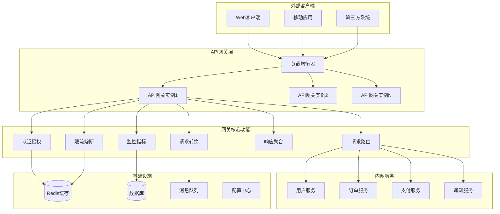
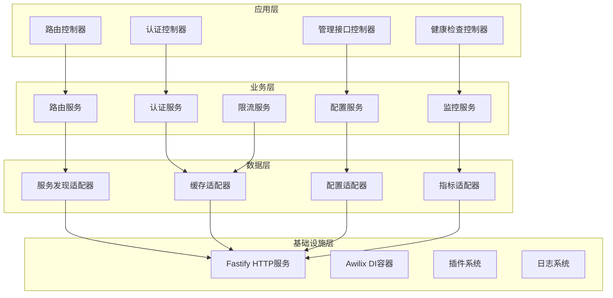

# API 网关应用架构设计

## 概述

基于 Stratix 框架构建的企业级 API 网关，充分利用框架的插件系统、依赖注入和 Fastify 生态系统，提供高性能、可扩展的网关解决方案。

## 系统架构

### 1. 整体架构图



### 2. 分层架构



## 核心模块设计

### 1. 路由模块

**功能**: 智能请求路由和负载均衡

**组件**:
- `RouteController` - 路由控制器
- `RouteService` - 路由逻辑服务
- `ServiceDiscoveryAdapter` - 服务发现适配器
- `LoadBalancer` - 负载均衡器

```typescript
@Controller('/api')
export class RouteController {
  constructor(
    private routeService: RouteService,
    private logger: Logger
  ) {}

  @Get('/*')
  @Post('/*')
  @Put('/*')
  @Delete('/*')
  async proxyRequest(request: FastifyRequest, reply: FastifyReply) {
    return this.routeService.routeRequest(request, reply)
  }
}
```

### 2. 认证模块

**功能**: 统一身份认证和授权

**组件**:
- `AuthController` - 认证控制器
- `AuthService` - 认证服务
- `JWTService` - JWT 令牌服务
- `RBACService` - 基于角色的访问控制

```typescript
@Controller('/auth')
export class AuthController {
  constructor(
    private authService: AuthService,
    private jwtService: JWTService
  ) {}

  @Post('/login')
  async login(@IsString() username: string, @IsString() password: string) {
    const user = await this.authService.validateUser(username, password)
    const token = await this.jwtService.generateToken(user)
    return { token, user }
  }

  @Post('/verify')
  async verifyToken(@IsString() token: string) {
    return this.jwtService.verifyToken(token)
  }
}
```

### 3. 限流模块

**功能**: 请求限流和熔断保护

**组件**:
- `RateLimitService` - 限流服务
- `CircuitBreakerService` - 熔断器服务
- `ThrottleMiddleware` - 限流中间件

```typescript
@Injectable()
export class RateLimitService {
  constructor(private cacheAdapter: CacheAdapter) {}

  async checkRateLimit(key: string, limit: number, window: number): Promise<boolean> {
    const current = await this.cacheAdapter.get(key) || 0
    if (current >= limit) {
      return false
    }
    await this.cacheAdapter.increment(key, window)
    return true
  }
}
```

### 4. 监控模块

**功能**: 实时监控和指标收集

**组件**:
- `MetricsController` - 指标控制器
- `MonitoringService` - 监控服务
- `HealthCheckService` - 健康检查服务
- `AlertService` - 告警服务

```typescript
@Controller('/health')
export class HealthController {
  constructor(
    private healthService: HealthCheckService,
    private monitoringService: MonitoringService
  ) {}

  @Get('/')
  async healthCheck() {
    return this.healthService.getHealthStatus()
  }

  @Get('/metrics')
  async getMetrics() {
    return this.monitoringService.getMetrics()
  }
}
```

### 5. 配置模块

**功能**: 动态配置管理

**组件**:
- `ConfigController` - 配置控制器
- `ConfigService` - 配置服务
- `ConfigWatcher` - 配置监听器

```typescript
@Executor('config-watcher')
export class ConfigWatcher {
  constructor(
    private configService: ConfigService,
    private logger: Logger
  ) {}

  async execute() {
    // 监听配置变更
    this.configService.watchConfig((changes) => {
      this.logger.info('配置更新:', changes)
      // 重新加载路由配置
    })
  }
}
```

## 插件架构设计

### 1. 核心插件

基于 Stratix 的 `withRegisterAutoDI` 构建主要功能插件：

```typescript
// plugins/gateway-core-plugin.ts
export default withRegisterAutoDI(async (fastify, options) => {
  // 插件初始化逻辑
  fastify.log.info('Gateway Core Plugin loaded')
}, {
  discovery: {
    patterns: [
      'controllers/*.{ts,js}',
      'services/*.{ts,js}',
      'adapters/*.{ts,js}',
      'executors/*.{ts,js}'
    ]
  },
  routing: {
    prefix: '',
    enabled: true,
    validation: true
  },
  services: {
    enabled: true,
    patterns: ['adapters/*.{ts,js}']
  },
  lifecycle: {
    enabled: true,
    errorHandling: 'throw',
    debug: true
  }
})
```

### 2. 扩展插件

利用 Fastify 生态系统的现有插件：

```typescript
// plugins/fastify-ecosystem-plugin.ts
export default withRegisterAutoDI(async (fastify, options) => {
  // 注册 Fastify 生态插件
  await fastify.register(import('@fastify/cors'), {
    origin: true,
    credentials: true
  })

  await fastify.register(import('@fastify/helmet'), {
    contentSecurityPolicy: false
  })

  await fastify.register(import('@fastify/rate-limit'), {
    max: 1000,
    timeWindow: '1 minute'
  })

  await fastify.register(import('@fastify/swagger'), {
    swagger: {
      info: {
        title: 'API Gateway',
        description: 'API Gateway Documentation',
        version: '1.0.0'
      }
    }
  })
})
```

### 3. 自定义中间件插件

```typescript
// plugins/middleware-plugin.ts
export default withRegisterAutoDI(async (fastify, options) => {
  // 请求 ID 中间件
  fastify.addHook('onRequest', async (request, reply) => {
    request.requestId = generateRequestId()
    reply.header('X-Request-ID', request.requestId)
  })

  // 认证中间件
  fastify.addHook('preHandler', async (request, reply) => {
    if (request.url.startsWith('/api/')) {
      const authService = request.diContainer.resolve('authService')
      await authService.validateRequest(request)
    }
  })

  // 响应时间中间件
  fastify.addHook('onResponse', async (request, reply) => {
    const responseTime = Date.now() - request.startTime
    reply.header('X-Response-Time', `${responseTime}ms`)
  })
})
```

## 服务适配器设计

### 1. 服务发现适配器

```typescript
// adapters/service-discovery.adapter.ts
@Injectable()
export class ServiceDiscoveryAdapter {
  private services: Map<string, ServiceEndpoint[]> = new Map()

  constructor(
    private cacheAdapter: CacheAdapter,
    private logger: Logger
  ) {}

  async registerService(name: string, endpoint: ServiceEndpoint): Promise<void> {
    const services = this.services.get(name) || []
    services.push(endpoint)
    this.services.set(name, services)
    
    await this.cacheAdapter.set(`service:${name}`, services, 300)
    this.logger.info(`服务注册: ${name} -> ${endpoint.url}`)
  }

  async getService(name: string): Promise<ServiceEndpoint | null> {
    let services = this.services.get(name)
    
    if (!services) {
      services = await this.cacheAdapter.get(`service:${name}`)
      if (services) {
        this.services.set(name, services)
      }
    }

    if (!services || services.length === 0) {
      return null
    }

    // 简单轮询负载均衡
    return services[Math.floor(Math.random() * services.length)]
  }

  async healthCheck(): Promise<Record<string, boolean>> {
    const health: Record<string, boolean> = {}
    
    for (const [name, endpoints] of this.services.entries()) {
      health[name] = endpoints.some(endpoint => endpoint.healthy)
    }
    
    return health
  }
}
```

### 2. 缓存适配器

```typescript
// adapters/cache.adapter.ts
@Injectable()
export class CacheAdapter {
  private redis: Redis

  constructor(@Inject('cacheConfig') private config: CacheConfig) {
    this.redis = new Redis(config.redis)
  }

  async get<T>(key: string): Promise<T | null> {
    const value = await this.redis.get(key)
    return value ? JSON.parse(value) : null
  }

  async set(key: string, value: any, ttl?: number): Promise<void> {
    const serialized = JSON.stringify(value)
    if (ttl) {
      await this.redis.setex(key, ttl, serialized)
    } else {
      await this.redis.set(key, serialized)
    }
  }

  async increment(key: string, ttl?: number): Promise<number> {
    const result = await this.redis.incr(key)
    if (ttl && result === 1) {
      await this.redis.expire(key, ttl)
    }
    return result
  }

  async delete(key: string): Promise<void> {
    await this.redis.del(key)
  }
}
```

### 3. HTTP 客户端适配器

```typescript
// adapters/http-client.adapter.ts
@Injectable()
export class HttpClientAdapter {
  private axios: AxiosInstance

  constructor(
    private logger: Logger,
    private metricsService: MetricsService
  ) {
    this.axios = axios.create({
      timeout: 5000,
      maxRedirects: 3
    })
    
    this.setupInterceptors()
  }

  private setupInterceptors(): void {
    // 请求拦截器
    this.axios.interceptors.request.use((config) => {
      const startTime = Date.now()
      config.metadata = { startTime }
      this.logger.debug(`HTTP请求: ${config.method?.toUpperCase()} ${config.url}`)
      return config
    })

    // 响应拦截器
    this.axios.interceptors.response.use(
      (response) => {
        const duration = Date.now() - response.config.metadata.startTime
        this.metricsService.recordHttpRequest(
          response.config.method!,
          response.status,
          duration
        )
        return response
      },
      (error) => {
        const duration = Date.now() - error.config?.metadata?.startTime
        this.metricsService.recordHttpRequest(
          error.config?.method || 'unknown',
          error.response?.status || 0,
          duration
        )
        return Promise.reject(error)
      }
    )
  }

  async request<T>(config: AxiosRequestConfig): Promise<T> {
    const response = await this.axios.request<T>(config)
    return response.data
  }
}
```

## 配置结构设计

### 1. 主配置文件

```typescript
// stratix.config.ts
export default (sensitiveConfig: Record<string, string>) => ({
  server: {
    port: parseInt(process.env.PORT || '3000'),
    host: process.env.HOST || '0.0.0.0',
    keepAliveTimeout: 5000,
    requestTimeout: 30000
  },

  plugins: [
    {
      name: 'gateway-core',
      plugin: gatewayCorePlugin,
      options: {
        discovery: {
          patterns: [
            'controllers/*.{ts,js}',
            'services/*.{ts,js}',
            'adapters/*.{ts,js}',
            'executors/*.{ts,js}'
          ]
        }
      }
    },
    {
      name: 'fastify-ecosystem',
      plugin: fastifyEcosystemPlugin,
      options: {}
    },
    {
      name: 'middleware',
      plugin: middlewarePlugin,
      options: {}
    }
  ],

  autoLoad: {
    patterns: ['plugins/*.{ts,js}']
  },

  logger: {
    level: process.env.LOG_LEVEL || 'info',
    pretty: process.env.NODE_ENV !== 'production',
    enableRequestLogging: true,
    enablePerformanceLogging: true,
    enableErrorTracking: true,
    sensitiveFields: ['password', 'token', 'authorization']
  },

  cache: {
    type: 'redis',
    options: {
      host: sensitiveConfig.REDIS_HOST || 'localhost',
      port: parseInt(sensitiveConfig.REDIS_PORT || '6379'),
      password: sensitiveConfig.REDIS_PASSWORD,
      db: parseInt(sensitiveConfig.REDIS_DB || '0'),
      ttl: 300
    }
  }
})
```

### 2. 环境配置

```typescript
// config/gateway.config.ts
export interface GatewayConfig {
  routes: RouteConfig[]
  auth: AuthConfig
  rateLimit: RateLimitConfig
  monitoring: MonitoringConfig
}

export interface RouteConfig {
  path: string
  method: string[]
  target: string
  timeout?: number
  retries?: number
  loadBalancing?: 'round-robin' | 'random' | 'weighted'
  middleware?: string[]
}

export interface AuthConfig {
  enabled: boolean
  jwtSecret: string
  tokenExpiry: string
  refreshTokenExpiry: string
  excludePaths: string[]
}

export interface RateLimitConfig {
  global: {
    max: number
    timeWindow: string
  }
  perRoute: Record<string, {
    max: number
    timeWindow: string
  }>
}
```

## 部署架构

### 1. 容器化部署

```dockerfile
# Dockerfile
FROM node:20-alpine

WORKDIR /app

COPY package*.json ./
RUN npm ci --only=production

COPY dist/ ./dist/
COPY config/ ./config/

EXPOSE 3000

HEALTHCHECK --interval=30s --timeout=3s --start-period=5s --retries=3 \
  CMD curl -f http://localhost:3000/health || exit 1

CMD ["node", "dist/index.js"]
```

### 2. Kubernetes 部署

```yaml
# k8s/deployment.yaml
apiVersion: apps/v1
kind: Deployment
metadata:
  name: api-gateway
spec:
  replicas: 3
  selector:
    matchLabels:
      app: api-gateway
  template:
    metadata:
      labels:
        app: api-gateway
    spec:
      containers:
      - name: api-gateway
        image: api-gateway:latest
        ports:
        - containerPort: 3000
        env:
        - name: NODE_ENV
          value: "production"
        - name: LOG_LEVEL
          value: "info"
        livenessProbe:
          httpGet:
            path: /health
            port: 3000
          initialDelaySeconds: 30
          periodSeconds: 10
        readinessProbe:
          httpGet:
            path: /health
            port: 3000
          initialDelaySeconds: 5
          periodSeconds: 5
```

### 3. 服务发现

```yaml
# k8s/service.yaml
apiVersion: v1
kind: Service
metadata:
  name: api-gateway-service
spec:
  selector:
    app: api-gateway
  ports:
  - port: 80
    targetPort: 3000
  type: LoadBalancer

---
apiVersion: networking.k8s.io/v1
kind: Ingress
metadata:
  name: api-gateway-ingress
spec:
  rules:
  - host: api.example.com
    http:
      paths:
      - path: /
        pathType: Prefix
        backend:
          service:
            name: api-gateway-service
            port:
              number: 80
```

## 监控和运维

### 1. 指标收集

```typescript
// services/metrics.service.ts
@Injectable()
export class MetricsService {
  private metrics: Map<string, number> = new Map()

  recordRequest(method: string, path: string, statusCode: number, duration: number): void {
    const key = `http_requests_total{method="${method}",path="${path}",status="${statusCode}"}`
    this.metrics.set(key, (this.metrics.get(key) || 0) + 1)
    
    const durationKey = `http_request_duration_ms{method="${method}",path="${path}"}`
    this.metrics.set(durationKey, duration)
  }

  getMetrics(): Record<string, number> {
    return Object.fromEntries(this.metrics)
  }
}
```

### 2. 健康检查

```typescript
// services/health-check.service.ts
@Injectable()
export class HealthCheckService {
  constructor(
    private serviceDiscovery: ServiceDiscoveryAdapter,
    private cacheAdapter: CacheAdapter
  ) {}

  async getHealthStatus(): Promise<HealthStatus> {
    const services = await this.serviceDiscovery.healthCheck()
    const cache = await this.checkCacheHealth()
    
    const allHealthy = Object.values(services).every(Boolean) && cache
    
    return {
      status: allHealthy ? 'healthy' : 'unhealthy',
      timestamp: new Date().toISOString(),
      services,
      cache,
      uptime: process.uptime(),
      memory: process.memoryUsage()
    }
  }

  private async checkCacheHealth(): Promise<boolean> {
    try {
      await this.cacheAdapter.set('health_check', Date.now(), 10)
      return true
    } catch (error) {
      return false
    }
  }
}
```

## 总结

该 API 网关架构设计充分利用了 Stratix 框架的以下优势：

1. **插件系统**: 模块化的功能扩展
2. **依赖注入**: 松耦合的组件设计
3. **装饰器**: 简洁的代码组织
4. **Fastify 生态**: 丰富的插件支持
5. **生命周期管理**: 优雅的启停控制

该架构具备：
- **高性能**: 基于 Fastify 的高性能基础
- **高可用**: 多实例部署和健康检查
- **可扩展**: 插件化架构易于功能扩展
- **可观测**: 完整的监控和日志体系
- **易运维**: 标准化的部署和配置管理

适用于企业级 API 网关场景，支持高并发、多租户、复杂路由等需求。