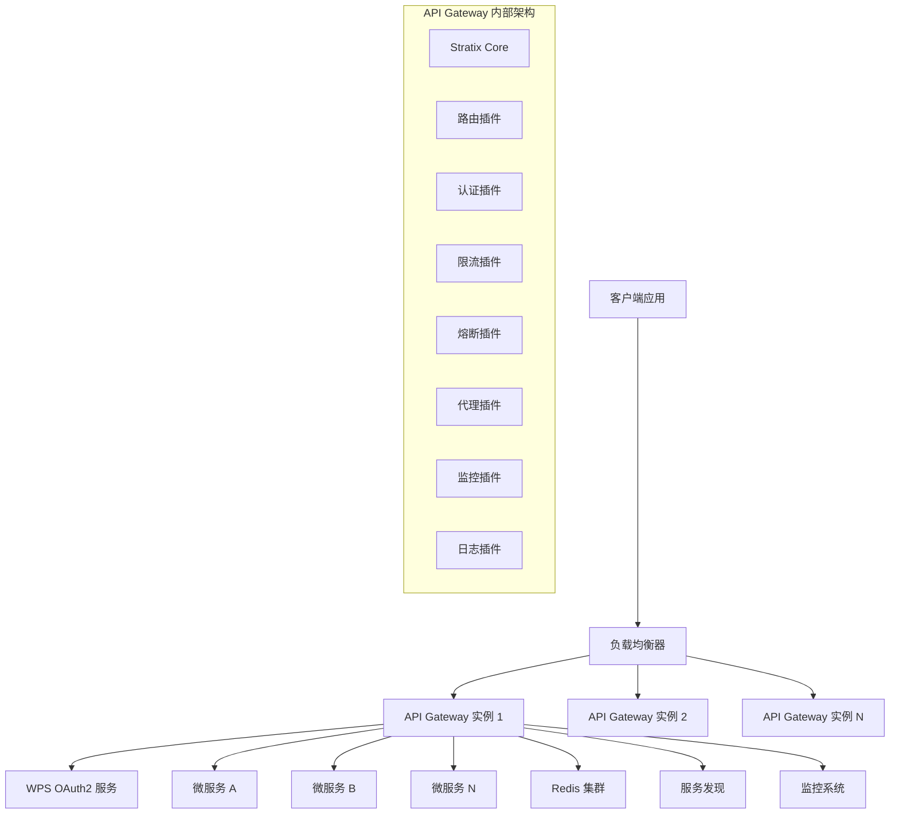
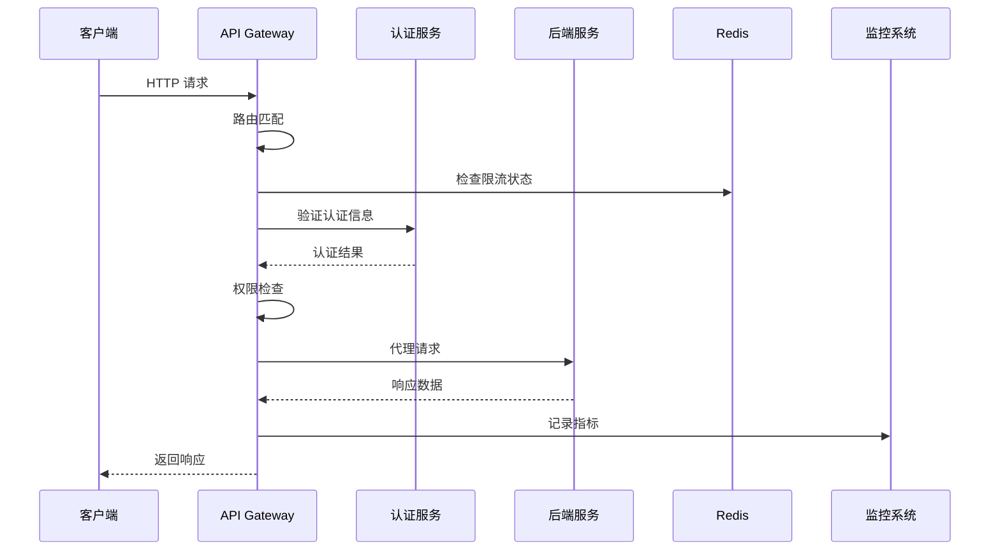

# Stratix API Gateway 架构设计文档

## 1. 概述

Stratix API Gateway 是基于 Stratix 框架（Fastify 5 + Awilix 12）构建的现代化、高性能 API 网关服务。采用函数式编程范式和插件化架构，提供企业级的 API 管理、安全认证、流量控制和监控能力。

### 1.1 核心特性

- **高性能**: 基于 Fastify 5 的高性能 HTTP 服务器
- **插件化架构**: 所有功能以 Fastify 插件的方式加载
- **函数式编程**: 完全采用函数式编程范式
- **依赖注入**: 基于 Awilix 12 的强大 IOC 容器
- **分布式支持**: 支持分布式部署和服务发现
- **OAuth2 集成**: 深度集成 WPS 协作平台认证服务

### 1.2 技术栈

- **核心框架**: Stratix Framework (Fastify 5 + Awilix 12)
- **编程语言**: TypeScript 5.8+
- **运行时**: Node.js 22+
- **包管理**: pnpm + Turbo (Monorepo)
- **测试框架**: Vitest
- **容器化**: Docker + Docker Compose
- **服务发现**: Consul / etcd (可选)
- **监控**: Prometheus + Grafana
- **日志**: Pino + ELK Stack

## 2. 系统架构

### 2.1 整体架构图



### 2.2 核心组件

#### 2.2.1 Stratix Core
- **应用启动器**: 负责应用的完整启动流程
- **插件管理器**: 管理插件的注册、加载和生命周期
- **依赖注入容器**: 基于 Awilix 的 IOC 容器
- **配置管理**: 支持多环境配置和配置加密

#### 2.2.2 路由系统
- **动态路由**: 支持运行时路由配置更新
- **路径匹配**: 支持精确匹配、前缀匹配、正则匹配
- **负载均衡**: 支持轮询、加权轮询、最少连接等算法
- **健康检查**: 自动检测后端服务健康状态

#### 2.2.3 认证授权
- **OAuth2 集成**: 深度集成 WPS 协作平台
- **JWT 处理**: 支持 JWT 令牌验证和刷新
- **权限控制**: 基于角色和资源的访问控制
- **会话管理**: 支持有状态和无状态会话

#### 2.2.4 流量控制
- **限流**: 支持基于 IP、用户、API 的多维度限流
- **熔断**: 实现熔断器模式，防止级联故障
- **重试**: 智能重试机制，支持指数退避
- **超时控制**: 请求超时和连接超时管理

#### 2.2.5 监控观测
- **指标收集**: 收集请求量、响应时间、错误率等指标
- **链路追踪**: 支持分布式链路追踪
- **健康检查**: 提供健康检查端点
- **日志记录**: 结构化日志记录和聚合

## 3. 插件架构

### 3.1 插件分层

```
┌─────────────────────────────────────┐
│           应用层插件                │
├─────────────────────────────────────┤
│  路由插件 │ 认证插件 │ 监控插件     │
├─────────────────────────────────────┤
│           中间件层插件              │
├─────────────────────────────────────┤
│  限流插件 │ 熔断插件 │ 代理插件     │
├─────────────────────────────────────┤
│           基础设施插件              │
├─────────────────────────────────────┤
│  日志插件 │ 配置插件 │ 健康检查     │
└─────────────────────────────────────┘
```

### 3.2 插件生命周期

1. **注册阶段**: 插件注册到 Fastify 实例
2. **初始化阶段**: 插件初始化配置和依赖
3. **启动阶段**: 插件启动服务和监听器
4. **运行阶段**: 插件处理请求和响应
5. **关闭阶段**: 插件清理资源和连接

### 3.3 插件依赖注入

```typescript
// 插件依赖注入示例
export interface GatewayPluginDependencies {
  logger: Logger;
  config: GatewayConfig;
  redis: Redis;
  consul: ConsulClient;
  metrics: MetricsCollector;
}

// 插件工厂函数
export const createGatewayPlugin = (
  dependencies: GatewayPluginDependencies
) => {
  return async (fastify: FastifyInstance, options: PluginOptions) => {
    // 插件实现
  };
};
```

## 4. 数据流架构

### 4.1 请求处理流程



### 4.2 配置管理流程


## 5. 部署架构

### 5.1 单机部署

```
┌─────────────────────────────────────┐
│            单机服务器               │
│  ┌─────────────────────────────────┐ │
│  │        API Gateway              │ │
│  │  ┌─────────┐  ┌─────────────┐   │ │
│  │  │ Nginx   │  │ Gateway App │   │ │
│  │  └─────────┘  └─────────────┘   │ │
│  └─────────────────────────────────┘ │
│  ┌─────────────────────────────────┐ │
│  │         Redis               │ │
│  └─────────────────────────────────┘ │
└─────────────────────────────────────┘
```

### 5.2 分布式部署

```
┌─────────────────────────────────────┐
│            负载均衡层               │
│  ┌─────────────────────────────────┐ │
│  │        Nginx/HAProxy            │ │
│  └─────────────────────────────────┘ │
└─────────────────────────────────────┘
              │
    ┌─────────┼─────────┐
    │         │         │
┌───▼───┐ ┌───▼───┐ ┌───▼───┐
│Gateway│ │Gateway│ │Gateway│
│Node 1 │ │Node 2 │ │Node N │
└───────┘ └───────┘ └───────┘
    │         │         │
    └─────────┼─────────┘
              │
┌─────────────▼─────────────┐
│        共享存储层         │
│  ┌─────────────────────┐  │
│  │    Redis Cluster    │  │
│  └─────────────────────┘  │
│  ┌─────────────────────┐  │
│  │   Consul Cluster    │  │
│  └─────────────────────┘  │
└───────────────────────────┘
```

### 5.3 容器化部署

```yaml
# docker-compose.yml 示例
version: '3.8'
services:
  gateway:
    image: stratix/api-gateway:latest
    ports:
      - "3000:3000"
    environment:
      - NODE_ENV=production
      - REDIS_URL=redis://redis:6379
      - CONSUL_URL=http://consul:8500
    depends_on:
      - redis
      - consul
    
  redis:
    image: redis:7-alpine
    ports:
      - "6379:6379"
    
  consul:
    image: consul:latest
    ports:
      - "8500:8500"
    command: consul agent -dev -client=0.0.0.0
```

## 6. 安全架构

### 6.1 安全层次

1. **网络安全**: HTTPS、防火墙、VPN
2. **认证安全**: OAuth2、JWT、多因子认证
3. **授权安全**: RBAC、ABAC、API 密钥
4. **传输安全**: TLS 1.3、证书管理
5. **数据安全**: 敏感数据加密、脱敏

### 6.2 威胁防护

- **DDoS 防护**: 限流、熔断、黑名单
- **注入攻击**: 输入验证、参数化查询
- **跨站攻击**: CORS 配置、CSP 头
- **会话劫持**: 安全 Cookie、会话超时

## 7. 性能优化

### 7.1 性能指标

- **吞吐量**: > 10,000 RPS
- **延迟**: P99 < 100ms
- **可用性**: 99.9%
- **错误率**: < 0.1%

### 7.2 优化策略

- **连接池**: HTTP 连接复用
- **缓存**: 多级缓存策略
- **压缩**: Gzip/Brotli 压缩
- **CDN**: 静态资源分发

## 8. 扩展性设计

### 8.1 水平扩展

- **无状态设计**: 网关实例无状态
- **负载均衡**: 支持动态扩缩容
- **服务发现**: 自动服务注册和发现

### 8.2 垂直扩展

- **资源优化**: CPU 和内存优化
- **异步处理**: 非阻塞 I/O
- **批处理**: 批量处理优化

## 9. 监控和运维

### 9.1 监控体系

- **基础监控**: CPU、内存、网络、磁盘
- **应用监控**: QPS、延迟、错误率
- **业务监控**: API 调用量、用户活跃度
- **日志监控**: 错误日志、访问日志

### 9.2 告警机制

- **阈值告警**: 基于指标阈值
- **异常检测**: 基于机器学习
- **多渠道通知**: 邮件、短信、钉钉

## 10. 容灾和备份

### 10.1 容灾策略

- **多机房部署**: 跨地域部署
- **故障转移**: 自动故障切换
- **数据同步**: 实时数据同步

### 10.2 备份策略

- **配置备份**: 定期配置备份
- **数据备份**: 关键数据备份
- **恢复测试**: 定期恢复演练
