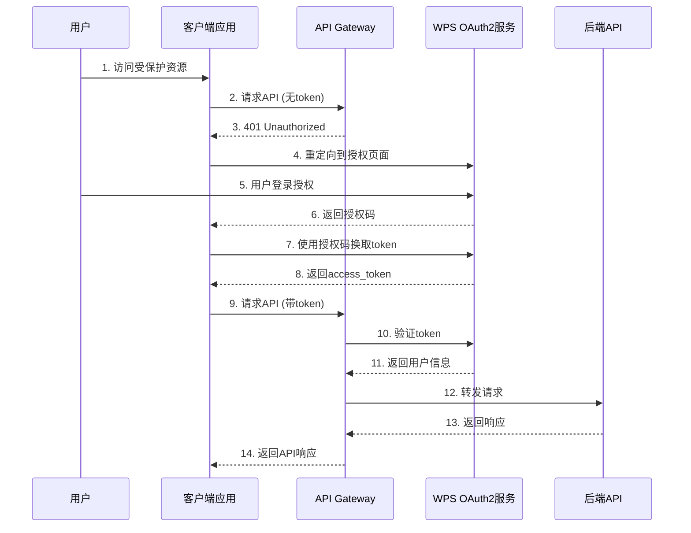
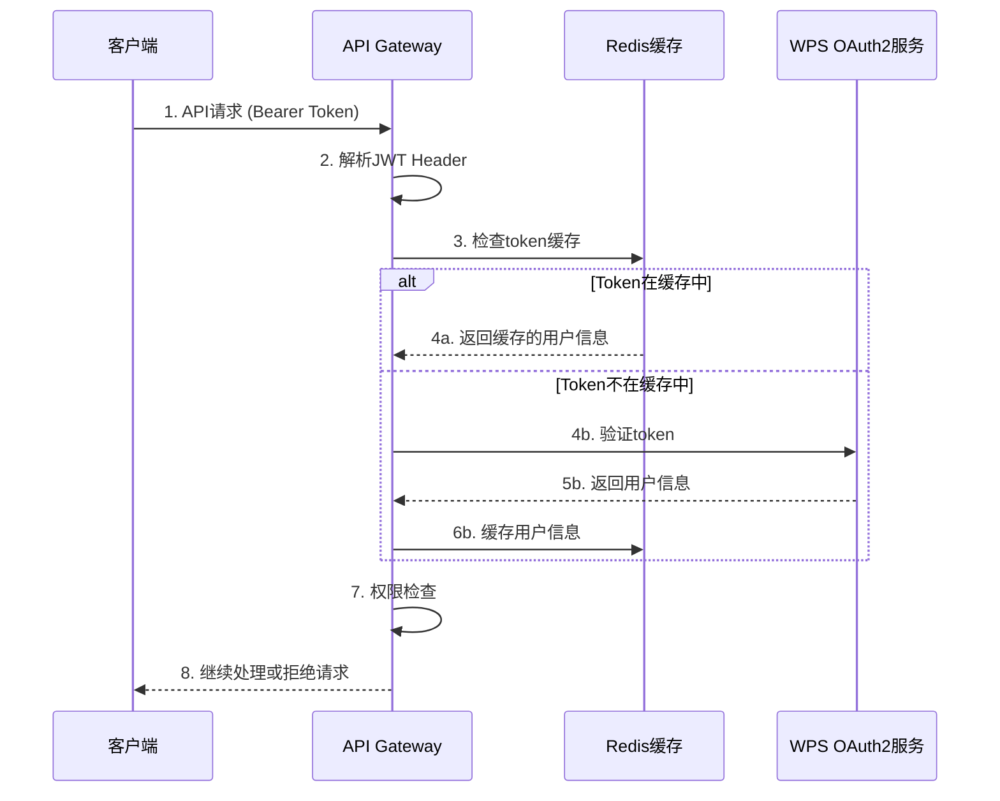

# WPS OAuth2 集成方案

## 1. 概述

本文档详细描述了 Stratix API Gateway 与 WPS 协作平台 OAuth2 认证服务的集成方案。该方案基于 OAuth 2.0 标准协议，提供安全、可靠的用户认证和授权机制。

### 1.1 集成目标

- **统一认证**: 使用 WPS 账号体系进行统一身份认证
- **安全授权**: 基于 OAuth2 标准的安全授权流程
- **无缝集成**: 与现有 WPS 协作平台无缝集成
- **高性能**: 支持高并发认证请求
- **可扩展**: 支持多种认证场景和客户端类型

### 1.2 技术规范

- **协议版本**: OAuth 2.0 (RFC 6749)
- **授权类型**: Authorization Code Grant
- **令牌类型**: Bearer Token (JWT)
- **加密算法**: RS256
- **传输协议**: HTTPS (TLS 1.3)

## 2. OAuth2 流程设计

### 2.1 标准授权码流程



### 2.2 JWT Token 验证流程



## 3. WPS OAuth2 配置

### 3.1 应用注册信息

```typescript
interface WPSOAuth2Config {
  // 基础配置
  clientId: string;           // WPS分配的客户端ID
  clientSecret: string;       // WPS分配的客户端密钥
  
  // 端点配置
  authorizationUrl: string;   // 授权端点
  tokenUrl: string;          // 令牌端点
  userInfoUrl: string;       // 用户信息端点
  jwksUrl: string;           // JWT公钥端点
  
  // 授权配置
  scope: string[];           // 请求的权限范围
  redirectUri: string;       // 回调地址
  
  // 安全配置
  state: boolean;            // 是否使用state参数
  pkce: boolean;             // 是否启用PKCE
  
  // 缓存配置
  tokenCacheTtl: number;     // token缓存时间(秒)
  userInfoCacheTtl: number;  // 用户信息缓存时间(秒)
}
```

### 3.2 环境配置示例

```yaml
# 开发环境
development:
  oauth2:
    wps:
      clientId: "dev-client-id"
      clientSecret: "dev-client-secret"
      authorizationUrl: "https://auth-dev.wps.com/oauth2/authorize"
      tokenUrl: "https://auth-dev.wps.com/oauth2/token"
      userInfoUrl: "https://auth-dev.wps.com/oauth2/userinfo"
      jwksUrl: "https://auth-dev.wps.com/.well-known/jwks.json"
      scope: ["read", "write", "profile"]
      redirectUri: "http://localhost:3000/auth/callback"
      state: true
      pkce: true
      tokenCacheTtl: 3600
      userInfoCacheTtl: 1800

# 生产环境
production:
  oauth2:
    wps:
      clientId: "${WPS_CLIENT_ID}"
      clientSecret: "${WPS_CLIENT_SECRET}"
      authorizationUrl: "https://auth.wps.com/oauth2/authorize"
      tokenUrl: "https://auth.wps.com/oauth2/token"
      userInfoUrl: "https://auth.wps.com/oauth2/userinfo"
      jwksUrl: "https://auth.wps.com/.well-known/jwks.json"
      scope: ["read", "write", "profile"]
      redirectUri: "https://gateway.example.com/auth/callback"
      state: true
      pkce: true
      tokenCacheTtl: 3600
      userInfoCacheTtl: 1800
```

## 4. 认证插件实现

### 4.1 插件架构

```typescript
// OAuth2认证插件接口
interface OAuth2AuthPlugin {
  // 验证访问令牌
  verifyAccessToken(token: string): Promise<UserInfo>;
  
  // 刷新访问令牌
  refreshAccessToken(refreshToken: string): Promise<TokenResponse>;
  
  // 获取用户信息
  getUserInfo(accessToken: string): Promise<UserInfo>;
  
  // 撤销令牌
  revokeToken(token: string): Promise<void>;
  
  // 生成授权URL
  generateAuthUrl(state?: string): string;
  
  // 处理授权回调
  handleCallback(code: string, state?: string): Promise<TokenResponse>;
}

// 用户信息接口
interface UserInfo {
  id: string;
  username: string;
  email: string;
  name: string;
  avatar?: string;
  roles: string[];
  permissions: string[];
  metadata?: Record<string, any>;
}

// 令牌响应接口
interface TokenResponse {
  accessToken: string;
  refreshToken?: string;
  tokenType: string;
  expiresIn: number;
  scope: string[];
}
```

### 4.2 插件实现示例

```typescript
import { FastifyInstance, FastifyPluginOptions } from 'fastify';
import { withRegisterAutoDI } from '@stratix/core/plugin';

interface OAuth2PluginOptions extends FastifyPluginOptions {
  wps: WPSOAuth2Config;
}

async function oauth2AuthPlugin(
  fastify: FastifyInstance,
  options: OAuth2PluginOptions
) {
  const { wps } = options;
  
  // 注册OAuth2服务
  fastify.decorate('oauth2', {
    // 验证token的中间件
    async verifyToken(request: FastifyRequest, reply: FastifyReply) {
      const authorization = request.headers.authorization;
      
      if (!authorization || !authorization.startsWith('Bearer ')) {
        return reply.code(401).send({
          error: 'UNAUTHORIZED',
          message: 'Missing or invalid authorization header'
        });
      }
      
      const token = authorization.substring(7);
      
      try {
        // 验证JWT token
        const userInfo = await verifyJWTToken(token, wps);
        
        // 将用户信息添加到请求上下文
        request.user = userInfo;
        
        return;
      } catch (error) {
        return reply.code(401).send({
          error: 'UNAUTHORIZED',
          message: 'Invalid or expired token'
        });
      }
    },
    
    // 生成授权URL
    generateAuthUrl(state?: string): string {
      const params = new URLSearchParams({
        response_type: 'code',
        client_id: wps.clientId,
        redirect_uri: wps.redirectUri,
        scope: wps.scope.join(' '),
        ...(state && { state })
      });
      
      return `${wps.authorizationUrl}?${params.toString()}`;
    },
    
    // 处理授权回调
    async handleCallback(code: string, state?: string): Promise<TokenResponse> {
      const tokenResponse = await fetch(wps.tokenUrl, {
        method: 'POST',
        headers: {
          'Content-Type': 'application/x-www-form-urlencoded',
          'Authorization': `Basic ${Buffer.from(`${wps.clientId}:${wps.clientSecret}`).toString('base64')}`
        },
        body: new URLSearchParams({
          grant_type: 'authorization_code',
          code,
          redirect_uri: wps.redirectUri
        })
      });
      
      if (!tokenResponse.ok) {
        throw new Error('Failed to exchange authorization code for token');
      }
      
      return await tokenResponse.json();
    }
  });
  
  // 注册认证路由
  fastify.register(async function(fastify) {
    // 授权端点
    fastify.get('/auth/authorize', async (request, reply) => {
      const state = generateRandomState();
      const authUrl = fastify.oauth2.generateAuthUrl(state);
      
      // 存储state用于验证
      await fastify.redis.setex(`oauth2:state:${state}`, 600, 'valid');
      
      return reply.redirect(authUrl);
    });
    
    // 回调端点
    fastify.get('/auth/callback', async (request, reply) => {
      const { code, state } = request.query as any;
      
      if (!code) {
        return reply.code(400).send({
          error: 'INVALID_REQUEST',
          message: 'Missing authorization code'
        });
      }
      
      // 验证state参数
      if (state) {
        const storedState = await fastify.redis.get(`oauth2:state:${state}`);
        if (!storedState) {
          return reply.code(400).send({
            error: 'INVALID_STATE',
            message: 'Invalid or expired state parameter'
          });
        }
        await fastify.redis.del(`oauth2:state:${state}`);
      }
      
      try {
        const tokenResponse = await fastify.oauth2.handleCallback(code, state);
        
        return reply.send({
          success: true,
          data: tokenResponse
        });
      } catch (error) {
        return reply.code(400).send({
          error: 'TOKEN_EXCHANGE_FAILED',
          message: 'Failed to exchange authorization code for token'
        });
      }
    });
    
    // 用户信息端点
    fastify.get('/auth/userinfo', {
      preHandler: fastify.oauth2.verifyToken
    }, async (request, reply) => {
      return reply.send({
        success: true,
        data: request.user
      });
    });
    
    // 登出端点
    fastify.post('/auth/logout', {
      preHandler: fastify.oauth2.verifyToken
    }, async (request, reply) => {
      const authorization = request.headers.authorization;
      const token = authorization?.substring(7);
      
      if (token) {
        // 将token加入黑名单
        await fastify.redis.setex(`oauth2:blacklist:${token}`, 3600, 'revoked');
      }
      
      return reply.send({
        success: true,
        message: 'Logged out successfully'
      });
    });
  }, { prefix: '/api/v1' });
}

// 导出插件
export default withRegisterAutoDI(oauth2AuthPlugin, {
  discovery: {
    patterns: ['services/**/*.ts', 'repositories/**/*.ts']
  }
});
```

## 5. JWT Token 处理

### 5.1 JWT 验证逻辑

```typescript
import jwt from 'jsonwebtoken';
import jwksClient from 'jwks-rsa';

// JWT验证服务
class JWTVerificationService {
  private jwksClient: jwksClient.JwksClient;
  
  constructor(private config: WPSOAuth2Config) {
    this.jwksClient = jwksClient({
      jwksUri: config.jwksUrl,
      cache: true,
      cacheMaxAge: 86400000, // 24小时
      rateLimit: true,
      jwksRequestsPerMinute: 10
    });
  }
  
  // 获取签名密钥
  private async getSigningKey(kid: string): Promise<string> {
    const key = await this.jwksClient.getSigningKey(kid);
    return key.getPublicKey();
  }
  
  // 验证JWT token
  async verifyToken(token: string): Promise<UserInfo> {
    try {
      // 解码token头部获取kid
      const decoded = jwt.decode(token, { complete: true });
      if (!decoded || !decoded.header.kid) {
        throw new Error('Invalid token format');
      }
      
      // 获取公钥
      const publicKey = await this.getSigningKey(decoded.header.kid);
      
      // 验证token
      const payload = jwt.verify(token, publicKey, {
        algorithms: ['RS256'],
        issuer: 'wps-oauth2',
        audience: this.config.clientId
      }) as any;
      
      // 转换为用户信息
      return {
        id: payload.sub,
        username: payload.preferred_username,
        email: payload.email,
        name: payload.name,
        avatar: payload.picture,
        roles: payload.roles || [],
        permissions: payload.permissions || [],
        metadata: {
          iat: payload.iat,
          exp: payload.exp,
          scope: payload.scope
        }
      };
    } catch (error) {
      throw new Error(`Token verification failed: ${error.message}`);
    }
  }
  
  // 检查token是否在黑名单中
  async isTokenBlacklisted(token: string, redis: any): Promise<boolean> {
    const result = await redis.get(`oauth2:blacklist:${token}`);
    return result === 'revoked';
  }
}
```

### 5.2 Token 缓存策略

```typescript
// Token缓存服务
class TokenCacheService {
  constructor(
    private redis: any,
    private config: WPSOAuth2Config
  ) {}
  
  // 缓存用户信息
  async cacheUserInfo(token: string, userInfo: UserInfo): Promise<void> {
    const key = `oauth2:userinfo:${this.hashToken(token)}`;
    await this.redis.setex(
      key,
      this.config.userInfoCacheTtl,
      JSON.stringify(userInfo)
    );
  }
  
  // 获取缓存的用户信息
  async getCachedUserInfo(token: string): Promise<UserInfo | null> {
    const key = `oauth2:userinfo:${this.hashToken(token)}`;
    const cached = await this.redis.get(key);
    
    if (cached) {
      return JSON.parse(cached);
    }
    
    return null;
  }
  
  // 清除用户信息缓存
  async clearUserInfoCache(token: string): Promise<void> {
    const key = `oauth2:userinfo:${this.hashToken(token)}`;
    await this.redis.del(key);
  }
  
  // 对token进行哈希处理
  private hashToken(token: string): string {
    return require('crypto')
      .createHash('sha256')
      .update(token)
      .digest('hex');
  }
}
```

## 6. 权限控制

### 6.1 基于角色的访问控制 (RBAC)

```typescript
// 权限检查中间件
interface PermissionOptions {
  roles?: string[];
  permissions?: string[];
  requireAll?: boolean; // 是否需要满足所有条件
}

function requirePermission(options: PermissionOptions) {
  return async (request: FastifyRequest, reply: FastifyReply) => {
    const user = request.user;
    
    if (!user) {
      return reply.code(401).send({
        error: 'UNAUTHORIZED',
        message: 'Authentication required'
      });
    }
    
    // 检查角色权限
    if (options.roles && options.roles.length > 0) {
      const hasRole = options.requireAll
        ? options.roles.every(role => user.roles.includes(role))
        : options.roles.some(role => user.roles.includes(role));
      
      if (!hasRole) {
        return reply.code(403).send({
          error: 'FORBIDDEN',
          message: 'Insufficient role permissions'
        });
      }
    }
    
    // 检查具体权限
    if (options.permissions && options.permissions.length > 0) {
      const hasPermission = options.requireAll
        ? options.permissions.every(perm => user.permissions.includes(perm))
        : options.permissions.some(perm => user.permissions.includes(perm));
      
      if (!hasPermission) {
        return reply.code(403).send({
          error: 'FORBIDDEN',
          message: 'Insufficient permissions'
        });
      }
    }
  };
}

// 使用示例
fastify.get('/admin/users', {
  preHandler: [
    fastify.oauth2.verifyToken,
    requirePermission({ roles: ['admin'] })
  ]
}, async (request, reply) => {
  // 管理员才能访问的用户列表
});

fastify.post('/api/documents', {
  preHandler: [
    fastify.oauth2.verifyToken,
    requirePermission({ permissions: ['document:create'] })
  ]
}, async (request, reply) => {
  // 需要文档创建权限
});
```

## 7. 安全考虑

### 7.1 安全最佳实践

1. **HTTPS 强制**: 所有OAuth2通信必须使用HTTPS
2. **State 参数**: 防止CSRF攻击
3. **PKCE**: 增强授权码流程安全性
4. **Token 过期**: 设置合理的token过期时间
5. **Scope 限制**: 最小权限原则
6. **Rate Limiting**: 防止暴力攻击
7. **日志审计**: 记录所有认证相关操作

### 7.2 错误处理

```typescript
// OAuth2错误类型
enum OAuth2ErrorType {
  INVALID_REQUEST = 'invalid_request',
  INVALID_CLIENT = 'invalid_client',
  INVALID_GRANT = 'invalid_grant',
  UNAUTHORIZED_CLIENT = 'unauthorized_client',
  UNSUPPORTED_GRANT_TYPE = 'unsupported_grant_type',
  INVALID_SCOPE = 'invalid_scope',
  ACCESS_DENIED = 'access_denied',
  SERVER_ERROR = 'server_error'
}

// 错误处理中间件
fastify.setErrorHandler((error, request, reply) => {
  if (error.name === 'OAuth2Error') {
    return reply.code(400).send({
      error: error.code,
      error_description: error.message,
      error_uri: 'https://docs.example.com/oauth2/errors'
    });
  }
  
  // 其他错误处理...
});
```

## 8. 监控和日志

### 8.1 关键指标监控

- **认证成功率**: 成功认证请求 / 总认证请求
- **Token 验证延迟**: Token验证平均响应时间
- **缓存命中率**: 缓存命中次数 / 总查询次数
- **错误率**: 认证错误次数 / 总认证请求

### 8.2 审计日志

```typescript
// 审计日志格式
interface OAuth2AuditLog {
  timestamp: string;
  event: 'auth_request' | 'token_issued' | 'token_verified' | 'token_revoked';
  userId?: string;
  clientId: string;
  ipAddress: string;
  userAgent: string;
  success: boolean;
  error?: string;
  metadata?: Record<string, any>;
}

// 记录审计日志
function logOAuth2Event(event: OAuth2AuditLog) {
  fastify.log.info({
    type: 'oauth2_audit',
    ...event
  });
}
```
