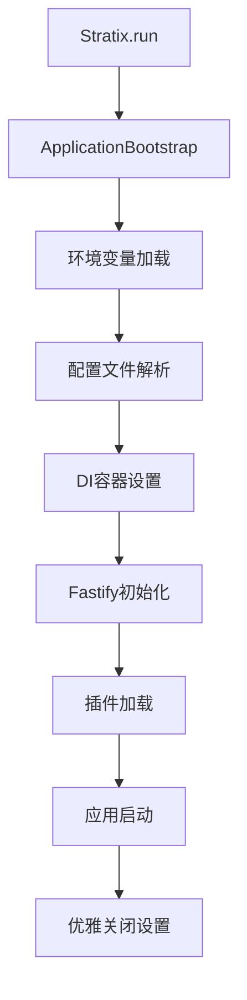

# Stratix 框架深度分析报告

## 框架概览

Stratix 是一个基于 Fastify 构建的轻量级 Node.js 应用框架，提供了现代化的插件系统、依赖注入、装饰器支持和企业级功能。

### 核心设计理念

- **插件优先**: 基于 Fastify 插件生态系统，支持模块化开发
- **依赖注入**: 内置 Awilix 容器，提供强大的 DI 功能
- **装饰器支持**: 可选的装饰器语法，简化开发体验
- **零配置启动**: 支持约定优于配置的开发模式
- **企业级**: 内置生命周期管理、错误处理、日志系统

## 架构分析

### 1. 核心模块架构

```
@stratix/core/
├── src/
│   ├── stratix.ts           # 主入口类
│   ├── bootstrap/           # 应用启动器
│   ├── decorators/          # 装饰器系统
│   ├── plugin/              # 插件系统
│   ├── types/               # 类型定义
│   ├── utils/               # 工具函数
│   └── logger/              # 日志系统
```

### 2. 启动流程架构



### 3. 插件系统架构


## 核心功能分析

### 1. 主入口 (Stratix)

**文件**: `src/stratix.ts`

**主要功能**:
- 应用生命周期管理 (start, stop, restart)
- 统一的配置接口
- 错误处理和恢复
- 状态监控

**核心 API**:
```typescript
// 静态方法 - 快速启动
Stratix.run(options?: StratixRunOptions): Promise<StratixApplication>

// 实例方法 - 精细控制
const stratix = new Stratix(options)
await stratix.start(options)
await stratix.stop()
await stratix.restart(options)
```

### 2. 应用启动器 (ApplicationBootstrap)

**文件**: `src/bootstrap/application-bootstrap.ts`

**主要功能**:
- 十阶段启动流程管理
- 环境变量和配置加载
- Fastify 实例初始化
- 插件系统集成
- 优雅关闭处理

**启动阶段**:
```typescript
enum BootstrapPhase {
  INITIALIZING = 'initializing',
  ENV_LOADING = 'env_loading',
  CONFIG_LOADING = 'config_loading',
  CONTAINER_SETUP = 'container_setup',
  FASTIFY_INIT = 'fastify_init',
  PLUGIN_LOADING = 'plugin_loading',
  STARTING = 'starting',
  SERVER_STARTING = 'server_starting',
  READY = 'ready',
  STOPPING = 'stopping',
  STOPPED = 'stopped',
  ERROR = 'error'
}
```

### 3. 插件系统 (withRegisterAutoDI)

**文件**: `src/plugin/auto-di-plugin.ts`

**主要功能**:
- 自动依赖注入
- 模块发现和注册
- 控制器路由绑定
- 服务适配器注册
- 生命周期管理

**使用方式**:
```typescript
export default withRegisterAutoDI(async (fastify, options) => {
  // 插件逻辑
}, {
  discovery: {
    patterns: ['controllers/*.{ts,js}', 'services/*.{ts,js}']
  },
  routing: {
    prefix: '/api',
    enabled: true
  }
})
```

### 4. 依赖注入系统

**基于**: Awilix 容器
**文件**: `src/plugin/service-discovery.ts`

**特性**:
- 三层容器结构 (根容器 -> 插件容器 -> 请求作用域)
- 自动模块加载
- 生命周期管理 (SINGLETON, SCOPED, TRANSIENT)
- 类型安全的注入

### 5. 装饰器系统

**文件**: `src/decorators/`

**提供的装饰器**:
- `@Controller()` - 控制器定义
- `@Get/@Post/@Put/@Delete` - 路由定义
- `@Executor()` - 执行器定义
- `@IsString/@IsNumber/@IsEmail` - 验证装饰器

**示例**:
```typescript
@Controller('/users')
export class UserController {
  @Get('/')
  async getUsers() {
    return { users: [] }
  }
  
  @Post('/')
  async createUser(@IsString() name: string) {
    return { id: 1, name }
  }
}
```

### 6. 生命周期管理

**文件**: `src/plugin/lifecycle-manager.ts`

**管理阶段**:
- preRegister - 注册前
- postRegister - 注册后
- preStart - 启动前
- postStart - 启动后
- preStop - 停止前
- postStop - 停止后

## 与 Fastify 的集成方式

### 1. 扩展 Fastify 类型

**文件**: `src/types/fastify.ts`

```typescript
declare module 'fastify' {
  interface FastifyInstance {
    stratixApp: StratixApplication;
    diContainer: AwilixContainer;
  }
  
  interface FastifyRequest {
    context: Record<string, any>;
    requestId: string;
    diContainer: AwilixContainer;
  }
  
  interface FastifyReply {
    diContainer: AwilixContainer;
    getResponseTime(): number;
    setContext(key: string, value: any): this;
  }
}
```

### 2. 装饰器注入

框架通过 `fastify.decorate()` 将核心功能注入到 Fastify 实例：

```typescript
// 注入 DI 容器
fastify.decorate('diContainer', container)

// 注入 Stratix 应用实例
fastify.decorate('stratixApp', application)
```

### 3. 请求钩子集成

```typescript
// 请求开始 - 创建请求作用域
fastify.addHook('onRequest', async (request, reply) => {
  const requestScope = rootContainer.createScope()
  request.container = requestScope
})

// 请求结束 - 清理作用域
fastify.addHook('onResponse', async (request, reply) => {
  await request.container.dispose()
})
```

### 4. 错误处理集成

```typescript
// 全局错误处理器
fastify.setErrorHandler(async (error, request, reply) => {
  logger.error('Unhandled error:', error)
  reply.status(error.statusCode || 500).send({
    error: {
      message: error.message,
      statusCode: error.statusCode || 500,
      timestamp: new Date().toISOString()
    }
  })
})
```

## 配置系统

### 1. 配置文件结构

**文件**: `stratix.config.ts`

```typescript
export default (sensitiveConfig: Record<string, string>) => ({
  server: {
    port: 3000,
    host: '0.0.0.0'
  },
  plugins: [
    {
      name: 'my-plugin',
      plugin: myPlugin,
      options: { /* 插件配置 */ }
    }
  ],
  autoLoad: {
    patterns: ['plugins/*.{ts,js}']
  },
  logger: {
    level: 'info',
    pretty: true
  }
})
```

### 2. 环境变量支持

- 支持 `.env` 文件加载
- 支持加密配置 (通过 `STRATIX_SENSITIVE_CONFIG`)
- 支持环境特定配置 (`.env.local`, `.env.production`)

### 3. 零配置模式

框架支持完全零配置启动，提供合理的默认值：

```typescript
// 最简启动
const app = await Stratix.run()
```

## 安全特性

### 1. 配置加密

- 支持敏感配置加密存储
- 运行时解密
- 环境变量注入

### 2. 请求验证

- 内置验证装饰器
- AJV 验证引擎
- 类型安全的参数验证

### 3. 错误处理

- 统一错误格式
- 敏感信息过滤
- 错误追踪和监控

## 性能特性

### 1. 依赖注入优化

- 延迟加载
- 作用域管理
- 内存泄漏防护

### 2. 模块加载优化

- 动态模块导入
- 缓存机制
- 热重载支持

### 3. 请求处理优化

- 请求作用域复用
- 中间件缓存
- 响应时间监控

## 框架能力边界

### 支持的应用类型

1. **Web 应用** - 完整的 HTTP 服务器功能
2. **CLI 应用** - 命令行工具支持
3. **Worker 应用** - 后台任务处理
4. **Service 应用** - 微服务支持

### 内置功能

✅ **已支持**:
- 依赖注入容器
- 装饰器系统
- 插件系统
- 生命周期管理
- 错误处理
- 日志系统
- 配置管理
- 环境变量处理
- 请求验证
- 路由绑定

❌ **不支持** (需要通过插件扩展):
- 数据库 ORM
- 认证授权
- 缓存系统
- 消息队列
- 文件上传
- WebSocket
- GraphQL
- 监控指标

### 扩展机制

1. **Fastify 插件** - 利用 Fastify 丰富的插件生态
2. **Stratix 插件** - 框架原生插件系统
3. **依赖注入** - 通过 DI 容器注册服务
4. **装饰器** - 自定义装饰器扩展

## 优势分析

### 1. 开发体验

- **零配置启动**: 快速项目初始化
- **装饰器语法**: 简化代码编写
- **TypeScript 原生**: 完整类型支持
- **热重载**: 开发期快速迭代

### 2. 架构优势

- **模块化**: 插件化架构，易于扩展
- **可测试**: DI 容器便于单元测试
- **性能**: 基于 Fastify，高性能底层
- **标准化**: 统一的项目结构和约定

### 3. 企业级特性

- **生命周期**: 完整的应用生命周期管理
- **错误处理**: 统一的错误处理机制
- **日志系统**: 结构化日志输出
- **监控**: 内置健康检查和指标

## 总结

Stratix 框架提供了一个现代化、企业级的 Node.js 应用开发平台，具有以下核心优势：

1. **完整的生态**: 基于 Fastify 成熟生态系统
2. **现代化架构**: DI、装饰器、插件化设计
3. **开发友好**: 零配置、TypeScript、热重载
4. **企业就绪**: 生命周期、错误处理、日志、监控
5. **高度可扩展**: 插件系统和 DI 容器

该框架特别适合构建：
- 企业级 API 服务
- 微服务架构应用
- 复杂的业务逻辑处理
- 需要高度模块化的项目

对于 API 网关应用的开发，Stratix 提供了强大的基础设施支持，可以充分利用其插件系统和依赖注入能力来实现网关的各种功能。