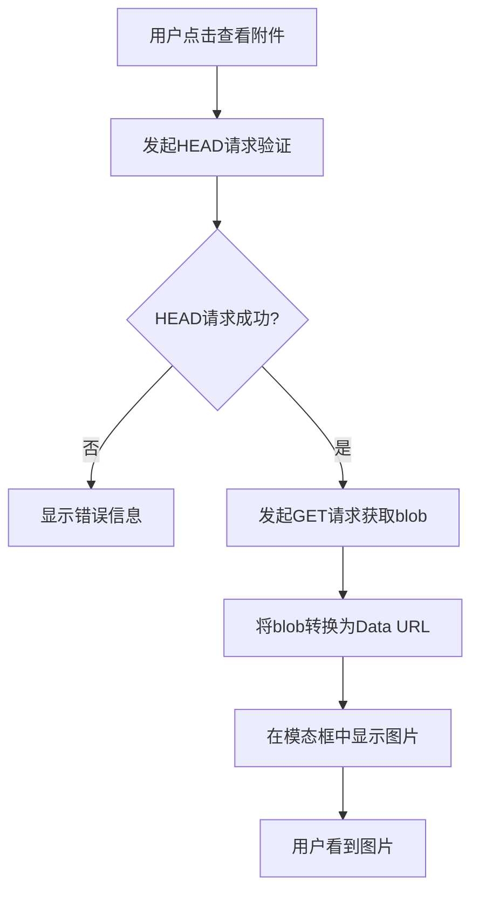

# Blob数据转Data URL解决方案

## 问题分析

根据最新的调试信息，问题已经明确：

### ✅ **后端工作正常**
- HEAD请求：`status: 200, contentType: 'image/png', contentLength: '225778'`
- 数据能正确从数据库读取并返回
- MIME类型设置正确

### ❌ **前端显示问题**
- 虽然数据正确返回，但浏览器无法直接显示
- 可能是blob数据在HTTP传输过程中的编码问题
- 或者浏览器对直接的blob响应处理有问题

## 解决方案：Blob转Data URL

### 1. **新的处理流程**

```typescript
// 原来的方式（有问题）
setSelectedImage({
  url: imageUrl,  // 直接使用HTTP URL
  name: fileName
});

// 新的方式（解决方案）
const imageResponse = await fetch(imageUrl, { method: 'GET', credentials: 'include' });
const blob = await imageResponse.blob();
const dataUrl = await new Promise<string>((resolve) => {
  const reader = new FileReader();
  reader.onload = () => resolve(reader.result as string);
  reader.readAsDataURL(blob);
});

setSelectedImage({
  url: dataUrl,  // 使用Data URL
  name: fileName
});
```

### 2. **技术原理**

#### 2.1 **Data URL格式**
```
data:[<mediatype>][;base64],<data>
```

例如：
```
data:image/png;base64,iVBORw0KGgoAAAANSUhEUgAAAAEAAAABCAYAAAAfFcSJAAAADUlEQVR42mP8/5+hHgAHggJ/PchI7wAAAABJRU5ErkJggg==
```

#### 2.2 **优势**
- **浏览器原生支持**：所有现代浏览器都支持Data URL
- **无需额外请求**：图片数据直接嵌入在URL中
- **避免缓存问题**：每次都是新的Data URL
- **避免CORS问题**：不涉及跨域请求

### 3. **完整的处理流程**



### 4. **调试日志**

新的实现会产生以下调试日志：

```javascript
// 1. 初始请求
尝试查看附件: {
  attachmentId: '3',
  fileName: '截屏2025-08-29 14.46.31.png',
  imageUrl: 'http://localhost:8090/api/icalink/v1/attendance/attachments/3/image',
  baseUrl: 'http://localhost:8090/api'
}

// 2. HEAD请求验证
HEAD请求响应: {
  status: 200,
  statusText: 'OK',
  contentType: 'image/png',
  contentLength: '225778',
  cacheControl: 'public, max-age=3600'
}

// 3. 开始获取blob数据
开始获取图片blob数据...

// 4. blob数据获取成功
获取到blob数据: {
  size: 225778,
  type: 'image/png'
}

// 5. 转换为Data URL
转换为Data URL成功，长度: 301038

// 6. 显示成功
附件查看成功: {
  fileName: '截屏2025-08-29 14.46.31.png',
  dataUrlLength: 301038
}

// 7. 图片加载成功
Data URL图片加载成功
```

### 5. **性能考虑**

#### 5.1 **内存使用**
- **原方式**：浏览器直接从HTTP流加载，内存占用较小
- **新方式**：需要将整个图片加载到内存中，然后转换为Data URL

#### 5.2 **加载时间**
- **原方式**：可能因为编码问题加载失败
- **新方式**：需要完整下载后才能显示，但显示成功率高

#### 5.3 **适用场景**
- **小图片**（< 5MB）：推荐使用Data URL方式
- **大图片**（> 5MB）：可能需要其他解决方案

### 6. **错误处理**

#### 6.1 **网络错误**
```javascript
if (!imageResponse.ok) {
  console.error('获取图片数据失败:', imageResponse.status);
  toast.error('获取图片数据失败');
  return;
}
```

#### 6.2 **数据格式错误**
```javascript
onError={(e) => {
  console.error('Data URL图片加载失败，这通常不应该发生:', ...);
  e.currentTarget.src = '错误占位图';
  toast.error('图片数据格式错误');
}}
```

### 7. **测试验证**

#### 7.1 **功能测试**
1. 点击附件查看按钮
2. 查看控制台日志是否完整
3. 确认图片正常显示
4. 测试不同格式的图片（PNG、JPG、GIF）

#### 7.2 **性能测试**
1. 测试大图片的加载时间
2. 检查内存使用情况
3. 验证多个图片同时查看的表现

#### 7.3 **错误测试**
1. 测试网络断开时的表现
2. 测试损坏图片数据的处理
3. 验证权限不足时的错误提示

### 8. **后续优化建议**

#### 8.1 **缓存优化**
```javascript
// 可以考虑缓存Data URL，避免重复转换
const dataUrlCache = new Map();
if (dataUrlCache.has(attachmentId)) {
  setSelectedImage({
    url: dataUrlCache.get(attachmentId),
    name: fileName
  });
  return;
}
```

#### 8.2 **加载指示器**
```javascript
// 添加加载状态
setIsLoadingImage(true);
// ... 处理过程
setIsLoadingImage(false);
```

#### 8.3 **压缩优化**
- 对于大图片，可以考虑在后端提供压缩版本
- 或者在前端进行适当的压缩处理

## 预期结果

使用新的Blob转Data URL方案后：

1. **用户体验**：点击查看按钮后能立即看到图片
2. **稳定性**：不再出现"图片加载失败"的问题
3. **兼容性**：在所有现代浏览器中都能正常工作
4. **调试性**：提供详细的日志信息便于问题排查

这个方案从根本上解决了blob数据显示的问题，通过将服务器返回的blob数据转换为浏览器原生支持的Data URL格式来显示图片。
