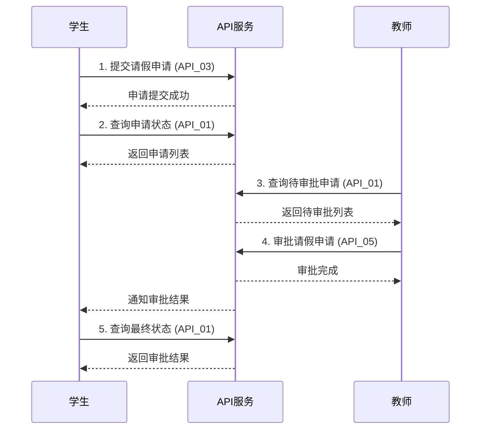
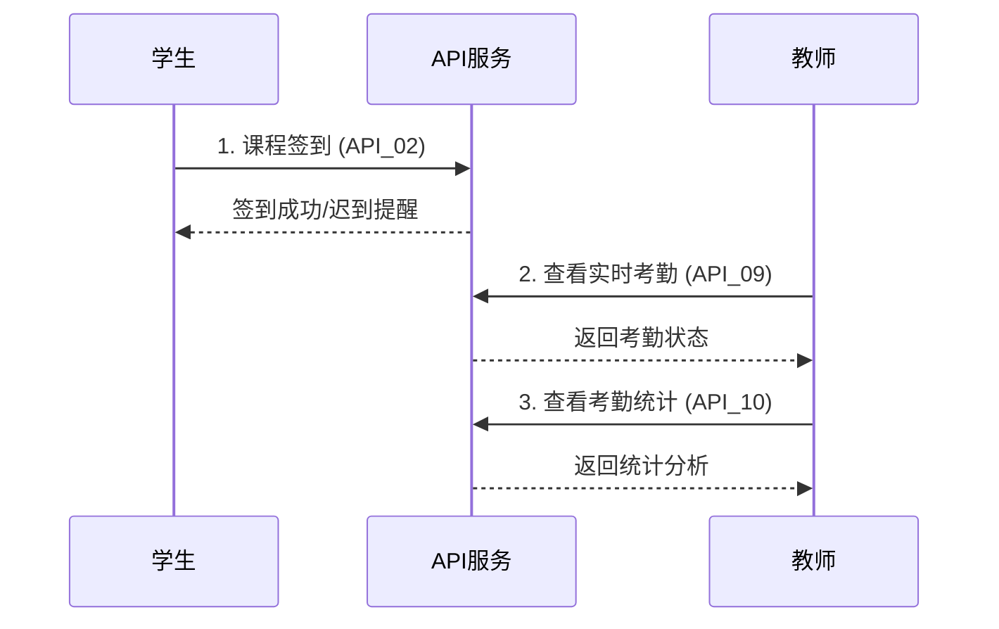

# app-icalink API接口文档

## 项目概述

app-icalink是基于Stratix框架开发的考勤管理系统，提供完整的学生签到、请假申请、教师审批等功能。本文档包含了系统的完整API接口规范。

## 文档结构

### 📋 总体设计
- [API接口重新设计规范](./API_REDESIGN_SPECIFICATION.md) - 整体设计原则和规范

### 🔍 请假管理接口
- [API_01: 查询请假信息接口](./API_01_LEAVE_QUERY.md) - 查询请假申请列表
- [API_03: 学生请假申请接口](./API_03_LEAVE_APPLICATION.md) - 提交请假申请
- [API_04: 撤回请假申请接口](./API_04_LEAVE_WITHDRAW.md) - 撤回请假申请
- [API_05: 审批请假申请接口](./API_05_LEAVE_APPROVAL.md) - 教师审批请假

### 📎 附件管理接口
- [API_06: 查看请假申请附件接口](./API_06_LEAVE_ATTACHMENTS.md) - 查看附件列表
- [API_07: 下载请假申请附件接口](./API_07_ATTACHMENT_DOWNLOAD.md) - 下载附件文件

### ✅ 考勤管理接口
- [API_02: 学生签到接口](./API_02_STUDENT_CHECKIN.md) - 学生签到
- [API_08: 课程历史考勤数据查询接口](./API_08_ATTENDANCE_HISTORY.md) - 历史考勤查询
- [API_09: 本次课学生考勤信息查询接口](./API_09_CURRENT_ATTENDANCE.md) - 当前考勤状态
- [API_10: 本课程学生考勤记录统计接口](./API_10_ATTENDANCE_STATISTICS.md) - 考勤统计分析

## 快速开始

### 认证方式

**重要说明**: 后端服务只需要从HTTP请求头中获取用户信息，不需要额外的认证流程。

所有API请求都需要在HTTP请求头中包含用户认证信息：

```http
X-User-Id: 用户ID
X-User-Type: 用户类型 (student/teacher)
X-User-Name: 用户姓名 (URL编码)
```

**认证流程**:
1. 前端系统负责用户登录和身份验证
2. 验证成功后，前端在每个API请求的Header中携带用户信息
3. 后端服务直接从Header中读取用户信息，无需额外验证
4. 基于Header中的用户信息进行权限控制和业务处理

### 基础URL

```
生产环境: https://api.icalink.edu.cn/api/icalink
测试环境: https://test-api.icalink.edu.cn/api/icalink
开发环境: http://localhost:3000/api/icalink
```

### 通用响应格式

#### 成功响应
```json
{
  "success": true,
  "message": "操作成功",
  "data": {
    // 具体数据
  }
}
```

#### 错误响应
```json
{
  "success": false,
  "message": "错误描述",
  "code": "ERROR_CODE"
}
```

## 用户角色权限

### 学生权限
- ✅ 查询自己的请假申请
- ✅ 提交请假申请
- ✅ 撤回待审批的请假申请
- ✅ 查看自己的请假附件
- ✅ 下载自己的请假附件
- ✅ 课程签到
- ✅ 查询自己的考勤历史
- ✅ 查看自己的考勤状态
- ✅ 查看自己的考勤统计

### 教师权限
- ✅ 查询自己课程的所有请假申请
- ✅ 审批学生的请假申请
- ✅ 查看学生的请假附件
- ✅ 下载学生的请假附件
- ✅ 查询课程的考勤历史
- ✅ 查看课程的实时考勤状态
- ✅ 查看课程的考勤统计分析

## 常用业务流程

### 学生请假流程



### 学生签到流程



## 错误代码说明

| 错误代码 | HTTP状态码 | 说明 | 常见原因 |
|---------|-----------|------|----------|
| `UNAUTHORIZED` | 401 | 用户未认证 | 缺少认证头或认证信息无效 |
| `FORBIDDEN` | 403 | 权限不足 | 用户角色不匹配或无访问权限 |
| `NOT_FOUND` | 404 | 资源不存在 | 请求的资源ID不存在 |
| `BAD_REQUEST` | 400 | 请求参数错误 | 参数格式错误或缺少必需参数 |
| `CONFLICT` | 409 | 资源冲突 | 重复操作或状态冲突 |
| `UNPROCESSABLE_ENTITY` | 422 | 业务逻辑错误 | 不满足业务规则 |
| `PAYLOAD_TOO_LARGE` | 413 | 请求体过大 | 上传文件超过大小限制 |
| `TOO_MANY_REQUESTS` | 429 | 请求频率过高 | 触发频率限制 |
| `INTERNAL_ERROR` | 500 | 服务器内部错误 | 系统异常 |

## 开发指南

### 前端集成示例

#### JavaScript/TypeScript
```javascript
// 基础API客户端
class IcalinkAPI {
  constructor(baseURL, userInfo) {
    this.baseURL = baseURL;
    this.userInfo = userInfo;
  }

  async request(method, path, data = null) {
    const headers = {
      'Content-Type': 'application/json',
      'X-User-Id': this.userInfo.id,
      'X-User-Type': this.userInfo.type,
      'X-User-Name': encodeURIComponent(this.userInfo.name)
    };

    const config = {
      method,
      headers,
      body: data ? JSON.stringify(data) : null
    };

    const response = await fetch(`${this.baseURL}${path}`, config);
    return await response.json();
  }

  // 学生签到
  async checkin(courseId, locationData) {
    return this.request('POST', `/v1/attendance/${courseId}/checkin`, locationData);
  }

  // 提交请假申请
  async submitLeave(leaveData) {
    return this.request('POST', '/v1/leave-applications', leaveData);
  }

  // 查询请假申请
  async getLeaveApplications(params = {}) {
    const query = new URLSearchParams(params).toString();
    return this.request('GET', `/v1/leave-applications?${query}`);
  }
}

// 使用示例
const api = new IcalinkAPI('https://api.icalink.edu.cn/api/icalink', {
  id: '20210001',
  type: 'student',
  name: '张三'
});

// 签到
await api.checkin(123, {
  location: '教学楼A101',
  latitude: 39.9042,
  longitude: 116.4074
});
```

#### React Hook示例
```jsx
import { useState, useEffect } from 'react';

function useIcalinkAPI(userInfo) {
  const [api] = useState(() => new IcalinkAPI('https://api.icalink.edu.cn/api/icalink', userInfo));
  return api;
}

function useLeaveApplications(filters = {}) {
  const [data, setData] = useState(null);
  const [loading, setLoading] = useState(true);
  const [error, setError] = useState(null);
  const api = useIcalinkAPI();

  useEffect(() => {
    async function fetchData() {
      try {
        setLoading(true);
        const result = await api.getLeaveApplications(filters);
        setData(result.data);
      } catch (err) {
        setError(err.message);
      } finally {
        setLoading(false);
      }
    }
    fetchData();
  }, [filters]);

  return { data, loading, error };
}
```

### 后端集成示例

#### Node.js/Express
```javascript
const axios = require('axios');

class IcalinkAPIClient {
  constructor(baseURL) {
    this.client = axios.create({
      baseURL,
      timeout: 10000
    });
  }

  async makeRequest(method, path, data, userInfo) {
    const headers = {
      'X-User-Id': userInfo.id,
      'X-User-Type': userInfo.type,
      'X-User-Name': encodeURIComponent(userInfo.name)
    };

    try {
      const response = await this.client.request({
        method,
        url: path,
        data,
        headers
      });
      return response.data;
    } catch (error) {
      throw new Error(error.response?.data?.message || error.message);
    }
  }
}
```

## 测试指南

### 单元测试示例

```javascript
// Jest测试示例
describe('Icalink API', () => {
  let api;

  beforeEach(() => {
    api = new IcalinkAPI('http://localhost:3000', {
      id: '20210001',
      type: 'student',
      name: '张三'
    });
  });

  test('学生签到成功', async () => {
    const result = await api.checkin(123, {
      location: '教学楼A101'
    });
    
    expect(result.success).toBe(true);
    expect(result.data.status).toMatch(/present|late/);
  });

  test('提交请假申请', async () => {
    const leaveData = {
      attendance_record_id: 456,
      leave_type: 'sick',
      leave_reason: '感冒发烧，需要休息'
    };
    
    const result = await api.submitLeave(leaveData);
    
    expect(result.success).toBe(true);
    expect(result.data.status).toBe('leave_pending');
  });
});
```

### API测试工具

推荐使用以下工具进行API测试：

1. **Postman** - 图形化API测试工具
2. **curl** - 命令行HTTP客户端
3. **Insomnia** - 现代化API测试工具
4. **Thunder Client** - VS Code插件

### Postman集合

我们提供了完整的Postman集合文件，包含所有API接口的示例请求：

```json
{
  "info": {
    "name": "Icalink API Collection",
    "description": "Complete API collection for Icalink attendance system"
  },
  "variable": [
    {
      "key": "baseUrl",
      "value": "https://api.icalink.edu.cn"
    },
    {
      "key": "userId",
      "value": "20210001"
    },
    {
      "key": "userType",
      "value": "student"
    },
    {
      "key": "userName",
      "value": "张三"
    }
  ]
}
```

## 性能优化建议

### 1. 缓存策略
- 静态数据（课程信息、用户信息）缓存1小时
- 考勤统计数据缓存15分钟
- 实时考勤状态缓存1分钟

### 2. 分页查询
- 历史数据查询使用分页，默认每页20条
- 大数据量统计使用流式处理
- 提供数据导出功能

### 3. 图片优化
- 上传时自动生成缩略图
- 使用CDN加速图片访问
- 支持WebP格式

### 4. 并发控制
- 限制同时上传的文件数量
- 实现请求队列管理
- 提供重试机制

## 安全注意事项

### 1. 数据验证
- 严格验证所有输入参数
- 防止SQL注入和XSS攻击
- 限制文件上传类型和大小

### 2. 权限控制
- 每个请求都验证用户权限
- 实现细粒度的访问控制
- 记录敏感操作日志

### 3. 频率限制
- 实现API调用频率限制
- 防止恶意刷接口
- 提供合理的错误提示

## 更新日志

### v1.0.0 (2024-01-15)
- 🎉 初始版本发布
- ✅ 完成10个核心API接口
- 📚 提供完整的接口文档
- 🔧 支持学生和教师两种角色

### 计划更新

#### v1.1.0 (计划中)
- 📊 增加更多统计维度
- 🔔 添加消息通知功能
- 📱 优化移动端体验
- 🚀 性能优化和缓存改进

## 技术支持

### 联系方式
- 📧 邮箱: support@icalink.edu.cn
- 📞 电话: 400-123-4567
- 💬 在线客服: https://support.icalink.edu.cn

### 问题反馈
- 🐛 Bug报告: https://github.com/icalink/issues
- 💡 功能建议: https://github.com/icalink/discussions
- 📖 文档问题: https://docs.icalink.edu.cn/feedback

---

*最后更新时间: 2024-01-15*  
*文档版本: v1.0.0*
