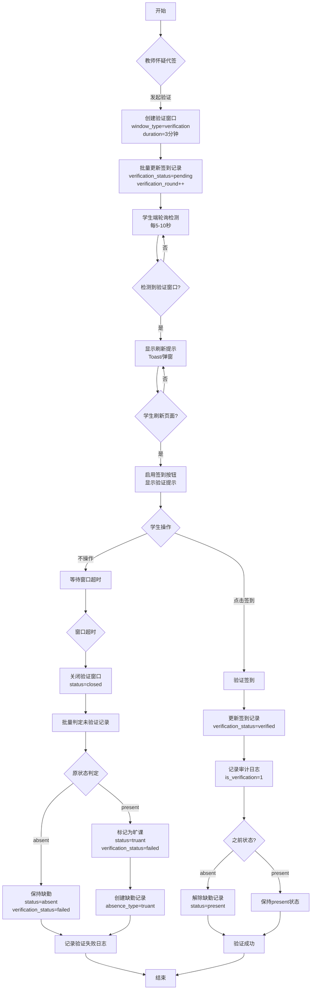
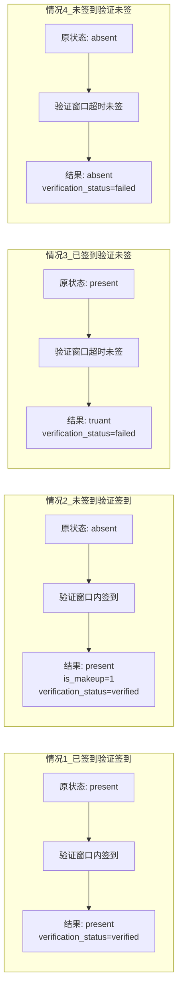
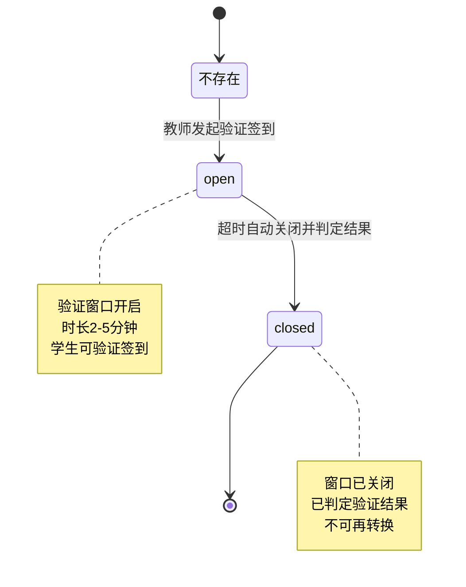
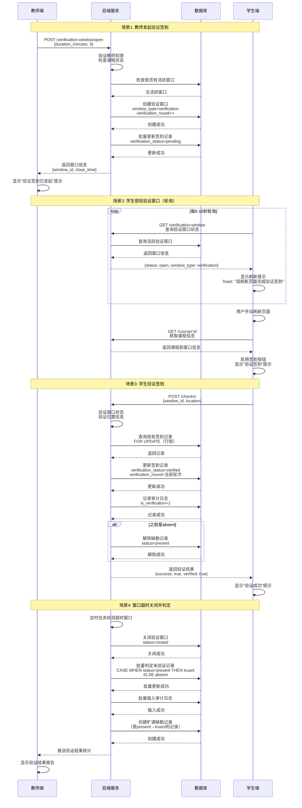
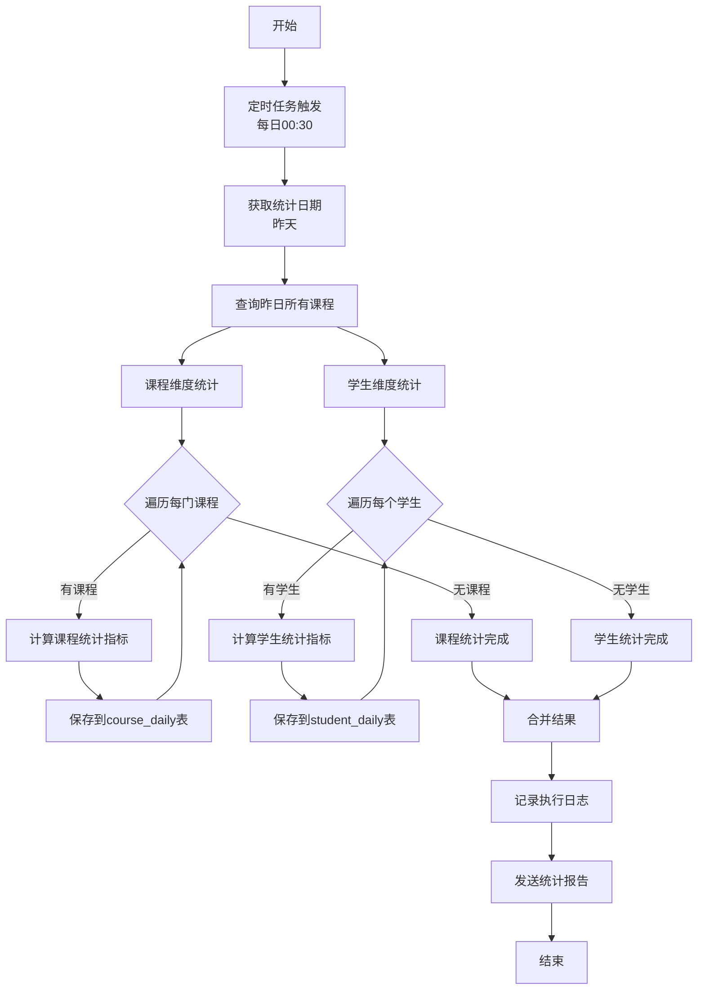
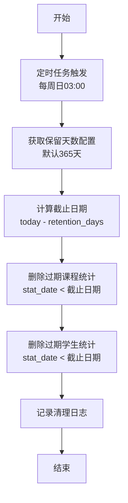
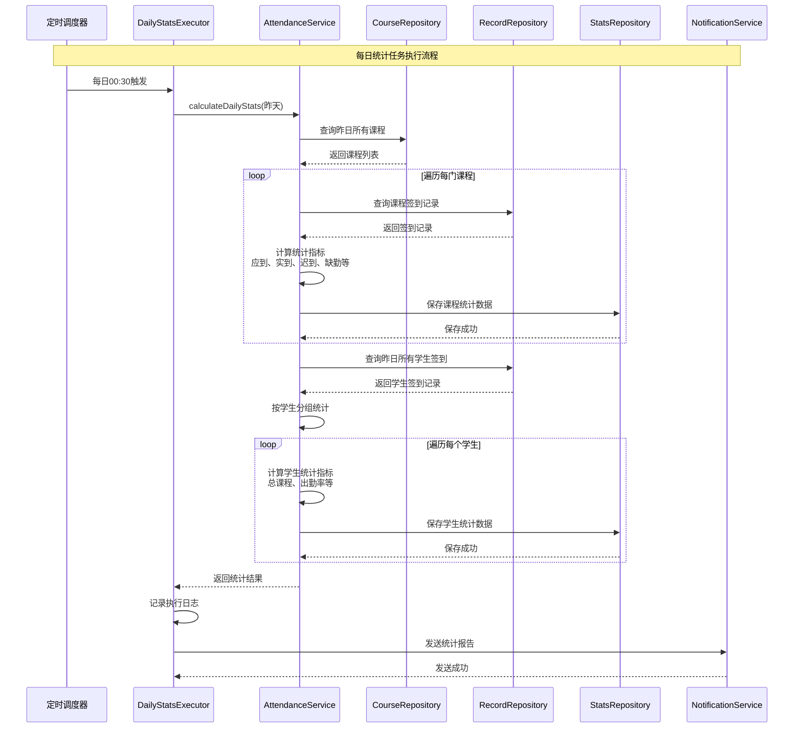

# 签到系统功能扩展 - 完整技术方案

## 1. 现有项目分析

### 1.1 前端项目 (agendaedu-app)

**技术栈**:

- React 18 + Vite + TypeScript
- Tailwind CSS (样式框架)
- React Router (路由管理)
- Lucide React (图标库)

**核心页面**:

- `StudentDashboard.tsx` - 学生签到页面
  - 支持地理位置验证 (WPS JSAPI)
  - 乐观更新策略
  - 实时状态管理 (每60秒刷新)
- `AttendanceSheet.tsx` - 教师考勤查看页面
  - 学生签到列表
  - 统计数据展示
  - 请假审批入口
- `AttendanceView.tsx` - 统一入口页面
  - 根据用户类型路由到对应页面

**API客户端**:

- `IcaLinkApiClient` - 统一API调用封装
  - 自动token刷新
  - 错误处理
  - Cookie管理

**特色功能**:

- WPS JSAPI集成 (地理位置、拍照等)
- 乐观更新 (签到操作即时反馈)
- 位置验证 (500米范围内打卡)

### 1.2 后端项目 (app-icalink)

**技术栈**:

- Stratix 框架 (基于 Fastify 5 + Awilix 12)
- MySQL 8 数据库
- TypeScript
- Kysely (类型安全的SQL查询构建器)

**架构模式**:

```
Controller (HTTP接口层)
    ↓
Service (业务逻辑层)
    ↓
Repository (数据访问层)
    ↓
Database (MySQL)
```

**核心模块**:

- `AttendanceController` - 考勤接口控制器
  - 学生签到 API
  - 教师查看 API
  - 请假申请 API
- `AttendanceService` - 考勤业务服务
  - 签到逻辑
  - 时间窗口计算
  - 自动标记缺勤
- `AttendanceRecordRepository` - 签到记录仓储
  - CRUD操作
  - 复杂查询
  - 统计聚合

**已有功能**:

- ✅ 学生签到 (支持位置验证)
- ✅ 请假申请与审批
- ✅ 课程统计 (基础版)
- ✅ RBAC权限管理
- ✅ 自动标记缺勤

### 1.3 现有数据模型

**核心数据表**:

1. `icasync_attendance_courses` - 签到课程表
   - 课程基本信息
   - 签到时间窗口配置
   - 教师信息

2. `icalink_attendance_records` - 签到记录表
   - 学生签到状态
   - 签到时间、位置
   - 迟到标记
   - **唯一约束**: (attendance_course_id, student_id)

3. `icalink_leave_applications` - 请假申请表
   - 请假类型、原因
   - 审批状态
   - 附件信息

4. `icalink_system_configs` - 系统配置表
   - 签到时间窗口配置
   - 迟到阈值
   - 自动缺勤时间

5. `out_xsxx` / `out_jsxx` - 外部学生/教师表
   - 学生基本信息
   - 教师基本信息

**数据关系**:

```
icasync_attendance_courses (课程)
    ↓ 1:N
icalink_attendance_records (签到记录)
    ↓ 1:N
icalink_leave_applications (请假申请)
```

### 1.4 可复用模块识别

**后端可复用**:

- ✅ BaseRepository - 通用仓储基类
- ✅ ServiceResult - 统一结果封装
- ✅ 权限验证中间件
- ✅ 日期时间工具函数
- ✅ 分页查询封装

**前端可复用**:

- ✅ IcaLinkApiClient - API客户端
- ✅ Toast组件 - 消息提示
- ✅ 位置服务 - LocationHelper
- ✅ 日期格式化工具

**需要扩展的部分**:

- ⚠️ AttendanceService - 需要新增补签、补卡逻辑
- ⚠️ AttendanceRecordRepository - 需要新增窗口、缺勤查询
- ⚠️ AttendanceController - 需要新增窗口、统计接口
- ⚠️ StudentDashboard - 需要新增窗口监听
- ⚠️ AttendanceSheet - 需要新增补卡、统计功能

---

## 需求1: 验证签到功能（防作弊机制）

### 1.1 功能描述与核心策略

**背景**: 教师怀疑存在代签或虚假签到行为，需要在课程进行中发起验证签到，要求学生在短时间内（2-5分钟）重新签到，以验证学生是否真的在教室。

**核心功能**:

- **验证窗口**: 教师在课程进行时可发起验证签到，时长1-3分钟
- **真实性验证**: 通过短时间窗口防止不在教室的学生远程签到
- **结果判定**: 根据验证结果判定学生状态（签到/旷课/缺勤）
- **实时通知**: 推送通知 + SSE实时通知学生
- **多轮验证**: 教师可多次发起验证，以最后一次结果为准

**业务场景**:

| 场景                | 说明                   | 触发条件     | 处理方式                   |
| ------------------- | ---------------------- | ------------ | -------------------------- |
| **场景1: 发起验证** | 教师怀疑代签或虚假签到 | 课程进行中   | 教师点击"发起验证签到"按钮 |
| **场景2: 学生验证** | 学生收到验证通知       | 验证窗口开启 | 学生在限定时间内完成签到   |
| **场景3: 窗口关闭** | 验证时间结束           | 自动超时     | 系统关闭窗口，判定验证结果 |
| **场景4: 结果判定** | 根据验证结果更新状态   | 窗口关闭后   | 更新签到记录，记录审计日志 |

**业务规则**:

| 规则项       | 配置值                 | 说明                       |
| ------------ | ---------------------- | -------------------------- |
| **开启时间** | 课程开始 ~ 课程结束    | 仅在课程进行中可发起       |
| **持续时间** | 2-5分钟（可配置）      | 默认3分钟，防止远程签到    |
| **权限控制** | 仅授课教师             | 需验证教师与课程的授课关系 |
| **验证轮次** | 支持多次验证           | 以最后一次验证结果为准     |
| **并发控制** | 同一课程仅一个活跃窗口 | 防止重复开启               |
| **自动关闭** | 超时自动关闭并判定结果 | 到达close_time自动关闭     |

**验证结果判定规则**:

| 正常签到状态 | 验证窗口内签到 | 最终结果  | 说明                   |
| ------------ | -------------- | --------- | ---------------------- |
| **已签到**   | ✅ 签到        | `present` | 验证通过，保持签到状态 |
| **已签到**   | ❌ 未签到      | `truant`  | 验证失败，判定为旷课   |
| **未签到**   | ✅ 签到        | `present` | 验证通过，补签成功     |
| **未签到**   | ❌ 未签到      | `absent`  | 验证失败，保持缺勤状态 |

**窗口状态转换**:

| 当前状态 | 触发事件     | 目标状态 | 说明               |
| -------- | ------------ | -------- | ------------------ |
| `不存在` | 教师发起验证 | `open`   | 创建验证窗口记录   |
| `open`   | 超时自动关闭 | `closed` | 系统自动关闭并判定 |
| `closed` | -            | -        | 终态，不可再转换   |

**签到记录标识**:

| 字段                  | 正常签到  | 验证签到          | 手动补卡 |
| --------------------- | --------- | ----------------- | -------- |
| `last_checkin_source` | `regular` | `window`          | `manual` |
| `checkin_window_id`   | `NULL`    | 窗口UUID          | `NULL`   |
| `is_makeup`           | `0`       | `0/1`             | `1`      |
| `verification_status` | `NULL`    | `verified/failed` | `NULL`   |
| `verification_round`  | `0`       | `1,2,3...`        | `0`      |
| `manual_override_by`  | `NULL`    | `NULL`            | 教师ID   |

#### 2.1.2 系统架构流程图

**验证签到完整流程**:



**4种情况处理流程**:



**窗口状态转换图**:



#### 2.1.3 业务流程泳道图

**验证签到完整流程（教师发起 → 学生验证 → 窗口关闭判定）**:



#### 2.1.4 签到按钮状态控制逻辑

**学生端签到按钮状态判定**:

```
判定签到按钮是否可点击(course, currentTime, verificationWindow):
  1. 检查常规签到窗口
     if (currentTime >= course.checkin_start_time AND
         currentTime <= course.checkin_end_time):
       return {enabled: true, text: "签到", type: "regular"}

  2. 检查验证签到窗口
     if (verificationWindow AND verificationWindow.status == 'open' AND
         currentTime <= verificationWindow.close_time):
       return {enabled: true, text: "验证签到", type: "verification"}

  3. 其他情况
     return {enabled: false, text: "不在签到时间", type: "disabled"}
```

**按钮状态与显示文本**:

| 条件                 | 按钮状态 | 显示文本         | 提示信息                           |
| -------------------- | -------- | ---------------- | ---------------------------------- |
| 常规签到时间内       | 可点击   | "签到"           | -                                  |
| 验证窗口开启         | 可点击   | "验证签到"       | "验证签到窗口已开启，剩余X分钟"    |
| 已签到（present）    | 禁用     | "已签到"         | "您已完成签到"                     |
| 已签到（late）       | 禁用     | "已签到（迟到）" | "您已完成签到"                     |
| 验证中（pending）    | 可点击   | "验证签到"       | "请完成验证签到，否则将判定为旷课" |
| 验证通过（verified） | 禁用     | "已验证"         | "验证签到已通过"                   |
| 验证失败（failed）   | 禁用     | "验证失败"       | "验证签到超时未完成"               |
| 不在签到时间         | 禁用     | "不在签到时间"   | -                                  |
| 课程未开始           | 禁用     | "课程未开始"     | -                                  |
| 课程已结束           | 禁用     | "课程已结束"     | -                                  |

**学生端轮询策略**:

| 场景           | 轮询间隔 | 说明                     |
| -------------- | -------- | ------------------------ |
| 课程未开始     | 不轮询   | 节省资源                 |
| 课程进行中     | 10秒     | 检测验证窗口开启         |
| 验证窗口开启中 | 5秒      | 更频繁检测，及时提示刷新 |
| 课程已结束     | 停止轮询 | 节省资源                 |

**轮询实现细节**:

**启动时机**:

- 学生进入课程详情页时
- 检查课程时间，仅在课程进行中启动轮询
- 立即执行一次查询，然后开始定时轮询

**停止时机**:

- 学生离开课程详情页（组件卸载）
- 课程结束时间到达
- 可选：网络连续失败超过3次

**动态间隔调整**:

```
确定轮询间隔():
  if (验证窗口状态 == 'open'):
    return 5秒   // 验证窗口开启时更频繁
  else:
    return 10秒  // 其他情况正常间隔
```

**页面刷新提示机制**:

```
检测到验证窗口开启时的处理流程:
  1. 轮询检测到验证窗口开启
  2. 显示Toast提示："验证签到已开启，请刷新页面完成验证"
  3. Toast包含"刷新页面"按钮
  4. 用户点击按钮或手动刷新页面
  5. 页面重新加载，获取最新课程和窗口信息
  6. 签到按钮变为可用状态，显示"验证签到"
  7. 用户点击签到按钮完成验证
```

**性能优化**:

- 后端缓存活跃窗口查询结果（5秒TTL）
- 使用course_id + window_type + status复合索引加速查询
- 仅在课程时间范围内轮询
- 验证窗口关闭后立即停止高频轮询

**用户体验优化**:

- 窗口开启时显示Toast提示
- 剩余时间<30秒时显示警告提示
- 网络异常时显示友好提示
- 可选：支持浏览器通知API

#### 2.1.5 签到记录处理方案

**正常签到 vs 验证签到对比**:

| 对比项       | 正常签到                      | 验证签到                              |
| ------------ | ----------------------------- | ------------------------------------- |
| **触发时间** | 课程签到时间窗口内            | 教师发起验证签到后                    |
| **验证逻辑** | 时间验证 + 位置验证           | 窗口状态验证 + 位置验证               |
| **记录标识** | `last_checkin_source=regular` | `last_checkin_source=window`          |
| **窗口关联** | `checkin_window_id=NULL`      | `checkin_window_id=UUID`              |
| **验证状态** | `verification_status=NULL`    | `verification_status=verified/failed` |
| **审计日志** | `is_verification=0`           | `is_verification=1`                   |
| **缺勤处理** | 不涉及                        | 如之前缺勤，则解除缺勤记录            |

**4种情况详细处理逻辑**:

**情况1: 已签到 + 验证签到 → present**

```
处理流程:
  1. 查询现有记录
     record = findByStudentAndCourse(studentId, courseId) FOR UPDATE
     // record.status = 'present', verification_status = 'pending'

  2. 更新签到记录
     UPDATE icalink_attendance_records SET
       status = 'present',  // 保持present
       last_checkin_source = 'window',
       checkin_window_id = windowId,
       verification_status = 'verified',
       verification_round = currentRound,
       last_verification_time = NOW(),
       checkin_time = NOW()
     WHERE id = record.id

  3. 记录审计日志
     INSERT INTO icalink_checkin_attempts (
       attendance_record_id, operator_type, operator_id,
       previous_status, new_status, window_id,
       is_verification, verification_round
     ) VALUES (
       record.id, 'student', studentId,
       'present', 'present', windowId,
       1, currentRound
     )

  4. 返回结果
     return {success: true, status: 'present', verified: true}
```

**情况2: 未签到 + 验证签到 → present**

```
处理流程:
  1. 查询现有记录
     record = findByStudentAndCourse(studentId, courseId) FOR UPDATE
     // record.status = 'absent', verification_status = 'pending'

  2. 更新签到记录
     UPDATE icalink_attendance_records SET
       status = 'present',  // absent → present
       last_checkin_source = 'window',
       checkin_window_id = windowId,
       is_makeup = 1,  // 标记为补签
       verification_status = 'verified',
       verification_round = currentRound,
       last_verification_time = NOW(),
       checkin_time = NOW()
     WHERE id = record.id

  3. 记录审计日志
     INSERT INTO icalink_checkin_attempts (...)
     VALUES (..., 'absent', 'present', ...)

  4. 解除缺勤记录
     UPDATE icalink_absence_records SET
       resolved_flag = 1,
       resolved_by = 'verification_checkin',
       resolved_at = NOW()
     WHERE attendance_record_id = record.id AND resolved_flag = 0

  5. 返回结果
     return {success: true, status: 'present', verified: true, makeup: true}
```

**情况3: 已签到 + 验证未签 → truant**

```
处理流程（窗口关闭时批量处理）:
  1. 批量更新未验证记录
     UPDATE icalink_attendance_records SET
       status = 'truant',  // present → truant
       verification_status = 'failed',
       last_verification_time = NOW(),
       remark = CONCAT(IFNULL(remark, ''), '; 验证签到未通过')
     WHERE course_id = courseId
       AND verification_status = 'pending'
       AND verification_round = currentRound
       AND status = 'present'  // 仅处理原本已签到的记录

  2. 批量插入审计日志
     INSERT INTO icalink_checkin_attempts (
       attendance_record_id, operator_type, operator_id,
       previous_status, new_status, window_id,
       is_verification, verification_round, remark
     )
     SELECT id, 'system', 'system', 'present', 'truant',
            windowId, 1, currentRound, '验证签到超时未签到'
     FROM icalink_attendance_records
     WHERE course_id = courseId AND status = 'truant'
       AND verification_round = currentRound

  3. 创建旷课缺勤记录
     INSERT INTO icalink_absence_records (
       attendance_record_id, student_id, course_id,
       absence_type, absence_date, created_by, remark
     )
     SELECT id, student_id, course_id, 'truant', CURDATE(),
            'system', '验证签到未通过，判定为旷课'
     FROM icalink_attendance_records
     WHERE course_id = courseId AND status = 'truant'
       AND verification_round = currentRound
```

**情况4: 未签到 + 验证未签 → absent**

```
处理流程（窗口关闭时批量处理）:
  1. 批量更新未验证记录
     UPDATE icalink_attendance_records SET
       status = 'absent',  // 保持absent
       verification_status = 'failed',
       last_verification_time = NOW()
     WHERE course_id = courseId
       AND verification_status = 'pending'
       AND verification_round = currentRound
       AND status = 'absent'  // 仅处理原本缺勤的记录

  2. 批量插入审计日志
     INSERT INTO icalink_checkin_attempts (...)
     SELECT ..., 'absent', 'absent', ...
     FROM icalink_attendance_records
     WHERE course_id = courseId AND status = 'absent'
       AND verification_round = currentRound

  3. 缺勤记录保持不变（已存在）
```

**验证签到通用处理流程**:

```
处理验证签到请求(studentId, courseId, location, windowId):
  BEGIN TRANSACTION

  1. 验证窗口状态
     window = findByWindowId(windowId)
     if (!window OR window.status != 'open' OR NOW() > window.close_time):
       return {success: false, error: '验证窗口已关闭'}

  2. 查询现有签到记录（加锁）
     record = findByStudentAndCourse(studentId, courseId) FOR UPDATE

  3. 验证记录状态
     if (record.verification_status != 'pending'):
       return {success: false, error: '无需验证或已验证'}

  4. 更新签到记录
     previousStatus = record.status
     UPDATE icalink_attendance_records SET
       status = 'present',
       last_checkin_source = 'window',
       checkin_window_id = windowId,
       is_makeup = (previousStatus == 'absent' ? 1 : 0),
       verification_status = 'verified',
       verification_round = window.verification_round,
       last_verification_time = NOW(),
       checkin_time = NOW(),
       location = location
     WHERE id = record.id

  5. 记录审计日志
     INSERT INTO icalink_checkin_attempts (...)

  6. 处理缺勤记录
     if (previousStatus == 'absent'):
       UPDATE icalink_absence_records SET resolved_flag = 1 ...

  COMMIT

  7. 返回结果
     return {success: true, status: 'present', verified: true}
```

#### 2.1.6 数据库设计

**新增表1: icalink_checkin_windows (验证签到窗口表)**

| 字段                       | 类型         | 说明                                     | 取值范围/默认值                 |
| -------------------------- | ------------ | ---------------------------------------- | ------------------------------- |
| id                         | BIGINT       | 主键，自增                               | -                               |
| window_id                  | CHAR(36)     | UUID，窗口唯一标识                       | UUID v4                         |
| course_id                  | BIGINT       | 关联课程ID                               | 外键: icalink_courses.id        |
| **window_type**            | ENUM         | **窗口类型**                             | **'makeup', 'verification'**    |
| scope                      | ENUM         | 适用范围                                 | 'all', 'class', 'student_group' |
| open_time                  | DATETIME     | 开启时间                                 | NOW()                           |
| close_time                 | DATETIME     | 关闭时间                                 | open_time + duration_minutes    |
| opened_by                  | VARCHAR(100) | 开启人（教师ID）                         | -                               |
| closed_by                  | VARCHAR(100) | 关闭人（教师ID或system）                 | NULL                            |
| status                     | ENUM         | 窗口状态                                 | 'open', 'closed'                |
| duration_minutes           | INT          | 持续时长（分钟）                         | 3（验证签到默认3分钟）          |
| **verification_round**     | INT          | **验证轮次**（同一课程可多次发起验证）   | 1, 2, 3...                      |
| **expected_checkin_count** | INT          | **预期签到人数**（发起验证时的学生总数） | -                               |
| **actual_checkin_count**   | INT          | **实际验证签到人数**（窗口内签到的人数） | 0                               |
| metadata                   | JSON         | 扩展信息                                 | NULL                            |
| created_at                 | DATETIME     | 创建时间                                 | NOW()                           |
| updated_at                 | DATETIME     | 更新时间                                 | NOW()                           |

**字段用途说明**:

- **window_type**: 区分补签窗口（makeup）和验证签到窗口（verification），验证签到用于防作弊
- **verification_round**: 教师可多次发起验证签到，每次递增，用于标识最后一次验证结果
- **expected_checkin_count**: 记录发起验证时应该签到的学生总数，用于统计验证通过率
- **actual_checkin_count**: 记录窗口内实际完成验证签到的人数，用于实时统计

**新增表2: icalink_checkin_attempts (签到尝试审计表)**

| 字段                   | 类型          | 说明                                         | 取值范围/默认值                       |
| ---------------------- | ------------- | -------------------------------------------- | ------------------------------------- |
| id                     | BIGINT        | 主键，自增                                   | -                                     |
| attendance_record_id   | BIGINT        | 关联签到记录ID                               | 外键: icalink_attendance_records.id   |
| attempt_no             | INT           | 尝试序号（同一记录的第N次操作）              | 1, 2, 3...                            |
| operator_type          | ENUM          | 操作者类型                                   | 'student', 'teacher', 'system'        |
| operator_id            | VARCHAR(100)  | 操作者ID                                     | -                                     |
| previous_status        | VARCHAR(50)   | 操作前状态                                   | 'present', 'absent', 'late', 'truant' |
| new_status             | VARCHAR(50)   | 操作后状态                                   | 'present', 'absent', 'late', 'truant' |
| window_id              | CHAR(36)      | 关联窗口ID（如果是窗口签到）                 | NULL或UUID                            |
| **is_verification**    | TINYINT(1)    | **是否为验证签到**                           | **0, 1**                              |
| **verification_round** | INT           | **验证轮次**（对应窗口的verification_round） | NULL或1, 2, 3...                      |
| checkin_time           | DATETIME      | 签到时间                                     | NOW()                                 |
| location               | VARCHAR(500)  | 位置描述                                     | NULL                                  |
| latitude               | DECIMAL(10,7) | 纬度                                         | NULL                                  |
| longitude              | DECIMAL(10,7) | 经度                                         | NULL                                  |
| manual_override        | TINYINT(1)    | 是否手动补卡                                 | 0, 1                                  |
| remark                 | TEXT          | 备注                                         | NULL                                  |
| metadata               | JSON          | 扩展信息                                     | NULL                                  |
| created_at             | DATETIME      | 创建时间                                     | NOW()                                 |

**字段用途说明**:

- **is_verification**: 标识该审计记录是否为验证签到操作，用于区分常规签到和验证签到
- **verification_round**: 记录验证轮次，用于追溯是哪一轮验证的操作

**扩展表: icalink_attendance_records**

新增字段:

| 字段                       | 类型         | 说明                 | 取值范围/默认值                           |
| -------------------------- | ------------ | -------------------- | ----------------------------------------- |
| last_checkin_source        | ENUM         | 最后签到来源         | 'regular', 'window', 'manual'             |
| last_checkin_reason        | VARCHAR(255) | 最后签到原因         | NULL                                      |
| manual_override_by         | VARCHAR(100) | 手动补卡人（教师ID） | NULL                                      |
| manual_override_time       | DATETIME     | 手动补卡时间         | NULL                                      |
| manual_override_reason     | VARCHAR(500) | 手动补卡原因         | NULL                                      |
| auto_marked_at             | DATETIME     | 自动标记时间         | NULL                                      |
| **verification_status**    | ENUM         | **验证状态**         | **NULL, 'pending', 'verified', 'failed'** |
| **verification_round**     | INT          | **最后验证轮次**     | **NULL或1, 2, 3...**                      |
| **last_verification_time** | DATETIME     | **最后验证时间**     | **NULL**                                  |

**新增字段用途说明**:

- **verification_status**:
  - `NULL`: 未发起验证
  - `pending`: 验证中（教师发起验证后，学生未完成验证）
  - `verified`: 验证通过（学生在窗口内完成验证签到）
  - `failed`: 验证失败（窗口超时，学生未完成验证）

- **verification_round**: 记录最后一次验证的轮次，用于判定以最后一次验证结果为准

- **last_verification_time**: 记录最后一次验证操作的时间（验证签到或验证失败的时间）

**索引设计**:

| 表名                         | 索引名                     | 字段                                | 用途                        |
| ---------------------------- | -------------------------- | ----------------------------------- | --------------------------- |
| `icalink_checkin_windows`    | `uk_window_id`             | window_id (UNIQUE)                  | 窗口唯一标识                |
| `icalink_checkin_windows`    | `idx_course_window_status` | course_id, window_type, status      | 查询课程的活跃验证窗口      |
| `icalink_checkin_windows`    | `idx_close_time`           | close_time                          | 定时任务查询超时窗口        |
| `icalink_checkin_windows`    | `idx_verification_round`   | course_id, verification_round       | 查询特定轮次的验证窗口      |
| `icalink_checkin_attempts`   | `idx_record_id`            | attendance_record_id                | 查询签到记录的所有尝试      |
| `icalink_checkin_attempts`   | `idx_window_id`            | window_id                           | 查询窗口的所有签到尝试      |
| `icalink_checkin_attempts`   | `idx_verification`         | is_verification, verification_round | 查询验证签到的审计记录      |
| `icalink_attendance_records` | `idx_checkin_source`       | last_checkin_source                 | 统计不同来源的签到          |
| `icalink_attendance_records` | `idx_verification_status`  | course_id, verification_status      | 查询待验证/已验证的签到记录 |
| `icalink_attendance_records` | `idx_verification_round`   | verification_round                  | 查询特定轮次的验证记录      |

#### 2.1.7 后端接口设计

##### 2.1.7.1 Repository层接口

**CheckinWindowRepository 接口定义**:

```typescript
export interface ICheckinWindowRepository {
  // 创建验证窗口
  create(data: CreateCheckinWindowData): Promise<ServiceResult<CheckinWindow>>;

  // 查询活跃验证窗口（指定窗口类型）
  findActiveByCourseId(
    courseId: number,
    windowType: 'makeup' | 'verification'
  ): Promise<ServiceResult<CheckinWindow | null>>;

  // 根据window_id查询
  findByWindowId(
    windowId: string
  ): Promise<ServiceResult<CheckinWindow | null>>;

  // 关闭窗口
  close(windowId: string, closedBy: string): Promise<ServiceResult<void>>;

  // 查询超时窗口（用于定时任务）
  findExpiredWindows(beforeTime: Date): Promise<ServiceResult<CheckinWindow[]>>;

  // 获取课程的最大验证轮次
  getMaxVerificationRound(courseId: number): Promise<ServiceResult<number>>;

  // 更新实际签到人数
  incrementActualCheckinCount(windowId: string): Promise<ServiceResult<void>>;
}
```

**AttendanceRecordRepository 扩展接口**:

```typescript
export interface IAttendanceRecordRepository extends BaseRepository {
  // 批量更新验证状态（发起验证时）
  batchUpdateVerificationStatus(
    courseId: number,
    verificationRound: number,
    status: 'pending'
  ): Promise<ServiceResult<number>>;

  // 批量判定验证失败（窗口关闭时）
  batchJudgeVerificationFailed(
    courseId: number,
    verificationRound: number
  ): Promise<
    ServiceResult<{
      truantCount: number;
      absentCount: number;
    }>
  >;

  // 查询待验证的记录
  findPendingVerificationRecords(
    courseId: number,
    verificationRound: number
  ): Promise<ServiceResult<AttendanceRecord[]>>;
}
```

**CheckinAttemptRepository 接口定义**:

```typescript
export interface ICheckinAttemptRepository {
  // 创建签到尝试记录
  create(
    data: CreateCheckinAttemptData
  ): Promise<ServiceResult<CheckinAttempt>>;

  // 批量创建审计日志（窗口关闭时）
  batchCreate(data: CreateCheckinAttemptData[]): Promise<ServiceResult<number>>;

  // 查询签到记录的所有尝试
  findByAttendanceRecordId(
    recordId: number
  ): Promise<ServiceResult<CheckinAttempt[]>>;

  // 查询窗口的所有签到尝试
  findByWindowId(windowId: string): Promise<ServiceResult<CheckinAttempt[]>>;

  // 查询验证签到的审计记录
  findVerificationAttempts(
    courseId: number,
    verificationRound: number
  ): Promise<ServiceResult<CheckinAttempt[]>>;
}
```

**类型定义**:

```typescript
export interface CheckinWindow {
  id: number;
  window_id: string;
  course_id: number;
  window_type: 'makeup' | 'verification'; // 新增
  scope: 'all' | 'class' | 'student_group';
  open_time: Date;
  close_time: Date;
  opened_by: string;
  closed_by?: string;
  status: 'open' | 'closed';
  duration_minutes: number;
  verification_round?: number; // 新增
  expected_checkin_count?: number; // 新增
  actual_checkin_count?: number; // 新增
  metadata?: Record<string, any>;
}

export interface CheckinAttempt {
  id: number;
  attendance_record_id: number;
  attempt_no: number;
  operator_type: 'student' | 'teacher' | 'system';
  operator_id: string;
  previous_status?: string;
  new_status: string;
  window_id?: string;
  is_verification: boolean; // 新增
  verification_round?: number; // 新增
  checkin_time: Date;
  location?: string;
  latitude?: number;
  longitude?: number;
  manual_override: boolean;
  remark?: string;
  metadata?: Record<string, any>;
}

export interface AttendanceRecord {
  id: number;
  student_id: string;
  course_id: number;
  status: 'present' | 'late' | 'absent' | 'truant';
  verification_status?: 'pending' | 'verified' | 'failed'; // 新增
  verification_round?: number; // 新增
  last_verification_time?: Date; // 新增
  // ... 其他字段
}
```

##### 2.1.7.2 Service层接口

**AttendanceService 扩展接口**:

```typescript
export interface IAttendanceService {
  // 开启验证签到窗口
  openVerificationWindow(
    courseId: number,
    teacherId: string,
    options: OpenVerificationWindowOptions
  ): Promise<ServiceResult<VerificationWindowResult>>;

  // 查询活跃验证窗口
  getActiveVerificationWindow(
    courseId: number
  ): Promise<ServiceResult<CheckinWindow | null>>;

  // 验证签到（学生在验证窗口内签到）
  verifyCheckin(
    courseId: number,
    studentInfo: UserInfo,
    request: VerificationCheckinRequest
  ): Promise<ServiceResult<VerificationCheckinResponse>>;

  // 扩展签到方法（支持常规签到和验证签到）
  checkin(
    courseId: number,
    studentInfo: UserInfo,
    request: CheckinRequest
  ): Promise<ServiceResult<CheckinResponse>>;
}

export interface OpenVerificationWindowOptions {
  duration_minutes?: number; // 默认3分钟
  scope?: 'all' | 'class' | 'student_group'; // 默认all
  target_students?: string[]; // scope=student_group时必填
}

export interface VerificationWindowResult {
  window_id: string;
  verification_round: number;
  open_time: Date;
  close_time: Date;
  expected_checkin_count: number;
  message: string;
}

export interface CheckinRequest {
  location?: string;
  latitude?: number;
  longitude?: number;
  window_id?: string; // 如果是验证签到，传入window_id
}

export interface VerificationCheckinRequest {
  window_id: string;
  location?: string;
  latitude?: number;
  longitude?: number;
}

export interface CheckinResponse {
  success: boolean;
  status: 'present' | 'late' | 'absent' | 'truant';
  is_makeup: boolean;
  is_verification: boolean; // 新增
  verified: boolean; // 新增
  checkin_time: Date;
  message?: string;
}

export interface VerificationCheckinResponse {
  success: boolean;
  verified: boolean;
  previous_status: string;
  current_status: string;
  verification_round: number;
  message: string;
}
```

**业务逻辑说明**:

**开启验证签到窗口逻辑**:

```
openVerificationWindow(courseId, teacherId, options):
  BEGIN TRANSACTION

  1. 验证教师权限
     - 检查教师是否为该课程的授课教师

  2. 验证课程状态
     - 检查课程是否在进行中

  3. 检查并发窗口
     - 查询是否已有活跃验证窗口（window_type=verification, status=open）
     - 如果有，返回错误"已存在活跃验证窗口"

  4. 获取验证轮次
     - maxRound = getMaxVerificationRound(courseId)
     - currentRound = maxRound + 1

  5. 统计预期签到人数
     - expectedCount = 查询该课程的学生总数

  6. 创建验证窗口记录
     - window_id = UUID()
     - window_type = 'verification'
     - verification_round = currentRound
     - expected_checkin_count = expectedCount
     - actual_checkin_count = 0
     - close_time = now() + duration_minutes
     - 插入icalink_checkin_windows表

  7. 批量更新签到记录状态
     - UPDATE icalink_attendance_records
       SET verification_status = 'pending',
           verification_round = currentRound
       WHERE course_id = courseId

  COMMIT

  8. 返回窗口信息
     - 返回window_id, verification_round, open_time, close_time, expected_checkin_count
```

**验证签到逻辑**:

```
verifyCheckin(courseId, studentInfo, request):
  BEGIN TRANSACTION

  1. 验证窗口状态
     - window = findByWindowId(request.window_id)
     - if (!window OR window.status != 'open' OR now() > window.close_time):
         return error "验证窗口已关闭"

  2. 验证位置信息（如果需要）
     - 计算距离，检查是否在允许范围内

  3. 查询现有签到记录（加行锁）
     - record = findByStudentAndCourse(studentInfo.id, courseId) FOR UPDATE

  4. 验证记录状态
     - if (record.verification_status != 'pending'):
         return error "无需验证或已验证"

  5. 更新签到记录
     - previousStatus = record.status
     - UPDATE icalink_attendance_records SET
         status = 'present',
         last_checkin_source = 'window',
         checkin_window_id = request.window_id,
         is_makeup = (previousStatus == 'absent' ? 1 : 0),
         verification_status = 'verified',
         verification_round = window.verification_round,
         last_verification_time = now(),
         checkin_time = now(),
         location = request.location

  6. 记录审计日志
     - INSERT INTO icalink_checkin_attempts (
         ..., is_verification=1, verification_round=window.verification_round
       )

  7. 更新窗口实际签到人数
     - incrementActualCheckinCount(request.window_id)

  8. 处理缺勤记录
     - if (previousStatus == 'absent'):
         UPDATE icalink_absence_records SET resolved_flag = 1

  COMMIT

  9. 返回验证结果
     - return {verified: true, previous_status, current_status: 'present'}
```

**窗口超时关闭逻辑（定时任务）**:

```
closeExpiredVerificationWindows():
  1. 查询超时窗口
     - windows = findExpiredWindows(now())
     - 筛选window_type = 'verification'

  2. 对每个超时窗口执行批量判定
     FOR EACH window IN windows:
       BEGIN TRANSACTION

       a. 关闭窗口
          - UPDATE icalink_checkin_windows SET status = 'closed'

       b. 批量判定未验证记录
          - UPDATE icalink_attendance_records SET
              status = CASE
                WHEN status = 'present' THEN 'truant'
                ELSE 'absent'
              END,
              verification_status = 'failed',
              last_verification_time = now()
            WHERE course_id = window.course_id
              AND verification_status = 'pending'
              AND verification_round = window.verification_round

       c. 批量插入审计日志
          - INSERT INTO icalink_checkin_attempts (...)
            SELECT ... FROM icalink_attendance_records
            WHERE verification_status = 'failed'

       d. 创建旷课缺勤记录
          - INSERT INTO icalink_absence_records (...)
            SELECT ... FROM icalink_attendance_records
            WHERE status = 'truant' AND verification_round = window.verification_round

       COMMIT
```

#### 2.1.8 后端API设计

**API 1.1: 开启验证签到窗口**

```
POST /api/icalink/v1/courses/:course_id/verification-window/open

权限: 教师 (需验证授课关系)

请求体:
{
  "duration_minutes": 3,   // 可选，默认3分钟
  "scope": "all",          // all/class/student_group
  "target_students": []    // scope=student_group时必填
}

响应:
{
  "success": true,
  "data": {
    "window_id": "uuid",
    "verification_round": 1,
    "open_time": "2024-01-01T10:00:00Z",
    "close_time": "2024-01-01T10:03:00Z",
    "expected_checkin_count": 50,
    "actual_checkin_count": 0,
    "status": "open",
    "message": "验证签到窗口已开启，请通知学生刷新页面完成验证"
  }
}
```

**API 1.2: 查询验证签到窗口状态**

```
GET /api/icalink/v1/courses/:course_id/verification-window

权限: 学生/教师

响应（窗口开启时）:
{
  "success": true,
  "data": {
    "window_id": "uuid",
    "window_type": "verification",
    "verification_round": 1,
    "status": "open",
    "open_time": "2024-01-01T10:00:00Z",
    "close_time": "2024-01-01T10:03:00Z",
    "can_checkin": true,
    "remaining_seconds": 120,
    "expected_checkin_count": 50,
    "actual_checkin_count": 30
  }
}

响应（无活跃窗口时）:
{
  "success": true,
  "data": null
}
```

**API 1.3: 验证签到**

```
POST /api/icalink/v1/courses/:course_id/verification-checkin

权限: 学生

请求体:
{
  "window_id": "uuid",
  "location": "教学楼A101",
  "latitude": 39.9042,
  "longitude": 116.4074
}

响应（验证成功）:
{
  "success": true,
  "data": {
    "verified": true,
    "previous_status": "present",
    "current_status": "present",
    "verification_round": 1,
    "checkin_time": "2024-01-01T10:01:30Z",
    "message": "验证签到成功"
  }
}

响应（验证失败）:
{
  "success": false,
  "error": {
    "code": "VERIFICATION_WINDOW_CLOSED",
    "message": "验证窗口已关闭"
  }
}
```

#### 2.1.9 关键技术要点

**权限验证**:

| 验证项       | 验证逻辑              | 说明                           |
| ------------ | --------------------- | ------------------------------ |
| **教师权限** | 检查teacher_codes字段 | 验证教师是否为该课程的授课教师 |
| **课程状态** | 检查课程时间          | 仅在课程进行中可开启窗口       |
| **学生权限** | 检查班级名单          | 验证学生是否属于该课程         |

**并发控制**:

| 场景             | 控制方案                    | 说明                                |
| ---------------- | --------------------------- | ----------------------------------- |
| **重复开启窗口** | 数据库唯一索引 + 业务层检查 | 同一课程仅允许一个活跃验证窗口      |
| **并发验证签到** | 数据库行锁                  | 使用`SELECT ... FOR UPDATE`锁定记录 |
| **窗口关闭竞态** | 乐观锁                      | 检查窗口状态，避免重复关闭          |
| **批量判定竞态** | 事务隔离                    | 批量更新在事务中执行，保证原子性    |

**Redis消息队列设计（削峰处理）**:

| 组件         | 技术方案               | 说明                                |
| ------------ | ---------------------- | ----------------------------------- |
| **队列类型** | Bull Queue             | 基于Redis的任务队列，支持延迟、重试 |
| **队列名称** | `verification-checkin` | 验证签到任务队列                    |
| **并发数**   | 10个worker             | 同时处理10个签到请求                |
| **重试策略** | 3次重试，指数退避      | 失败后重试，间隔1s、2s、4s          |
| **超时时间** | 5秒                    | 单个任务最长执行时间                |
| **优先级**   | 按时间戳排序           | 先到先处理                          |

**队列处理流程**:

```
验证签到请求 → 入队 → Worker处理 → 更新数据库 → 返回结果

1. 学生发起验证签到请求
2. 接口层验证基本参数，将任务加入队列
3. 立即返回任务ID给前端
4. Worker从队列中取出任务
5. 执行验证签到逻辑（加锁、更新记录、记录审计）
6. 更新任务状态（成功/失败）
7. 前端轮询任务状态或通过WebSocket推送结果
```

**接口限流方案**:

| 限流维度     | 限流策略                   | 说明                                |
| ------------ | -------------------------- | ----------------------------------- |
| **学生维度** | 5次/分钟                   | 单个学生每分钟最多5次验证签到请求   |
| **课程维度** | 100次/分钟                 | 单个课程每分钟最多100次验证签到请求 |
| **全局维度** | 1000次/分钟                | 全局每分钟最多1000次验证签到请求    |
| **算法**     | 滑动窗口（Redis）          | 使用Redis ZSET实现滑动窗口限流      |
| **响应**     | HTTP 429 Too Many Requests | 超过限流返回429状态码               |

**批量优化方案**:

| 优化场景         | 优化方案            | 说明                                 |
| ---------------- | ------------------- | ------------------------------------ |
| **发起验证**     | 批量UPDATE          | 一次SQL更新所有学生的验证状态        |
| **窗口关闭判定** | 批量UPDATE + INSERT | 批量更新未验证记录，批量插入审计日志 |
| **缺勤记录创建** | 批量INSERT          | 批量创建旷课缺勤记录                 |
| **审计日志**     | 批量INSERT          | 批量插入审计日志，减少数据库交互     |

**数据一致性**:

| 保障措施     | 实现方式               | 说明                                      |
| ------------ | ---------------------- | ----------------------------------------- |
| **事务保证** | 数据库事务             | 验证签到记录更新 + 审计日志插入在同一事务 |
| **审计完整** | 记录所有尝试           | checkin_attempts表记录所有验证签到尝试    |
| **缺勤联动** | 级联更新               | 验证签到成功自动解除缺勤记录              |
| **轮次控制** | verification_round字段 | 确保以最后一次验证结果为准                |

**缓存策略**:

| 缓存项           | 缓存时长 | 说明                             |
| ---------------- | -------- | -------------------------------- |
| **活跃窗口查询** | 5秒      | Redis缓存活跃验证窗口信息        |
| **课程信息**     | 10分钟   | 缓存课程基本信息，减少数据库查询 |
| **学生名单**     | 10分钟   | 缓存课程学生名单，用于权限验证   |

#### 2.1.10 配置参数

| 参数名                                          | 默认值 | 说明                         |
| ----------------------------------------------- | ------ | ---------------------------- |
| `verification_window.default_duration`          | `3`    | 默认验证窗口持续时间（分钟） |
| `verification_window.min_duration`              | `2`    | 最小验证窗口持续时间（分钟） |
| `verification_window.max_duration`              | `5`    | 最大验证窗口持续时间（分钟） |
| `verification_window.auto_close_enabled`        | `true` | 是否启用自动关闭             |
| `verification_window.auto_close_check_interval` | `30`   | 自动关闭检查间隔（秒）       |
| `verification_window.location_required`         | `true` | 是否需要位置验证             |
| `verification_window.max_distance_meters`       | `500`  | 最大允许距离（米）           |
| `verification_window.rate_limit_per_student`    | `5`    | 学生每分钟最大请求次数       |
| `verification_window.rate_limit_per_course`     | `100`  | 课程每分钟最大请求次数       |
| `verification_window.queue_enabled`             | `true` | 是否启用消息队列削峰         |
| `verification_window.queue_concurrency`         | `10`   | 队列并发处理数               |
| `verification_window.cache_ttl_seconds`         | `5`    | 活跃窗口缓存时长（秒）       |

#### 2.1.11 监控与日志

**执行日志格式**:

**开启验证窗口日志**:

```json
{
  "timestamp": "2024-01-15T10:00:00.000Z",
  "action": "open_verification_window",
  "course_id": 101,
  "window_id": "uuid",
  "window_type": "verification",
  "verification_round": 1,
  "opened_by": "T001",
  "duration_minutes": 3,
  "expected_checkin_count": 50,
  "status": "success"
}
```

**验证签到日志**:

```json
{
  "timestamp": "2024-01-15T10:01:30.000Z",
  "action": "verification_checkin",
  "course_id": 101,
  "student_id": "S001",
  "window_id": "uuid",
  "verification_round": 1,
  "previous_status": "present",
  "current_status": "present",
  "verified": true,
  "status": "success"
}
```

**窗口关闭判定日志**:

```json
{
  "timestamp": "2024-01-15T10:03:00.000Z",
  "action": "close_verification_window",
  "course_id": 101,
  "window_id": "uuid",
  "verification_round": 1,
  "expected_checkin_count": 50,
  "actual_checkin_count": 45,
  "truant_count": 3,
  "absent_count": 2,
  "verification_pass_rate": 0.9,
  "status": "success"
}
```

**异常告警触发条件**:

| 告警类型             | 触发条件                             | 告警级别 |
| -------------------- | ------------------------------------ | -------- |
| **窗口开启失败**     | 权限不足、课程状态异常、并发窗口冲突 | Warning  |
| **验证通过率过低**   | 验证通过率 < 60%                     | Warning  |
| **旷课率异常**       | 旷课率 > 20%（原已签到但验证未通过） | Critical |
| **窗口自动关闭失败** | 定时任务执行失败                     | Critical |
| **数据库连接失败**   | 数据库连接超时或异常                 | Critical |
| **队列积压**         | 队列任务积压 > 100                   | Warning  |
| **限流触发频繁**     | 单个学生1分钟内触发限流 > 3次        | Warning  |

**监控指标**:

| 指标名                               | 类型      | 说明                     |
| ------------------------------------ | --------- | ------------------------ |
| `verification_window_opened`         | Counter   | 验证窗口开启次数         |
| `verification_window_closed`         | Counter   | 验证窗口关闭次数         |
| `verification_window_duration`       | Histogram | 验证窗口持续时间分布     |
| `verification_checkin_attempts`      | Counter   | 验证签到尝试次数         |
| `verification_checkin_success`       | Counter   | 验证签到成功次数         |
| `verification_checkin_failed`        | Counter   | 验证签到失败次数         |
| `verification_pass_rate`             | Gauge     | 验证通过率（实时）       |
| `verification_truant_count`          | Counter   | 验证失败判定为旷课的次数 |
| `verification_queue_size`            | Gauge     | 验证签到队列当前大小     |
| `verification_queue_processing_time` | Histogram | 队列任务处理时间分布     |
| `verification_rate_limit_triggered`  | Counter   | 限流触发次数             |

#### 2.1.12 前端实现要点

##### 2.1.12.1 教师端组件

**VerificationWindowControl 组件**:

**组件职责**:

- 显示"发起验证签到"按钮
- 显示验证窗口状态和剩余时间
- 处理验证窗口开启操作
- 显示验证结果统计（验证通过率、旷课人数等）
- 窗口关闭后自动刷新签到列表

**状态管理**:

```typescript
interface VerificationWindowControlState {
  windowStatus: 'closed' | 'open' | 'loading';
  windowId?: string;
  verificationRound?: number;
  remainingTime: number; // 剩余秒数
  closeTime?: Date;
  expectedCheckinCount: number;
  actualCheckinCount: number;
}
```

**关键功能**:

| 功能             | 说明                                     |
| ---------------- | ---------------------------------------- |
| **发起验证签到** | 调用API开启验证窗口，显示成功提示        |
| **倒计时显示**   | 实时显示剩余时间                         |
| **实时统计**     | 显示已验证人数/总人数                    |
| **自动刷新**     | 窗口关闭后自动刷新签到列表，查看验证结果 |
| **通知学生**     | 提示教师通过微信群或口头通知学生刷新页面 |

**教师操作流程**:

```
1. 教师点击"发起验证签到"按钮
2. 系统开启验证窗口（3分钟）
3. 显示提示："验证签到已发起，请通知学生刷新页面完成验证"
4. 教师通过微信群或口头通知学生："请刷新页面完成验证签到"
5. 显示实时统计：已验证 X/Y 人
6. 窗口超时自动关闭
7. 自动刷新签到列表，查看验证结果（旷课、缺勤等）
```

**集成到 AttendanceSheet**:

- 在签到列表上方添加验证窗口控制组件
- 窗口开启后显示实时统计
- 窗口关闭后自动刷新签到列表

##### 2.1.12.2 学生端扩展

**StudentDashboard 扩展**:

**页面加载时获取验证窗口状态**:

```typescript
interface CourseDetailResponse {
  course: CourseInfo;
  attendanceRecord: AttendanceRecord;
  verificationWindow?: VerificationWindowInfo; // 新增
}

interface VerificationWindowInfo {
  window_id: string;
  window_type: 'verification';
  verification_round: number;
  status: 'open' | 'closed';
  open_time: Date;
  close_time: Date;
  can_checkin: boolean;
  remaining_seconds: number;
}

interface AttendanceRecord {
  status: 'present' | 'late' | 'absent' | 'truant';
  verification_status?: 'pending' | 'verified' | 'failed';
  verification_round?: number;
  // ... 其他字段
}
```

**签到按钮状态控制逻辑**:

```
页面加载时判定按钮状态():
  1. 获取课程详情（包含验证窗口信息）
  2. 判定按钮状态：
     a. 如果 verification_status === 'verified' → 禁用，显示"已验证"
     b. 如果 verification_status === 'failed' → 禁用，显示"验证失败"
     c. 如果 verification_status === 'pending' AND verificationWindow.status === 'open':
        → 启用，显示"验证签到"，高亮提示
     d. 如果在常规签到时间 → 启用，显示"签到"
     e. 如果已签到（status === 'present'） → 禁用，显示"已签到"
     f. 其他情况 → 禁用，显示"不在签到时间"
```

**学生操作流程**:

```
方式1：教师口头通知
1. 教师发起验证签到
2. 教师口头通知："请大家刷新页面完成验证签到"
3. 学生手动刷新页面（F5或下拉刷新）
4. 页面重新加载，获取最新课程信息和验证窗口状态
5. 签到按钮变为可用状态，显示"验证签到"
6. 学生点击签到按钮完成验证

方式2：教师微信群通知
1. 教师发起验证签到
2. 教师在微信群发送："请刷新页面完成验证签到"
3. 学生看到消息后刷新页面
4. 完成验证签到
```

**验证签到提示UI**:

| 场景                     | UI显示                                           |
| ------------------------ | ------------------------------------------------ |
| **验证窗口开启**         | 签到按钮高亮，显示"验证签到"，倒计时显示剩余时间 |
| **验证状态为pending**    | 显示警告提示："请完成验证签到，否则将判定为旷课" |
| **验证成功**             | 显示成功提示："验证签到成功"，按钮禁用           |
| **验证失败（超时未签）** | 显示失败提示："验证签到超时未完成"，按钮禁用     |
| **无验证窗口**           | 正常显示签到按钮状态                             |

**关键实现要点**:

1. **无需轮询**：学生端不使用定时轮询检测验证窗口状态
2. **页面刷新获取状态**：每次页面加载时调用课程详情API，获取最新的验证窗口状态
3. **教师线下通知**：教师通过微信群、口头等方式通知学生刷新页面
4. **简化实现**：降低服务器开销，避免大量轮询请求

##### 2.1.12.3 扩展 IcaLinkApiClient

**新增API方法**:

```typescript
class IcaLinkApiClient {
  // 开启验证签到窗口
  async openVerificationWindow(
    courseId: string,
    options: OpenVerificationWindowOptions
  ): Promise<ApiResponse<VerificationWindowResult>>;

  // 查询验证窗口状态
  async getVerificationWindow(
    courseId: string
  ): Promise<ApiResponse<VerificationWindowInfo | null>>;

  // 验证签到
  async verifyCheckin(
    courseId: string,
    request: VerificationCheckinRequest
  ): Promise<ApiResponse<VerificationCheckinResponse>>;

  // 扩展课程详情API（返回验证窗口信息）
  async getCourseDetail(
    courseId: string
  ): Promise<ApiResponse<CourseDetailResponse>>;
}
```

**课程详情API扩展**:

```
GET /api/icalink/v1/courses/:course_id

响应（包含验证窗口信息）:
{
  "success": true,
  "data": {
    "course": { ... },
    "attendanceRecord": {
      "status": "present",
      "verification_status": "pending",  // 新增
      "verification_round": 1,           // 新增
      ...
    },
    "verificationWindow": {              // 新增
      "window_id": "uuid",
      "window_type": "verification",
      "verification_round": 1,
      "status": "open",
      "close_time": "2024-01-01T10:03:00Z",
      "can_checkin": true,
      "remaining_seconds": 120
    }
  }
}
```

#### 2.1.13 实施检查清单

**数据库任务**:

- [ ] 创建 `icalink_checkin_windows` 表（新增window_type、verification_round等字段）
- [ ] 创建 `icalink_checkin_attempts` 表（新增is_verification、verification_round字段）
- [ ] 扩展 `icalink_attendance_records` 表（新增verification_status、verification_round、last_verification_time字段）
- [ ] 创建索引: `idx_course_window_status`, `idx_verification_round`, `idx_verification_status`
- [ ] 编写数据库迁移脚本
- [ ] 在测试环境验证迁移

**后端任务**:

- [ ] 创建 `CheckinWindowRepository`（支持验证窗口）
- [ ] 扩展 `AttendanceRecordRepository`（批量更新验证状态、批量判定验证失败）
- [ ] 创建 `CheckinAttemptRepository`（支持批量创建审计日志）
- [ ] 实现 `AttendanceService.openVerificationWindow()`
- [ ] 实现 `AttendanceService.verifyCheckin()`
- [ ] 实现定时任务：关闭超时验证窗口并批量判定
- [ ] 扩展 `AttendanceController`（新增3个验证签到API）
- [ ] 实现Redis消息队列（Bull Queue）
- [ ] 实现接口限流（Redis滑动窗口）
- [ ] 编写单元测试（覆盖率 > 80%）
- [ ] 编写集成测试

**前端任务**:

- [ ] 创建 `VerificationWindowControl` 组件（教师端）
- [ ] 扩展 `AttendanceSheet`（集成验证窗口控制）
- [ ] 扩展 `StudentDashboard`（页面加载时获取验证窗口状态）
- [ ] 扩展 `IcaLinkApiClient`（新增验证签到API）
- [ ] 扩展课程详情API响应（包含验证窗口信息）
- [ ] 实现验证签到按钮状态控制逻辑
- [ ] UI/UX测试
- [ ] 浏览器兼容性测试

**测试任务**:

- [ ] 单元测试: 验证窗口开启逻辑
- [ ] 单元测试: 4种情况的验证签到逻辑
- [ ] 单元测试: 窗口关闭批量判定逻辑
- [ ] 集成测试: 完整验证签到流程
- [ ] 性能测试: 并发验证签到场景（100人同时签到）
- [ ] 性能测试: Redis消息队列削峰效果
- [ ] 边界测试: 窗口超时、重复开启、多轮验证等

**文档任务**:

- [ ] API文档更新（验证签到相关API）
- [ ] 用户操作手册（教师如何发起验证签到、学生如何完成验证）
- [ ] 运维部署文档（Redis配置、定时任务配置）

---

### 需求2: 统计报表功能

#### 2.2.1 功能描述与核心策略

**核心功能**:

- **自动统计**: 每日自动统计签到数据并写入统计表
- **双维度统计**: 课程维度 + 学生维度
- **历史数据**: 支持历史数据查询和趋势分析
- **数据清理**: 自动清理过期统计数据

**统计维度**:

| 维度         | 统计对象           | 主要用途                             | 更新频率      |
| ------------ | ------------------ | ------------------------------------ | ------------- |
| **课程维度** | 每门课程的签到情况 | 教师查看课程出勤率、分析课程质量     | 每日凌晨00:30 |
| **学生维度** | 每个学生的签到情况 | 学生查看个人出勤、辅导员监控学生状态 | 每日凌晨00:30 |

**统计指标详解**:

**课程维度指标**:

| 指标名                | 计算公式                                                     | 说明               |
| --------------------- | ------------------------------------------------------------ | ------------------ |
| `total_should_attend` | 课程应到人数                                                 | 从课程班级名单计算 |
| `actual_attended`     | present_count + late_count                                   | 实际到课人数       |
| `present_count`       | COUNT(status='present')                                      | 正常签到人数       |
| `late_count`          | COUNT(status='late')                                         | 迟到人数           |
| `absent_count`        | COUNT(status='absent')                                       | 缺勤人数           |
| `leave_count`         | COUNT(status='excused')                                      | 请假人数           |
| `attendance_rate`     | (actual_attended + leave_count) / total_should_attend × 100% | 出勤率             |

**学生维度指标**:

| 指标名            | 计算公式                                                          | 说明             |
| ----------------- | ----------------------------------------------------------------- | ---------------- |
| `total_courses`   | COUNT(DISTINCT course_id)                                         | 学生当日总课程数 |
| `present_count`   | COUNT(status='present')                                           | 正常签到次数     |
| `late_count`      | COUNT(status='late')                                              | 迟到次数         |
| `absent_count`    | COUNT(status='absent')                                            | 缺勤次数         |
| `leave_count`     | COUNT(status='excused')                                           | 请假次数         |
| `attendance_rate` | (present_count + late_count + leave_count) / total_courses × 100% | 出勤率           |

**业务规则**:

| 规则项       | 配置值              | 说明             |
| ------------ | ------------------- | ---------------- |
| **统计时机** | 每日 00:30          | 避开业务高峰期   |
| **统计范围** | 前一日的所有课程    | 确保数据完整性   |
| **数据保留** | 365天（可配置）     | 支持年度分析     |
| **清理策略** | 每周日凌晨3:00      | 自动清理过期数据 |
| **幂等性**   | 基于日期+ID唯一索引 | 支持重复执行     |
| **失败重试** | 最多3次             | 确保数据完整性   |

#### 2.2.2 系统架构流程图

**整体统计流程**:



**数据清理流程**:



#### 2.2.3 业务流程泳道图



#### 2.2.4 数据库设计

**新增表1: icalink_course_attendance_daily (课程维度日报)**

| 字段                | 类型         | 说明         |
| ------------------- | ------------ | ------------ |
| id                  | BIGINT       | 主键         |
| stat_date           | DATE         | 统计日期     |
| course_id           | BIGINT       | 课程ID       |
| course_code         | VARCHAR(60)  | 课程代码     |
| course_name         | VARCHAR(500) | 课程名称     |
| teacher_codes       | VARCHAR(500) | 教师工号列表 |
| semester            | VARCHAR(20)  | 学期         |
| total_should_attend | INT          | 应到人数     |
| actual_attended     | INT          | 实到人数     |
| present_count       | INT          | 正常签到人数 |
| late_count          | INT          | 迟到人数     |
| absent_count        | INT          | 缺勤人数     |
| leave_count         | INT          | 请假人数     |
| attendance_rate     | DECIMAL(5,2) | 出勤率       |
| created_at          | TIMESTAMP    | 创建时间     |

**索引**:

- UNIQUE KEY `uk_date_course` (stat_date, course_id)
- KEY `idx_stat_date` (stat_date)
- KEY `idx_course_id` (course_id)
- KEY `idx_semester` (semester)

**新增表2: icalink_student_attendance_daily (学生维度日报)**

| 字段            | 类型         | 说明         |
| --------------- | ------------ | ------------ |
| id              | BIGINT       | 主键         |
| stat_date       | DATE         | 统计日期     |
| student_id      | VARCHAR(100) | 学号         |
| student_name    | VARCHAR(200) | 学生姓名     |
| class_name      | VARCHAR(200) | 班级名称     |
| semester        | VARCHAR(20)  | 学期         |
| total_courses   | INT          | 总课程数     |
| present_count   | INT          | 正常签到次数 |
| late_count      | INT          | 迟到次数     |
| absent_count    | INT          | 缺勤次数     |
| leave_count     | INT          | 请假次数     |
| attendance_rate | DECIMAL(5,2) | 出勤率       |
| created_at      | TIMESTAMP    | 创建时间     |

**索引**:

- UNIQUE KEY `uk_date_student` (stat_date, student_id)
- KEY `idx_stat_date` (stat_date)
- KEY `idx_student_id` (student_id)
- KEY `idx_semester` (semester)

#### 2.2.5 后端接口设计

##### 2.2.5.1 Repository层接口

**AttendanceStatsRepository 接口定义**:

```typescript
export interface IAttendanceStatsRepository {
  // 课程统计相关
  batchInsertCourseStats(
    stats: CourseAttendanceDaily[]
  ): Promise<ServiceResult<void>>;
  findCourseStatsByDateRange(
    startDate: Date,
    endDate: Date,
    courseId?: number
  ): Promise<ServiceResult<CourseAttendanceDaily[]>>;
  deleteCourseStatsBeforeDate(beforeDate: Date): Promise<ServiceResult<number>>;

  // 学生统计相关
  batchInsertStudentStats(
    stats: StudentAttendanceDaily[]
  ): Promise<ServiceResult<void>>;
  findStudentStatsByDateRange(
    startDate: Date,
    endDate: Date,
    studentId?: string
  ): Promise<ServiceResult<StudentAttendanceDaily[]>>;
  deleteStudentStatsBeforeDate(
    beforeDate: Date
  ): Promise<ServiceResult<number>>;
}
```

**类型定义**:

```typescript
export interface CourseAttendanceDaily {
  id?: number;
  stat_date: Date;
  course_id: number;
  course_code: string;
  course_name: string;
  teacher_codes: string;
  semester: string;
  total_should_attend: number;
  actual_attended: number;
  present_count: number;
  late_count: number;
  absent_count: number;
  leave_count: number;
  attendance_rate: number;
  created_at?: Date;
}

export interface StudentAttendanceDaily {
  id?: number;
  stat_date: Date;
  student_id: string;
  student_name: string;
  class_name: string;
  semester: string;
  total_courses: number;
  present_count: number;
  late_count: number;
  absent_count: number;
  leave_count: number;
  attendance_rate: number;
  created_at?: Date;
}
```

**实现要点**:

- 使用批量插入提高性能（`INSERT INTO ... ON DUPLICATE KEY UPDATE`）
- 利用唯一索引保证幂等性
- 使用事务确保数据一致性
- 支持按日期范围查询和删除

##### 2.2.5.2 Executor层接口

**DailyAttendanceStatsExecutor 接口定义**:

```typescript
@Executor({
  name: 'dailyAttendanceStats',
  description: '每日考勤统计任务',
  version: '1.0.0',
  category: 'attendance',
  schedule: '0 30 0 * * *' // 每日00:30执行
})
export default class DailyAttendanceStatsExecutor implements TaskExecutor {
  readonly name = 'dailyAttendanceStats';

  // 依赖注入
  constructor(
    private attendanceRecordRepository: IAttendanceRecordRepository,
    private attendanceCourseRepository: IAttendanceCourseRepository,
    private attendanceStatsRepository: IAttendanceStatsRepository,
    private logger: Logger
  );

  // 主执行方法
  async execute(context: ExecutionContext): Promise<ExecutionResult>;

  // 健康检查
  async healthCheck(): Promise<boolean>;

  // 配置验证
  validateConfig(config: DailyStatsConfig): boolean;
}
```

**配置类型**:

```typescript
export interface DailyStatsConfig {
  statDate?: Date; // 统计日期（默认昨天）
  retentionDays?: number; // 数据保留天数（默认365）
  batchSize?: number; // 批量处理大小（默认100）
  enableNotification?: boolean; // 是否发送通知（默认true）
}

export interface ExecutionResult {
  success: boolean;
  data?: {
    statDate: Date;
    courseStatsCount: number;
    studentStatsCount: number;
    duration: number;
  };
  error?: string;
}
```

#### 2.2.6 详细执行流程

**主执行流程**:

```
execute(context):
  1. 获取配置参数
     - statDate = config.statDate || 昨天
     - retentionDays = config.retentionDays || 365

  2. 执行课程维度统计
     - 调用 calculateCourseStats(statDate)
     - 批量保存到 icalink_course_attendance_daily

  3. 执行学生维度统计
     - 调用 calculateStudentStats(statDate)
     - 批量保存到 icalink_student_attendance_daily

  4. 清理过期数据
     - 调用 cleanupOldStats(statDate, retentionDays)

  5. 记录执行日志
     - 统计数量、执行时间等

  6. 发送通知（可选）
     - 发送统计报告给管理员
```

**课程统计算法**:

```
calculateCourseStats(statDate):
  1. 查询指定日期的所有课程
     courses = attendanceCourseRepository.findByDate(statDate)

  2. 遍历每门课程
     for course in courses:
       a. 查询课程的所有签到记录
          records = attendanceRecordRepository.findByCourseId(course.id)

       b. 计算统计指标
          total_should_attend = records.length
          present_count = COUNT(status='present')
          late_count = COUNT(status='late')
          absent_count = COUNT(status='absent')
          leave_count = COUNT(status='excused')
          actual_attended = present_count + late_count
          attendance_rate = (actual_attended + leave_count) / total_should_attend × 100

       c. 构建统计对象
          stats.push({
            stat_date, course_id, course_code, course_name,
            teacher_codes, semester,
            total_should_attend, actual_attended,
            present_count, late_count, absent_count, leave_count,
            attendance_rate
          })

  3. 返回统计结果数组
     return stats
```

**学生统计算法**:

```
calculateStudentStats(statDate):
  1. 查询指定日期有课的所有学生
     students = getStudentsWithCoursesOnDate(statDate)

  2. 遍历每个学生
     for student in students:
       a. 查询学生当天的所有签到记录
          records = attendanceRecordRepository.findByStudentAndDate(
            student.id, statDate
          )

       b. 计算统计指标
          total_courses = records.length
          present_count = COUNT(status='present')
          late_count = COUNT(status='late')
          absent_count = COUNT(status='absent')
          leave_count = COUNT(status='excused')
          attendance_rate = (present_count + late_count + leave_count) / total_courses × 100

       c. 构建统计对象
          stats.push({
            stat_date, student_id, student_name, class_name, semester,
            total_courses, present_count, late_count, absent_count, leave_count,
            attendance_rate
          })

  3. 返回统计结果数组
     return stats
```

**数据清理算法**:

```
cleanupOldStats(currentDate, retentionDays):
  1. 计算截止日期
     cutoffDate = currentDate - retentionDays

  2. 删除过期课程统计
     deletedCourseCount = attendanceStatsRepository.deleteCourseStatsBeforeDate(cutoffDate)

  3. 删除过期学生统计
     deletedStudentCount = attendanceStatsRepository.deleteStudentStatsBeforeDate(cutoffDate)

  4. 记录清理日志
     logger.info(`清理了 ${deletedCourseCount} 条课程统计，${deletedStudentCount} 条学生统计`)
```

#### 2.2.7 关键技术要点

**性能优化**:

| 优化项       | 方案                                           | 效果               |
| ------------ | ---------------------------------------------- | ------------------ |
| **批量插入** | 使用 `INSERT INTO ... ON DUPLICATE KEY UPDATE` | 减少数据库交互次数 |
| **分批处理** | 每批处理100条记录                              | 避免内存溢出       |
| **索引优化** | 在查询字段上建立索引                           | 提高查询速度       |
| **并行统计** | 课程和学生统计可并行执行                       | 减少总执行时间     |

**数据一致性**:

| 保障措施     | 实现方式                                     | 说明                 |
| ------------ | -------------------------------------------- | -------------------- |
| **幂等性**   | 唯一索引 `uk_date_course`, `uk_date_student` | 支持重复执行         |
| **事务保证** | 使用数据库事务                               | 确保批量插入的原子性 |
| **失败重试** | 最多重试3次                                  | 提高成功率           |
| **数据校验** | 统计前验证数据完整性                         | 避免脏数据           |

**监控与告警**:

| 监控项         | 阈值             | 告警方式     |
| -------------- | ---------------- | ------------ |
| **执行时间**   | > 10分钟         | 发送告警邮件 |
| **失败次数**   | 连续失败3次      | 发送紧急告警 |
| **统计数量**   | 异常波动（±50%） | 发送提醒     |
| **数据库连接** | 连接失败         | 立即告警     |

#### 2.2.8 配置参数

| 参数名                      | 默认值         | 说明                        |
| --------------------------- | -------------- | --------------------------- |
| `stats.schedule`            | `0 30 0 * * *` | Cron表达式（每日00:30）     |
| `stats.retention_days`      | `365`          | 数据保留天数                |
| `stats.batch_size`          | `100`          | 批量处理大小                |
| `stats.enable_notification` | `true`         | 是否发送通知                |
| `stats.notification_emails` | `[]`           | 通知邮箱列表                |
| `stats.retry_max_attempts`  | `3`            | 最大重试次数                |
| `stats.retry_delay_ms`      | `5000`         | 重试延迟（毫秒）            |
| `stats.cleanup_schedule`    | `0 0 3 * * 0`  | 清理任务Cron（每周日03:00） |

#### 2.2.9 监控与日志

**执行日志格式**:

```json
{
  "timestamp": "2024-01-15T00:30:00.000Z",
  "executor": "dailyAttendanceStats",
  "statDate": "2024-01-14",
  "courseStatsCount": 150,
  "studentStatsCount": 3500,
  "duration": 45000,
  "status": "success"
}
```

**异常告警触发条件**:

- 执行失败
- 执行时间超过10分钟
- 统计数量异常（与前一天相比波动超过50%）
- 数据库连接失败

**监控指标**:

| 指标名                     | 类型      | 说明         |
| -------------------------- | --------- | ------------ |
| `stats_execution_duration` | Histogram | 执行耗时分布 |
| `stats_course_count`       | Gauge     | 课程统计数量 |
| `stats_student_count`      | Gauge     | 学生统计数量 |
| `stats_errors`             | Counter   | 错误次数     |
| `stats_retries`            | Counter   | 重试次数     |

#### 2.2.10 定时任务配置

**Cron表达式配置**:

```typescript
export const schedules: ScheduleConfig[] = [
  {
    name: '每日考勤统计',
    executorName: 'dailyAttendanceStats',
    cronExpression: '0 30 0 * * *', // 每天 00:30 执行
    timezone: 'Asia/Shanghai',
    enabled: true,
    maxInstances: 1,
    config: {
      retentionDays: 365,
      batchSize: 100,
      enableNotification: true
    }
  },
  {
    name: '统计数据清理',
    executorName: 'cleanupAttendanceStats',
    cronExpression: '0 0 3 * * 0', // 每周日 03:00 执行
    timezone: 'Asia/Shanghai',
    enabled: true,
    maxInstances: 1
  }
];
```

#### 2.2.11 后端API设计

**API 2.1: 查询课程统计数据**

```
GET /api/attendance/stats/courses
```

**请求参数**:

| 参数名       | 类型   | 必填 | 说明                   |
| ------------ | ------ | ---- | ---------------------- |
| `start_date` | string | 是   | 开始日期（YYYY-MM-DD） |
| `end_date`   | string | 是   | 结束日期（YYYY-MM-DD） |
| `course_id`  | number | 否   | 课程ID（筛选特定课程） |
| `semester`   | string | 否   | 学期（筛选特定学期）   |
| `page`       | number | 否   | 页码（默认1）          |
| `page_size`  | number | 否   | 每页数量（默认20）     |

**响应格式**:

```typescript
{
  success: true,
  data: {
    items: [
      {
        id: 1,
        stat_date: "2024-01-14",
        course_id: 101,
        course_code: "CS101",
        course_name: "计算机科学导论",
        teacher_codes: "T001,T002",
        semester: "2023-2024-2",
        total_should_attend: 50,
        actual_attended: 45,
        present_count: 40,
        late_count: 5,
        absent_count: 3,
        leave_count: 2,
        attendance_rate: 94.00,
        created_at: "2024-01-15T00:35:00Z"
      }
    ],
    total: 150,
    page: 1,
    page_size: 20
  }
}
```

**API 2.2: 查询学生统计数据**

```
GET /api/attendance/stats/students
```

**请求参数**:

| 参数名       | 类型   | 必填 | 说明                   |
| ------------ | ------ | ---- | ---------------------- |
| `start_date` | string | 是   | 开始日期（YYYY-MM-DD） |
| `end_date`   | string | 是   | 结束日期（YYYY-MM-DD） |
| `student_id` | string | 否   | 学号（筛选特定学生）   |
| `class_name` | string | 否   | 班级名称               |
| `semester`   | string | 否   | 学期                   |
| `page`       | number | 否   | 页码（默认1）          |
| `page_size`  | number | 否   | 每页数量（默认20）     |

**响应格式**:

```typescript
{
  success: true,
  data: {
    items: [
      {
        id: 1,
        stat_date: "2024-01-14",
        student_id: "2021001",
        student_name: "张三",
        class_name: "计算机2101",
        semester: "2023-2024-2",
        total_courses: 5,
        present_count: 4,
        late_count: 1,
        absent_count: 0,
        leave_count: 0,
        attendance_rate: 100.00,
        created_at: "2024-01-15T00:35:00Z"
      }
    ],
    total: 3500,
    page: 1,
    page_size: 20
  }
}
```

#### 2.2.12 前端实现要点

**StatisticsView 页面**:

**页面职责**:

- 展示课程维度和学生维度的统计数据
- 支持日期范围筛选
- 支持导出统计报表
- 支持图表可视化展示

**关键功能**:

| 功能         | 说明                     |
| ------------ | ------------------------ |
| **Tab切换**  | 课程统计 / 学生统计      |
| **日期筛选** | 选择统计日期范围         |
| **数据表格** | 展示统计数据列表         |
| **图表展示** | 出勤率趋势图、统计柱状图 |
| **数据导出** | 导出Excel报表            |

**状态管理**:

```typescript
interface StatsState {
  activeTab: 'course' | 'student';
  dateRange: {
    startDate: Date;
    endDate: Date;
  };
  courseStats: CourseAttendanceDaily[];
  studentStats: StudentAttendanceDaily[];
  loading: boolean;
  filters: {
    courseId?: number;
    studentId?: string;
    semester?: string;
  };
}
```

**扩展 IcaLinkApiClient**:

```typescript
class IcaLinkApiClient {
  // 查询课程统计
  async getCourseStats(
    params: CourseStatsQueryParams
  ): Promise<ApiResponse<CourseStatsListResponse>>;

  // 查询学生统计
  async getStudentStats(
    params: StudentStatsQueryParams
  ): Promise<ApiResponse<StudentStatsListResponse>>;

  // 导出统计报表
  async exportStats(
    type: 'course' | 'student',
    params: ExportParams
  ): Promise<Blob>;
}
```

#### 2.2.13 实施检查清单

**数据库任务**:

- [x] 创建 `icalink_course_attendance_daily` 表（已在SQL脚本中）
- [x] 创建 `icalink_student_attendance_daily` 表（已在SQL脚本中）
- [x] 创建索引（已在SQL脚本中）
- [ ] 在测试环境验证迁移

**后端任务**:

- [ ] 创建 `AttendanceStatsRepository`
  - [ ] 实现 `batchInsertCourseStats` 方法
  - [ ] 实现 `batchInsertStudentStats` 方法
  - [ ] 实现 `findCourseStatsByDateRange` 方法
  - [ ] 实现 `findStudentStatsByDateRange` 方法
  - [ ] 实现数据清理方法
- [ ] 创建 `DailyAttendanceStatsExecutor`
  - [ ] 实现 `execute` 主方法
  - [ ] 实现 `calculateCourseStats` 方法
  - [ ] 实现 `calculateStudentStats` 方法
  - [ ] 实现 `cleanupOldStats` 方法
  - [ ] 实现 `healthCheck` 方法
- [ ] 创建 `AttendanceStatsController`
  - [ ] 实现课程统计查询API
  - [ ] 实现学生统计查询API
- [ ] 配置定时任务
  - [ ] 配置每日统计任务（00:30）
  - [ ] 配置数据清理任务（每周日03:00）
- [ ] 编写单元测试
  - [ ] Repository层测试
  - [ ] Executor层测试
  - [ ] Controller层测试
- [ ] 编写集成测试
  - [ ] 统计任务端到端测试
  - [ ] API接口测试

**前端任务**:

- [ ] 创建 `StatisticsView` 页面
  - [ ] 实现Tab切换（课程/学生）
  - [ ] 实现日期范围筛选器
  - [ ] 实现数据表格展示
  - [ ] 实现图表可视化
  - [ ] 实现数据导出功能
- [ ] 扩展 `IcaLinkApiClient`
  - [ ] 添加 `getCourseStats` 方法
  - [ ] 添加 `getStudentStats` 方法
  - [ ] 添加 `exportStats` 方法
- [ ] UI/UX测试
  - [ ] 测试数据加载和展示
  - [ ] 测试筛选和分页
  - [ ] 测试导出功能

**测试任务**:

- [ ] 单元测试: 统计算法正确性
- [ ] 单元测试: 数据清理逻辑
- [ ] 集成测试: 定时任务执行流程
- [ ] 集成测试: API接口功能
- [ ] 性能测试: 大数据量统计性能
- [ ] 边界测试: 异常数据处理

---

## 📚 文档导航

由于篇幅限制，完整技术方案分为多个部分：

- **[Part 1 (本文档)](./签到系统功能扩展-完整技术方案.md)** - 项目分析、需求1、需求2
- **[Part 2](./签到系统功能扩展-完整技术方案-Part2.md)** - 需求3 (缺勤记录自动生成)、需求4 (教师端补卡功能-前半部分)
- **[Part 3](./签到系统功能扩展-完整技术方案-Part3.md)** - 需求4 (教师端补卡功能-后半部分)、需求5 (课程普调功能-前半部分)
- **[Part 4](./签到系统功能扩展-完整技术方案-Part4.md)** - 需求5 (课程普调功能-后半部分：Repository、Service、Controller、API设计)
- **[Part 5](./签到系统功能扩展-完整技术方案-Part5.md)** - 需求5 (前端实现、实施清单)、需求6 (日历日程查询功能-前半部分)
- **[Part 6](./签到系统功能扩展-完整技术方案-Part6.md)** - 需求6 (日历日程查询功能-后半部分：Repository、Service、API设计、前端实现、实施清单)

### 快速索引

**需求1: 临时补签功能** (本文档)

- 数据库设计: `icalink_checkin_windows`, `icalink_checkin_attempts`
- 后端实现: CheckinWindowRepository, AttendanceService扩展
- 前端实现: CheckinWindowControl组件
- API: 开启/关闭窗口、查询窗口状态

**需求2: 统计报表功能** (本文档)

- 数据库设计: `icalink_course_attendance_daily`, `icalink_student_attendance_daily`
- 后端实现: DailyAttendanceStatsExecutor, AttendanceStatsRepository
- 前端实现: StatisticsView页面
- API: 课程/学生维度统计查询

**需求3: 缺勤记录自动生成** (Part 2)

- 数据库设计: `icalink_absence_records`
- 后端实现: AbsenceRecordRepository, 自动标记缺勤逻辑
- 前端实现: AbsenceRecordTable组件
- API: 缺勤记录查询、详情

**需求4: 教师端补卡功能** (Part 2 & Part 3)

- 后端实现: manualCheckin方法、权限验证
- 前端实现: ManualCheckinDialog组件
- API: 手动补卡、签到尝试记录查询

**需求5: 课程普调功能** (Part 3)

- 数据库设计: `icalink_course_adjustments`
- 后端实现: 冲突检测算法、调课审批流程
- 前端实现: 调课申请页面、冲突展示
- API: 调课申请、审批、冲突检测

**需求6: 日历日程查询功能** (Part 3)

- 数据库设计: `icalink_calendars`, `icalink_calendar_shares`, `icalink_calendar_events`
- 后端实现: 日历管理、分享权限控制
- 前端实现: CalendarView页面、分享弹窗
- API: 日历列表、事件查询、分享链接生成

---

## 📋 完整实施检查清单

详细的任务分解和进度跟踪请参考：

- **[实施检查清单文档](./签到系统功能扩展-实施检查清单.md)**

---

## 🗄️ 数据库迁移脚本

所有SQL迁移脚本已创建完成，位于 `apps/app-icalink/database/` 目录：

- `006_wave1_checkin_windows_and_absence.sql` - Wave 1迁移
- `007_wave2_attendance_statistics.sql` - Wave 2迁移
- `008_wave3_course_adjustment_and_calendar.sql` - Wave 3迁移
- `009_rollback_wave1.sql` - Wave 1回滚
- `010_rollback_wave2.sql` - Wave 2回滚
- `011_rollback_wave3.sql` - Wave 3回滚

详细的迁移指南请参考：

- **[数据库迁移指南](../apps/app-icalink/database/README_MIGRATION.md)**
- **[快速参考](../apps/app-icalink/database/QUICK_REFERENCE.md)**
- **[迁移脚本总结](./数据库迁移脚本总结.md)**

---

## 🎯 下一步行动

1. **阅读完整技术方案** - 查看Part 2和Part 3了解需求3-6的详细设计
2. **评审数据库设计** - 与DBA一起评审所有SQL脚本
3. **测试环境验证** - 在测试环境执行数据库迁移
4. **开始Wave 1开发** - 按照实施检查清单开始需求1、3、4的开发
5. **编写单元测试** - 确保代码质量和覆盖率

---

_文档完成日期: 2024-01-XX_
