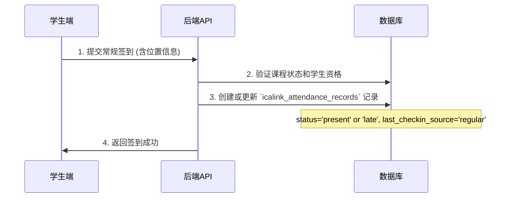
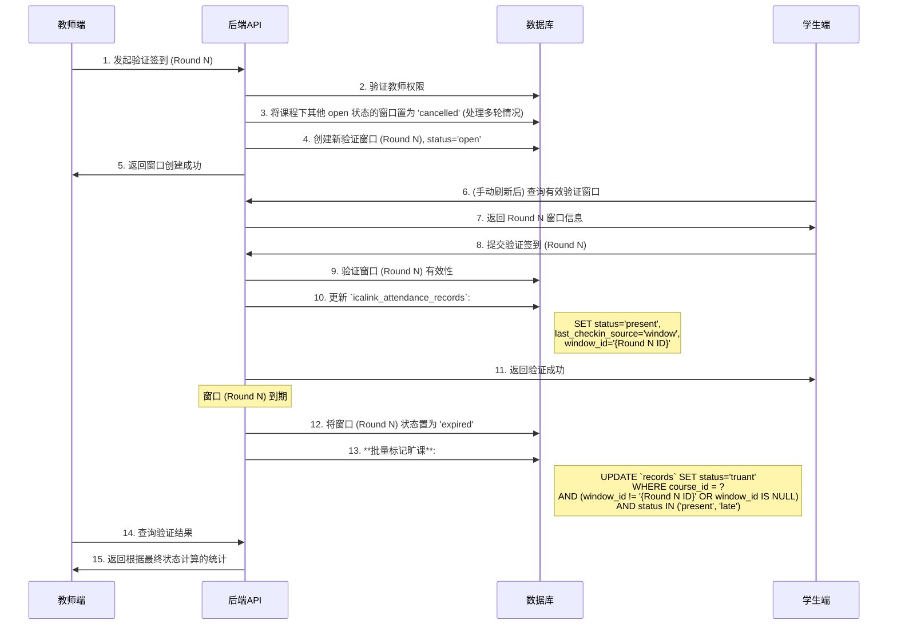

# @wps/app-icalink 签到系统防作弊与统计功能 - 完整技术方案

1. 现有项目分析
   1.1 前端项目 (agendaedu-app)
   技术栈:
   • React 18 + Vite + TypeScript
   • Tailwind CSS (样式框架)
   • React Router (路由管理)
   • Lucide React (图标库)
   核心页面:
   • StudentDashboard.tsx - 学生签到页面
   ◦ 支持地理位置验证 (WPS JSAPI)
   ◦ 乐观更新策略
   ◦ 实时状态管理 (每1秒刷新本地状态)
   • AttendanceSheet.tsx - 教师考勤查看页面
   ◦ 学生签到列表
   ◦ 统计数据展示
   ◦ 请假审批入口
   • AttendanceView.tsx - 统一入口页面
   ◦ 根据用户类型路由到对应页面
   API客户端:
   • IcaLinkApiClient - 统一API调用封装
   ◦ 自动token刷新
   ◦ 错误处理
   ◦ Cookie管理
   集成功能:
   • WPS JSAPI集成 (地理位置)
   • 乐观更新 (签到操作即时反馈)
   • 位置验证 (500米范围内打卡)
   1.2 后端项目 (app-icalink)
   技术栈:
   • Stratix 框架 (基于 Fastify 5 + Awilix 12)
   • MySQL 5 数据库
   • TypeScript
   • Kysely (类型安全的SQL查询构建器)
   架构模式:
   Controller (HTTP接口层)
   ↓
   Service (业务逻辑层)
   ↓
   Repository (数据访问层)
   ↓
   Database (MySQL)核心模块:
   • AttendanceController - 考勤接口控制器
   ◦ 学生签到 API
   ◦ 教师查看 API
   ◦ 请假申请 API
   • AttendanceService - 考勤业务服务
   ◦ 签到逻辑
   ◦ 时间窗口计算
   ◦ 自动标记缺勤
   • AttendanceRecordRepository - 签到记录仓储
   ◦ CRUD操作
   ◦ 复杂查询
   ◦ 统计聚合
   已有功能:
   • ✅ 学生签到 (支持位置验证)
   • ✅ 请假申请与审批
   • ✅ 课程统计 (基础版)
   • ✅ RBAC权限管理
   • ✅ 自动标记缺勤
   1.3 现有数据模型
   核心数据表:
1. icasync_attendance_courses - 签到课程表
   ◦ 课程基本信息
   ◦ 签到时间窗口配置
   ◦ 教师信息
1. icalink_attendance_records - 签到记录表
   ◦ 学生签到状态
   ◦ 签到时间、位置
   ◦ 迟到标记
   ◦ 唯一约束: (attendance_course_id, student_id)
1. icalink_leave_applications - 请假申请表
   ◦ 请假类型、原因
   ◦ 审批状态
   ◦ 附件信息
1. icalink_system_configs - 系统配置表
   ◦ 签到时间窗口配置
   ◦ 迟到阈值
   ◦ 自动缺勤时间
1. out_xsxx / out_jsxx - 外部学生/教师表
   ◦ 学生基本信息
   ◦ 教师基本信息
   数据关系:
   icasync_attendance_courses (课程)
   ↓ 1:N
   icalink_attendance_records (签到记录)
   ↓ 1:N
   icalink_leave_applications (请假申请)1.4 可复用模块识别
   后端可复用:
   • ✅ BaseRepository - 通用仓储基类
   • ✅ ServiceResult - 统一结果封装
   • ✅ 权限验证中间件
   • ✅ 日期时间工具函数
   • ✅ 分页查询封装
   前端可复用:
   • ✅ IcaLinkApiClient - API客户端
   • ✅ Toast组件 - 消息提示
   • ✅ 位置服务 - LocationHelper
   • ✅ 日期格式化工具
   需要扩展的部分:
   • ⚠️ AttendanceService - 需要新增补签、补卡逻辑
   • ⚠️ AttendanceRecordRepository - 需要新增窗口、缺勤查询
   • ⚠️ AttendanceController - 需要新增窗口、统计接口
   • ⚠️ StudentDashboard - 需要新增窗口监听
   • ⚠️ AttendanceSheet - 需要新增补卡、统计功能

---

# 需求1: 签到系统防作弊与统计功能（优先级高）

## 核心功能模块

1.  **验证签到功能（防作弊机制）** - 教师在课程进行中发起验证窗口，学生需在限定时间内完成二次签到。
2.  **教师补卡功能** - 教师可为指定学生进行当天课程的状态补录（如补卡、记为请假）。
3.  **历史数据统计与归档** - 每日定时任务对当天签到数据进行统计、归档，并清空当日表。
4.  **系统管理与监控** - 完善的监控告警和系统管理功能。

## 签到流程与状态优先级

最终出勤状态判定遵循最高优先级覆盖原则：

**教师补卡 > 验证窗口签到 > 常规签到**

## 缺勤状态定义

| 状态           | 英文标识                             | 判定条件                                             | v7 版本说明                                                                   |
| :------------- | :----------------------------------- | :--------------------------------------------------- | :---------------------------------------------------------------------------- |
| **正常出勤**   | `present`                            | 完成任一签到或教师补卡为出勤。                       | 无变更。                                                                      |
| **缺勤**       | `absent`                             | 无任何签到记录。                                     | 无变更。                                                                      |
| **旷课**       | `truant`                             | 有常规签到（`present`或`late`）但验证窗口签到失败。  | **高优先级状态**。此状态会覆盖 `late` 等其他状态，但可被教师手动修正。        |
| **请假**       | `leave`                              | 教师手动标记为请假状态，或通过旧有请假流程审批通过。 | 无变更。                                                                      |
| **迟到**       | `late`                               | 在规定时间后签到。                                   | 这是一个独立的旧有状态。如果迟到的学生未通过验证，其状态将**变为 `truant`**。 |
| **其他旧状态** | `not_started`, `pending_approval` 等 | (保持原始逻辑)                                       | 新的防作弊和补卡流程不直接产生这些状态，但会作为状态覆盖的输入。              |

---

## 第一部分：数据库设计

### 1.1 架构核心思想：混合数据源模式

为在数据实时性与系统独立性之间取得平衡，本次设计采用混合数据源模式：

- **内部基础数据**：对于核心实体 **用户(User)** 和 **选课关系(Enrollment)**，我们从外部系统同步数据到内部表，以保证业务逻辑的稳定和高性能。
- **外部实时数据**：对于 **课程(Course)** 信息，我们将**直接查询外部的 `icasync_calendar_mapping` 表**。这确保了课程信息的绝对实时性，但同时也引入了强耦合风险。
- **内部业务数据**：应用产生的签到记录、验证窗口等数据，存储在内部业务表中。

### 1.2 内部基础数据表 (外部同步)

#### 1.2.1 用户表 (icalink_users)

```sql
CREATE TABLE `icalink_users` (
  `user_id` varchar(100) NOT NULL COMMENT '用户唯一标识 (学号/工号)',
  `user_name` varchar(200) NOT NULL COMMENT '用户姓名',
  `user_type` enum('student', 'teacher') NOT NULL COMMENT '用户类型',
  `class_name` varchar(200) DEFAULT NULL COMMENT '班级名称 (学生专属)',
  `is_active` tinyint(1) NOT NULL DEFAULT 1 COMMENT '是否活跃 (用于软删除)',
  `sync_at` timestamp NOT NULL DEFAULT CURRENT_TIMESTAMP ON UPDATE CURRENT_TIMESTAMP COMMENT '最后同步时间',
  PRIMARY KEY (`user_id`),
  KEY `idx_user_type` (`user_type`)
) ENGINE=InnoDB COMMENT='统一用户表 (基础数据)';
```

#### 1.2.2 教学班 (选课关系) 表 (icalink_enrollments)

**核心定位**：此表是定义“教学班”的核心。一个教学班由所有选修了同一个 `course_code` 的学生和教师组成。

```sql
CREATE TABLE `icalink_enrollments` (
  `id` bigint(20) NOT NULL AUTO_INCREMENT,
  `course_code` varchar(100) NOT NULL COMMENT '课程代码, 教学班的唯一标识',
  `user_id` varchar(100) NOT NULL COMMENT '用户ID (学号/工号)',
  `user_type` enum('student', 'teacher') NOT NULL COMMENT '用户在教学班中的角色',
  `is_active` tinyint(1) NOT NULL DEFAULT 1 COMMENT '是否活跃 (用于软删除)',
  `sync_at` timestamp NOT NULL DEFAULT CURRENT_TIMESTAMP ON UPDATE CURRENT_TIMESTAMP COMMENT '最后同步时间',
  `created_at` timestamp NOT NULL DEFAULT CURRENT_TIMESTAMP COMMENT '创建时间',
  `updated_at` timestamp NOT NULL DEFAULT CURRENT_TIMESTAMP ON UPDATE CURRENT_TIMESTAMP COMMENT '更新时间',
  PRIMARY KEY (`id`),
  UNIQUE KEY `uk_course_code_user` (`course_code`, `user_id`),
  KEY `idx_user_id` (`user_id`),
  CONSTRAINT `fk_enrollment_user` FOREIGN KEY (`user_id`) REFERENCES `icalink_users` (`user_id`) ON DELETE CASCADE
) ENGINE=InnoDB COMMENT='教学班 (选课关系) 表 (基础数据)';
```

### 1.3 业务数据表

#### 1.3.1 当日签到记录表 (icalink_attendance_records)

```sql
CREATE TABLE `icalink_attendance_records` (
  -- == 原始字段 (v1.0.0) ==
  `id` bigint(20) NOT NULL AUTO_INCREMENT COMMENT '主键ID',
  `attendance_course_id` bigint(20) NOT NULL COMMENT '关联课程ID',
  `student_id` varchar(100) NOT NULL COMMENT '学生ID',
  `student_name` varchar(200) NOT NULL COMMENT '学生姓名',
  `class_name` varchar(200) COMMENT '班级名称',
  `major_name` varchar(200) COMMENT '专业名称',
  `status` enum('not_started','present','absent','leave','pending_approval','leave_pending','late', 'truant') NOT NULL DEFAULT 'not_started' COMMENT '签到状态 (v7 新增 truant)',
  `checkin_time` datetime NULL COMMENT '签到时间',
  `checkin_location` varchar(500) COMMENT '签到位置描述',
  `checkin_latitude` decimal(10,7) NULL COMMENT '签到纬度',
  `checkin_longitude` decimal(10,7) NULL COMMENT '签到经度',
  `checkin_accuracy` int(11) NULL COMMENT '位置精度(米)',
  `ip_address` varchar(45) COMMENT '签到IP地址',
  `user_agent` varchar(1000) COMMENT '用户代理信息',
  `is_late` tinyint(1) NOT NULL DEFAULT 0 COMMENT '是否迟到',
  `late_minutes` int(11) NULL COMMENT '迟到分钟数',
  `remark` text COMMENT '备注信息',
  `created_at` timestamp NOT NULL DEFAULT CURRENT_TIMESTAMP COMMENT '创建时间',
  `updated_at` timestamp NOT NULL DEFAULT CURRENT_TIMESTAMP ON UPDATE CURRENT_TIMESTAMP COMMENT '更新时间',
  `created_by` varchar(100) COMMENT '创建人',
  `updated_by` varchar(100) COMMENT '更新人',
  `metadata` json DEFAULT NULL COMMENT '扩展元数据',

  -- == 新增字段 (防作弊与补卡功能) ==
  `last_checkin_source` enum('regular', 'window', 'manual') DEFAULT NULL COMMENT '最后签到来源',
  `last_checkin_reason` VARCHAR(255) DEFAULT NULL COMMENT '最后签到原因说明',
  `manual_override_by` varchar(100) COMMENT '手动补卡人（教师ID）',
  `manual_override_time` datetime COMMENT '手动补卡时间',
  `manual_override_reason` varchar(500) COMMENT '手动补卡原因说明',
  `auto_marked_at` DATETIME DEFAULT NULL COMMENT '系统自动标记时间',
  `window_id` CHAR(36) DEFAULT NULL COMMENT '关联的验证签到窗口ID',

  -- == 原始主键与索引 ==
  PRIMARY KEY (`id`),
  UNIQUE KEY `uk_course_student` (`attendance_course_id`, `student_id`),
  KEY `idx_student_id` (`student_id`),
  KEY `idx_status` (`status`),
  KEY `idx_checkin_time` (`checkin_time`),
  KEY `idx_created_at` (`created_at`),
  KEY `idx_student_status` (`student_id`, `status`),
  KEY `idx_course_status` (`attendance_course_id`, `status`),

  -- == v7 新增索引与外键 ==
  KEY `idx_window_id` (`window_id`),
  CONSTRAINT `fk_record_student_v7` FOREIGN KEY (`student_id`) REFERENCES `icalink_users` (`user_id`) ON DELETE CASCADE,
  CONSTRAINT `fk_record_window_v7` FOREIGN KEY (`window_id`) REFERENCES `icalink_verification_windows` (`window_id`) ON DELETE SET NULL
) ENGINE=InnoDB COMMENT='学生签到记录表 (v7兼容模式)';
```

#### **状态管理与优先级**

由于保留了所有旧状态并引入新状态，`status` 字段的管理变得复杂。为确保业务逻辑的确定性，必须定义清晰的状态覆盖规则。

**核心原则：新功能引入的状态变更具有更高优先级。**

1.  **教师手动操作 (`manual`) 拥有最高绝对优先权**。
2.  **验证签到结果 (`truant`) 拥有次高优先权**。
3.  **旧有状态逻辑保持不变**。

#### 1.3.2 签到历史表 (icalink_attendance_records_history)

结构与 `icalink_attendance_records` 完全一致，用于数据归档。

#### 1.3.3 验证签到窗口表 (icalink_verification_windows)

```sql
CREATE TABLE `icalink_verification_windows` (
  `id` bigint(20) NOT NULL AUTO_INCREMENT COMMENT '主键ID',
  `window_id` char(36) NOT NULL COMMENT 'UUID，用于API调用和关联',
  `course_id` bigint(20) NOT NULL COMMENT '关联课程ID',
  `verification_round` int(11) NOT NULL DEFAULT 1 COMMENT '验证轮次',
  `open_time` datetime NOT NULL COMMENT '窗口开启时间',
  `close_time` datetime NOT NULL COMMENT '窗口关闭时间',
  `opened_by` varchar(100) NOT NULL COMMENT '开启人ID（教师工号）',
  `status` enum('open','closed','cancelled','expired') NOT NULL DEFAULT 'open' COMMENT '窗口状态(closed:教师手动关闭, cancelled:被新验证覆盖, expired:超时自动关闭)',
  `duration_minutes` int(11) NOT NULL DEFAULT 3 COMMENT '持续时长（分钟）',
  `expected_checkin_count` int(11) NOT NULL DEFAULT 0 COMMENT '预期签到人数',
  `actual_checkin_count` int(11) NOT NULL DEFAULT 0 COMMENT '实际签到人数',
  `created_at` timestamp NOT NULL DEFAULT CURRENT_TIMESTAMP,
  `updated_at` timestamp NOT NULL DEFAULT CURRENT_TIMESTAMP ON UPDATE CURRENT_TIMESTAMP,
  PRIMARY KEY (`id`),
  UNIQUE KEY `uk_window_id` (`window_id`),
  KEY `idx_course_status` (`course_id`, `status`)
) ENGINE=InnoDB DEFAULT CHARSET=utf8mb4 COLLATE=utf8mb4_unicode_ci;
```

#### 1.3.4 课程签到统计历史表 (icalink_course_checkin_stats)

```sql
CREATE TABLE `icalink_course_checkin_stats` (
  `id` bigint(20) NOT NULL AUTO_INCREMENT,
  `stat_date` date NOT NULL COMMENT '统计日期',
  `course_id` bigint(20) NOT NULL COMMENT '课程ID (课节ID)',
  `course_code` varchar(100) NOT NULL COMMENT '课程代码 (关联教学班)',
  `course_name` varchar(200) NOT NULL COMMENT '课程名称',
  `class_location` varchar(1000) COMMENT '上课地址(教学楼+教室)',
  `teacher_name` varchar(500) COMMENT '教师姓名',
  `teacher_codes` varchar(500) COMMENT '教师工号列表(逗号分隔)',
  `semester` varchar(20) NOT NULL COMMENT '学年学期',
  `teaching_week` int(11) NOT NULL COMMENT '教学周(来自juhe_renwu.jxz)',
  `week_day` int(11) NOT NULL COMMENT '周次-星期几(来自juhe_renwu.zc)',
  `time_period` varchar(2) NOT NULL COMMENT '时间段(am/pm)',
  `periods` varchar(256) COMMENT '节次',
  `start_time` datetime NOT NULL COMMENT '开始时间(RFC3339格式)',
  `end_time` datetime NOT NULL COMMENT '结束时间(RFC3339格式)',
  `total_should_attend` int(11) NOT NULL DEFAULT 0 COMMENT '应到人数',
  `present_count` int(11) NOT NULL DEFAULT 0 COMMENT '实到人数',
  `absent_count` int(11) NOT NULL DEFAULT 0 COMMENT '缺勤人数',
  `truant_count` int(11) NOT NULL DEFAULT 0 COMMENT '旷课人数',
  `leave_count` int(11) NOT NULL DEFAULT 0 COMMENT '请假人数',
  `created_at` timestamp NOT NULL DEFAULT CURRENT_TIMESTAMP,
  `updated_at` timestamp NOT NULL DEFAULT CURRENT_TIMESTAMP ON UPDATE CURRENT_TIMESTAMP,
  PRIMARY KEY (`id`),
  UNIQUE KEY `uk_date_course` (`stat_date`, `course_id`),
  KEY `idx_course_code` (`course_code`)
) ENGINE=InnoDB COMMENT='课程签到统计历史表';
```

#### 1.3.5 未签课程人员关联表 (icalink_absent_student_relations)

```sql
CREATE TABLE `icalink_absent_student_relations` (
  `id` bigint(20) NOT NULL AUTO_INCREMENT,
  `course_stats_id` bigint(20) NOT NULL COMMENT '关联课程统计ID',
  `course_id` bigint(20) NOT NULL COMMENT '课程ID (课节ID)',
  `course_code` varchar(100) NOT NULL COMMENT '课程代码 (关联教学班)',
  `course_name` varchar(200) NOT NULL COMMENT '课程名称',
  `student_id` varchar(100) NOT NULL,
  `student_name` varchar(200) NOT NULL,
  `school_name` varchar(200) COMMENT '学院名称',
  `class_name` varchar(200) COMMENT '班级名称',
  `major_name` varchar(200) COMMENT '专业名称',
  `absence_type` enum('absent','truant','leave','leave_pending') NOT NULL COMMENT '缺勤类型',
  `stat_date` date NOT NULL,
  `semester` varchar(20) NOT NULL COMMENT '学年学期',
  `teaching_week` int(11) NOT NULL COMMENT '教学周(来自juhe_renwu.jxz)',
  `week_day` int(11) NOT NULL COMMENT '周次-星期几(来自juhe_renwu.zc)',
  `periods` varchar(256) COMMENT '节次',
 `time_period` varchar(2) NOT NULL COMMENT '时间段(am/pm)',
  `created_at` timestamp NOT NULL DEFAULT CURRENT_TIMESTAMP,
  `updated_at` timestamp NOT NULL DEFAULT CURRENT_TIMESTAMP ON UPDATE CURRENT_TIMESTAMP,
  PRIMARY KEY (`id`),
  KEY `idx_course_stats` (`course_stats_id`),
  KEY `idx_student_queries` (`student_id`, `course_code`, `absence_type`),
  KEY `idx_teacher_queries` (`course_code`, `stat_date`),
  CONSTRAINT `fk_relations_stats` FOREIGN KEY (`course_stats_id`) REFERENCES `icalink_course_checkin_stats` (`id`) ON DELETE CASCADE
) ENGINE=InnoDB COMMENT='历史缺勤人员关联表';
```

#### 1.3.6 每日课程宏观统计历史表 (icalink_daily_course_summary)

```sql
CREATE TABLE `icalink_daily_course_summary` (
  `id` BIGINT(20) NOT NULL AUTO_INCREMENT COMMENT '主键ID',
  `summary_date` DATE NOT NULL COMMENT '统计日期',
  `total_courses_scheduled` INT(11) NOT NULL COMMENT '当日应上课程总数',
  `total_students_expected` INT(11) NOT NULL COMMENT '当日应到总人次',
  `processed_at` TIMESTAMP NOT NULL DEFAULT CURRENT_TIMESTAMP COMMENT '处理时间',
  PRIMARY KEY (`id`),
  UNIQUE KEY `uk_summary_date` (`summary_date`)
) ENGINE=InnoDB COMMENT='每日课程宏观统计历史表';
```

### 1.4 ER 关系图

```mermaid
erDiagram
    subgraph 外部数据源 {
        icasync_calendar_mapping {
            bigint course_id PK
            varchar course_name
            varchar course_code
        }
    }

    subgraph 内部基础数据 {
        icalink_users {
            varchar(100) user_id PK
            varchar(200) user_name
        }
        icalink_enrollments {
            bigint id PK
            varchar(100) course_code
            varchar(100) user_id FK
        }
    }

    subgraph 内部业务数据 {
        icalink_attendance_records {
            bigint id PK
            bigint attendance_course_id
            varchar(100) student_id FK
            char(36) window_id FK
        }
        icalink_verification_windows {
            char(36) window_id PK
            bigint course_id
        }
    }

    icalink_users ||--|{ icalink_enrollments : "has"
    icalink_users ||--|{ icalink_attendance_records : "generates"

    note for icasync_calendar_mapping "逻辑关联, 无物理外键"
    icasync_calendar_mapping }o..o{ icalink_enrollments : "defines"
    icasync_calendar_mapping }o..o{ icalink_attendance_records : "has"
    icasync_calendar_mapping }o..o{ icalink_verification_windows : "references"

    icalink_verification_windows }o..o| icalink_attendance_records : "verifies"
```

### 1.5 课程明细获取逻辑 (智能视图方案)

为了将复杂的业务逻辑封装在数据库层，简化应用层调用，我们设计了多个独立的智能视图，分别用于直接查询实时和历史课程的最终考勤结果。

#### 1.5.1 **历史**课程明细视图 (v_attendance_history_details)

- **用途**: 高效查询已归档课程（T-1及更早）的最终学生考勤状态。
- **逻辑**: 以“课程-学生”名册为主，左连接已归档的异常记录表。若无法关联到异常记录，则该生为“出勤”。
- **视图创建 SQL**:

```sql
CREATE OR REPLACE VIEW v_attendance_history_details AS
SELECT
    cal.id AS course_id,              -- 具体课程的ID
    cal.course_code,                 -- 课程代码
    u.user_id AS student_id,         -- 学生ID
    u.user_name AS student_name,     -- 学生姓名
    u.class_name AS student_class_name, -- 学生所在的行政班级
    -- 如果在缺勤关系表中找不到记录，则默认为 'present' (已签到)
    COALESCE(asr.absence_type, 'present') AS final_status,
    -- 从异常关联表冗余的维度字段
    asr.semester,
    asr.teaching_week,
    asr.week_day,
    asr.periods
FROM
    icasync_calendar_mapping cal
JOIN
    icalink_enrollments e ON cal.course_code = e.course_code
JOIN
    icalink_users u ON e.user_id = u.user_id
LEFT JOIN
    icalink_absent_student_relations asr ON cal.id = asr.course_id AND u.user_id = asr.student_id
WHERE
    e.user_type = 'student' AND e.is_active = 1 AND u.is_active = 1;
```

- **使用方法**: `SELECT * FROM v_attendance_history_details WHERE course_id = ?;`

#### 1.5.2 **实时**课程明细视图 (v_attendance_realtime_details)

- **用途**: 查询当天课程的实时最终考勤状态，视图内部封装了补卡、多轮验证等复杂优先级逻辑。
- **逻辑**: 通过子查询和大量的 `CASE` 语句，模拟实现了服务层的优先级判断逻辑。
- **视图创建 SQL**:

```sql
CREATE OR REPLACE VIEW v_attendance_realtime_details AS
SELECT-- 关键信息
sessions.id AS attendance_course_id,-- 每一“节”课的唯一ID
sessions.external_id,
sessions.course_code,-- 所属“门”课的代码
sessions.course_name,-- 所属“门”课的代码
sessions.created_at,
roster_u.student_id,-- 学生ID
roster_u.student_name,-- 学生姓名
-- 从 Roster 中获取的更多人员字段
roster_u.class_name,
roster_u.major_name,
roster_u.school_name,-- 签到信息和最终状态计算
-- ==================================
-- 新增：课程/课节元数据 (来自 sessions 表)
-- ==================================
sessions.teaching_week,-- 新增: 教学周
sessions.week_day,-- 新增: 周几
sessions.periods,-- 新增: 节次
sessions.time_period,-- 新增: 节次
sessions.start_time,-- 新增: 开始时间
sessions.end_time,-- 新增: 结束时间
-- ==================================
-- 新增：教师信息 (来自 sessions 表)
-- ==================================
sessions.teacher_names,-- 新增: 授课教师姓名
sessions.teacher_codes,-- 新增: 授课教师code
CASE
		WHEN ar.manual_override_by IS NOT NULL THEN
		ar.STATUS 
		WHEN ar.STATUS IN ('leave', 'leave_pending') THEN
		ar.STATUS 
		WHEN lw.window_id IS NOT NULL THEN
		CASE
				WHEN ar.window_id = lw.window_id THEN
				'present' 
				WHEN ar.STATUS IN ('present', 'late') 
				AND (
					ar.window_id != lw.window_id 
					OR ar.window_id IS NULL) THEN
					'truant' ELSE 'absent' 
					END 
						WHEN ar.id IS NOT NULL THEN
						ar.STATUS ELSE 'absent' 
				END AS final_status 
				FROM-- 1. 从“每节课”信息表开始
				icasync.icasync_attendance_courses AS sessions
				JOIN
       -- 2. 直接 JOIN 选课表，而不是通过子查询
        syncdb.out_jw_kcb_xs AS roster_oxs ON sessions.course_code = roster_oxs.kkh AND roster_oxs.zt IN ('add', 'update')
				JOIN
        -- 3. 直接 JOIN 学生信息表
        (
          SELECT xh as student_id, xm as student_name, bjmc as class_name, zymc as major_name, xymc as 
      school_name, zt
          FROM syncdb.out_xsxx
					WHERE zt IN ('add', 'update')
        ) AS roster_u ON roster_oxs.xh = roster_u.student_id
				LEFT JOIN -- 3. 关联“这节课”的“这个学生”的实时签到记录
				icalink_attendance_records ar ON sessions.id = ar.attendance_course_id 
				AND roster_u.student_id = ar.student_id
				LEFT JOIN -- 4. 关联“这节课”的最新验证窗口
				(
					SELECT
						v.course_id,
						v.window_id 
					FROM
						icalink_verification_windows v
						INNER JOIN (
							SELECT
								course_id,
								MAX(verification_round) AS max_round 
							FROM
								icalink_verification_windows 
							WHERE
								STATUS IN ('open', 'expired') 
							GROUP BY
						course_id) AS max_rounds ON v.course_id = max_rounds.course_id 
						AND v.verification_round = max_rounds.max_round 
				WHERE
						v.STATUS IN ('open', 'expired')) AS lw ON sessions.id = lw.course_id;
```

- **设计考量**:
  - **性能**: 此视图包含窗口函数和复杂`CASE`，性能开销较大。**必须**始终使用 `WHERE course_id = ?` 条件进行查询，以利用索引，避免全表扫描。
  - **维护性**: 业务逻辑封装在数据库中，应用层代码简洁，但后续逻辑变更需要修改复杂的SQL，对数据库维护有一定要求。

#### 1.5.3 **实时**课程统计视图 (v_course_attendance_stats_realtime)

- **用途**: 基于实时明细视图进行聚合，提供与 `icalink_course_checkin_stats` 结构一致的**当天实时统计数据**。
- **逻辑**: 对 `v_attendance_realtime_details` 的结果按课程进行分组，并使用条件聚合计算各类状态的人数。
- **视图创建 SQL**:

```sql
CREATE OR REPLACE VIEW v_course_attendance_stats_realtime AS
SELECT
    vd.course_id,
    vd.course_code,
    -- 假设课程名称等信息可以通过关联获取，或在应用层补齐
    vd.semester,
    vd.teaching_week,
    vd.week_day,
    vd.periods,
    COUNT(vd.student_id) AS total_should_attend,
    SUM(CASE WHEN vd.final_status IN ('present', 'late') THEN 1 ELSE 0 END) AS present_count,
    SUM(CASE WHEN vd.final_status = 'absent' THEN 1 ELSE 0 END) AS absent_count,
    SUM(CASE WHEN vd.final_status = 'truant' THEN 1 ELSE 0 END) AS truant_count,
    SUM(CASE WHEN vd.final_status IN ('leave', 'leave_pending') THEN 1 ELSE 0 END) AS leave_count,
    -- 计算实时出勤率
    (SUM(CASE WHEN vd.final_status IN ('present', 'late') THEN 1 ELSE 0 END) / COUNT(vd.student_id)) * 100 AS attendance_rate
FROM
    v_attendance_realtime_details vd
GROUP BY
    vd.course_id, vd.course_code, vd.semester, vd.teaching_week, vd.week_day, vd.periods;
```

- **使用方法**: `SELECT * FROM v_course_attendance_stats_realtime WHERE course_id = ?;`

#### 1.5.4 **历史缺勤人员明细视图 (v_absent_student_details)**

- **用途**: 专门用于快速查询已归档课程的**所有缺勤类型（含缺勤、旷课、请假）**的学生明细列表。相比 `v_attendance_history_details`，此视图不包含正常出勤的学生，查询目标更明确，性能更高。
- **逻辑**: 直接以 `icalink_absent_student_relations` 表为主体，关联用户表获取额外信息。
- **视图创建 SQL**:

```sql
CREATE OR REPLACE VIEW v_absent_student_details AS
SELECT
    asr.course_stats_id,             -- 关联的统计ID
    asr.course_id,                   -- 具体课程的ID
    asr.course_code,                 -- 课程代码
    asr.student_id,                  -- 学生ID
    asr.student_name,                -- 学生姓名
    u.class_name AS student_class_name, -- 学生所在的行政班级
    asr.absence_type AS final_status,-- 缺勤类型 (与另外两个视图的 `final_status` 字段保持一致)
    asr.stat_date,                   -- 统计日期
    -- 从缺勤关联表冗余的维度字段
    asr.semester,
    asr.teaching_week,
    asr.week_day,
    asr.periods
FROM
    icalink_absent_student_relations asr
LEFT JOIN
    icalink_users u ON asr.student_id = u.user_id AND u.is_active = 1;
```

- **使用方法**: `SELECT * FROM v_absent_student_details WHERE course_id = ?;`
- **设计考量**:
  - **聚焦性**: 此视图只返回缺勤相关的学生，避免了在全量学生名单中进行过滤的开销。
  - **一致性**: 视图的字段名（如 `final_status`）与其他视图保持一致，便于应用层统一处理。

---

## 第二部分：数据同步方案

### 2.1 同步目标

- 将外部数据源的数据，定期、可靠地同步到内部的 `icalink_users` 和 `icalink_enrollments` 表中。
- **课程信息 (`icasync_calendar_mapping`) 不再同步**，改为业务层直接查询。

### 2.2 同步流程

- 同步任务将只包含 **用户同步** 和 **教学班关系同步** 两步。

```mermaid
flowchart TD
    A[启动同步任务] --> B(开始事务);
    B --> C[1. 同步用户 (icalink_users)];
    C --> E[2. 同步教学班关系 (icalink_enrollments)];
    E --> F(提交事务);
    F --> G[任务成功];
    B -- 发生错误 --> H(回滚事务);
    H --> I[记录错误日志];
    I --> J[发送告警];
    J --> K[任务失败];
```

---

## 第三部分：业务流程设计

### 3.1 常规签到流程



### 3.2 验证签到完整流程 (含多轮验证)



### 3.3 教师补卡流程

```mermaid
flowchart TD
    A[教师选择学生] --> B[选择补签状态]
    B --> C[填写补签原因]
    C --> D[提交补签申请]

    D --> E{权限与时间验证}
    E -->|失败| F[返回错误]
    E -->|成功| G[查询或创建签到记录]
    G --> H[更新记录]
    Note over H: status = new_status<br>last_checkin_source = 'manual'<br>manual_override_by = teacher_id<br>...
    H --> I[记录审计日志]
    I --> J[返回补卡成功]
```

### 3.4 每日数据统计归档流程 (含事务)

```mermaid
flowchart TD
    subgraph 每日归档定时任务 (Executor)
        A[每日凌晨2点启动] --> B(开始数据库事务);
        B --> C[获取昨日日期 T-1];
        C --> D[查询 T-1 的所有课程 `course_id`];
        D --> E{遍历每个课程};
        E --> F[执行“课程最终状态统计”子流程];
        F --> G[执行“缺勤人员关联记录生成”子流程];
        E --> H{所有课程处理完毕?};
        H -->|是| I[执行“每日宏观统计生成”子流程];
        I --> J[数据归档：将 T-1 的数据从 `records` 移至 `records_history`];
        J --> K[清空 T-1 在 `records` 表中的数据];
        K --> L(提交事务);
        L --> M[任务完成];
        H -->|否| E;
        B -- 发生任何错误 --> N(回滚事务);
        N --> O[记录错误日志并发送告警];
        O --> P[任务失败];
    end
```

---

## 第四部分：接口设计 (规范与建议)

**核心建议**：所有接口都必须提供完整的 **Fastify JSON Schema** 定义，包括 `params`, `body`, `querystring` 和 `response`。这不仅是文档，更是保证接口健壮性的代码实现。

### 4.1 教师端接口

#### 4.1.1 发起验证签到

- **路径**: `POST /api/teacher/verification-windows`
- **权限**: 教师
- **Body Schema**: `{ course_id: string, duration_minutes: number, reason?: string }`
- **Response Schema (200)**: `ServiceResult<{ window_id: string, ... }>`

#### 4.1.2 教师补卡

- **路径**: `POST /api/teacher/attendance/manual-override`
- **权限**: 教师
- **Body Schema**: `{ student_id: string, course_id: string, new_status: 'present' | 'absent' | 'leave', reason: string }`
- **Response Schema (200)**: `ServiceResult<{ success: boolean }>`

#### 4.1.3 获取课程学生签到列表

- **路径**: `GET /api/teacher/courses/:course_id/attendance-details`
- **权限**: 教师
- **Response Schema (200)**: `ServiceResult<Array<{ student_id: string, student_name: string, final_status: string, ... }>>`
- **后端实现**:
  - Service层判断课程日期。
  - 如果是当天，则查询 `v_attendance_realtime_details` 视图。
  - 如果是历史，则查询 `v_attendance_history_details` 视图。

### 4.2 学生端接口

#### 4.2.1 学生验证签到

- **路径**: `POST /api/student/attendance/verify-checkin`
- **权限**: 学生
- **Body Schema**: `{ window_id: string, course_id: string, location?: object }`
- **Response Schema (200)**: `ServiceResult<{ success: boolean, status: string }>`

---

## 第五部分：核心业务实现详解

### 5.1 课程签到统计记录生成详解 (最终状态判定)

此流程是每日归档任务的核心，用于计算每个学生在一节课的最终出勤状态，并写入 `icalink_course_checkin_stats`。

**输入**: `course_id`, `stat_date`

**执行步骤**:

1.  **查询最终状态**: 直接查询 `v_attendance_realtime_details` 视图获取该课程所有学生的 `final_status`。

    ```sql
    SELECT final_status, COUNT(*) as count
    FROM v_attendance_realtime_details
    WHERE course_id = ?
    GROUP BY final_status;
    ```

2.  **聚合统计**:
    - 根据上一步的聚合结果，填充 `present_count`, `absent_count`, `truant_count`, `leave_count`。

3.  **写入统计表**:
    - 将聚合后的统计数据 `INSERT` 或 `UPDATE` 到 `icalink_course_checkin_stats` 表。
    - 对于 `final_status` 为 `absent`, `truant`, `leave` 的学生，将其记录从视图中筛选出来，插入到 `icalink_absent_student_relations` 表。

---

## 第六部分：业务流程风险分析与规避策略

### 6.1 外部表强耦合风险

- **风险场景**：`icasync_calendar_mapping` 表的 Schema 变更、性能恶化或不可用。
- **风险影响**：直接导致本系统核心功能全面瘫痪。
- **规避策略**：
  1.  **建立沟通契约**：与上游系统维护团队建立变更通知流程。
  2.  **封装隔离层 (Repository)**：所有对 `icasync_calendar_mapping` 的查询严格限制在 `CourseRepository` 内部。
  3.  **增加缓存与超时**：在 `CourseRepository` 中增加 Redis 缓存和合理的查询超时。

### 6.2 数据同步与归档风险

- **风险场景**：用户同步任务失败；或每日归档任务执行一半失败。
- **风险影响**：应用基于过时数据运行；或产生数据不一致（如历史表与统计表不匹配）。
- **规避策略**：
  1.  **事务完整性**：所有同步和归档任务的核心数据操作，必须封装在数据库事务中。
  2.  **关键告警**：任务失败是高优先级事件，必须通过监控系统通知管理员。
  3.  **可监控性**：在管理后台展示“最后成功同步/归档时间”。

### 6.3 并发操作与竞态条件风险

- **风险场景**：教师补卡与系统自动标记旷课冲突；教师同时发起两次验证签到。
- **规避策略**：
  1.  **数据库行锁**: 在处理单个学生记录时，可使用 `SELECT ... FOR UPDATE` 避免并发修改冲突。
  2.  **业务逻辑加锁**: 在发起验证签到时，先检查并更新旧窗口，保证操作的原子性。
  3.  **遵守业务优先级**: 严格遵守“教师手动操作优先级最高”的业务规则。

---

## 第七部分：前端技术方案 (agendaedu-app)

### 7.1 实时通知优化建议

- **当前方案**: 依赖“教师口头通知 + 学生手动刷新”，实现简单但体验一般。
- **优化建议**: 引入轻量级实时通知机制（如 WebSocket 或 SSE）。教师发起验证时，由后端主动推送消息给所有在当前课程页面的学生客户端，实现UI自动刷新，提升用户体验。

### 7.2 教师端改造方案

教师端的核心是**课程签到详情页**。

#### 7.2.1 功能实现细节

**1. 验证签到控制面板 (`VerificationControlPanel`)**

- **UI/UX**: 提供“发起验证签到”按钮。点击后弹窗，让教师选择验证时长。验证进行中，面板显示倒计时和实时进度（如 `15/50`）。
- **API 集成**:
  - 点击确认，调用 `POST /api/teacher/verification-windows`。
  - 为实时展示验证进度，教师端在此面板激活时，轮询 `GET /api/teacher/verification-windows/{window_id}` 接口获取 `actual_checkin_count` 等信息。

**2. 学生签到列表 (`StudentAttendanceList`)**

- **UI/UX**: 列表展示所有学生及其**最终签到状态**。每行提供“操作”按钮，用于教师补卡。
- **API 集成**:
  - 页面加载时，调用 `GET /api/teacher/courses/:course_id/attendance-details` 获取列表。
  - 教师端在验证进行中，列表数据也应随轮询刷新。

### 7.3 学生端改造方案

**1. 页面加载时状态获取**

- **核心逻辑**: 当学生端的课程详情页被加载或刷新时，执行**一次性**的 API 调用，获取当前课程是否有激活的验证窗口。
- **API 集成**: 调用 `GET /api/student/courses/:course_id/active-verification-window` 接口。
- **渲染逻辑**: 根据接口返回结果，渲染为“常规签到”或“验证签到”按钮。

---

## 第八部分：任务分解与分配建议

| 任务模块              | 子任务                | 任务描述                                                   | 产出物               | 依赖关系   | 负责人 | 预计工时 (人/天) |
| :-------------------- | :-------------------- | :--------------------------------------------------------- | :------------------- | :--------- | :----- | :--------------- |
| **1. 基础架构**       | 1.1 DB-基础表         | 创建 `icalink_users`, `icalink_enrollments` 数据库表。     | DB Migration 脚本    | -          |        | 0.5              |
|                       | 1.2 Backend-数据同步  | 开发定时任务，从外部源同步用户和教学班数据。               | Executor, Repository | 1.1        |        | 1.5              |
|                       | 1.3 DB-业务表改造     | 修改 `icalink_attendance_records` 等表，增加新字段和索引。 | DB Migration 脚本    | 1.1        |        | 0.5              |
| **2. 验证签到功能**   | 2.1 DB-验证窗口表     | 创建 `icalink_verification_windows` 表。                   | DB Migration 脚本    | -          |        | 0.5              |
|                       | 2.2 Backend-教师端API | 实现发起、查询验证窗口的API，包含多轮验证逻辑。            | Controller, Service  | 1.3, 2.1   |        | 2                |
|                       | 2.3 Backend-学生端API | 实现学生响应验证签到的API。                                | Controller, Service  | 1.3, 2.1   |        | 1                |
|                       | 2.4 Backend-核心逻辑  | 实现验证窗口超时后，自动标记旷课的核心业务逻辑。           | Service, Executor    | 2.2, 2.3   |        | 1.5              |
|                       | 2.5 Frontend-教师端   | 开发验证签到控制面板（发起按钮、进度条、倒计时）。         | Vue/React 组件       | 2.2        |        | 2                |
|                       | 2.6 Frontend-学生端   | **(无轮询)** 实现页面加载时获取验证状态，并渲染对应按钮。  | Vue/React 组件       | 2.3        |        | **1**            |
| **3. 教师补卡功能**   | 3.1 Backend-补卡API   | 实现教师为指定学生手动修改签到状态的API。                  | Controller, Service  | 1.3        |        | 1                |
|                       | 3.2 Frontend-教师端   | 在学生列表中增加“操作”按钮和补卡弹窗界面。                 | Vue/React 组件       | 3.1        |        | 1                |
| **4. 数据统计与归档** | 4.1 DB-统计相关表     | 创建所有 `_stats`, `_relations`, `_summary` 统计表。       | DB Migration 脚本    | -          |        | 0.5              |
|                       | 4.2 Backend-归档任务  | 开发包含最终状态判定的、事务性的每日数据归档任务。         | Executor, Repository | 1.3, 4.1   |        | 2.5              |
|                       | 4.3 Backend-查询API   | 开发用于前端查询实时/历史明细和统计数据的API。             | Controller, Service  | 4.1        |        | 1.5              |
|                       | 4.4 Frontend-教师端   | 开发历史出勤统计数据的查询和图表化展示页面。               | Vue/React 组件       | 4.3        |        | 1.5              |
| **5. 联调与测试**     | 5.1 全流程测试        | 对签到、验证、补卡、统计等全流程进行集成测试和端到端测试。 | 测试用例报告         | 1, 2, 3, 4 |        | 3                |
