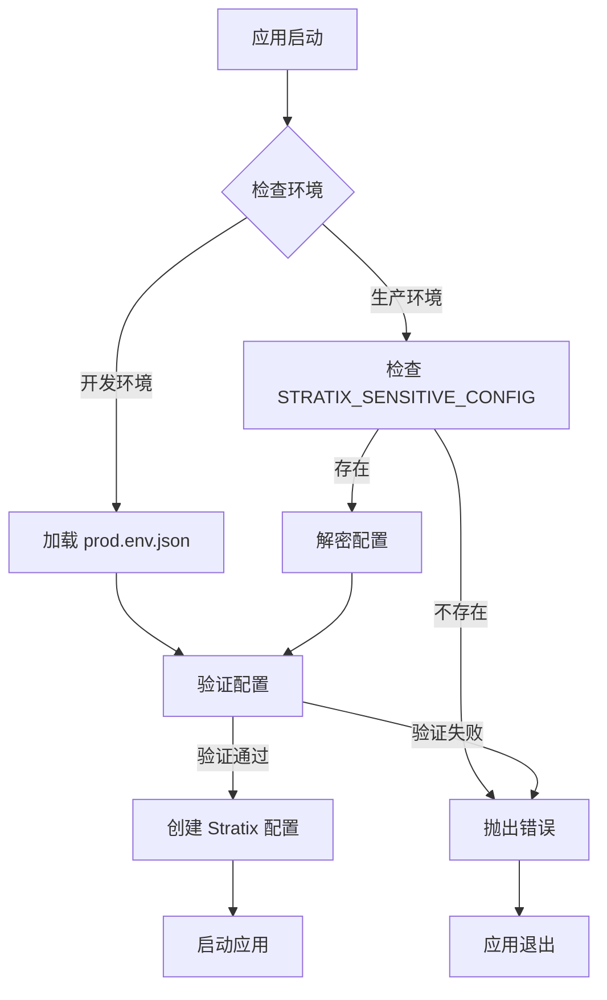

# Stratix 加密配置系统

本文档介绍如何使用 Stratix 框架的加密配置系统，确保敏感信息的安全存储和加载。

## 📋 **概述**

新的配置系统提供以下功能：

- **🔐 配置加密**：敏感配置信息使用 AES-256-GCM 加密
- **🌍 环境分离**：开发环境和生产环境配置分离
- **🔑 密钥管理**：支持自定义加密密钥
- **✅ 配置验证**：自动验证配置结构的完整性
- **🛠️ 工具支持**：提供配置生成和验证工具

## 🏗️ **文件结构**

```
apps/icalink-sync/
├── src/
│   ├── config/
│   │   └── environment.ts          # 环境配置加载器
│   ├── stratix.config.ts           # Stratix 配置文件
│   └── index.ts                    # 应用入口
├── scripts/
│   ├── generate-encrypted-config.ts # 配置加密工具
│   └── verify-config.ts            # 配置验证工具
├── prod.env.json                   # 生产环境配置模板
└── CONFIG.md                       # 本文档
```

## ⚙️ **配置文件格式**

### `prod.env.json` 结构

```json
{
  "web": {
    "port": 3000,
    "host": "0.0.0.0",
    "https": {
      "key": "server.key",
      "cert": "server.crt"
    }
  },
  "logger": {
    "loglevle": "info",
    "disableRequestLogging": false
  },
  "databases": {
    "default": {
      "host": "localhost",
      "port": 3306,
      "user": "root",
      "password": "your_password",
      "database": "your_database"
    },
    "origin": {
      "host": "localhost",
      "port": 3306,
      "user": "root",
      "password": "your_password",
      "database": "your_origin_database"
    }
  },
  "wasV7": {
    "appId": "your_app_id",
    "appSecret": "your_app_secret"
  },
  "icalink_api": {
    "appUrl": "https://your-api-url.com",
    "tokenSecret": "your_token_secret"
  }
}
```

## 🚀 **快速开始**

### 1. 开发环境设置

开发环境直接使用 `prod.env.json` 文件：

```bash
# 1. 复制配置模板
cp prod.env.json.example prod.env.json

# 2. 编辑配置文件
vim prod.env.json

# 3. 验证配置
tsx scripts/verify-config.ts --verbose

# 4. 启动应用
npm start
```

### 2. 生产环境设置

生产环境使用加密配置：

```bash
# 1. 设置加密密钥（推荐）
export STRATIX_ENCRYPTION_KEY="your-super-secret-encryption-key"

# 2. 生成加密配置
tsx scripts/generate-encrypted-config.ts

# 3. 设置环境变量
export STRATIX_SENSITIVE_CONFIG="生成的加密字符串"

# 4. 验证配置
NODE_ENV=production tsx scripts/verify-config.ts

# 5. 启动应用
NODE_ENV=production npm start
```

## 🔧 **工具使用**

### 配置加密工具

```bash
# 基本使用
tsx scripts/generate-encrypted-config.ts

# 指定输入文件
tsx scripts/generate-encrypted-config.ts -i ./config/production.json

# 生成并验证
tsx scripts/generate-encrypted-config.ts --verify

# 保存到文件
tsx scripts/generate-encrypted-config.ts -o .env.encrypted

# 使用自定义密钥
STRATIX_ENCRYPTION_KEY="my-key" tsx scripts/generate-encrypted-config.ts
```

### 配置验证工具

```bash
# 验证当前环境配置
tsx scripts/verify-config.ts

# 验证生产环境配置
tsx scripts/verify-config.ts --env production

# 显示详细信息
tsx scripts/verify-config.ts --verbose

# 检查相关文件
tsx scripts/verify-config.ts --check-files
```

## 🔐 **安全最佳实践**

### 1. 加密密钥管理

```bash
# 生产环境必须设置自定义密钥
export STRATIX_ENCRYPTION_KEY="your-256-bit-secret-key"

# 密钥应该：
# - 至少 32 字符长度
# - 包含大小写字母、数字和特殊字符
# - 定期轮换
# - 安全存储（如 AWS Secrets Manager、Azure Key Vault）
```

### 2. 环境变量设置

```bash
# 方式1：直接设置
export STRATIX_SENSITIVE_CONFIG="encrypted-config-string"

# 方式2：从文件加载
source .env.encrypted

# 方式3：在 Docker 中使用
docker run -e STRATIX_SENSITIVE_CONFIG="..." your-app

# 方式4：在 Kubernetes 中使用 Secret
kubectl create secret generic stratix-config \
  --from-literal=STRATIX_SENSITIVE_CONFIG="..."
```

### 3. 配置文件安全

```bash
# prod.env.json 应该：
# - 添加到 .gitignore
# - 设置适当的文件权限
chmod 600 prod.env.json

# 加密配置的优势：
# - 可以安全地存储在环境变量中
# - 可以通过 CI/CD 管道传递
# - 支持配置管理系统
```

## 🔄 **配置加载流程**



## 🛠️ **开发指南**

### 添加新的配置项

1. **更新类型定义**：

```typescript
// src/config/environment.ts
export interface SensitiveConfig {
  // 添加新的配置项
  newService: {
    apiKey: string;
    endpoint: string;
  };
}
```

2. **更新验证逻辑**：

```typescript
// 在 validateConfig 方法中添加验证
if (!config.newService?.apiKey) {
  throw new Error('newService 配置缺少 apiKey');
}
```

3. **更新配置文件**：

```json
{
  "newService": {
    "apiKey": "your-api-key",
    "endpoint": "https://api.example.com"
  }
}
```

### 自定义加密算法

如需使用不同的加密算法，可以修改 `EnvironmentLoader` 类：

```typescript
// 修改加密算法
private static readonly ENCRYPTION_ALGORITHM = 'aes-256-cbc';

// 自定义密钥生成
private static generateKey(): Buffer {
  // 自定义密钥生成逻辑
}
```

## 🚨 **故障排除**

### 常见问题

1. **配置解密失败**
   ```bash
   # 检查加密密钥是否正确
   echo $STRATIX_ENCRYPTION_KEY
   
   # 重新生成配置
   tsx scripts/generate-encrypted-config.ts --verify
   ```

2. **配置验证失败**
   ```bash
   # 检查配置结构
   tsx scripts/verify-config.ts --verbose
   
   # 检查必需字段
   cat prod.env.json | jq .
   ```

3. **文件权限问题**
   ```bash
   # 设置正确的文件权限
   chmod 600 prod.env.json
   chmod +x scripts/*.ts
   ```

### 调试模式

```bash
# 启用详细日志
DEBUG=stratix:* tsx scripts/verify-config.ts

# 检查环境变量
env | grep STRATIX

# 测试配置加载
node -e "
const { loadEnvironment } = require('./dist/config/environment.js');
console.log(JSON.stringify(loadEnvironment(), null, 2));
"
```

## 📚 **参考资料**

- [Stratix 框架文档](../../../packages/core/README.md)
- [Node.js Crypto 模块](https://nodejs.org/api/crypto.html)
- [环境变量最佳实践](https://12factor.net/config)
- [配置管理安全指南](https://owasp.org/www-project-cheat-sheets/cheatsheets/Secrets_Management_Cheat_Sheet.html)

---

**⚠️ 重要提醒**：
- 生产环境必须使用加密配置
- 定期轮换加密密钥
- 不要在代码中硬编码敏感信息
- 定期审计配置访问权限
