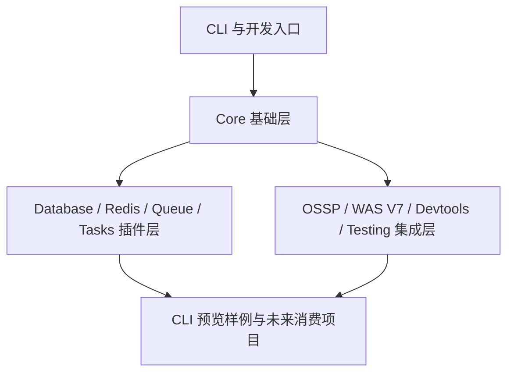

# 系统架构

**项目名称：** stratix框架以及生态  
**文档状态：** 草稿  
**负责人：** 仓库维护者  
**主要读者：** 架构 | 开发 | QA | 维护者  
**上游输入：** 当前状态分析 | 技术选型  
**下游输出：** 模块边界 | 实施计划 | 测试计划  
**关联 ID：** `MOD-001` ~ `MOD-004`  
**最后更新：** 2026-03-28  

## 1. 架构摘要

当前仓库是一个源码级 monorepo，包含：

- 框架核心层：`@stratix/core`, `@stratix/cli`
- 能力插件层：`database`, `redis`, `queue`, `tasks`, `ossp`, `was-v7`, `devtools`, `testing`
- legacy 归档层：`legacy/packages/utils`
- 样例层：`examples/web-admin-preview`（CLI 生成预览样例，不属于 workspace）

## 2. 逻辑分层

## 3. 当前架构事实

- `@stratix/core` 是运行时和 DI 中心。
- `@stratix/core` 现在同时承接原 `@stratix/utils` 的公共工具导出面。
- `@stratix/database`、`@stratix/redis` 等插件依赖 core，并向消费方暴露能力 token。
- `@stratix/cli` 负责工程化初始化、资源生成和应用启动入口。
- `legacy/packages/utils` 保留 `@stratix/utils` 老版本源码，不再参与当前 workspace 包图。
- `examples/web-admin-preview` 是 CLI 生成样例，用于预览模板输出，不属于公共包发布面。

## 4. 架构层面的主要问题

- 根级脚本没有正确代表底层包的真实状态。
- 发布面没有形成统一的架构边界说明，导致源码仓、tag 和 registry 脱节。
- 当前缺少统一的根级 CI/验证闭环。

## 5. 当前架构建议

- 保持“基础层 -> 插件层 -> 应用层”的依赖方向。
- 优先修复 core 层问题，再收敛插件与发布面。
- 将公共包发布与私有应用验证分开管理，但在同一治理框架下追踪。

## 6. 变更记录

| 日期 | 变更内容 | 变更人 |
|---|---|---|
| 2026-03-28 | 架构基线初版 | Codex |
