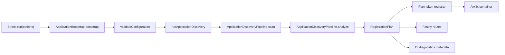

# Core 应用发现管道设计

- 文档编号：`DESIGN-CORE-DISCOVERY-20260617`
- 模块：`@stratix/core`
- 设计目标：单一应用级 discovery 管道

## 总体设计

## 管道职责

| 阶段 | 输入 | 输出 | 失败策略 |
|---|---|---|---|
| scan | `rootDir`、`patterns`、`directories`、`exclude` | `LoadedModule[]` | 模块加载失败抛 `DiscoveryError` |
| analyze | 模块导出对象 | `ComponentMetadata | null` | 非 Stratix 组件跳过 |
| plan | 组件元数据 | `RegistrationPlan` | 只描述将注册的 token、route、scope、依赖和来源 |
| register | `RegistrationPlan`、组件元数据、容器、Fastify | DI token、路由数量 | 重复 token 或注册失败抛 `RegistrationError` |
| route binding | 控制器路由元数据 | Fastify route | handler 不存在抛 `RegistrationError` |

## 显式组件规则

应用级 discovery 只处理以下元数据：

| 装饰器 | 组件类型 | 默认生命周期 |
|---|---|---|
| `@Service()` | `service` | `SINGLETON` |
| `@Repository()` | `repository` | `SINGLETON` |
| `@Component()` | 自定义 component | `SINGLETON` |
| `@Controller()` | `controller` | `SCOPED` |

普通 class 不注册。这样可以让代码扫描结果可审计，避免目录命名或导出顺序造成隐式行为。

## DI token 规则

默认 token 使用类名首字母小写：

| 类名 | token |
|---|---|
| `UserService` | `userService` |
| `HealthController` | `healthController` |
| `OrderRepository` | `orderRepository` |

重复 token 是配置错误，必须失败。

## 请求作用域

每个请求创建 Awilix scope，并注册：

- `request`
- `reply`
- `requestId`
- `logger`
- `diScope`

控制器 handler 从请求 scope 解析 controller，因此 controller 可以接收 request-scoped token。

## 与插件级 AutoDI 的边界

| 层级 | 入口 | 配置字段 | 适用场景 |
|---|---|---|---|
| 应用级 | `ApplicationDiscoveryPipeline` | `config.discovery` | 应用源码中的 service/controller/repository/component |
| 插件级 | `withRegisterAutoDI` | 插件自身 `AutoDIConfig` | 生态插件内部模块注册 |

两者不共享配置字段，不互相兜底。插件级能力仍然保留，但它不再承担应用级 discovery 的职责。

## Phase 2 扩展

应用级 discovery 在分析完成后先生成 `RegistrationPlan`，再由 plan token registrar 注册 DI token，并同步记录 plan metadata，供 `createDIGraph()`、`diagnoseDIGraph()`、`runDIDiagnostics()` 使用。DI graph 以 plan 显式依赖和来源为主，源码参数推断只作为 fallback。

控制器路由继续把 schema 透传给 Fastify，同时可由 `getControllerRouteContracts()` 提取为 route contract，再用于 contract diagnostics 和 OpenAPI 文档生成。

## Phase 6 P1 扩展

插件级 `withRegisterAutoDI` 保持原有插件作者 API，但内部也会生成 `RegistrationPlan`：插件 internal container tokens、controller routes、lifecycle hooks 和公开 adapter token 都会进入同一 plan schema。adapter root token 通过 plan token registrar 注册并进入根容器 DI graph，插件内部 token 记录在插件作用域 plan 中。

`ApplicationBootstrap` 的 discovery / production-manifest 编排已抽出到 `ApplicationDiscoveryRegistrar`。启动器继续负责生命周期顺序，registrar 负责应用发现、manifest-driven registration 和 manifest mismatch 校验。

## Phase 6 P2 扩展

production manifest v2 以 P1 `RegistrationPlan` 为生产注册中间表示。`@stratix/forge build-manifest` 默认生成 v2 artifact：包含 generator/runtime metadata、app `registrationPlan`、source hash、可选 compiled file/hash，并继续保留 v1 routes/DI 投影字段。

`ApplicationDiscoveryRegistrar` 在 `skipRuntimeDiscovery: true` + `registerFromManifest: true` 时，把 v2 `registrationPlan` 转换为 `manifestRegistration` selectors，并优先使用 `metadata.compiledFile` 作为 `ApplicationDiscoveryPipeline.files` 输入。严格模式会先校验 artifact hash；注册后继续校验 manifest token/route 与实际导入组件一致，因此生产启动不会回退到隐式源码 glob。
