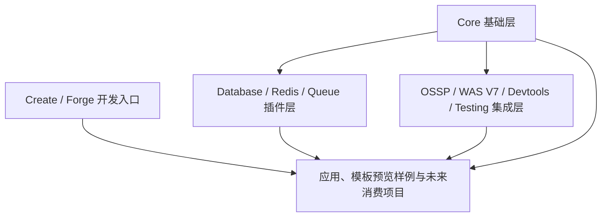

# 系统架构

**项目名称：** stratix框架以及生态  
**文档状态：** 草稿  
**负责人：** 仓库维护者  
**主要读者：** 架构 | 开发 | QA | 维护者  
**上游输入：** 当前状态分析 | 技术选型  
**下游输出：** 模块边界 | 实施计划 | 测试计划  
**关联 ID：** `MOD-001` ~ `MOD-012`
**最后更新：** 2026-06-26

## 1. 架构摘要

当前仓库是一个源码级 monorepo，包含：

- 框架核心层：`@stratix/core`
- 工具链层：`@stratix/create`, `@stratix/forge`
- 核心工具层：`@stratix/core/utils`
- 能力插件层：`database`, `redis`, `queue`, `ossp`, `was-v7`, `devtools`, `testing`
- 样例层：`examples/web-admin-preview`（模板生成预览样例，不属于 workspace）

## 2. 逻辑分层

## 3. 当前架构事实

- `@stratix/core` 是运行时和 DI 中心。
- `@stratix/core` 通过 `@stratix/core/utils` 以及 `@stratix/core/async`、`@stratix/core/data`、`@stratix/core/functional` 等子路径承接共享工具导出面。
- `@stratix/utils` 不再作为独立 workspace 公共包维护。
- `@stratix/database`、`@stratix/redis` 等插件依赖 core，并向消费方暴露能力 token。
- `@stratix/create` 负责轻量 app/plugin 创建入口。
- `@stratix/forge` 负责项目内工程化生成、诊断、OpenAPI、配置和应用启动入口。
- `examples/web-admin-preview` 是模板生成样例，用于预览模板输出，不属于公共包发布面。
- `@stratix/tasks` 已从当前 workspace、preset 模板和发布面物理移除，不再作为当前架构层。

## 4. 架构层面的主要问题

- 根级脚本没有正确代表底层包的真实状态。
- 发布面没有形成统一的架构边界说明，导致源码仓、tag 和 registry 脱节。
- 当前缺少统一的根级 CI/验证闭环。

## 5. 当前架构建议

- 保持“基础层 -> 插件层 -> 应用层”的依赖方向。
- 优先修复 core 层问题，再收敛插件与发布面。
- 将公共包发布与私有应用验证分开管理，但在同一治理框架下追踪。

## 6. 变更记录

| 日期 | 变更内容 | 变更人 |
|---|---|---|
| 2026-03-28 | 架构基线初版 | Codex |
| 2026-06-16 | 记录 `@stratix/utils` 重新进入 `packages/*` workspace 包图 | Codex |
| 2026-06-16 | 删除独立 `@stratix/utils` 包，明确共享工具能力归入 `@stratix/core/utils` | Codex |
| 2026-06-18 | 将工具链架构拆分为 `@stratix/create` 创建入口和 `@stratix/forge` 项目工程入口 | Codex |
| 2026-06-26 | 移除架构摘要中的 `@stratix/tasks` 当前层级口径，避免与物理删除事实冲突 | Codex |
