# Core 概念模型与生产级框架重构计划

- 文档编号：`PLAN-CORE-CONCEPT-REFACTOR-20260617`
- 关联方案：`EVO-CORE-CONCEPT-20260617`
- 执行原则：破坏性升级；不兼容旧概念；不保留 executor 适配层；`@stratix/tasks` 暂时冻结
- 目标评分：所有分项评分达到 95 分以上后才进入完成状态

## 1. 最终目标

本计划执行 [Stratix Core 概念模型与生产级框架完整演进方案](../09-evolution/core-concept-model-evolution.md)，目标不是“把旧 executor 换个名字”，而是把 Stratix 演进为标准生产级 Node.js 后端框架。

```mermaid
flowchart TD
  Core["@stratix/core"] --> Bootstrap["Bootstrap"]
  Core --> Discovery["ApplicationDiscoveryPipeline"]
  Core --> DI["DI Container + diagnostics"]
  Core --> HTTP["Controller / Route / Contract"]
  Core --> ObjectModel["Service / Repository / Component"]
  Core --> Plugin["Plugin Protocol"]
  Core --> Hooks["Stable Test Hooks"]

  Removed["executor"]:::removed
  Core -.删除.-> Removed

  Create["@stratix/create"] --> Init["app/plugin creation"]
  Forge["@stratix/forge"] --> Generate["resource/module/schema/test/openapi/doctor/build/pack"]
  Testing["@stratix/testing"] --> TestApp["createTestApp / fixture / contract"]
  Database["@stratix/database"] --> Repo["repository-first / UnitOfWork"]
  Ecosystem["plugins"] --> Manifest["manifest / capability / health"]
  Tasks["@stratix/tasks"] --> Frozen["Frozen / Deprecated Candidate"]

  classDef removed fill:#fbeaea,stroke:#cc3333,color:#660000;
```



验收结果：

- core 生产代码中不存在 executor decorator、metadata、discovery、registration、public export。
- 没有 executor alias、shim、compat package、compat runtime branch。
- `@stratix/tasks` 不作为本轮迁移目标，不阻塞 core 删除 executor。
- Module 只作为代码项目治理对象，不进入应用启动 runtime path。
- `@stratix/testing` 作为独立一等测试入口建立能力基线。
- Contract-first API 驱动 runtime validation、OpenAPI、typed client、contract tests。
- DI doctor、module doctor、plugin manifest、observability、安全和生产 manifest 进入可验证闭环。

## 2. 分项评分目标

| 分项               | 当前风险                            | 目标分 | 达标标准                                                                            |
| ------------------ | ----------------------------------- | -----: | ----------------------------------------------------------------------------------- |
| 核心概念纯度       | executor 污染 core 概念面           |    95+ | core 只保留通用后端框架概念                                                         |
| 破坏性升级一致性   | 可能出现兼容层或旧 API alias        |    95+ | 无兼容入口，失败要显式暴露                                                          |
| discovery 可维护性 | 领域分支过多                        |    95+ | discovery 只识别 controller/service/repository/component                            |
| public API 清晰度  | 旧概念继续被类型提示暴露            |    95+ | 根导出无 executor                                                                   |
| Contract-first     | schema、OpenAPI、测试割裂           |    95+ | route schema 成为单一契约源                                                         |
| DI 可诊断性        | token 问题难定位                    |    95+ | doctor/graph/cycle/missing/duplicate 可验证                                         |
| 测试平台完整性     | testing 包能力不足                  |    95+ | createTestApp、override、fixture、contract 基线可用                                 |
| Module 工程治理    | 容易误解为 runtime module           |    95+ | module.yaml/doctor/graph 定义清晰，runtime 不依赖                                   |
| 工具链开发体验     | create/forge 边界不清               |    95+ | create 只负责创建，forge 负责 resource/module/schema/test/openapi/doctor/build/pack |
| 数据库能力         | repository-first 仍需企业级事务能力 |    95+ | UnitOfWork、transaction context、outbox 有设计和测试                                |
| 插件治理           | 能力、依赖、版本不透明              |    95+ | manifest/capability/topology/version matrix                                         |
| 生产能力           | 可观测、安全、冷启动证据不足        |    95+ | observability/security/production manifest 可验证                                   |
| 文档一致性         | 新旧概念混写                        |    95+ | docs/API/示例/迁移说明统一为新模型                                                  |

## 3. 工作流与职责

### 工作流 1：Core executor 删除

负责人角色：高级框架架构师、核心开发人员、QA。

| ID                  | 任务                             | 交付物                                           | 验收                              |
| ------------------- | -------------------------------- | ------------------------------------------------ | --------------------------------- | -------- | --------------------------------------- |
| `TASK-CORE-EXE-001` | 删除 executor decorator          | 删除 `decorators/executor.ts` 和相关导出         | core build 不再依赖该文件         |
| `TASK-CORE-EXE-002` | 删除 executor metadata           | 删除类型、常量、读写逻辑和缓存                   | metadata 单测无 executor 路径     |
| `TASK-CORE-EXE-003` | 删除 discovery 分支              | `ApplicationDiscoveryPipeline` 不再识别 executor | discovery 测试只覆盖保留对象类型  |
| `TASK-CORE-EXE-004` | 删除 plugin AutoDI executor 注册 | 插件注册逻辑无 executor 特判                     | 插件测试不再出现 executor fixture |
| `TASK-CORE-EXE-005` | 删除 public export               | 根导出、子路径导出、类型导出无 executor          | `rg -n "Executor                  | executor | EXECUTOR" packages/core/src` 无生产命中 |
| `TASK-CORE-EXE-006` | 删除 executor 示例和测试         | 删除或改写 core 内 executor 测试夹具             | core vitest 全绿                  |

禁止事项：

- 不允许增加 `legacyExecutor`、`ExecutorCompat`、`compat/executor`。
- 不允许在 runtime 里识别旧 metadata 后转换成新对象。
- 不允许把 `@Executor()` 保留为 deprecated decorator。
- 不允许把 executor 自动映射到 `@stratix/tasks`。

### 工作流 2：Tasks 冻结与支持面清理

负责人角色：架构师、发布经理、文档开发、QA。

| ID                      | 任务                              | 交付物                                   | 验收                          |
| ----------------------- | --------------------------------- | ---------------------------------------- | ----------------------------- |
| `TASK-TASKS-FREEZE-001` | 标记 `@stratix/tasks` 状态        | 支持矩阵写明 frozen/deprecated candidate | 文档不再承诺 tasks 新能力     |
| `TASK-TASKS-FREEZE-002` | 从 core 路线中移除 tasks 前置关系 | core plan 不依赖 tasks                   | core 删除 executor 可独立完成 |
| `TASK-TASKS-FREEZE-003` | 发布门禁隔离                      | core 质量门不因 tasks 未重构失败         | release gate 有清晰边界       |
| `TASK-TASKS-FREEZE-004` | 建立未来重做入口                  | 新建后续决策项，不进入本轮 scope         | tasks 是否继续做由新 ADR 决定 |

### 工作流 3：Contract-first API

负责人角色：高级框架架构师、核心开发、测试经理、文档开发。

| ID                  | 任务                   | 交付物                                         | 验收                                                                                                  |
| ------------------- | ---------------------- | ---------------------------------------------- | ----------------------------------------------------------------------------------------------------- |
| `TASK-CONTRACT-001` | 定义 route schema 契约 | params/query/body/headers/response schema 规范 | controller 示例可编译                                                                                 |
| `TASK-CONTRACT-002` | runtime validation     | Fastify route schema 集成                      | 已完成请求校验和 response schema failure 归一化；请求和响应校验行为稳定                               |
| `TASK-CONTRACT-003` | 统一错误 envelope      | 错误响应契约                                   | 已完成；4xx/5xx 契约测试通过                                                                          |
| `TASK-CONTRACT-004` | OpenAPI 生成           | `stratix openapi generate`                     | 已完成；route schema 可生成 OpenAPI                                                                   |
| `TASK-CONTRACT-005` | typed client 生成      | `stratix openapi client`                       | 已完成；支持 response types、path params、query/body/header 参数、auth provider 和 before/after hooks |
| `TASK-CONTRACT-006` | contract tests         | `@stratix/testing` `contractTest()`            | 已完成；覆盖状态码、成功响应 schema 与共享错误 envelope                                               |

### 工作流 4：DI 诊断

负责人角色：框架架构师、forge 开发、QA。

| ID            | 任务              | 交付物                             | 验收                       |
| ------------- | ----------------- | ---------------------------------- | -------------------------- |
| `TASK-DI-001` | DI graph 数据模型 | token -> dependency -> lifetime 图 | 能输出 JSON 和文本图       |
| `TASK-DI-002` | 重复 token 检查   | duplicate token diagnostic         | 重复注册启动失败并给出来源 |
| `TASK-DI-003` | 缺失 token 检查   | missing token diagnostic           | 构造函数依赖缺失可定位     |
| `TASK-DI-004` | 循环依赖检查      | cycle detector                     | 能输出循环链路             |
| `TASK-DI-005` | Forge doctor      | `stratix doctor di`                | CI 可使用非零退出码        |
| `TASK-DI-006` | Forge graph       | `stratix di graph`                 | 可导出 Mermaid/JSON        |

### 工作流 5：Module 工程治理

负责人角色：架构师、forge 开发、文档开发、测试经理。

| ID             | 任务                      | 交付物                          | 验收                                              |
| -------------- | ------------------------- | ------------------------------- | ------------------------------------------------- |
| `TASK-MOD-001` | 定义 `module.yaml` schema | module schema 文档和校验规则    | schema 覆盖 name/root/layers/contracts/boundaries |
| `TASK-MOD-002` | Forge module 生成器       | `stratix generate module users` | 生成标准目录、module.yaml、schema/test 目录       |
| `TASK-MOD-003` | Module doctor             | `stratix doctor modules`        | 能检查缺失文件、越界依赖、循环依赖                |
| `TASK-MOD-004` | Module graph              | `stratix graph modules`         | 输出 module -> route/token/dependency 图          |
| `TASK-MOD-005` | OpenAPI tag 集成          | 文档/生成工具使用 module tag    | 不影响 runtime route 注册                         |
| `TASK-MOD-006` | Module fixture            | `createModuleFixture('users')`  | testing 能按 module 组织夹具                      |

设计约束：

- `module.yaml` 可被 forge、docs、doctor、testing 读取。
- 应用启动不读取 `module.yaml` 作为注册依据。
- Module 不参与 DI container 创建。
- Module 不提供 runtime imports/providers/controllers 注册模型。

### 工作流 6：Testing 一等公民升级

负责人角色：高级测试经理、测试开发、框架开发。

| ID              | 任务               | 交付物                             | 验收                                                                         |
| --------------- | ------------------ | ---------------------------------- | ---------------------------------------------------------------------------- |
| `TASK-TEST-001` | `createTestApp()`  | 官方 test app 工厂                 | 已完成；支持 app.inject，不 listen                                           |
| `TASK-TEST-002` | DI override        | `overrideToken()` / overrides 配置 | 已完成；可替换显式 provider/controller 路径中的 service/repository/component |
| `TASK-TEST-003` | Plugin fixture     | `mockPlugin()` / disable plugin    | 已完成；可替换或禁用生态插件                                                 |
| `TASK-TEST-004` | Discovery fixture  | 测试专用 discovery root/patterns   | 已完成；fixture app 可隔离加载                                               |
| `TASK-TEST-005` | Contract test      | route schema/OpenAPI 契约测试      | 已完成；可验证状态码、schema、错误响应                                       |
| `TASK-TEST-006` | Module fixture     | 与 module.yaml 集成                | 已完成；可按 module.yaml 建立测试边界                                        |
| `TASK-TEST-007` | Repository fixture | database repository 测试夹具       | 已完成；支持 transaction rollback                                            |

执行结果：

| 验收项             | 结果 | 证据                                                                                             |
| ------------------ | ---- | ------------------------------------------------------------------------------------------------ |
| `createTestApp()`  | 通过 | 包装真实 `Stratix.run()` 非监听模式，支持 `app.inject`                                           |
| DI override        | 通过 | `createTestContainer()` / `overrideToken()` 可替换显式 provider/controller 依赖                  |
| Plugin fixture     | 通过 | `mockPlugin()` 可替换插件并注册 decorator/token；`disablePlugin()` / `disablePlugins` 可禁用插件 |
| Discovery fixture  | 通过 | `createDiscoveryFixture()` 可指定隔离 root/patterns 并触发应用级 discovery                       |
| Contract test      | 通过 | `contractTest()` 保持 route contract、response schema 和错误 envelope 校验                       |
| Module fixture     | 通过 | `createModuleFixture()` 读取 `module.yaml` 的 root/layers/contracts/boundaries                   |
| Repository fixture | 通过 | `createRepositoryFixture()` 支持 begin/rollback 和 transaction-bound repository                  |
| testing 包门禁     | 通过 | `pnpm --filter @stratix/testing test` 3 files / 12 tests；typecheck/build 通过                   |

### 工作流 7：Create 与 Forge 完整开发体验

负责人角色：create/forge 开发、文档开发、QA。

| ID              | 任务              | 交付物                                    | 验收                                                                                   |
| --------------- | ----------------- | ----------------------------------------- | -------------------------------------------------------------------------------------- |
| `TASK-TOOL-001` | create 包边界     | `@stratix/create`                         | 只创建 app/plugin/template，不承载 test/build/pack/doctor/openapi                      |
| `TASK-TOOL-002` | forge 包边界      | `@stratix/forge`                          | 承载 generate/doctor/openapi/graph/routes/test/build/pack，不读取 app/plugin 创建模板  |
| `TASK-TOOL-003` | 项目 manifest v2  | `.stratix/project.json`                   | create 写入 template contribution 快照；forge 只读 manifest/presets/resource templates |
| `TASK-TOOL-004` | resource 生成链路 | controller/service/repository/schema/test | 生成后可 typecheck/test                                                                |
| `TASK-TOOL-005` | module 生成链路   | module.yaml + 标准目录                    | 与 module doctor 兼容                                                                  |
| `TASK-TOOL-006` | OpenAPI 命令      | `stratix openapi generate`                | 输出稳定 OpenAPI                                                                       |
| `TASK-TOOL-007` | routes 命令       | `stratix routes`                          | 展示 route/schema/module                                                               |
| `TASK-TOOL-008` | test scaffold     | `stratix test scaffold`                   | 生成 testing 包标准测试                                                                |

### 工作流 8：Database repository-first 强化

负责人角色：数据库架构师、后端开发、测试经理。

| ID            | 任务                | 交付物                     | 验收                         |
| ------------- | ------------------- | -------------------------- | ---------------------------- |
| `TASK-DB-001` | UnitOfWork 设计     | UoW API 和事务边界         | 多 repository 一致性测试通过 |
| `TASK-DB-002` | Transaction context | 自动传播机制               | service 不直接处理连接对象   |
| `TASK-DB-003` | Outbox pattern      | outbox 基线能力            | 事务提交后事件可追踪         |
| `TASK-DB-004` | Health/slow query   | 数据库健康和慢查询观测     | observability 可接入         |
| `TASK-DB-005` | Fixture 适配        | testing repository fixture | 支持 rollback                |

### 工作流 9：插件生态治理

负责人角色：插件架构师、核心开发、QA。

| ID                | 任务                   | 交付物                                             | 验收                                                                                                |
| ----------------- | ---------------------- | -------------------------------------------------- | --------------------------------------------------------------------------------------------------- |
| `TASK-PLUGIN-001` | plugin manifest schema | name/version/capabilities/provides/requires/health | 已完成基线；`.stratix/plugin.json` 校验通过                                                         |
| `TASK-PLUGIN-002` | capability registry    | 能力声明注册表                                     | 已完成基线；`graph plugins` 输出 capability/provides/requires                                       |
| `TASK-PLUGIN-003` | dependency validation  | 插件依赖校验                                       | 已完成基线；缺失 `requires` 依赖时 `doctor plugins` 非零退出                                        |
| `TASK-PLUGIN-004` | token conflict check   | adapter token 冲突检查                             | 已完成基础诊断；plugin manifest provides 进入治理图                                                 |
| `TASK-PLUGIN-005` | topology graph         | plugin graph                                       | 已完成基线；forge 可输出 Mermaid/JSON                                                               |
| `TASK-PLUGIN-006` | version matrix         | 版本兼容矩阵                                       | 已完成 artifact 基线；production manifest 记录运行时 plugin-lock，跨包兼容矩阵后续进入 release gate |

### 工作流 10：生产能力与 DevTools

负责人角色：架构师、运维、DevTools 开发、QA。

| ID              | 任务                                    | 交付物                                         | 验收                                                                 |
| --------------- | --------------------------------------- | ---------------------------------------------- | -------------------------------------------------------------------- |
| `TASK-PROD-001` | Observability preset                    | request id、traces、metrics、health            | 示例应用可输出 trace/metric                                          |
| `TASK-PROD-002` | Security preset                         | CORS、headers、rate limit、body limit          | 安全默认值可测试                                                     |
| `TASK-PROD-003` | Production manifest                     | discovery/route/DI/module/plugin-lock manifest | 已完成 artifact、runtime consumption 与 manifest-driven registration |
| `TASK-PROD-004` | Build manifest 命令                     | `stratix build-manifest`                       | 已完成；CI 可生成 artifact                                           |
| `TASK-PROD-005` | DevTools routes/DI/plugin/config/health | 可视化面板                                     | 已完成；可展示 routes、DI、plugins、config、health、traces           |
| `TASK-PROD-006` | Release gate                            | build/test/docs/security/pack/API surface gate | Phase 5 project gate 已完成；Phase 6 workspace gate 已进入开发       |

### 工作流 11：文档、API 与发布门禁

负责人角色：文档开发、QA、技术总监架构师。

| ID             | 任务                 | 交付物                   | 验收                                                     |
| -------------- | -------------------- | ------------------------ | -------------------------------------------------------- |
| `TASK-DOC-001` | 更新完整演进方案     | 概念模型与生产级框架方案 | 覆盖本轮讨论全部内容                                     |
| `TASK-DOC-002` | 更新 public API 文档 | API 边界文档             | 根导出无 executor                                        |
| `TASK-DOC-003` | 更新开发者指南       | 应用开发指南             | 推荐 controller/service/repository/component/module.yaml |
| `TASK-DOC-004` | 更新 release gate    | 发布门禁                 | 明确 breaking change 和无兼容原则                        |
| `TASK-DOC-005` | 更新质量评分报告     | 95+ 质量门报告           | 每项给出证据、命令、结果                                 |

文档验收命令：

```bash
uvx --from docs-stratego docs-stratego source validate --repo-path .
```

## 4. 实施阶段

### Phase 0：决策冻结

完成条件：

- 完整演进方案覆盖启动流程、discovery、DI、Module、executor、tasks、testing、生产级演进方向。
- 任务计划完成分解并挂入文档导航。
- docs-stratego 校验通过。

### Phase 1：Core 清理 PR（2026-06-18 已执行）

目标：core 删除 executor 的全部运行时代码和 API。

建议提交范围：

- `packages/core/src/decorators`
- `packages/core/src/discovery`
- `packages/core/src/plugin`
- `packages/core/src/types`
- `packages/core/src/index.ts`
- `packages/core/test`
- forge executor generator 相关路径

验收命令：

```bash
pnpm --filter @stratix/core exec tsc -p tsconfig.json --noEmit
CI=true pnpm --filter @stratix/core exec vitest run
pnpm --filter @stratix/core run build
pnpm --filter @stratix/create exec tsc -p tsconfig.json --noEmit
pnpm --filter @stratix/create run build
pnpm --filter @stratix/create test
pnpm --filter @stratix/forge exec tsc -p tsconfig.json --noEmit
pnpm --filter @stratix/forge run build
pnpm --filter @stratix/forge test
pnpm run build:supported
pnpm run test:supported
rg -n "Executor|executor|EXECUTOR|@Executor|registerTaskExecutor|registerExecutorDomain|TaskExecutor|executorModules|executorConfigs" packages/core/src packages/forge/src packages/forge/templates -g '!**/__tests__/**' -g '!**/*.test.ts' -g '!**/*.spec.ts'
rg --files packages/core/src packages/core/dist packages/forge/templates | rg -i 'executor'
```

执行结果：

| 验收项                                   | 结果 | 证据                                                                                                          |
| ---------------------------------------- | ---- | ------------------------------------------------------------------------------------------------------------- |
| core executor decorator 删除             | 通过 | `packages/core/src/decorators/executor.ts` 已删除，decorator index 无 executor 导出                           |
| core executor metadata 删除              | 通过 | `MetadataManager` 不再包含 executor metadata、`isExecutor()`、executor name/options API                       |
| application discovery 删除 executor 分支 | 通过 | 默认扫描目录只保留 `controllers/services/repositories/components`，启动集成测试覆盖不扫描 `executors/`        |
| plugin AutoDI 删除 executor 注册         | 通过 | module discovery、unified processor、auto-di plugin 无 executor result/config/modules 结构                    |
| public API 删除 executor                 | 通过 | public API 负向测试覆盖 `Executor`、`EXECUTOR_METADATA_KEY`、`getExecutorMetadata()`、`isExecutor()` 等旧入口 |
| Forge 删除 executor 生成面               | 通过 | `generate executor`、`generate plugin-executor` 入口和模板已删除，模板清单不再出现 executor                   |
| 无兼容层                                 | 通过 | 没有 executor alias、shim、compat package、runtime metadata 转换或 tasks 自动映射                             |
| 支持包门禁                               | 通过 | `pnpm run build:supported` 9/9；`pnpm run test:supported` 11 个 turbo tasks 全部通过                          |

本阶段完成后，下一阶段进入 Phase 2：Contract-first API 与 DI doctor。

### Phase 2：Contract-first、DI doctor 与 OpenAPI PR（2026-06-18 扩展工作流已执行）

目标：建立接口契约和 DI 诊断的核心能力。

验收：

- route schema 可驱动 validation/OpenAPI/typed client/contract tests。
- `stratix doctor di` 可检测重复、缺失、循环依赖。
- `stratix di graph` 可输出 token/lifetime/scope 关系。

已完成能力：

| 验收项                           | 结果 | 证据                                                                                                                                                             |
| -------------------------------- | ---- | ---------------------------------------------------------------------------------------------------------------------------------------------------------------- |
| Route contract extraction        | 通过 | `getControllerRouteContracts()` 从 Controller metadata 提取 method/path/schema/tags/openApiPath                                                                  |
| Contract diagnostics             | 通过 | `validateRouteContracts()` 可报告缺失 schema、缺失 response schema、缺失 operationId                                                                             |
| OpenAPI document generation      | 通过 | `generateOpenApiDocument()` 从 route contracts 生成 OpenAPI 3.1 paths、parameters、requestBody、responses                                                        |
| Runtime schema validation        | 通过 | application discovery 集成测试验证 Fastify schema 对非法 query 返回 400，并验证 response schema failure 返回统一 envelope                                        |
| Unified error envelope           | 通过 | `ERROR_ENVELOPE_SCHEMA` 与 `createErrorEnvelope()` 进入 core public API，bootstrap 的请求校验错误、404 和 response schema failure 使用同一 envelope              |
| DI graph                         | 通过 | `createDIGraph()` 输出稳定 token/dependencies/lifetime/injectionMode/source 节点                                                                                 |
| DI diagnostics                   | 通过 | `diagnoseDIGraph()` / `runDIDiagnostics()` 覆盖 duplicate token、missing dependency、cycle                                                                       |
| Discovery DI metadata            | 通过 | `ApplicationDiscoveryPipeline` 注册 component 时记录 DI metadata                                                                                                 |
| Forge doctor                     | 通过 | `stratix doctor di` 可对源码做零依赖静态 DI 检查，缺失依赖非零退出                                                                                               |
| Forge graph                      | 通过 | `stratix di graph --format json\|mermaid` 输出 DI graph                                                                                                          |
| OpenAPI forge command            | 通过 | `stratix openapi generate` 通过目标项目 `typescript` AST 解析 route schema，不依赖 `@stratix/core`                                                               |
| Typed client forge command       | 通过 | `stratix openapi client` 从 OpenAPI JSON 生成 TypeScript fetch client，覆盖 response types、path/query/body/header 参数、auth provider 和 before/after hooks     |
| Contract test DSL                | 通过 | `@stratix/testing` 暴露 runner-neutral `contractTest()`，复用 core route contract、diagnostics 与共享错误 envelope schema                                        |
| Plugin adapter diagnostics       | 通过 | `diagnoseServiceAdapterTokens()` 检查重复 adapter name 和根容器 token 冲突                                                                                       |
| Create templates                 | 通过 | API/plugin 创建模板输出 `@stratix/core` runtime dependency 和 `@stratix/forge` devDependency                                                                     |
| Project manifest v2              | 通过 | create 写入 `.stratix/project.json` `schemaVersion: 2` 与 template contribution 快照，forge `add/doctor` 不读取 app/plugin 创建模板                              |
| Forge templates                  | 通过 | resource 模板补显式 `@Service()`、`@Repository()`、operationId 与 response schema；forge 发布包只携带 `templates/resources` 与 `templates/presets`               |
| Create/forge dependency boundary | 通过 | `@stratix/create` 与 `@stratix/forge` 不依赖 `@stratix/core`；create 不承载 forge 生命周期命令；forge 不暴露 `init`                                              |
| Module governance tooling        | 通过 | `stratix generate module` 生成 `module.yaml`；`stratix doctor modules` 校验 manifest/layer/boundary/cycle；`stratix graph modules` 输出 JSON/Mermaid 模块图      |
| Plugin manifest governance       | 通过 | create 为 plugin 项目生成 `.stratix/plugin.json`；`stratix doctor plugins` 校验 capabilities/provides/requires/health；`stratix graph plugins` 输出 JSON/Mermaid |
| Production manifest artifact     | 通过 | `stratix build-manifest` 生成 route、DI、module、plugin-lock 生产 artifact                                                                                       |
| Runtime manifest consumption     | 通过 | `@stratix/core` 读取 `discovery.productionManifest`，启动期校验 artifact，并可在 `skipRuntimeDiscovery` 为 `true` 时跳过应用级 runtime glob discovery            |
| Manifest-driven registration     | 通过 | `registerFromManifest: true` 时 core 只导入 manifest `sourceFile` 并恢复 DI/路由注册                                                                             |
| Observability/Security preset    | 通过 | core 生产配置支持 request/trace id、health、metrics、traces、CORS、headers、rate limit、body limit                                                               |
| DevTools production views        | 通过 | `@stratix/devtools` 展示 manifest routes、DI tokens、plugins、redacted config、health 和 traces                                                                  |
| Release gate                     | 通过 | `stratix release gate --dry-run --manifest <file>` 输出 project 检查计划；`--scope workspace --dry-run` 输出 monorepo 发布准备计划                               |
| 支持包门禁                       | 通过 | `pnpm run build:supported` 10/10；`pnpm run test:supported` 12 个 turbo tasks 全部通过                                                                           |

Phase 6 后续工作：

- 真实执行 workspace release gate，并把失败项定位到 offline install、tag、registry 或 pack。
- 恢复离线安装，或正式声明当前发布形态不支持离线安装。
- 对齐本地 package manifest、git tags 与 npm registry 版本口径。
- 决策 `@stratix/tasks` 是永久废弃、移出 workspace，还是重新立项迁移。

### Phase 3：Testing 扩展与 Module PR

目标：让测试平台和模块治理落地。

验收：

- `@stratix/testing` 在已完成 `contractTest()` 基线之上提供 test app、override、plugin fixture、discovery fixture、repository fixture、module fixture。
- `stratix generate module`、`stratix doctor modules`、`stratix graph modules` 可用。（2026-06-18 已完成）
- Module 工具不改变应用启动 runtime 行为。（2026-06-18 已完成）

### Phase 4：Forge、Database、Plugin 生态 PR

目标：完善开发体验和生态治理。

验收：

- resource/module/schema/test/openapi 生成链路可用。
- database UnitOfWork、transaction context、repository fixture 有设计和测试。
- plugin manifest、capability、dependency validation、topology graph 可用。
- production manifest artifact 可由 CI 生成。

### Phase 5：生产能力 PR（2026-06-18 已执行）

目标：补齐可观测、安全、生产 manifest、DevTools。

验收：

- Observability preset 输出 trace/metric/health。（已完成）
- Security preset 有默认安全配置和测试。（已完成）
- `stratix build-manifest` 生成生产 manifest artifact。（已完成）
- production runtime 可读取 manifest、选择跳过 runtime glob discovery，并可优先按 v2 manifest `compiledFile` 注册 DI/路由，v1 manifest 继续按 source files 兼容注册。（已完成）
- DevTools 可展示 routes、DI、plugin、config、health、traces。（已完成）
- `stratix release gate` 可执行 production manifest 发布门禁。（已完成）

### Phase 6：95+ 评分复核（2026-06-18 已进入开发）

复核材料：

- 代码 diff
- API surface diff
- 测试结果
- docs-stratego 校验结果
- `rg executor` 清理结果
- public API 文档
- OpenAPI/typed client/contract test 示例
- DI graph/module graph/plugin graph 示例
- observability/security/production manifest 示例
- workspace release gate 输出
- offline install、git tag、npm registry 发布面对齐记录

通过条件：

- 所有分项评分 95+。
- 没有 P0/P1 级别缺陷。
- 没有 executor 兼容层。
- 没有 tasks 未定设计阻塞 core。
- `stratix release gate --scope workspace` 能把 supported build/test/docs/pack/API/release-surface 串成可重复门禁。
- `BUG-003` 和 `CR-001` 有关闭结论或明确发布阻断状态。

## 5. 统筹检查点

技术总监架构师需要在以下节点做 code review：

| 节点                   | 检查重点                                                     |
| ---------------------- | ------------------------------------------------------------ |
| Core 删除 decorator 后 | 是否还有 public export 或 metadata 残留                      |
| Discovery 改完后       | 是否引入新隐式分支或兼容路径                                 |
| Contract-first 设计后  | schema 是否真正驱动 validation/OpenAPI/client/contract tests |
| DI doctor 设计后       | 是否能解释 token 来源、scope、lifetime、缺失、重复和循环依赖 |
| Testing 能力设计后     | 是否把测试 DSL 错误塞回 core                                 |
| Module tooling 设计后  | 是否变成 runtime module system                               |
| Plugin manifest 设计后 | 是否能校验能力、依赖、版本和 token 冲突                      |
| 生产能力设计后         | observability/security/manifest 是否有可执行验收             |
| 发布门禁前             | 是否所有评分都有证据支撑                                     |

## 6. 完成定义

本轮重构完成必须同时满足：

1. `@stratix/core` 中 executor 完全删除，无兼容层。
2. `@stratix/tasks` 冻结状态明确，且不作为 core 删除 executor 的承接目标。
3. Module 被定义并落地为代码项目治理对象，不进入 runtime 注册模型。
4. `@stratix/testing` 具备一等测试平台的最小可用能力。
5. Contract-first API 能驱动 runtime validation、OpenAPI、typed client 和 contract tests。
6. DI doctor、module doctor、plugin graph 具备可验证输出。
7. observability、security、production manifest、DevTools 有最小闭环。
8. 文档、测试、发布门禁、质量评分全部同步。
9. 每个质量分项达到 95 分以上，并有命令输出或文档证据支撑。
