# Stratix Core 概念模型与生产级框架完整演进方案

- 文档编号：`EVO-CORE-CONCEPT-20260617`
- 适用版本：当前仓库 `@stratix/core@1.1.0`、`@stratix/create@1.1.0`、`@stratix/forge@1.1.0`、`@stratix/database@1.1.0`
- 范围：`@stratix/core`、`@stratix/create`、`@stratix/forge`、`@stratix/database`、`@stratix/testing`、`@stratix/tasks`、插件生态、文档与质量门
- 升级原则：破坏性升级；不兼容旧概念；不保留旧 API 适配层；以最新契约和最新设计为准
- 目标：把 Stratix 演进为契约驱动、诊断友好、测试优先、可观测、可发布的标准生产级 Node.js 后端框架

## 1. 讨论结论总览

本方案整合了本轮讨论中的全部核心结论：

1. `performApplicationAutoDI` 代表旧的应用级自动发现入口，后续不再作为目标架构使用；新应用级发现以 `config.discovery` 和 `ApplicationDiscoveryPipeline` 为唯一主线。
2. `executor` 不再属于 `@stratix/core` 的核心概念，必须从 decorator、metadata、discovery、plugin registration、public export、forge generator 中删除，不提供兼容层。
3. `@stratix/tasks` 暂时作为冻结/待废弃包处理，不作为 executor 的迁移目标，也不作为 core 删除 executor 的前置条件。
4. `Module` 不是运行时 DI 容器，不是 Nest 风格 runtime module，也不是应用启动时必须 import 的类。它是代码项目里的业务能力目录边界和治理描述。
5. `@stratix/testing` 成为一等公民，不等于合入 core；它应保持独立包，升级为官方测试平台。
6. Stratix 下一步不是堆更多装饰器，而是建立标准框架硬能力：Contract-first、DI 诊断、Module 治理、`@stratix/create` 轻量创建入口、`@stratix/forge` 项目工程中枢、可观测性、安全默认值、插件 manifest、生产 manifest、DevTools、质量门。
7. 所有分项评分目标为 95 分以上，未达到前不进入完成状态。

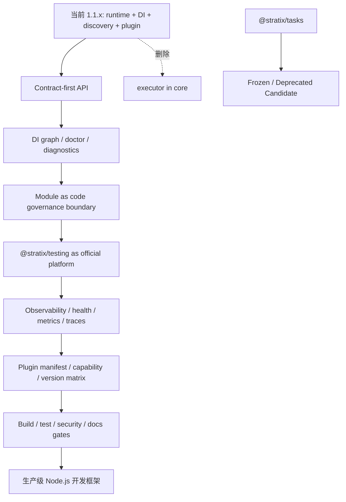

## 2. 当前应用启动完整流程

### 2.1 启动主链路

当前应用从 `Stratix.run()` 或 `new Stratix().start()` 进入，核心启动协调者是 `ApplicationBootstrap`。

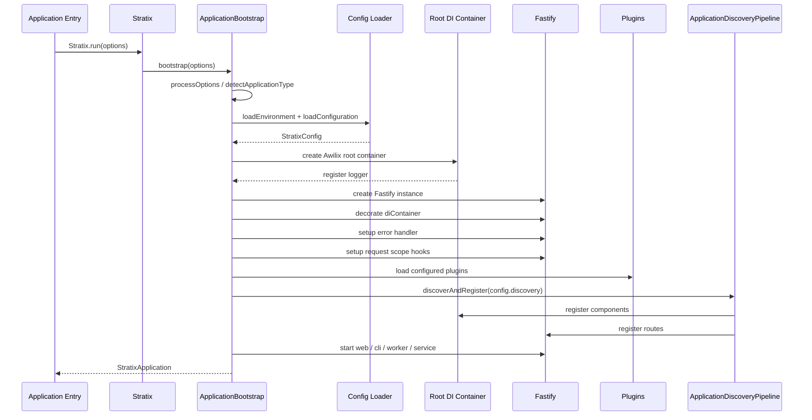

当前实际步骤：

| 顺序 | 阶段             | 当前行为                                                                                           |
| ---: | ---------------- | -------------------------------------------------------------------------------------------------- |
|    1 | 处理启动选项     | `processOptions(options)`，合并运行时参数                                                          |
|    2 | 检测应用类型     | 根据启动参数识别 `web`、`cli`、`worker`、`service` 等类型                                          |
|    3 | 加载环境         | 加载环境变量和敏感配置                                                                             |
|    4 | 加载配置         | 加载 `stratix.config.ts`，执行 schema 校验和 runtime overrides                                     |
|    5 | 创建根容器       | `createContainer({ injectionMode: CLASSIC, strict: false })`，注册 `logger`                        |
|    6 | 初始化 Fastify   | 创建 Fastify，挂载 `diContainer`，注册错误处理和请求上下文                                         |
|    7 | 加载插件         | 按 `config.plugins` 加载普通插件或 `withRegisterAutoDI` 增强插件                                   |
|    8 | 应用级 discovery | 以 `config.discovery` 驱动 `ApplicationDiscoveryPipeline`                                          |
|    9 | 启动应用         | 根据应用类型 listen 或执行非 Web 启动                                                              |
|   10 | 优雅关闭         | 注册 shutdown handler，关闭 Fastify 和容器资源                                                     |
|   11 | 返回应用对象     | 返回 `StratixApplication`，包含 `fastify`、`diContainer`、`config`、`logger`、`inject()`、`stop()` |

### 2.2 请求生命周期与对象解析

Fastify 初始化时会注册请求上下文 hook。每个请求进入时，core 会从根容器创建 request scope，并注册 `request`、`reply`、`requestId`、`logger`、`diScope`。

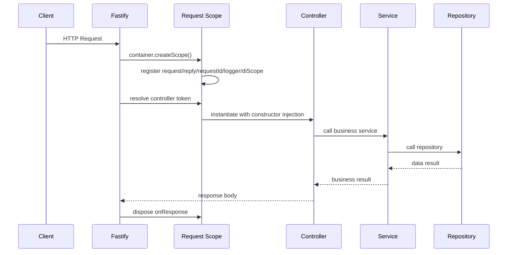

关键点：

- Controller 默认应在请求作用域中解析，便于注入 `request`、`reply`、`requestId`。
- Service 默认是 singleton，承载业务编排。
- Repository 默认是 scoped，承载数据库访问和事务上下文。
- Component 默认是 singleton，承载通用基础能力。
- 依赖注入采用 Awilix `CLASSIC` 模式，依赖名主要来自构造函数参数名和 DI token。

## 3. 服务、接口、对象如何定义与注入

### 3.1 Controller

Controller 是 HTTP 协议层对象，只负责请求、响应、参数转发和协议错误映射。

```ts
import { Controller, Get } from '@stratix/core';

@Controller()
export class UserController {
  constructor(private userService: UserService) {}

  @Get('/users/:id')
  async getUser(request: FastifyRequest) {
    return this.userService.getUser((request.params as any).id);
  }
}
```

约束：

- `@Controller()` 不承载路由前缀。
- 路由路径由 `@Get()`、`@Post()` 等方法装饰器声明。
- 全局或模块路由前缀由 Fastify 注册前缀或 `config.discovery.routing.prefix` 管理。
- Controller 不直接访问数据库插件。

### 3.2 Service

Service 是业务编排层对象，负责流程组织、跨服务协作、规则判断和调用 repository。

```ts
import { Service } from '@stratix/core';

@Service()
export class UserService {
  constructor(private userRepository: UserRepository) {}

  async getUser(id: string) {
    return this.userRepository.findById(id);
  }
}
```

默认注册行为：

| 属性          | 默认值                                              |
| ------------- | --------------------------------------------------- |
| type          | `service`                                           |
| lifetime      | `SINGLETON`                                         |
| injectionMode | `CLASSIC`                                           |
| token         | 类名 camelCase，例如 `UserService` -> `userService` |

### 3.3 Repository

Repository 是应用层唯一直接承接数据库访问的对象。`@stratix/database@1.1.0` 的方向是 repository-first，应用侧优先继承或组合 `BaseRepository`。

```ts
import { Repository } from '@stratix/core';

@Repository()
export class UserRepository {
  constructor(private databaseConnectionProvider: DatabaseConnectionProvider) {}

  async findById(id: string) {
    // database access here
  }
}
```

默认注册行为：

| 属性          | 默认值                       |
| ------------- | ---------------------------- |
| type          | `repository`                 |
| lifetime      | `SCOPED`                     |
| injectionMode | `CLASSIC`                    |
| token         | 类名 camelCase 或显式 `name` |

### 3.4 Component

Component 是不属于 HTTP 协议层、不属于业务 service、不属于 repository 的通用框架对象。

```ts
import { Component } from '@stratix/core';

@Component({ name: 'idGenerator' })
export class IdGenerator {
  next() {
    return crypto.randomUUID();
  }
}
```

### 3.5 DI token 生成与解析

应用级 discovery 注册 token 的基本规则：

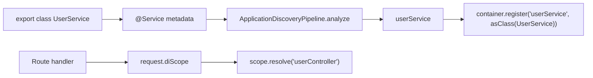

规则：

- 默认 token 为类名首字母小写。
- `@Service({name})`、`@Repository({name})`、`@Component({name})` 可以显式指定 token。
- 重复 token 是配置错误，必须启动失败，不能静默覆盖。
- request handler 里优先从 `request.diScope` 解析 Controller；没有 request scope 时才回退 root container。

## 4. 应用级 discovery 新旧管道是什么意思

### 4.1 旧管道

旧管道指历史应用级自动发现入口，例如 `performApplicationAutoDI` 这类函数式入口。它的问题是：

- 应用级自动发现、插件级 AutoDI、领域 executor 注册边界混杂。
- public API 暴露过多内部注册细节。
- 配置入口不统一，难以形成标准 `stratix.config.ts` 契约。
- 难以独立测试 scan、analyze、register、route registration 四个阶段。
- 容易让领域插件能力反向污染 core。

旧管道在目标架构中没有保留价值。本次是破坏性升级，不提供兼容入口。

### 4.2 新管道

新管道是 `ApplicationDiscoveryPipeline`，由 `config.discovery` 驱动。

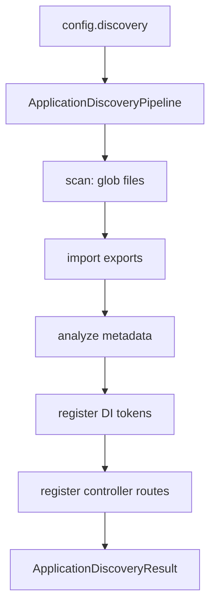

当前新管道阶段：

| 阶段               | 输入                                            | 输出                         | 说明                                           |
| ------------------ | ----------------------------------------------- | ---------------------------- | ---------------------------------------------- |
| scan               | `rootDir`、`directories`、`patterns`、`exclude` | `LoadedModule[]`             | 扫描文件并动态 import                          |
| analyze            | `LoadedModule`                                  | `ComponentMetadata`          | 读取 decorator metadata                        |
| register           | `ComponentMetadata`                             | DI token                     | 使用 Awilix 注册 class                         |
| route registration | controller route metadata                       | Fastify routes               | 为 Controller 注册 HTTP route                  |
| result             | 全流程数据                                      | `ApplicationDiscoveryResult` | 返回 scanned/analyzed/registered/routes/errors |

### 4.3 目标差异

| 维度       | 旧应用级管道                      | 新应用级管道                                        |
| ---------- | --------------------------------- | --------------------------------------------------- |
| 入口       | `performApplicationAutoDI` 类函数 | `config.discovery` + `ApplicationDiscoveryPipeline` |
| 所属层     | 历史自动注册工具                  | core bootstrap 标准阶段                             |
| 可测试性   | 难拆分                            | scan/analyze/register/route 可分段测试              |
| 配置       | 分散                              | `stratix.config.ts` 统一                            |
| public API | 暴露旧实现细节                    | 暴露稳定 pipeline 和 result                         |
| executor   | 历史上可能混入                    | 目标状态必须删除                                    |
| 兼容策略   | 不保留                            | 以新契约为准                                        |

### 4.4 应用级 discovery 与插件级 AutoDI 的边界

这两者不是同一件事：

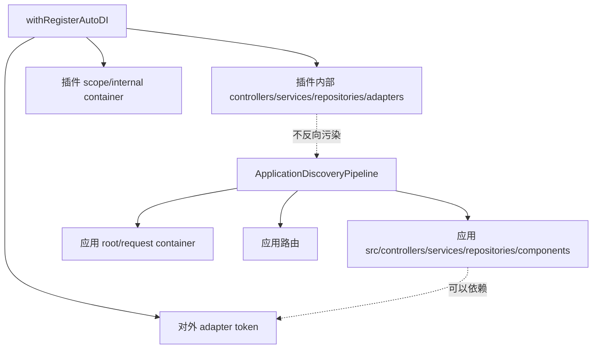

目标边界：

- 应用级 discovery 只负责应用代码。
- 插件级 AutoDI 只负责插件内部对象和 adapter。
- core 不内置任务执行、工作流调度、队列消费等领域概念。
- 领域插件不能要求 core 为它保留通用性不足的 decorator。

## 5. Phase 1 源码清理结果

截至 2026-06-18，executor 旧概念已经从 core 和 forge 生成面删除：

- `packages/core/src/decorators/executor.ts` 已删除。
- `MetadataManager` 中的 executor metadata、`isExecutor()`、executor name/options API 已删除。
- `ApplicationDiscoveryPipeline` 不再识别 `component.type === 'executor'`，默认扫描目录只保留 `controllers/services/repositories/components`。
- plugin module discovery、unified processor、auto-di plugin 不再包含 executor registration、executor configs、executor modules 或 task hook 注册逻辑。
- core 根导出和 decorator 子路径不再导出 `Executor`、`EXECUTOR_METADATA_KEY`、`getExecutorMetadata()`、`isExecutor()` 等旧 API。
- Forge `generate executor`、`generate plugin-executor` 入口和对应模板已删除。
- `@stratix/tasks` 没有承接旧 executor，也没有被自动映射为迁移目标。

生产代码中以下命令不应命中有效旧概念：

```bash
rg -n "Executor|executor|EXECUTOR|@Executor|registerTaskExecutor|registerExecutorDomain|TaskExecutor|executorModules|executorConfigs" packages/core/src packages/forge/src packages/forge/templates -g '!**/__tests__/**' -g '!**/*.test.ts' -g '!**/*.spec.ts'
rg --files packages/core/src packages/core/dist packages/forge/templates | rg -i 'executor'
tar -tf /tmp/stratix-core-1.1.0.tgz | rg -i 'executor'
```

允许命中范围仅限：

- 破坏性升级文档
- changelog
- migration note 中说明“已删除”的文字

不允许命中范围：

- runtime
- decorators
- metadata
- discovery
- plugin registration
- public export
- tests fixture 主路径
- Forge generator 主路径

## 6. Module 的最终定义

### 6.1 一句话定义

`Module` 是代码项目里的业务能力边界。它告诉人、`@stratix/forge`、文档生成器、测试工具和架构诊断工具：哪些 controller、service、repository、schema、route、test 属于同一个业务能力。

它不是一个需要框架实例化的运行时对象。

### 6.2 具体在代码项目里是什么

在真实项目里，Module 最直接的形态是目录：

```text
src/
  modules/
    users/
      module.yaml
      controllers/
        user.controller.ts
      services/
        user.service.ts
      repositories/
        user.repository.ts
      schemas/
        user.schema.ts
      tests/
        user.contract.test.ts
      index.ts
```

这个 `src/modules/users/` 就是 `Users` 业务模块。

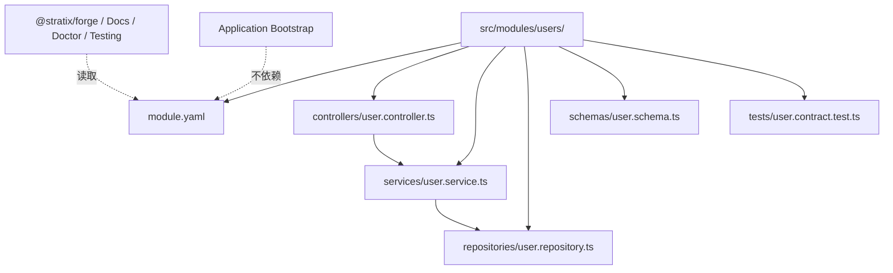

### 6.3 推荐 module.yaml

```yaml
name: users
title: User Management
root: src/modules/users
owner: platform-team
tags:
  - Users
layers:
  controllers: controllers/**/*.ts
  services: services/**/*.ts
  repositories: repositories/**/*.ts
  schemas: schemas/**/*.ts
contracts:
  openapiTag: Users
boundaries:
  owns:
    - userController
    - userService
    - userRepository
  allows:
    imports:
      - auth
      - database
```

TypeScript 形式可以存在，但必须保持工具链属性，不进入 runtime path：

```ts
import { defineModule } from '@stratix/forge/module';

export default defineModule({
  name: 'users',
  title: 'User Management',
  root: import.meta.dirname,
  tags: ['Users'],
  owner: 'platform-team'
});
```

### 6.4 Module 不应该是什么

| 不应该做成                                   | 原因                                                      |
| -------------------------------------------- | --------------------------------------------------------- |
| 模块级 DI 容器                               | 会制造 root/request/plugin/module 多层容器，提升理解成本  |
| runtime module class                         | 会让应用启动依赖模块装配顺序，破坏当前轻量 discovery 模型 |
| Nest 风格 imports/providers/controllers 克隆 | 与 Stratix 的轻量 Fastify 原生定位冲突                    |
| 目录名隐式注册机制                           | 会重新引入隐式行为，与明确 discovery 契约冲突             |
| 聚合所有对象的大类                           | 会变成上帝对象，破坏 controller/service/repository 职责   |

### 6.5 Module 应产生的工程价值

| 能力         | 用途                                                                                    |
| ------------ | --------------------------------------------------------------------------------------- |
| Forge 生成   | `stratix generate module users` 生成目录、`module.yaml`、schema/test 目录和模块分层代码 |
| 架构诊断     | `stratix doctor modules` 检查跨模块依赖、循环依赖、越层调用                             |
| 图谱输出     | `stratix graph modules` 输出 module -> route -> token -> dependency                     |
| OpenAPI 分组 | 根据 module tag 生成 API 文档分组                                                       |
| 测试组织     | `@stratix/testing` 支持 `createModuleFixture('users')`                                  |
| 评审证据     | 为架构评审提供模块 owner、依赖、路由、测试覆盖证据                                      |

## 7. executor 与 tasks 的最终决策

### 7.1 executor 删除结论

`executor` 表达的是任务执行、工作流执行、调度执行或队列消费这类领域能力。它不是所有 Node.js 后端框架都共有的基础概念，公用性弱于 controller、service、repository、component。

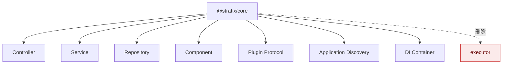

删除范围：

- 删除 `decorators/executor.ts`。
- 删除 executor metadata 类型、常量、读取、写入、缓存逻辑。
- 删除 `ApplicationDiscoveryPipeline` executor 分支。
- 删除 plugin AutoDI 或 discovery 中 executor 注册逻辑。
- 删除 core 根导出中的 executor API。
- 删除 core 文档、示例、测试中的 executor 入口。
- 删除 forge 面向 core 的 `generate executor` 路径，不能改造成兼容命令。

### 7.2 为什么不能保留适配层

| 适配方式                              | 为什么不接受                              |
| ------------------------------------- | ----------------------------------------- |
| 保留 `@Executor()` 但内部映射到新概念 | 用户仍会继续使用旧概念，概念清理失败      |
| 导出 `Executor` alias                 | public API 仍污染，类型提示继续暴露旧模型 |
| runtime 识别 executor metadata        | discovery 仍背负旧分支，复杂度没有消失    |
| Forge 自动把 executor 生成成新文件    | 旧命令继续可用，破坏破坏性升级边界        |
| 提供 compat 包                        | 生态长期分裂，不利于 95+ 质量目标         |

### 7.3 @stratix/tasks 当前状态

`@stratix/tasks` 暂时作为冻结/待废弃包处理。

这意味着：

- 不把 executor 迁移到 `@stratix/tasks`。
- 不要求 tasks 在本轮完成 `TaskHandler`、`Activity`、workflow、scheduler 等新契约。
- 不把 tasks 作为 core 删除 executor 的前置条件。
- 不让 tasks 影响 core 概念模型评分。
- 不把 tasks 纳入当前“标准 Node.js 完美开发框架”的必备 runtime 面。

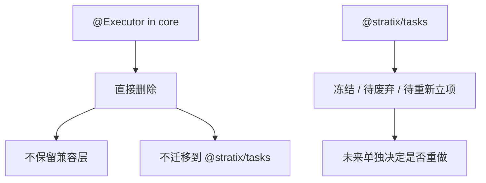

如果未来重做 tasks，必须重新立项，重新回答任务处理器、工作流、调度、状态、重试、补偿、分布式锁、测试 harness、插件边界等问题，不能继承旧 executor。

## 8. @stratix/testing 一等公民定义

### 8.1 不是并入 core

`@stratix/testing` 成为一等公民，不等于删除该包，也不等于把测试 DSL 塞进 `@stratix/core`。

正确边界：

| 包                  | 职责                                                                                        |
| ------------------- | ------------------------------------------------------------------------------------------- |
| `@stratix/core`     | 暴露稳定 runtime、DI、discovery、route、plugin test hooks                                   |
| `@stratix/testing`  | 提供官方测试 DSL、test app、DI override、route contract、plugin fixture、repository fixture |
| `@stratix/database` | 提供 database/repository fixture 或由 testing 包适配                                        |
| `@stratix/tasks`    | 冻结期间不作为 testing 必备支持面                                                           |

### 8.2 目标能力

```ts
const app = await createTestApp({
  config: {
    discovery: {
      rootDir: fixtureRoot,
      patterns: ['**/*.ts']
    }
  },
  overrides: {
    userRepository: mockUserRepository
  }
});

const response = await app.inject({
  method: 'GET',
  url: '/api/users/1'
});
```

能力清单：

| 能力                        | 说明                                     |
| --------------------------- | ---------------------------------------- |
| `createTestApp()`           | 启动真实 Stratix app，但默认不 listen    |
| `createTestContainer()`     | 创建与 core 一致的 Awilix 容器           |
| `overrideToken()`           | 替换 DI token                            |
| `mockPlugin()`              | 替换或禁用插件                           |
| `inject()`                  | Fastify inject 封装                      |
| `contractTest()`            | 基于 route schema/OpenAPI 做接口契约测试 |
| `createRepositoryFixture()` | 数据库 repository 测试夹具               |
| `createModuleFixture()`     | 按 Module 边界创建测试夹具               |

## 9. 生产级 Node.js 框架演进方向

### 9.1 Contract-first API

接口、类型、校验、OpenAPI、客户端 SDK、契约测试必须统一。

目标：

- `@Get()` / `@Post()` 支持 schema。
- 请求 `params`、`query`、`body`、`headers`、`response` 可声明。
- 自动生成 OpenAPI。
- 自动生成 typed client。
- 统一错误响应 envelope。
- Controller 不重复手写校验。

```ts
@Controller()
export class UserController {
  constructor(private userService: UserService) {}

  @Get('/users/:id', {
    schema: {
      params: UserIdParamsSchema,
      response: {
        200: UserResponseSchema
      }
    }
  })
  async getUser(request: TypedRequest<{ params: UserIdParams }>) {
    return this.userService.getUser(request.params.id);
  }
}
```

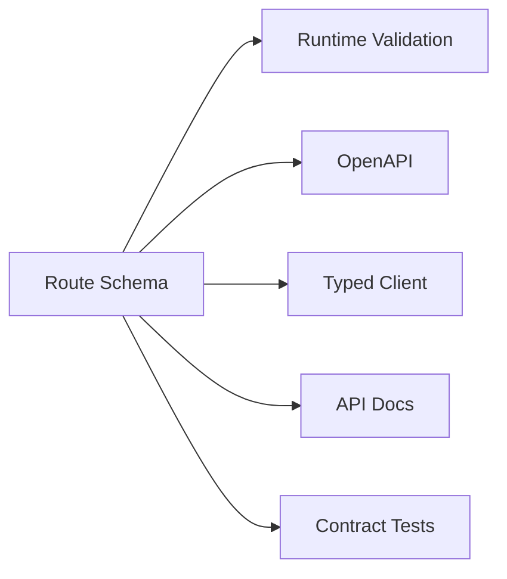

### 9.2 DI 诊断

DI 需要从“可用”升级为“可诊断”。

目标：

- 启动时生成依赖图。
- 检测循环依赖。
- 检测未注册 token。
- 检测重复 token。
- 显示 token lifetime。
- 支持 `stratix doctor di`。
- 支持 `stratix di graph`。

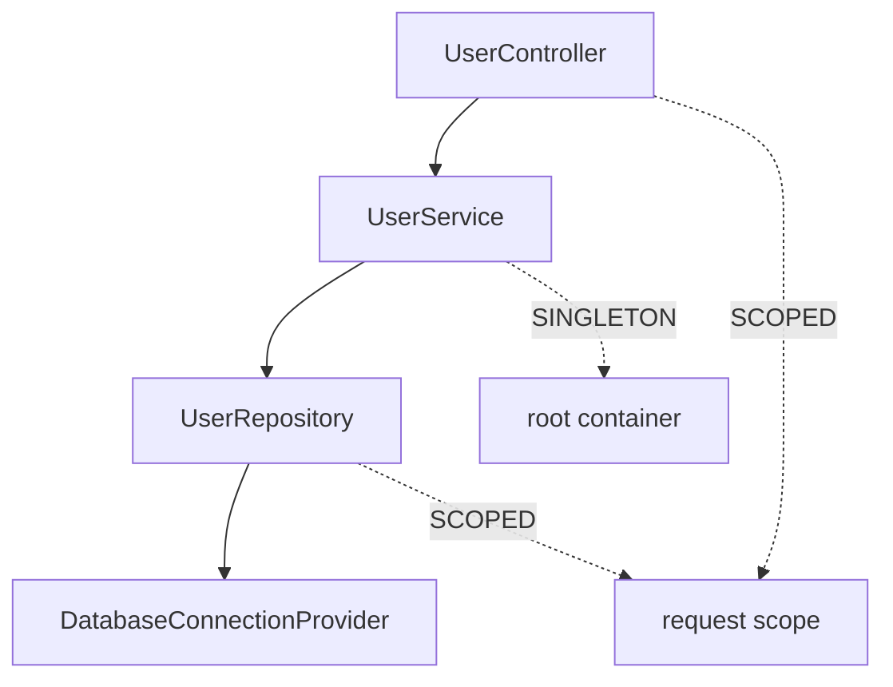

截至 2026-06-18，Phase 2 扩展工作流已经落地：

| 能力                        | 当前状态                                                                                                                                                     |
| --------------------------- | ------------------------------------------------------------------------------------------------------------------------------------------------------------ |
| route contract extraction   | `getControllerRouteContracts()` 可读取 Controller route schema 并生成标准 route contract                                                                     |
| contract diagnostics        | `validateRouteContracts()` 可检查 schema、response schema、operationId 缺失                                                                                  |
| OpenAPI document generation | `generateOpenApiDocument()` 可从 route contracts 生成 OpenAPI 3.1 文档对象                                                                                   |
| runtime schema validation   | application discovery 路由注册透传 schema，集成测试覆盖非法 query 返回 400 和 response schema failure 归一化                                                 |
| unified error envelope      | `ERROR_ENVELOPE_SCHEMA` 与 `createErrorEnvelope()` 已进入 core public API，bootstrap 对请求校验错误、404 和 response schema failure 使用同一错误 envelope    |
| DI graph                    | `createDIGraph()` 输出 token/dependencies/lifetime/injectionMode/source                                                                                      |
| DI diagnostics              | `diagnoseDIGraph()` 覆盖 duplicate token、missing dependency、cycle                                                                                          |
| Forge doctor                | `stratix doctor di` 对应用源码执行零依赖静态 DI 检查                                                                                                         |
| Forge graph                 | `stratix di graph --format json\|mermaid` 输出 DI graph                                                                                                      |
| OpenAPI forge command       | `stratix openapi generate` 从目标项目源码 route schema 生成 OpenAPI 3.1 JSON；forge 自身不依赖 `@stratix/core`                                               |
| typed client                | `stratix openapi client` 从 OpenAPI JSON 生成 TypeScript fetch client，覆盖 response types、path/query/body/header 参数、auth provider 和 before/after hooks |
| contract test DSL           | `@stratix/testing` `contractTest()` 复用 route contract、diagnostics 和共享错误 envelope schema 验证 app.inject 响应                                         |
| plugin adapter diagnostics  | `diagnoseServiceAdapterTokens()` 检测重复 adapter name 与根容器 token 冲突                                                                                   |

Phase 5/P2 生产能力已经落地：create 为插件项目生成 `.stratix/plugin.json`，forge 提供 `doctor plugins`、`graph plugins`、`build-manifest` 和 `release gate`，core 可通过 `discovery.productionManifest` 启动期读取 artifact、跳过应用级 runtime glob discovery，并在 `registerFromManifest: true` 时优先按 v2 manifest `compiledFile` 恢复 DI/路由注册，v1 manifest 继续按 source files 兼容注册。core 还提供 observability/security preset；DevTools 提供 routes、DI、plugins、redacted config、health 和 traces 生产视图。Module governance tooling 已有 `generate module` / `doctor modules` / `graph modules` 基线；`@stratix/testing` Phase 4 基线已覆盖 test app、DI override、plugin fixture、discovery fixture、repository fixture 和 module fixture。

### 9.3 Create 与 Forge 工具入口

标准框架必须让开发者少手写样板。

工具链分为两个公共包：

| 包                | 职责                                                                        | 依赖约束                                                                                  |
| ----------------- | --------------------------------------------------------------------------- | ----------------------------------------------------------------------------------------- |
| `@stratix/create` | 一次性创建应用、插件、模板项目                                              | 必须轻量；不依赖 `@stratix/core`、TypeScript、测试框架或打包器                            |
| `@stratix/forge`  | 项目内工程中枢：generate、doctor、test、build、pack、OpenAPI、graph、routes | 可以作为目标项目 devDependency；仍不直接依赖 runtime core，优先读取目标项目本地依赖和源码 |

`@stratix/create` 是框架的下载安装入口，不能反向依赖 runtime 包。创建项目时，create 把 `@stratix/core` 写入目标项目 runtime dependencies，把 `@stratix/forge` 写入目标项目 devDependencies；create 自身不承载 test/build/pack/doctor/openapi/graph 等生命周期命令。

create 与 forge 的交接契约是 `.stratix/project.json`。新契约使用 `schemaVersion: 2`，由 create 写入创建时的 template contribution 快照、allowed presets 和 managed files mode。forge 只读取这个项目 manifest、presets 和 resource 模板，不再读取 app/plugin 创建模板。

`@stratix/forge` 是项目内命令中心。`stratix openapi generate` 需要 TypeScript AST 时，从目标项目解析 `typescript`，不把编译器打进 forge 自身。forge 发布包只携带 project-local 需要的 `templates/resources` 与 `templates/presets`。

创建入口：

- `npm create @stratix`
- `pnpm create @stratix`
- `create-stratix app api my-api`

Forge 目标命令：

- `stratix generate resource user`
- `stratix generate module users`
- `stratix generate repository user`
- `stratix generate business-repository order`
- `stratix doctor`
- `stratix doctor di`
- `stratix doctor modules`
- `stratix routes`
- `stratix di graph`
- `stratix openapi generate`
- `stratix release gate --scope workspace`
- `stratix test scaffold`

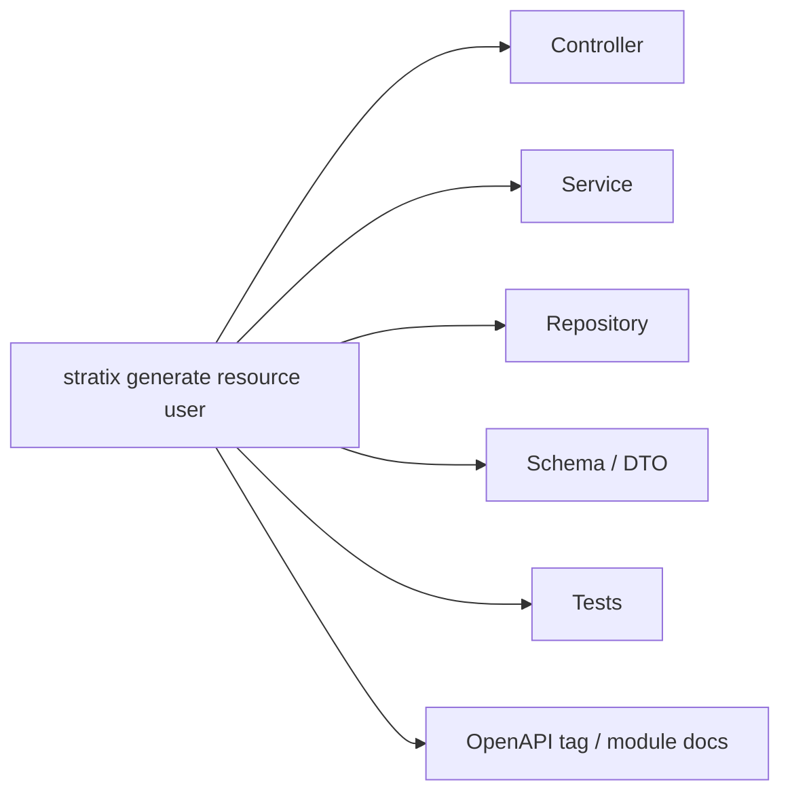

### 9.4 可观测性

生产框架必须默认支持排障。

目标：

- request id / correlation id
- structured logging
- OpenTelemetry tracing
- metrics
- health / readiness / liveness
- slow request log
- dependency startup timing
- plugin load timing
- discovery timing

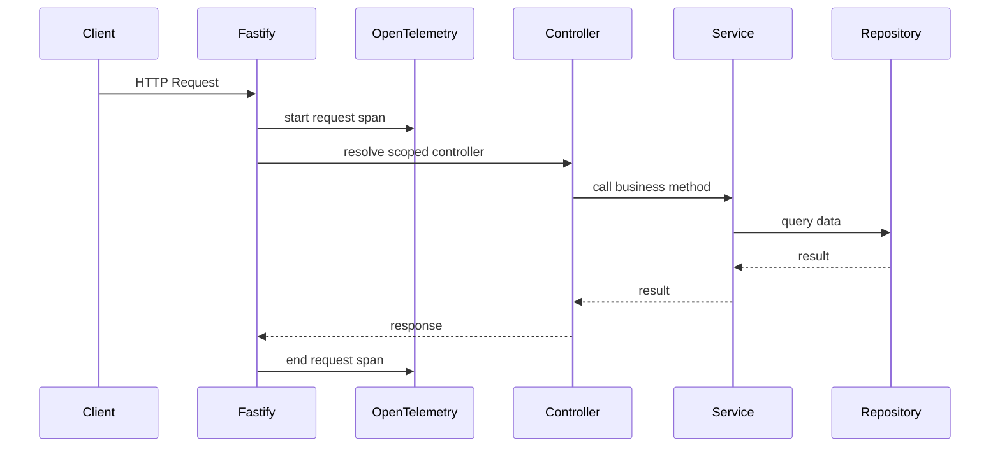

### 9.5 Database repository-first 强化

`@stratix/database` 应成为企业级后端能力中心，但应用侧仍坚持 repository-first。

方向：

- Unit of Work
- 事务上下文自动传播
- outbox pattern
- migration 管理
- repository query options 标准化
- read/write split
- multi-tenant connection provider
- health check
- slow query tracing

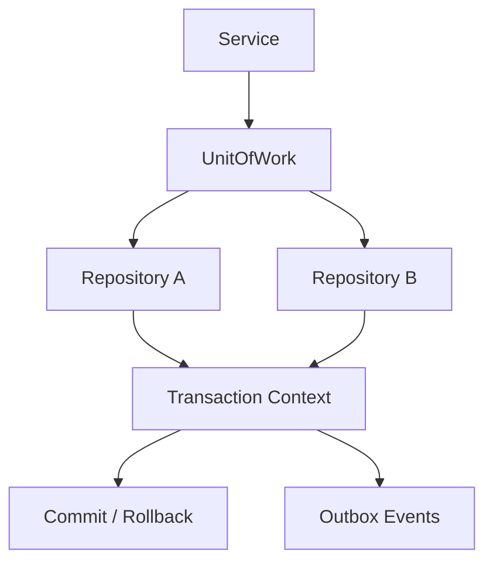

### 9.6 插件 manifest 与生态治理

插件需要能力声明、依赖校验、版本矩阵和拓扑输出。

```json
{
  "name": "@stratix/redis",
  "version": "1.1.0",
  "capabilities": ["cache", "lock", "pubsub"],
  "provides": ["redisAdapter"],
  "requires": [],
  "health": true
}
```

框架应支持：

- 校验插件依赖。
- 检查 token 冲突。
- 输出插件拓扑。
- 生成插件文档。
- 检查版本兼容矩阵。

截至 2026-06-18，插件 manifest 基线已完成：

| 能力                   | 状态                                                                           |
| ---------------------- | ------------------------------------------------------------------------------ |
| `.stratix/plugin.json` | create 在 plugin 项目中生成 name/version/capabilities/provides/requires/health |
| `doctor plugins`       | forge 校验 manifest schema、requires 依赖和 provides 重复                      |
| `graph plugins`        | forge 输出 capability/provides/requires JSON 与 Mermaid 拓扑                   |

### 9.7 安全能力标准化

安全能力应内置或 preset 化：

- CORS
- helmet / security headers
- rate limit
- auth adapter
- RBAC / ABAC
- request body limit
- input validation
- audit log
- secret redaction
- dependency security scan gate

截至 2026-06-18，core 已提供 Phase 5 security preset 基线：`config.security` 支持 body limit、CORS、security headers 和 rate limit；rate limit 返回统一错误 envelope。

### 9.8 生产 manifest 与性能

开发环境可以动态 discovery，生产环境应支持构建期 manifest，降低冷启动和大项目扫描成本。

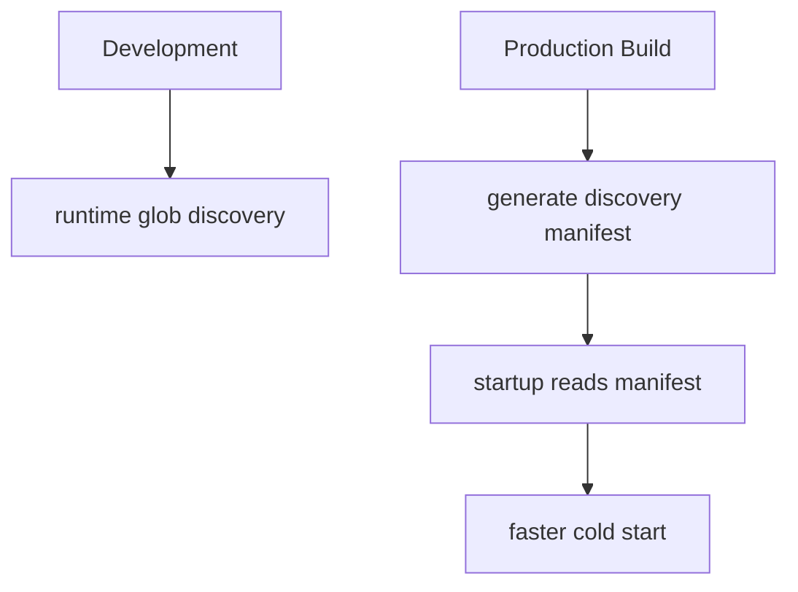

目标：

- `stratix build-manifest`
- route map manifest
- DI map manifest
- module graph manifest
- plugin manifest lock
- build artifact 校验

截至 2026-06-19，production manifest artifact、runtime consumption 与 manifest-driven registration 已完成 P2 基线：`stratix build-manifest` 默认生成 `schemaVersion: 2` 的 `.stratix/production-manifest.json`，内容包含 project、discovery、routes、DI tokens/issues、modules/moduleIssues、runtime plugin-lock、app `RegistrationPlan`、generator/runtime metadata、source hash 和可选 compiled artifact hash；`@stratix/core` 可通过 `discovery.productionManifest` 读取并校验该 artifact，在 `skipRuntimeDiscovery: true` 时跳过应用级 runtime glob discovery，并在 `registerFromManifest: true` 时优先导入 manifest 中记录的 `compiledFile` 完成 DI/路由注册，v1 manifest 继续按 `sourceFile` 兼容注册。

### 9.9 DevTools

DevTools 是差异化能力，应面向实际运营和排障：

- routes 面板
- DI graph 面板
- plugin graph 面板
- config validation 面板
- health check 面板
- traces / logs 面板
- module boundary 面板
- contract coverage 面板

不再规划 executor 状态面板，除非未来 `@stratix/tasks` 重新立项并定义新领域模型。

截至 2026-06-18，`@stratix/devtools` 已提供 Phase 5 production views：routes、DI、plugins、redacted config、health 和 traces。

## 10. 最终目标架构

```mermaid
flowchart TD
  Core["@stratix/core"] --> Bootstrap["Runtime Bootstrap"]
  Core --> Config["Config Contract"]
  Core --> DI["DI Container"]
  Core --> Discovery["Application Discovery"]
  Core --> HTTP["Controller / Route"]
  Core --> ObjectModel["Service / Repository / Component"]
  Core --> PluginProtocol["Plugin Protocol"]
  Core --> ErrorModel["Error Model"]
  Core --> TestHooks["Stable Test Hooks"]

  Create["@stratix/create"] --> Init["Create app/plugin"]
  Create --> Templates["Templates / presets"]
  Forge["@stratix/forge"] --> Generate["Generate resource/module/test"]
  Forge --> Doctor["Doctor / Graph / Routes / OpenAPI"]

  Testing["@stratix/testing"] --> TestApp["createTestApp"]
  Testing --> Override["DI override"]
  Testing --> Contract["Contract tests"]
  Testing --> Fixtures["Repository / Module fixtures"]

  Database["@stratix/database"] --> RepoFirst["Repository-first"]
  Database --> Uow["UnitOfWork / Transaction Context"]

  Ecosystem["Plugins"] --> Manifest["Plugin Manifest"]
  Ecosystem --> Health["Health / Capability / Version Matrix"]

  Tasks["@stratix/tasks"] --> Frozen["Frozen / Deprecated Candidate"]
  Executor["executor"]:::removed
  Core -.删除.-> Executor

  classDef removed fill:#fbeaea,stroke:#cc3333,color:#660000;
```

core 保留：

- `Stratix`
- `ApplicationBootstrap`
- `ApplicationDiscoveryPipeline`
- `Controller`
- `Service`
- `Repository`
- `Component`
- Route decorators
- Config schema
- Plugin protocol
- Stable test hooks
- Error model

core 删除：

- `Executor`
- executor-specific metadata
- executor discovery and registration
- executor public exports
- executor forge generation path
- executor compatibility alias or adapter

独立强化：

- `@stratix/testing`: test app、DI override、contract testing、fixtures、module fixture
- `@stratix/create`: app/plugin creation and template selection
- `@stratix/forge`: module/resource/test/openapi/doctor/graph/build/pack
- `@stratix/database`: repository-first、UnitOfWork、transaction context、outbox
- 插件生态：manifest、capability、health、version matrix
- `@stratix/tasks`: 冻结，等待独立决策

## 11. 分项评分目标

| 分项               | 当前主要问题              | 目标分 | 达标标准                                                                                                  |
| ------------------ | ------------------------- | -----: | --------------------------------------------------------------------------------------------------------- |
| 核心概念纯度       | executor 污染 core        |    95+ | core 只保留通用后端框架概念                                                                               |
| 破坏性升级一致性   | 可能保留 alias/shim       |    95+ | 无旧 API 兼容入口                                                                                         |
| discovery 可维护性 | 领域分支混入              |    95+ | discovery 只识别 controller/service/repository/component                                                  |
| DI 可诊断性        | token 问题难定位          |    95+ | doctor/graph/duplicate/cycle/missing token 可验证                                                         |
| Contract-first     | schema、OpenAPI、测试割裂 |    95+ | route schema -> validation/OpenAPI/client/contract tests                                                  |
| testing 平台       | testing 仍像辅助包        |    95+ | createTestApp/override/fixture/contract 可用                                                              |
| Module 治理        | 易误解为 runtime module   |    95+ | module.yaml/doctor/graph 落地，runtime 不依赖                                                             |
| 工具链开发体验     | create/forge 边界不清     |    95+ | `@stratix/create` 只负责创建；`@stratix/forge` 负责 resource/module/schema/test/openapi/doctor/build/pack |
| 可观测性           | 生产排障证据不足          |    95+ | traces/metrics/health/request id/slow logs                                                                |
| 插件治理           | 插件能力和依赖不透明      |    95+ | manifest/capability/topology/version matrix                                                               |
| 安全默认值         | 安全能力依赖手工拼装      |    95+ | security preset 和发布安全门                                                                              |
| 发布质量门         | 证据分散                  |    95+ | build/test/docs/security/pack/API surface 全链路证据                                                      |

## 12. 分阶段演进计划

### Phase 0：概念冻结与文档收口

目标：先统一所有人对新模型的理解。

交付：

- 完整演进方案。
- 概念模型重构计划。
- 当前状态分析同步。
- docs-stratego 校验通过。

完成条件：

- 文档明确 `executor` 从 core 删除且不兼容。
- 文档明确 `@stratix/tasks` 冻结。
- 文档明确 Module 是代码治理边界。
- 文档明确 `@stratix/testing` 独立一等公民。

### Phase 1：Core executor 删除

目标：core runtime、public API、metadata、discovery 全部摆脱 executor。

任务：

- 删除 `decorators/executor.ts`。
- 删除 `MetadataManager` executor metadata。
- 删除 `ApplicationDiscoveryPipeline` executor 分支。
- 删除 plugin AutoDI 中 executor 注册逻辑。
- 删除 core 根导出 executor API。
- 删除 executor 测试和 fixture。
- 删除 forge `generate executor` 主路径。

验收：

```bash
pnpm --filter @stratix/core exec tsc -p tsconfig.json --noEmit
CI=true pnpm --filter @stratix/core exec vitest run
pnpm --filter @stratix/core run build
rg -n "Executor|executor|EXECUTOR" packages/core/src
```

`rg` 如有生产路径命中，视为未完成。

### Phase 2：Contract-first API

目标：route schema 成为接口契约单一事实源。

任务：

- 定义 route schema 标准。
- 统一 params/query/body/headers/response 类型。
- 统一 error envelope。
- 生成 OpenAPI。
- 生成 typed client。
- contract test 使用同一份 schema。

验收：

- 示例 resource 可从 schema 生成 OpenAPI。
- route runtime validation 与文档一致，请求校验错误和 response schema failure 使用统一错误 envelope。
- `stratix openapi generate` 和 `stratix openapi client` 可用，且 forge 不依赖 `@stratix/core`。
- `@stratix/testing` `contractTest()` 能验证成功响应状态码、错误响应状态码、response schema 和共享错误 envelope schema。

### Phase 3：DI 诊断与 Module 治理

目标：大型项目能解释对象从哪里来、属于哪个模块、依赖谁。

任务：

- `stratix doctor di`
- `stratix di graph`
- `stratix generate module`
- `stratix doctor modules`
- `stratix graph modules`
- `module.yaml` schema 校验

截至 2026-06-18，Module 工程治理工具已经完成核心闭环：

| 能力                      | 状态   | 证据                                                                                                |
| ------------------------- | ------ | --------------------------------------------------------------------------------------------------- |
| `stratix generate module` | 已完成 | 生成 `src/modules/<name>/module.yaml`、controller/service/repository/schema/test 目录和模块分层代码 |
| `stratix doctor modules`  | 已完成 | 校验 `module.yaml` 必填字段、root 一致性、layer 目录、boundary owns、跨模块依赖和模块循环           |
| `stratix graph modules`   | 已完成 | 输出 JSON/Mermaid 的 module -> token -> route -> dependency 图                                      |
| runtime 隔离              | 已完成 | `module.yaml` 只被 forge 工具读取，应用 bootstrap 不读取它                                          |

验收：

- 能检测重复 token、缺失 token、循环依赖。
- 能输出 module -> token -> route -> dependency 图。
- Module 工具不改变应用启动 runtime 行为。

### Phase 4：@stratix/testing 一等平台扩展

目标：在已完成 `contractTest()` 基线之上，让应用、core、database、插件都能用同一套官方测试入口。

任务：

- `createTestApp()`
- `createTestContainer()`
- `overrideToken()`
- `mockPlugin()`
- `contractTest()`
- `createRepositoryFixture()`
- `createModuleFixture()`

截至 2026-06-18，Phase 4 testing 平台基线已经完成：

| 能力                               | 状态   | 证据                                                                                 |
| ---------------------------------- | ------ | ------------------------------------------------------------------------------------ |
| `createTestApp()`                  | 已完成 | 包装真实 `Stratix.run()` 非监听模式，支持 `app.inject`                               |
| `createTestContainer()`            | 已完成 | 创建 Awilix CLASSIC 测试容器并注册显式 provider                                      |
| `overrideToken()`                  | 已完成 | 可替换显式 provider/controller 路径中的 service、repository、component               |
| `mockPlugin()` / `disablePlugin()` | 已完成 | 可替换生态插件、注册 decorator/token，或从测试 app 中禁用插件                        |
| `createDiscoveryFixture()`         | 已完成 | 可指定隔离 discovery root/patterns/routing                                           |
| `contractTest()`                   | 已完成 | 继续复用 route contract、diagnostics 和共享错误 envelope schema                      |
| `createRepositoryFixture()`        | 已完成 | 支持 begin/rollback 与 transaction-bound repository                                  |
| `createModuleFixture()`            | 已完成 | 读取 `module.yaml` 的 root/layers/contracts/boundaries，并输出 module discovery 配置 |

验收：

```bash
pnpm --filter @stratix/testing exec tsc -p tsconfig.json --noEmit
CI=true pnpm --filter @stratix/testing exec vitest run
```

当前验证结果：

- `pnpm --filter @stratix/testing test` 通过，3 files / 12 tests。
- `pnpm --filter @stratix/testing exec tsc -p tsconfig.json --noEmit` 通过。
- `pnpm --filter @stratix/testing build` 通过。

### Phase 5：生产能力增强

目标：补齐生产级框架必须能力。

任务：

- Observability preset。
- Health/readiness/liveness。
- Plugin manifest。
- Security preset。
- Production discovery manifest。
- DevTools routes/DI/plugin/config/health/traces 面板。

验收：

- 启动日志输出 plugin load timing、discovery timing。
- health endpoint 可覆盖 core 和插件。
- manifest build 后生产启动不依赖 runtime glob。
- security preset 可纳入 release gate。

当前状态：Phase 5 已完成。Plugin manifest、Production manifest artifact、runtime manifest consumption、manifest-driven registration、Observability preset、Security preset、DevTools production views 和 `stratix release gate` 均已落地并有定向测试。

### Phase 6：95+ 质量门复核

当前状态：Phase 6 已进入开发。`@stratix/forge` 已扩展 `stratix release gate --scope workspace --dry-run`，用于在 monorepo 根目录规划 supported packages 发布准备门禁。project scope 继续校验应用级 production manifest；workspace scope 不要求 production manifest，默认扫描 `packages/*/package.json`，显式排除冻结的 `@stratix/tasks`，并规划 build/test/docs/pack/API/release-surface 检查。

Phase 6 workspace gate 可通过 `--include-offline-install` 和 `--include-registry` 把离线安装与 npm registry reconciliation 纳入发布准备计划。真实执行 workspace release-surface gate 时，supported package 必须存在 exact git tag；因此当前版本/tag/registry 未对齐会继续作为发布治理阻断，而不是被误判为已发布。

目标：用证据支撑所有分项达到 95 分以上。

证据：

- build/typecheck/test 输出。
- docs-stratego 校验输出。
- package pack 输出。
- API surface diff。
- `rg executor` 清理结果。
- OpenAPI/typed client/contract test 示例。
- DI graph/module graph 示例。
- security/observability/release gate 记录。
- workspace release gate 输出。
- offline install、git tag、npm registry reconciliation 记录。

通过条件：

- 所有分项 95+。
- 没有 executor 兼容层。
- tasks 冻结状态明确。
- Module 没有进入 runtime DI 模型。
- testing 独立包能力达到最小可用平台。
- supported packages 的 workspace release gate 有明确通过或阻断结论。

## 13. 角色分工

| 角色           | 职责                                                                   |
| -------------- | ---------------------------------------------------------------------- |
| 技术总监架构师 | 统筹概念模型、边界、评分和 code review，阻止兼容层和旧概念回流         |
| 高级框架架构师 | 设计 core/discovery/DI/contract/module/plugin 边界                     |
| 核心开发人员   | 删除 executor、实现 contract-first、DI doctor、manifest 等能力         |
| 文档开发       | 维护演进方案、开发者指南、API 文档、迁移说明、发布门禁                 |
| 高级测试经理   | 设计 testing 平台、契约测试、回归矩阵、95+ 质量门                      |
| 测试开发人员   | 实现 fixture、contract test、integration test、create/forge 端到端测试 |
| QA 人员        | 独立复核 build/test/docs/security/pack/API surface 证据                |
| 发布经理       | 管理 breaking release、支持矩阵、tasks 冻结状态、版本兼容矩阵          |

## 14. 技术总监 code review 检查点

| 节点                   | 必查项                                                                 |
| ---------------------- | ---------------------------------------------------------------------- |
| Core 删除 executor 后  | public export、metadata、discovery、plugin registration 是否还有旧概念 |
| Discovery 改完后       | 是否引入新的隐式注册分支或兼容路径                                     |
| Contract-first 设计后  | schema 是否真正驱动 validation、OpenAPI、client、contract tests        |
| DI doctor 设计后       | 是否能解释 token 来源、lifetime、scope、重复和循环依赖                 |
| Module tooling 设计后  | 是否变成 runtime module system                                         |
| Testing 平台设计后     | 是否把测试 DSL 错误塞回 core                                           |
| Plugin manifest 设计后 | 是否让插件能力声明和版本矩阵可校验                                     |
| Release gate 前        | 是否每个 95+ 评分都有证据支撑                                          |

## 15. 最终决策清单

| 编号                   | 决策                                                               | 状态     |
| ---------------------- | ------------------------------------------------------------------ | -------- |
| `ADR-CORE-CONCEPT-001` | 删除 executor                                                      | 已确认   |
| `ADR-CORE-CONCEPT-002` | 不做 executor 兼容层                                               | 已确认   |
| `ADR-CORE-CONCEPT-003` | `@stratix/tasks` 冻结/待废弃，不承接 executor                      | 已确认   |
| `ADR-CORE-CONCEPT-004` | Module 是代码治理边界，不进 runtime path                           | 已确认   |
| `ADR-CORE-CONCEPT-005` | `@stratix/testing` 保持独立包并升级为官方测试平台                  | 已确认   |
| `ADR-CORE-CONCEPT-006` | Contract-first 是下一阶段最高优先级能力                            | 建议确认 |
| `ADR-CORE-CONCEPT-007` | DI doctor 和 Module doctor 是大型项目必要能力                      | 建议确认 |
| `ADR-CORE-CONCEPT-008` | 生产 manifest、observability、security preset 进入生产级框架路线图 | 已确认   |

## 16. 完成定义

本轮演进完成必须同时满足：

1. `@stratix/core` 中 executor 完全删除，无兼容层。
2. `@stratix/tasks` 冻结状态明确，且不作为 core 删除 executor 的承接目标。
3. Module 被定义并落地为代码项目治理对象，不进入 runtime 注册模型。
4. `@stratix/testing` 具备一等测试平台的最小可用能力。
5. Contract-first API 能驱动 runtime validation、OpenAPI、typed client 和 contract tests。
6. DI doctor 和 module doctor 能给出大型项目可用的诊断证据。
7. observability、security、plugin manifest、production manifest、DevTools production views 和 release gate 有可验证的最小闭环。
8. 文档、测试、发布门禁、质量评分全部同步。
9. 每个质量分项达到 95 分以上，并有命令输出或文档证据支撑。
