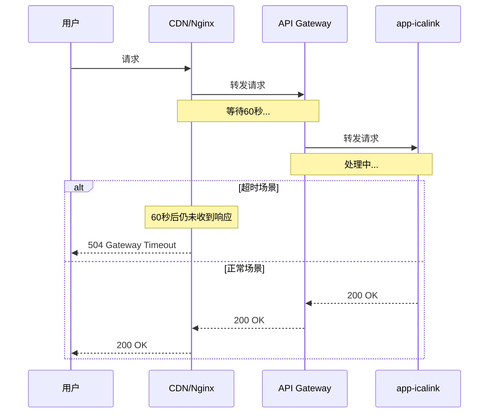
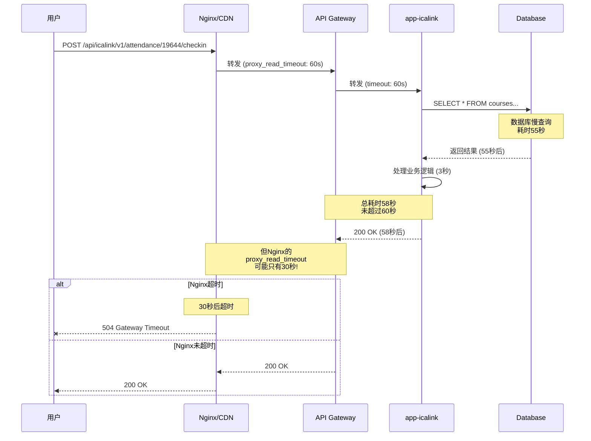
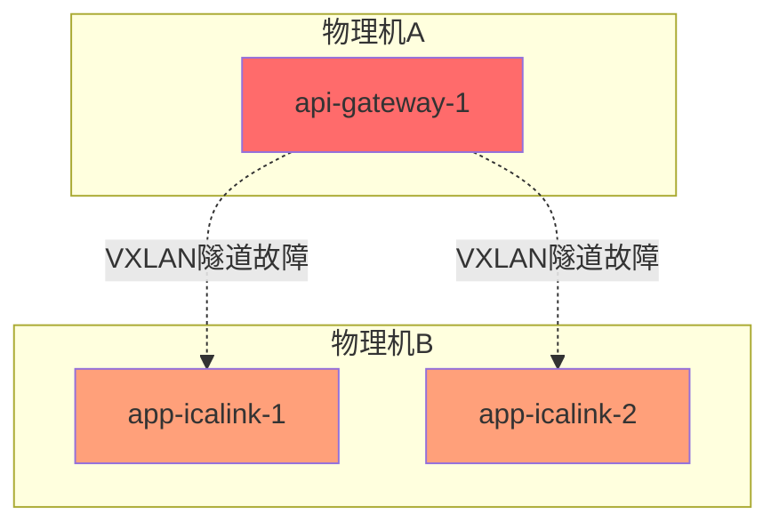

# CDN与Nginx超时错误分析

## 📋 目录

1. [CDN/Nginx 504错误详解](#1-cdnnginx-504错误详解)
2. [下游网络失败原因](#2-下游网络失败原因)
3. [错误在各层的体现](#3-错误在各层的体现)
4. [完整的错误传播链](#4-完整的错误传播链)
5. [监控和诊断](#5-监控和诊断)

---

## 1. CDN/Nginx 504错误详解

### 1.1 什么是504错误？

**504 Gateway Timeout** 表示上游服务器(网关)在规定时间内没有响应。



### 1.2 Nginx配置与504错误

**典型的Nginx配置**:

```nginx
# /etc/nginx/nginx.conf 或 /etc/nginx/sites-available/default

upstream backend {
    # 后端服务器列表
    server 47.116.161.190:8090 max_fails=3 fail_timeout=30s;
    server 120.131.12.6:8090 max_fails=3 fail_timeout=30s;
    
    # 负载均衡算法
    # ip_hash;        # 基于IP的会话保持
    # least_conn;     # 最少连接数
    # 默认: round-robin (轮询)
    
    # 健康检查
    keepalive 32;     # 保持32个长连接
}

server {
    listen 80;
    server_name kwps.jlufe.edu.cn;
    
    location /api/ {
        proxy_pass http://backend;
        
        # ⏱️ 超时配置 (关键!)
        proxy_connect_timeout 10s;    # 🔑 连接超时: 10秒
        proxy_send_timeout 60s;       # 🔑 发送超时: 60秒
        proxy_read_timeout 60s;       # 🔑 读取超时: 60秒
        
        # 如果超过这些时间,Nginx返回504
        
        # 请求头配置
        proxy_set_header Host $host;
        proxy_set_header X-Real-IP $remote_addr;
        proxy_set_header X-Forwarded-For $proxy_add_x_forwarded_for;
        proxy_set_header X-Forwarded-Proto $scheme;
        
        # 缓冲配置
        proxy_buffering on;
        proxy_buffer_size 4k;
        proxy_buffers 8 4k;
        proxy_busy_buffers_size 8k;
        
        # 错误处理
        proxy_next_upstream error timeout http_502 http_503 http_504;
        proxy_next_upstream_tries 2;    # 最多尝试2个后端
        proxy_next_upstream_timeout 10s; # 总超时时间
    }
    
    # 错误页面
    error_page 502 503 504 /50x.html;
    location = /50x.html {
        root /usr/share/nginx/html;
    }
}
```

### 1.3 504错误触发条件

**Nginx返回504的3种情况**:

#### 情况1: proxy_connect_timeout 超时

```nginx
proxy_connect_timeout 10s;  # 连接后端超时

# 场景:
用户请求 -> Nginx -> 尝试连接 47.116.161.190:8090
-> 10秒内无法建立TCP连接
-> Nginx返回 504 Gateway Timeout

# 原因:
- 后端服务器宕机
- 网络不通
- 防火墙阻止
- 后端服务器负载过高,无法接受新连接
```

**日志示例**:

```
2025/10/24 05:59:39 [error] 12345#12345: *67890 upstream timed out (110: Connection timed out) 
while connecting to upstream, 
client: 42.xxx.xxx.xxx, 
server: kwps.jlufe.edu.cn, 
request: "POST /api/icalink/v1/attendance/19644/checkin HTTP/1.1", 
upstream: "http://47.116.161.190:8090/api/icalink/v1/attendance/19644/checkin", 
host: "kwps.jlufe.edu.cn"
```

#### 情况2: proxy_read_timeout 超时

```nginx
proxy_read_timeout 60s;  # 读取响应超时

# 场景:
用户请求 -> Nginx -> 成功连接到后端
-> 后端开始处理请求
-> 60秒内没有返回完整响应
-> Nginx返回 504 Gateway Timeout

# 原因:
- 后端处理慢 (数据库查询慢、复杂计算)
- 后端卡死 (死锁、无限循环)
- 后端资源耗尽 (CPU 100%, 内存不足)
```

**日志示例**:

```
2025/10/24 05:59:39 [error] 12345#12345: *67890 upstream timed out (110: Connection timed out) 
while reading response header from upstream, 
client: 42.xxx.xxx.xxx, 
server: kwps.jlufe.edu.cn, 
request: "POST /api/icalink/v1/attendance/19644/checkin HTTP/1.1", 
upstream: "http://47.116.161.190:8090/api/icalink/v1/attendance/19644/checkin", 
host: "kwps.jlufe.edu.cn"
```

#### 情况3: proxy_send_timeout 超时

```nginx
proxy_send_timeout 60s;  # 发送请求超时

# 场景:
用户请求 -> Nginx -> 尝试发送请求体到后端
-> 60秒内无法发送完整请求
-> Nginx返回 504 Gateway Timeout

# 原因:
- 上传大文件时,后端接收慢
- 网络带宽不足
- 后端TCP接收缓冲区满
```

### 1.4 网络压力大时的504错误

**高并发场景下的504错误**:

```
场景: 签到高峰期 (1000个学生同时签到)

T0: 正常流量 50 QPS
    Nginx -> API Gateway -> app-icalink
    响应时间: 100ms
    
T1: 突发流量 500 QPS (上课铃响,学生开始签到)
    Nginx -> API Gateway (连接池: 32个长连接)
    -> 32个请求立即转发
    -> 468个请求在Nginx排队
    
T2: API Gateway处理慢
    -> 每个请求耗时从100ms增加到5000ms
    -> 32个连接被占用
    -> 新请求无法获得连接
    
T3: 排队的请求等待超过10秒
    -> proxy_connect_timeout 触发
    -> Nginx返回 504 Gateway Timeout ❌
    
T4: 即使后端恢复正常
    -> 大量504错误已经返回给用户
    -> 用户体验极差
```

**资源耗尽导致的504**:

```
场景: API Gateway资源耗尽

T0: API Gateway正常运行
    CPU: 30%, 内存: 400MB
    
T1: 大量请求涌入
    CPU: 80%, 内存: 600MB
    处理速度下降
    
T2: 资源继续上升
    CPU: 98%, 内存: 650MB
    under-pressure触发,返回503
    
T3: Nginx收到503
    proxy_next_upstream配置: http_503
    -> 尝试下一个后端服务器
    
T4: 所有后端都返回503
    -> Nginx无可用后端
    -> 返回 502 Bad Gateway 或 504 Gateway Timeout
```

---

## 2. 下游网络失败原因

### 2.1 网络层失败原因

**7种常见的网络失败**:

#### 1. TCP连接失败 (ECONNREFUSED)

```bash
# 原因: 后端服务未启动或端口未监听
api-gateway尝试连接 app-icalink:3000
-> TCP SYN包发送
-> 收到 RST (Reset) 包
-> ECONNREFUSED错误

# 日志:
Error: connect ECONNREFUSED 10.0.1.101:3000
    at TCPConnectWrap.afterConnect [as oncomplete] (net.js:1148:16)
```

#### 2. 连接超时 (ETIMEDOUT)

```bash
# 原因: 网络不通、防火墙阻止、服务器宕机
api-gateway尝试连接 app-icalink:3000
-> TCP SYN包发送
-> 等待75秒 (Linux默认超时)
-> 没有收到SYN-ACK
-> ETIMEDOUT错误

# 日志:
Error: connect ETIMEDOUT 10.0.1.101:3000
    at TCPConnectWrap.afterConnect [as oncomplete] (net.js:1148:16)
```

#### 3. 网络不可达 (ENETUNREACH)

```bash
# 原因: 路由问题、网络分区
api-gateway尝试连接 app-icalink:3000
-> 查找路由表
-> 没有到达目标网络的路由
-> ENETUNREACH错误

# 日志:
Error: connect ENETUNREACH 10.0.1.101:3000
```

#### 4. 主机不可达 (EHOSTUNREACH)

```bash
# 原因: 目标主机关机、网络隔离
api-gateway尝试连接 app-icalink:3000
-> ARP解析失败或路由器返回ICMP Host Unreachable
-> EHOSTUNREACH错误

# 日志:
Error: connect EHOSTUNREACH 10.0.1.101:3000
```

#### 5. 连接重置 (ECONNRESET)

```bash
# 原因: 连接建立后,对方强制关闭
api-gateway -> app-icalink (连接已建立)
-> 发送HTTP请求
-> app-icalink进程崩溃或被kill
-> 收到 RST 包
-> ECONNRESET错误

# 日志:
Error: read ECONNRESET
    at TCP.onStreamRead (internal/stream_base_commons.js:209:20)
```

#### 6. 管道破裂 (EPIPE)

```bash
# 原因: 写入已关闭的连接
api-gateway -> app-icalink (连接已建立)
-> app-icalink关闭连接
-> api-gateway继续写入数据
-> EPIPE错误

# 日志:
Error: write EPIPE
```

#### 7. DNS解析失败 (ENOTFOUND)

```bash
# 原因: 服务名无法解析
api-gateway尝试连接 app-icalink:3000
-> DNS查询 "app-icalink"
-> Docker Swarm DNS无响应或返回NXDOMAIN
-> ENOTFOUND错误

# 日志:
Error: getaddrinfo ENOTFOUND app-icalink
```

### 2.2 应用层失败原因

#### 1. HTTP超时

```typescript
// api-gateway配置
{
  upstream: "http://app-icalink:3000",
  timeout: 60000  // 60秒
}

// 场景:
api-gateway -> app-icalink
-> 等待60秒
-> 没有收到完整HTTP响应
-> 超时错误

// 错误:
Error: Request timeout
```

#### 2. HTTP错误响应

```typescript
// app-icalink返回错误
500 Internal Server Error
502 Bad Gateway
503 Service Unavailable
504 Gateway Timeout

// api-gateway处理:
if (response.statusCode >= 500) {
  // 计入熔断器失败次数
  circuitBreaker.recordFailure();
}
```

#### 3. 响应体解析失败

```typescript
// 场景: app-icalink返回非JSON数据
api-gateway -> app-icalink
<- 200 OK
<- Content-Type: application/json
<- Body: "<!DOCTYPE html>..." (实际是HTML)

// 解析失败:
Error: Unexpected token < in JSON at position 0
```

### 2.3 Docker Swarm网络失败

#### 1. Overlay网络问题

```bash
# 原因: VXLAN隧道故障
物理机A的api-gateway -> 物理机B的app-icalink
-> VXLAN封装失败
-> 网络不通

# 诊断:
docker network inspect obsync-overlay
# 检查Peers列表,确认所有节点都在网络中
```

#### 2. 服务发现失败

```bash
# 原因: Docker Swarm DNS故障
api-gateway查询 "app-icalink"
-> Docker内部DNS (127.0.0.11:53)
-> DNS服务异常
-> 解析失败

# 诊断:
docker exec <container_id> nslookup app-icalink
docker exec <container_id> dig app-icalink
```

#### 3. 负载均衡器故障

```bash
# 原因: IPVS规则异常
api-gateway -> VIP (10.0.1.100)
-> IPVS查找后端
-> 所有后端都标记为不健康
-> 连接失败

# 诊断:
ipvsadm -Ln  # 查看IPVS规则
```

---

## 3. 错误在各层的体现

### 3.1 在Nginx/CDN层的体现

**Nginx错误日志**:

```bash
# 位置: /var/log/nginx/error.log

# 1. 连接超时
2025/10/24 05:59:39 [error] 12345#12345: *67890 upstream timed out (110: Connection timed out) 
while connecting to upstream

# 2. 读取超时
2025/10/24 05:59:39 [error] 12345#12345: *67890 upstream timed out (110: Connection timed out) 
while reading response header from upstream

# 3. 连接被拒绝
2025/10/24 05:59:39 [error] 12345#12345: *67890 connect() failed (111: Connection refused) 
while connecting to upstream

# 4. 后端返回错误
2025/10/24 05:59:39 [error] 12345#12345: *67890 upstream prematurely closed connection 
while reading response header from upstream
```

**Nginx访问日志**:

```bash
# 位置: /var/log/nginx/access.log

# 正常请求
42.xxx.xxx.xxx - - [24/Oct/2025:05:59:38 +0800] "POST /api/icalink/v1/attendance/19644/checkin HTTP/1.1" 200 156 "-" "Mozilla/5.0"

# 504错误
42.xxx.xxx.xxx - - [24/Oct/2025:05:59:39 +0800] "POST /api/icalink/v1/attendance/19644/checkin HTTP/1.1" 504 167 "-" "Mozilla/5.0"

# 502错误
42.xxx.xxx.xxx - - [24/Oct/2025:05:59:40 +0800] "POST /api/icalink/v1/attendance/19644/checkin HTTP/1.1" 502 173 "-" "Mozilla/5.0"

# 503错误
42.xxx.xxx.xxx - - [24/Oct/2025:05:59:41 +0800] "POST /api/icalink/v1/attendance/19644/checkin HTTP/1.1" 503 185 "-" "Mozilla/5.0"
```

**Nginx状态监控**:

```nginx
# 启用stub_status模块
location /nginx_status {
    stub_status on;
    access_log off;
    allow 127.0.0.1;
    deny all;
}

# 输出:
Active connections: 291
server accepts handled requests
 16630948 16630948 31070465
Reading: 6 Writing: 179 Waiting: 106

# 关键指标:
# Active connections: 当前活跃连接数
# Writing: 正在写响应的连接数 (如果持续很高,说明后端慢)
# Waiting: 空闲的keepalive连接数
```

### 3.2 在API Gateway层的体现

**Fastify日志**:

```json
// 正常请求
{
  "level": 30,
  "time": "2025-10-24T05:59:38.500Z",
  "pid": 1,
  "env": "production",
  "name": "stratix-app",
  "reqId": "req-13cb",
  "req": {
    "method": "POST",
    "url": "/api/icalink/v1/attendance/19644/checkin",
    "remoteAddress": "42.xxx.xxx.xxx"
  },
  "res": {
    "statusCode": 200
  },
  "responseTime": 156.78,
  "msg": "request completed"
}

// 超时错误
{
  "level": 50,
  "time": "2025-10-24T05:59:39.714Z",
  "pid": 1,
  "env": "production",
  "name": "stratix-app",
  "reqId": "req-13cc",
  "err": {
    "type": "Error",
    "message": "Request timeout",
    "stack": "Error: Request timeout\n    at Timeout._onTimeout (/app/node_modules/@fastify/http-proxy/index.js:234:21)"
  },
  "msg": "Unhandled error"
}

// 连接失败
{
  "level": 50,
  "time": "2025-10-24T05:59:40.418Z",
  "pid": 1,
  "env": "production",
  "name": "stratix-app",
  "reqId": "req-13cd",
  "err": {
    "type": "Error",
    "message": "connect ECONNREFUSED 10.0.1.101:3000",
    "code": "ECONNREFUSED",
    "errno": -111,
    "syscall": "connect",
    "address": "10.0.1.101",
    "port": 3000
  },
  "msg": "Proxy error"
}

// 熔断器打开
{
  "level": 50,
  "time": "2025-10-24T05:59:41.564Z",
  "pid": 1,
  "env": "production",
  "name": "stratix-app",
  "reqId": "req-13ce",
  "err": {
    "type": "FastifyError",
    "message": "服务暂时不可用，请稍后再试",
    "code": "FST_ERR_CIRCUIT_BREAKER_OPEN",
    "statusCode": 503
  },
  "msg": "Circuit breaker opened"
}
```

**错误处理代码**:

```typescript
// apps/api-gateway/src/hooks.ts

// HTTP代理错误处理
{
  onError: async (reply, error) => {
    const errorInfo = {
      message: error.message,
      code: error.code,
      statusCode: error.statusCode
    };
    
    instance.log.error({
      service: name,
      error: errorInfo,
      url: reply.request.url
    }, `Proxy error for service ${name}`);
    
    // 根据错误类型返回不同状态码
    if (error.code === 'ECONNREFUSED') {
      reply.code(503).send({
        error: 'Service Unavailable',
        message: '服务暂时不可用'
      });
    } else if (error.code === 'ETIMEDOUT' || error.message.includes('timeout')) {
      reply.code(504).send({
        error: 'Gateway Timeout',
        message: '请求超时'
      });
    } else {
      reply.code(502).send({
        error: 'Bad Gateway',
        message: '网关错误'
      });
    }
  }
}
```

### 3.3 在app-icalink层的体现

**应用日志**:

```json
// 正常处理
{
  "level": 30,
  "time": "2025-10-24T05:59:38.450Z",
  "pid": 1,
  "name": "app-icalink",
  "reqId": "req-abc123",
  "msg": "Processing checkin request",
  "courseId": 19644,
  "studentId": 12345
}

// 数据库查询慢
{
  "level": 40,
  "time": "2025-10-24T05:59:39.500Z",
  "pid": 1,
  "name": "app-icalink",
  "reqId": "req-abc124",
  "msg": "Slow query detected",
  "query": "SELECT * FROM courses WHERE id = ?",
  "duration": 5234.56
}

// 内存压力
{
  "level": 40,
  "time": "2025-10-24T05:59:40.000Z",
  "pid": 1,
  "name": "app-icalink",
  "msg": "High memory usage",
  "heapUsed": 1150000000,
  "heapTotal": 1400000000,
  "rss": 1350000000
}

// under-pressure触发
{
  "level": 50,
  "time": "2025-10-24T05:59:40.500Z",
  "pid": 1,
  "name": "app-icalink",
  "reqId": "req-abc125",
  "msg": "Service under pressure",
  "type": "heapUsedBytes",
  "value": 1260000000,
  "limit": 1200000000
}
```

**健康检查失败**:

```bash
# Docker健康检查日志
docker service ps obsync_app-icalink

# 输出:
ID             NAME                  IMAGE           NODE    DESIRED STATE  CURRENT STATE
abc123         app-icalink.1         app-icalink:v1  node1   Running        Running 5 minutes ago
def456         app-icalink.2         app-icalink:v1  node2   Running        Starting 30 seconds ago (health: starting)
ghi789         app-icalink.3         app-icalink:v1  node1   Shutdown       Failed 1 minute ago "task: non-zero exit (137)"

# 健康检查失败原因:
# 1. 健康检查端点返回503
# 2. 健康检查超时 (> 10秒)
# 3. 容器OOM被kill (exit code 137)
```

---

## 4. 完整的错误传播链

### 4.1 场景1: 数据库慢导致的504



**关键点**:
- Nginx超时 < API Gateway超时 < app-icalink处理时间
- 即使后端返回成功,Nginx也可能已经超时

### 4.2 场景2: 网络分区导致的连接失败



**错误流程**:

```
T0: 物理机A和B之间网络故障
    -> VXLAN隧道中断
    
T1: api-gateway-1尝试连接app-icalink
    -> DNS解析: app-icalink -> 10.0.1.100 (VIP)
    -> IPVS选择: 10.0.1.101 (app-icalink-1, 在物理机B)
    -> 尝试建立TCP连接
    -> ETIMEDOUT (75秒后)
    
T2: api-gateway记录失败
    -> 失败计数 +1
    -> 返回 504 Gateway Timeout
    
T3: 连续20次失败
    -> 熔断器打开
    -> 返回 503 Service Unavailable
```

### 4.3 场景3: 资源耗尽的级联失败

```
T0: 正常状态
    Nginx: 活跃连接 50
    API Gateway: CPU 30%, 内存 400MB
    app-icalink: CPU 40%, 内存 600MB
    
T1: 突发流量 (500 QPS)
    Nginx: 活跃连接 500
    API Gateway: CPU 80%, 内存 600MB
    app-icalink: CPU 90%, 内存 1000MB
    
T2: app-icalink压力增大
    -> 响应时间从100ms增加到5000ms
    -> API Gateway请求堆积
    -> API Gateway内存上升到650MB
    
T3: API Gateway触发under-pressure
    -> 返回503 "Service under pressure"
    -> Nginx收到503
    -> proxy_next_upstream尝试下一个后端
    
T4: 所有API Gateway都返回503
    -> Nginx无可用后端
    -> 返回502 Bad Gateway
    
T5: 用户大量重试
    -> 流量进一步增加
    -> 雪崩效应 ❌
```

---

## 5. 监控和诊断

### 5.1 Nginx监控

**关键指标**:

```bash
# 1. 活跃连接数
curl http://localhost/nginx_status
# Active connections: 291

# 2. 错误日志统计
tail -f /var/log/nginx/error.log | grep -E "timeout|refused|failed"

# 3. 504错误统计
awk '$9 == 504' /var/log/nginx/access.log | wc -l

# 4. 响应时间分析
awk '{print $NF}' /var/log/nginx/access.log | sort -n | tail -100
```

### 5.2 API Gateway监控

**添加监控端点**:

```typescript
// apps/api-gateway/src/routes/metrics.ts
export const metricsRoute = async (fastify: FastifyInstance) => {
  fastify.get('/metrics', async (request, reply) => {
    const metrics = {
      timestamp: new Date().toISOString(),
      uptime: process.uptime(),
      memory: process.memoryUsage(),
      cpu: process.cpuUsage(),
      
      // 熔断器状态
      circuitBreaker: {
        state: 'CLOSED', // 需要从熔断器获取
        failureCount: 0
      },
      
      // 请求统计
      requests: {
        total: 0,
        success: 0,
        failed: 0,
        errorRate: 0
      }
    };
    
    return reply.send(metrics);
  });
};
```

### 5.3 诊断命令

**网络诊断**:

```bash
# 1. 测试连接
docker exec <api-gateway-container> curl -v http://app-icalink:3000/health

# 2. DNS解析
docker exec <api-gateway-container> nslookup app-icalink
docker exec <api-gateway-container> dig app-icalink

# 3. 网络延迟
docker exec <api-gateway-container> ping -c 10 app-icalink

# 4. 路由追踪
docker exec <api-gateway-container> traceroute app-icalink

# 5. TCP连接测试
docker exec <api-gateway-container> nc -zv app-icalink 3000
```

**Docker Swarm诊断**:

```bash
# 1. 服务状态
docker service ps obsync_api-gateway
docker service ps obsync_app-icalink

# 2. 网络检查
docker network inspect obsync-overlay

# 3. IPVS规则
ipvsadm -Ln

# 4. 容器日志
docker service logs obsync_api-gateway --tail 100
docker service logs obsync_app-icalink --tail 100
```

---

## 6. 总结

### 6.1 504错误的根本原因

| 层级 | 超时配置 | 触发条件 |
|------|---------|---------|
| **Nginx** | proxy_read_timeout: 60s | 后端60秒内未响应 |
| **API Gateway** | timeout: 60s | app-icalink 60秒内未响应 |
| **app-icalink** | requestTimeout: 60s | 请求处理超过60秒 |

### 6.2 网络失败的常见原因

1. **连接失败**: ECONNREFUSED, ETIMEDOUT
2. **网络不通**: ENETUNREACH, EHOSTUNREACH
3. **连接中断**: ECONNRESET, EPIPE
4. **DNS失败**: ENOTFOUND
5. **资源耗尽**: under-pressure触发

### 6.3 优化建议

1. **统一超时配置**: Nginx > API Gateway > app-icalink
2. **添加重试机制**: proxy_next_upstream
3. **健康检查**: 及时剔除不健康实例
4. **监控告警**: 实时监控504/503错误率
5. **优雅降级**: 熔断器 + 缓存

---

**文档版本**: v1.0  
**最后更新**: 2025-10-24  
**作者**: Stratix Team

