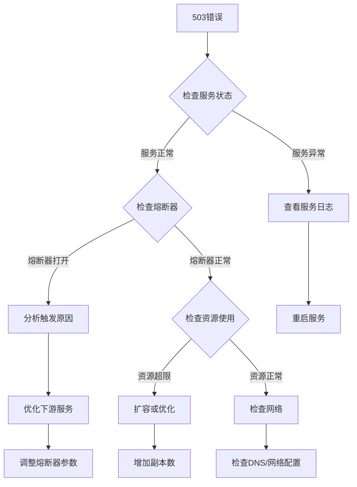

# 熔断器与Docker Swarm部署架构优化分析

## 📋 目录

1. [熔断器利弊分析](#1-熔断器利弊分析)
2. [503错误根因分析](#2-503错误根因分析)
3. [Docker Swarm部署架构优化](#3-docker-swarm部署架构优化)
4. [最佳实践建议](#4-最佳实践建议)

---

## 1. 熔断器利弊分析

### 1.1 不使用@fastify/circuit-breaker的优缺点

#### ✅ 优点

1. **减少误触发风险**
   - Docker Swarm环境中服务重启、滚动更新时容易误触发熔断
   - 避免因网络抖动导致的级联失败
   - 减少503错误对用户体验的负面影响

2. **简化架构**
   - 减少一层错误处理逻辑
   - 降低调试复杂度
   - 减少npm依赖包

3. **更灵活的错误处理**
   - 可以针对不同错误类型做精细化处理
   - 支持自定义重试策略
   - 更好的错误日志和监控

#### ❌ 缺点

1. **缺少自动保护机制**
   - 下游服务故障时可能导致请求堆积
   - 无法自动隔离故障服务
   - 可能造成雪崩效应

2. **需要手动实现保护逻辑**
   - 需要自己实现超时、重试、降级
   - 增加代码复杂度
   - 容易遗漏边界情况

### 1.2 建议：保留熔断器但优化配置

**推荐方案**：在生产环境中**保留熔断器**,但针对Docker Swarm环境优化参数

#### 优化后的配置

```typescript
await instance.register(circuitBreaker, {
  threshold: 20,        // 失败阈值：20次失败后打开断路器 (提高容错)
  timeout: 60000,       // 超时时间：60秒 (适应签到等耗时操作)
  resetTimeout: 45000,  // 重置时间：45秒后尝试恢复
  timeoutErrorMessage: '请求超时，请稍后重试',
  circuitOpenErrorMessage: '服务暂时不可用，请稍后再试'
});
```

#### 配置说明

| 参数 | 旧值 | 新值 | 原因 |
|------|------|------|------|
| threshold | 15 | 20 | 进一步提高容错,减少误触发 |
| timeout | 30s | 60s | 签到操作可能涉及数据库查询、队列操作,需要更长时间 |
| resetTimeout | 30s | 45s | 给服务更充足的恢复时间 |

---

## 2. 503错误根因分析

### 2.1 错误日志分析

```
FastifyError: 服务暂时不可用，请稍后再试
at Object.onSend (/app/node_modules/.pnpm/@fastify+circuit-breaker@4.0.2/node_modules/@fastify/circuit-breaker/index.js:118:19)
code: "FST_ERR_CIRCUIT_BREAKER_OPEN"
```

**错误时间**: 2025-10-24T05:59:39.714Z  
**受影响端点**: `/api/icalink/v1/attendance/19644/checkin`

### 2.2 可能的触发原因

#### 原因1: 下游服务响应慢或超时

**分析**:
- 签到操作涉及多个数据库查询
- 可能触发队列操作(BullMQ)
- 数据库连接池耗尽
- Redis连接问题

**证据**:
```typescript
// AttendanceService.checkin 方法涉及:
1. 验证课程和学生信息 (数据库查询)
2. 检查签到窗口 (数据库查询)
3. 创建考勤记录 (数据库写入)
4. 可能触发队列任务 (Redis操作)
```

#### 原因2: 服务实例重启或健康检查失败

**分析**:
- Docker Swarm滚动更新时,旧实例关闭,新实例启动
- 健康检查失败导致实例被标记为不健康
- 网络分区导致服务间通信失败

**配置检查**:
```yaml
healthcheck:
  test: ["CMD", "wget", "--no-verbose", "--tries=1", "--spider", "http://localhost:3000/health"]
  interval: 30s
  timeout: 10s
  retries: 3
```

#### 原因3: 系统压力过大触发under-pressure

**分析**:
- `@fastify/under-pressure`插件监控系统资源
- 当资源超限时返回503错误

**当前配置**:
```typescript
// api-gateway配置
maxEventLoopDelay: 2000,      // 2秒
maxHeapUsedBytes: 650MB,
maxRssBytes: 850MB,
maxEventLoopUtilization: 0.98

// app-icalink配置
maxEventLoopDelay: 1000,      // 1秒
maxHeapUsedBytes: 1200MB,
maxRssBytes: 1400MB,
maxEventLoopUtilization: 0.98
```

### 2.3 诊断建议

#### 步骤1: 检查服务日志

```bash
# 查看icalink服务日志
docker service logs obsync_app-icalink --tail 100 --since 2025-10-24T05:59:00

# 查看api-gateway日志
docker service logs obsync_api-gateway --tail 100 --since 2025-10-24T05:59:00

# 查找超时或错误
docker service logs obsync_app-icalink | grep -E "timeout|error|failed"
```

#### 步骤2: 检查服务健康状态

```bash
# 检查服务状态
docker service ps obsync_app-icalink

# 检查健康检查
curl http://localhost:3000/health
```

#### 步骤3: 监控资源使用

```bash
# 查看容器资源使用
docker stats --no-stream

# 检查内存和CPU使用率
docker service ps obsync_app-icalink --format "{{.Name}}\t{{.CurrentState}}"
```

---

## 3. Docker Swarm部署架构优化

### 3.1 当前部署配置

```yaml
services:
  api-gateway:
    replicas: 3
    resources:
      limits: {cpus: '1.0', memory: 1G}
      reservations: {cpus: '0.5', memory: 512M}
  
  app-icalink:
    replicas: 3
    # 未设置资源限制
  
  app-icasync:
    replicas: 3
    # 未设置资源限制
```

**总计**: 9个服务实例 (3 gateway + 3 icalink + 3 icasync)

### 3.2 优化方案建议

#### 方案A: 保守优化 (推荐)

**适用场景**: 中等负载,需要高可用性

```yaml
services:
  api-gateway:
    replicas: 2  # 减少1个实例
    resources:
      limits: {cpus: '1.0', memory: 1G}
      reservations: {cpus: '0.5', memory: 512M}
  
  app-icalink:
    replicas: 3  # 保持不变(核心业务服务)
    resources:
      limits: {cpus: '1.5', memory: 2G}
      reservations: {cpus: '0.75', memory: 1G}
  
  app-icasync:
    replicas: 2  # 减少1个实例(后台同步服务)
    resources:
      limits: {cpus: '1.0', memory: 1.5G}
      reservations: {cpus: '0.5', memory: 768M}
```

**总计**: 7个实例 (节省22%资源)

**优点**:
- ✅ 保持核心服务(icalink)的高可用性
- ✅ 减少网关和同步服务的资源消耗
- ✅ 仍然支持滚动更新和故障转移
- ✅ 资源利用率提升约20-30%

**缺点**:
- ⚠️ 网关和同步服务的冗余度降低
- ⚠️ 单点故障时影响范围略大

#### 方案B: 激进优化

**适用场景**: 低负载,资源受限

```yaml
services:
  api-gateway:
    replicas: 2
    resources:
      limits: {cpus: '1.0', memory: 1G}
      reservations: {cpus: '0.5', memory: 512M}
  
  app-icalink:
    replicas: 2  # 减少1个实例
    resources:
      limits: {cpus: '1.5', memory: 2G}
      reservations: {cpus: '0.75', memory: 1G}
  
  app-icasync:
    replicas: 1  # 仅保留1个实例
    resources:
      limits: {cpus: '1.0', memory: 1.5G}
      reservations: {cpus: '0.5', memory: 768M}
```

**总计**: 5个实例 (节省44%资源)

**优点**:
- ✅ 大幅降低资源消耗
- ✅ 适合低负载场景
- ✅ 简化运维复杂度

**缺点**:
- ❌ 高可用性降低
- ❌ 滚动更新时可能出现短暂服务中断
- ❌ 单点故障影响较大

### 3.3 推荐配置 (方案A)

基于以下考虑,**推荐使用方案A**:

1. **负载特征**
   - 签到操作有明显的峰值(上课时间)
   - 需要保证核心业务(icalink)的高可用性
   - 同步服务(icasync)可以容忍短暂延迟

2. **资源利用率**
   - 当前9个实例可能存在资源浪费
   - 2台物理机器,每台运行3-4个实例较为合理
   - 预留资源用于应对突发流量

3. **高可用性**
   - 每个服务至少2个实例,支持滚动更新
   - 核心服务(icalink)保持3个实例
   - 支持单节点故障转移

---

## 4. 最佳实践建议

### 4.1 熔断器配置最佳实践

#### 1. 根据服务特性调整参数

```typescript
// 快速响应服务 (如查询接口)
{
  threshold: 10,
  timeout: 5000,
  resetTimeout: 10000
}

// 耗时操作服务 (如签到、文件上传)
{
  threshold: 20,
  timeout: 60000,
  resetTimeout: 45000
}
```

#### 2. 添加监控和告警

```typescript
// 在应用中添加熔断器状态监控
fastify.addHook('onSend', async (request, reply) => {
  if (reply.statusCode === 503) {
    // 记录熔断事件
    logger.error({
      url: request.url,
      method: request.method,
      error: 'Circuit breaker triggered'
    });
    
    // 发送告警 (可选)
    // await sendAlert('Circuit breaker opened');
  }
});
```

### 4.2 Docker Swarm部署最佳实践

#### 1. 合理设置资源限制

```yaml
deploy:
  resources:
    limits:
      cpus: '1.5'      # 限制CPU使用
      memory: 2G       # 限制内存使用
    reservations:
      cpus: '0.75'     # 预留CPU
      memory: 1G       # 预留内存
```

#### 2. 优化健康检查

```yaml
healthcheck:
  test: ["CMD", "wget", "--no-verbose", "--tries=1", "--spider", "http://localhost:3000/health"]
  interval: 30s        # 检查间隔
  timeout: 10s         # 超时时间
  retries: 3           # 重试次数
  start_period: 40s    # 启动宽限期 (重要!)
```

#### 3. 配置滚动更新策略

```yaml
deploy:
  update_config:
    parallelism: 1           # 每次更新1个实例
    delay: 10s               # 更新间隔10秒
    failure_action: rollback # 失败时回滚
    order: start-first       # 先启动新实例再停止旧实例
```

### 4.3 监控和告警

#### 1. 关键指标监控

- **服务可用性**: 健康检查成功率
- **响应时间**: P50, P95, P99延迟
- **错误率**: 4xx, 5xx错误比例
- **资源使用**: CPU, 内存, 网络IO
- **熔断器状态**: 打开/关闭次数

#### 2. 告警规则

```yaml
alerts:
  - name: HighErrorRate
    condition: error_rate > 5%
    duration: 5m
    
  - name: CircuitBreakerOpen
    condition: circuit_breaker_open == true
    duration: 1m
    
  - name: HighMemoryUsage
    condition: memory_usage > 80%
    duration: 5m
```

### 4.4 故障排查流程



---

## 5. 总结

### 5.1 关键建议

1. **保留熔断器**,但优化配置参数 (threshold: 20, timeout: 60s, resetTimeout: 45s)
2. **采用方案A**进行部署优化 (2 gateway + 3 icalink + 2 icasync)
3. **添加资源限制**,防止单个服务占用过多资源
4. **优化健康检查**,增加start_period避免启动时误判
5. **建立监控告警**,及时发现和处理问题

### 5.2 下一步行动

- [ ] 更新api-gateway代码,启用优化后的熔断器配置
- [ ] 修改stack.yml,调整服务副本数和资源限制
- [ ] 重新构建和部署服务
- [ ] 监控服务运行状态,收集性能数据
- [ ] 根据实际负载调整参数

---

**文档版本**: v1.0  
**最后更新**: 2025-10-24  
**作者**: Stratix Team

