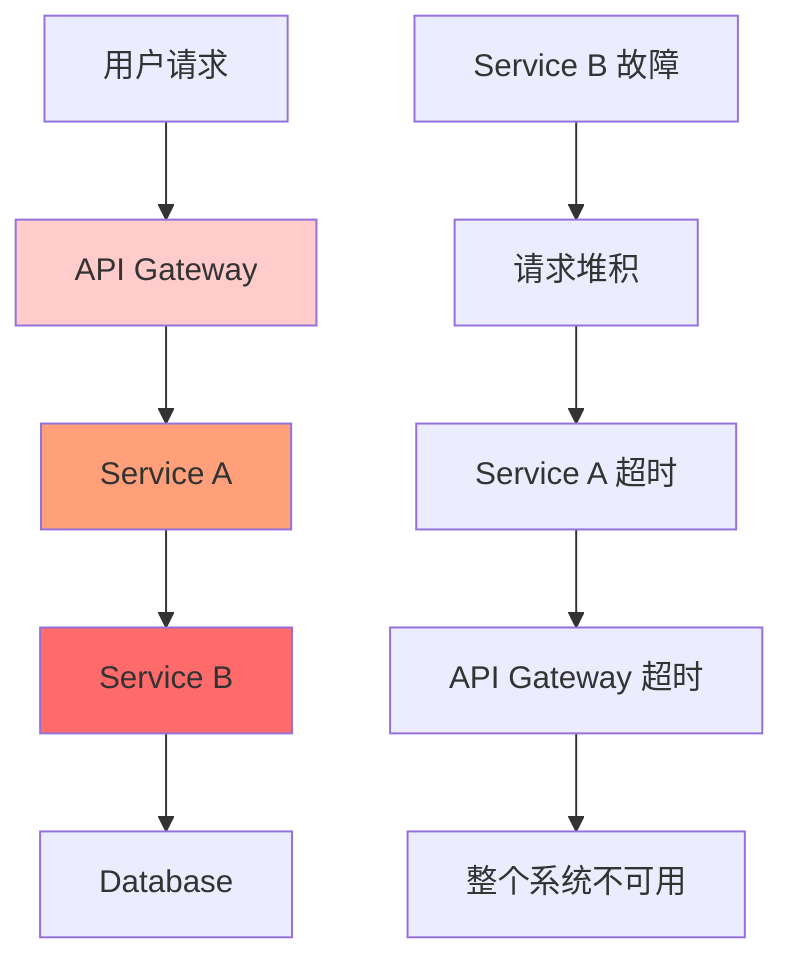
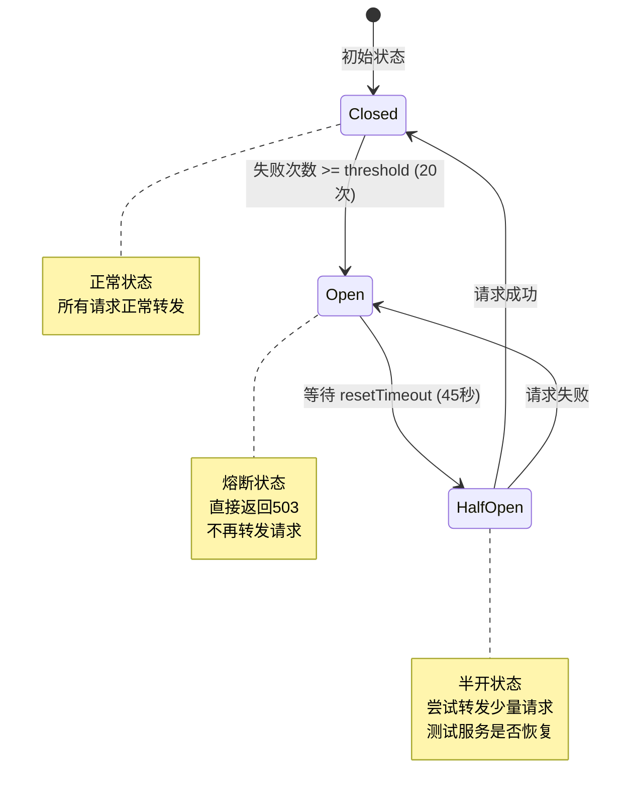
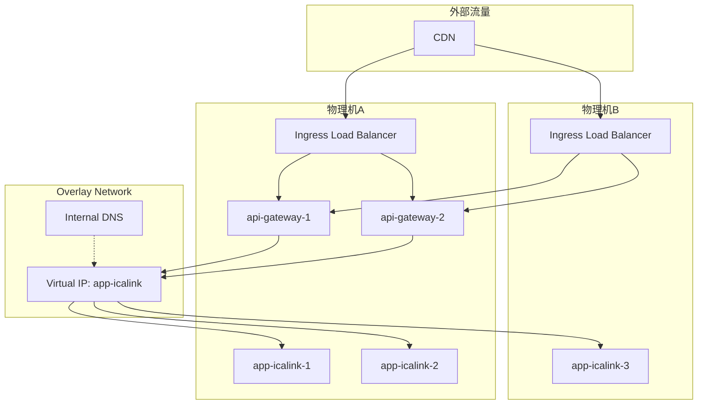
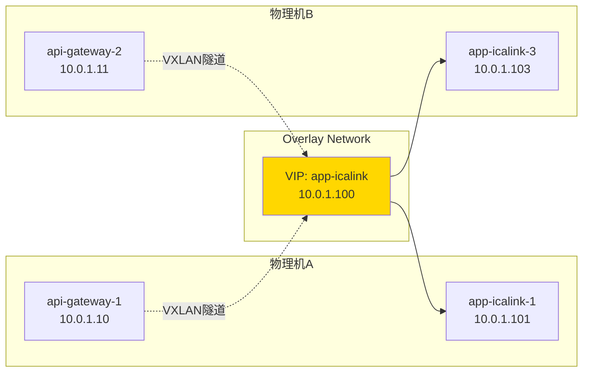
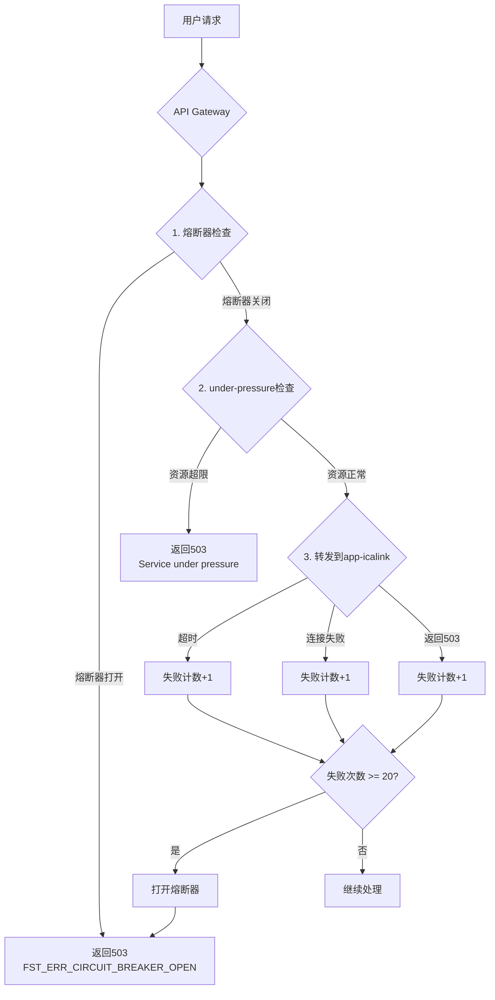
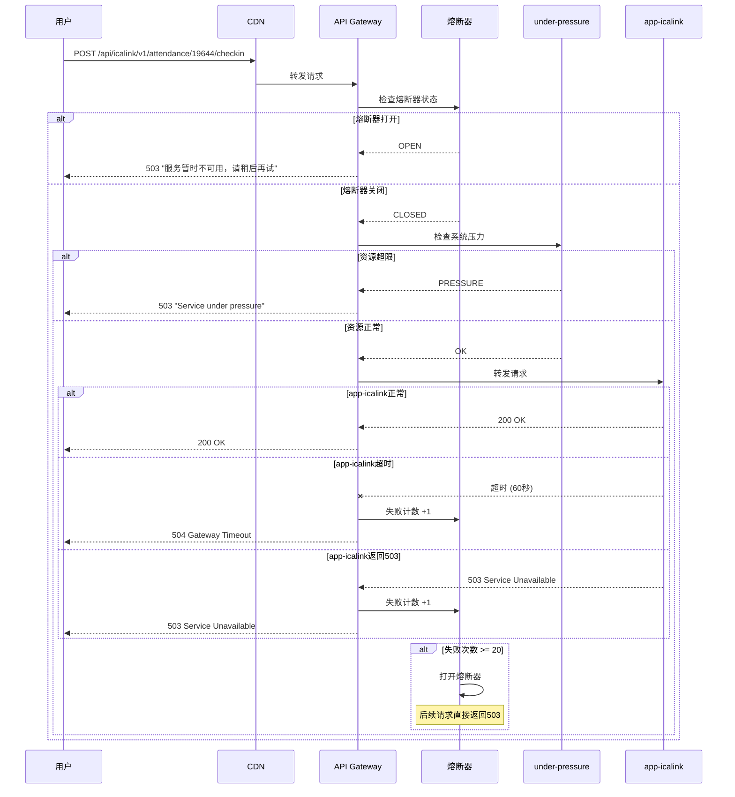
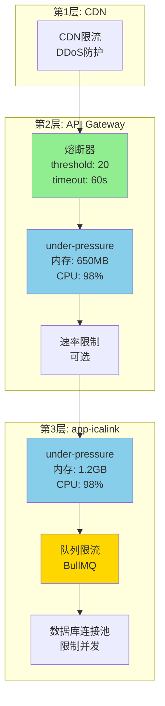

# 雪崩效应与负载均衡详解

## 📚 目录

1. [什么是雪崩效应](#1-什么是雪崩效应)
2. [Docker Swarm负载均衡机制](#2-docker-swarm负载均衡机制)
3. [API Gateway 503错误触发条件](#3-api-gateway-503错误触发条件)
4. [防护措施](#4-防护措施)

---

## 1. 什么是雪崩效应？

### 1.1 定义

**雪崩效应 (Cascading Failure)** 是指在微服务架构中,一个服务的故障导致其他依赖服务连锁失败,最终造成整个系统崩溃的现象。

### 1.2 雪崩效应的发生过程



### 1.3 典型场景示例

#### 场景1: 数据库连接池耗尽

```
时间线:
T0: 数据库响应变慢 (从10ms -> 2000ms)
T1: app-icalink 请求堆积,连接池耗尽
T2: app-icalink 开始返回超时错误
T3: api-gateway 请求失败累积,触发熔断器
T4: 所有用户请求返回503错误
T5: 系统完全不可用 ❌
```

**代码示例**:

```typescript
// app-icalink: 数据库查询变慢
async checkin(courseId: number, studentId: number) {
  // 数据库查询从10ms变成2000ms
  const course = await this.courseRepo.findById(courseId); // 2000ms ⏱️
  const student = await this.studentRepo.findById(studentId); // 2000ms ⏱️

  // 总耗时4000ms,超过api-gateway的3000ms超时
  // api-gateway触发超时,计入失败次数
}
```

#### 场景2: 内存泄漏导致的雪崩

```
时间线:
T0: app-icalink 某个实例内存泄漏
T1: 该实例OOM,被Docker Swarm重启
T2: 流量转移到其他2个实例
T3: 其他实例负载翻倍,也开始内存泄漏
T4: 所有实例陆续崩溃
T5: api-gateway 无法连接到任何实例
T6: 熔断器打开,返回503 ❌
```

#### 场景3: 突发流量导致的雪崩

```
时间线:
T0: 正常流量 100 QPS
T1: 突发流量 1000 QPS (上课签到高峰)
T2: app-icalink CPU 100%,响应变慢
T3: 请求堆积,内存占用上升
T4: under-pressure 触发,返回503
T5: api-gateway 收到大量503,触发熔断器
T6: 即使流量恢复正常,熔断器仍然打开
T7: 需要等待45秒才能恢复 ⏱️
```

### 1.4 雪崩效应的危害

| 影响层面       | 具体危害                         |
| -------------- | -------------------------------- |
| **用户体验**   | 所有用户无法使用系统,大量503错误 |
| **业务影响**   | 签到失败,数据丢失,业务中断       |
| **系统稳定性** | 服务频繁重启,资源耗尽            |
| **恢复时间**   | 需要手动干预,恢复时间长          |
| **连锁反应**   | 影响其他不相关的服务             |

### 1.5 熔断器如何防止雪崩

**熔断器的三种状态**:



**熔断器工作流程**:

```typescript
// 1. Closed 状态 (正常)
请求 -> api-gateway -> app-icalink -> 成功 ✅
请求 -> api-gateway -> app-icalink -> 成功 ✅
请求 -> api-gateway -> app-icalink -> 失败 ❌ (失败计数: 1)
请求 -> api-gateway -> app-icalink -> 失败 ❌ (失败计数: 2)
...
请求 -> api-gateway -> app-icalink -> 失败 ❌ (失败计数: 20)

// 2. Open 状态 (熔断)
熔断器打开! 🔴
请求 -> api-gateway -> 直接返回503 (不再转发到app-icalink)
请求 -> api-gateway -> 直接返回503
// 这样可以:
// - 减轻app-icalink的压力,让它有时间恢复
// - 避免请求堆积
// - 快速失败,不浪费资源

// 3. 等待 resetTimeout (45秒)
等待中... ⏱️

// 4. HalfOpen 状态 (半开)
请求 -> api-gateway -> app-icalink -> 成功 ✅
// 如果成功,熔断器关闭,恢复正常
// 如果失败,熔断器重新打开,继续等待
```

**防止雪崩的关键**:

1. **快速失败** - 不等待超时,立即返回错误
2. **隔离故障** - 阻止故障传播到上游服务
3. **自动恢复** - 定期尝试恢复,无需人工干预
4. **保护下游** - 减轻故障服务的压力

---

## 2. Docker Swarm负载均衡机制

### 2.1 Docker Swarm网络架构



### 2.2 请求转发流程详解

#### 步骤1: CDN到API Gateway

```bash
# CDN配置 (示例)
upstream backend {
    server 47.116.161.190:8090;   # 物理机A
    server 120.131.12.6:8090;     # 物理机B

    # 负载均衡算法: round-robin (轮询)
}

# 请求分发:
请求1 -> 物理机A:8090
请求2 -> 物理机B:8090
请求3 -> 物理机A:8090
请求4 -> 物理机B:8090
```

#### 步骤2: Ingress Load Balancer到API Gateway实例

```yaml
# Docker Swarm Ingress网络
# 当请求到达物理机的8090端口时:

物理机A:8090 -> Ingress LB -> 选择一个api-gateway实例
-> api-gateway-1 (在物理机A)
-> api-gateway-2 (在物理机A)
-> api-gateway-1 (在物理机B) ❌ 不存在
# 注意: 如果只有2个api-gateway副本,可能都在同一台机器上!
# Docker Swarm会尽量分散,但不保证
```

#### 步骤3: API Gateway到app-icalink

**关键配置**:

```json
// apps/api-gateway/prod.env.json
{
  "proxyServices": [
    {
      "name": "icalink",
      "upstream": "http://app-icalink:3000", // 🔑 关键: 使用服务名,不是IP
      "prefix": "/api/icalink",
      "rewritePrefix": "/api/icalink"
    }
  ]
}
```

**DNS解析过程**:

```bash
# 1. api-gateway发起请求
GET http://app-icalink:3000/api/icalink/v1/attendance/19644/checkin

# 2. Docker Swarm内部DNS解析
app-icalink -> 10.0.1.100 (Virtual IP)

# 3. Virtual IP背后的负载均衡
10.0.1.100 -> 10.0.1.101 (app-icalink-1, 物理机A)
           -> 10.0.1.102 (app-icalink-2, 物理机A)
           -> 10.0.1.103 (app-icalink-3, 物理机B)

# 4. 负载均衡算法: IPVS (IP Virtual Server)
# 默认算法: round-robin (轮询)
请求1 -> app-icalink-1
请求2 -> app-icalink-2
请求3 -> app-icalink-3
请求4 -> app-icalink-1
...
```

### 2.3 负载均衡算法详解

#### Docker Swarm使用的IPVS负载均衡

```bash
# 查看IPVS规则 (在Docker Swarm节点上执行)
ipvsadm -Ln

# 输出示例:
IP Virtual Server version 1.2.1 (size=4096)
Prot LocalAddress:Port Scheduler Flags
  -> RemoteAddress:Port           Forward Weight ActiveConn InActConn
TCP  10.0.1.100:3000 rr
  -> 10.0.1.101:3000              Masq    1      5          0
  -> 10.0.1.102:3000              Masq    1      3          0
  -> 10.0.1.103:3000              Masq    1      4          0
```

**负载均衡特性**:

| 特性         | 说明                  |
| ------------ | --------------------- |
| **算法**     | Round-Robin (轮询)    |
| **会话保持** | 无 (每个请求独立路由) |
| **健康检查** | 基于Docker健康检查    |
| **故障转移** | 自动剔除不健康的实例  |
| **权重**     | 默认相同权重          |

#### 负载均衡示例

**场景: 3个app-icalink实例**

```typescript
// 请求序列:
请求1: POST /api/icalink/v1/attendance/19644/checkin
  -> api-gateway-1 -> app-icalink-1 ✅

请求2: POST /api/icalink/v1/attendance/19644/checkin
  -> api-gateway-2 -> app-icalink-2 ✅

请求3: POST /api/icalink/v1/attendance/19644/checkin
  -> api-gateway-1 -> app-icalink-3 ✅

请求4: POST /api/icalink/v1/attendance/19644/checkin
  -> api-gateway-2 -> app-icalink-1 ✅

// 如果app-icalink-2健康检查失败:
请求5: POST /api/icalink/v1/attendance/19644/checkin
  -> api-gateway-1 -> app-icalink-3 ✅ (跳过app-icalink-2)

请求6: POST /api/icalink/v1/attendance/19644/checkin
  -> api-gateway-2 -> app-icalink-1 ✅
```

### 2.4 跨节点通信

**Overlay网络特性**:



**通信过程**:

1. **同节点通信** (api-gateway-1 -> app-icalink-1)
   - 延迟: ~0.1ms
   - 不经过物理网络
   - 使用Linux bridge

2. **跨节点通信** (api-gateway-1 -> app-icalink-3)
   - 延迟: ~1-5ms
   - 经过VXLAN隧道
   - 需要物理网络传输

---

## 3. API Gateway 503错误触发条件

### 3.1 触发条件汇总

API Gateway返回503错误有**3个主要来源**:



### 3.2 条件1: 熔断器打开

**触发条件**:

```typescript
// apps/api-gateway/src/hooks.ts
await instance.register(circuitBreaker, {
  threshold: 20, // 🔑 失败次数阈值
  timeout: 60000, // 🔑 单个请求超时时间
  resetTimeout: 45000 // 🔑 熔断器重置时间
});

// 触发逻辑:
if (失败次数 >= 20) {
  熔断器状态 = 'OPEN';
  return 503; // "服务暂时不可用，请稍后再试"
}
```

**什么算"失败"?**

1. **请求超时** (> 60秒)

   ```typescript
   // 场景: app-icalink响应慢
   api-gateway -> app-icalink (等待60秒)
   -> 超时! ❌
   -> 失败计数 +1
   ```

2. **连接失败**

   ```typescript
   // 场景: app-icalink所有实例都挂了
   api-gateway -> app-icalink
   -> ECONNREFUSED ❌
   -> 失败计数 +1
   ```

3. **下游返回5xx错误**
   ```typescript
   // 场景: app-icalink返回500/503
   api-gateway -> app-icalink
   -> 500 Internal Server Error ❌
   -> 失败计数 +1
   ```

**实际案例**:

```
时间线:
05:59:00 - 请求1 -> app-icalink -> 超时 (失败: 1)
05:59:02 - 请求2 -> app-icalink -> 超时 (失败: 2)
05:59:04 - 请求3 -> app-icalink -> 超时 (失败: 3)
...
05:59:38 - 请求20 -> app-icalink -> 超时 (失败: 20)
05:59:39 - 熔断器打开! 🔴
05:59:39 - 请求21 -> 直接返回503 (不再转发)
05:59:40 - 请求22 -> 直接返回503
...
06:00:24 - 等待45秒后,熔断器进入半开状态
06:00:24 - 请求N -> 尝试转发 -> 成功 ✅
06:00:24 - 熔断器关闭,恢复正常 🟢
```

### 3.3 条件2: under-pressure触发

**API Gateway的under-pressure配置**:

```typescript
// apps/api-gateway/src/stratix.config.ts
{
  name: 'under-pressure',
  plugin: underPressure,
  options: {
    maxEventLoopDelay: 2000,              // 🔑 事件循环延迟 > 2秒
    maxHeapUsedBytes: 650 * 1024 * 1024,  // 🔑 堆内存使用 > 650MB
    maxRssBytes: 850 * 1024 * 1024,       // 🔑 常驻内存 > 850MB
    maxEventLoopUtilization: 0.98,        // 🔑 事件循环利用率 > 98%
    message: 'Service under pressure',
    retryAfter: 30000                     // 建议30秒后重试
  }
}
```

**触发条件 (满足任一即触发)**:

```typescript
if (
  eventLoopDelay > 2000 ||           // 事件循环阻塞超过2秒
  heapUsed > 650MB ||                // 堆内存超过650MB
  rss > 850MB ||                     // 常驻内存超过850MB
  eventLoopUtilization > 0.98        // CPU利用率超过98%
) {
  return 503; // "Service under pressure"
}
```

**实际场景**:

```
场景1: 内存泄漏
T0: 正常运行,内存使用 400MB
T1: 处理大量请求,内存上升到 600MB
T2: 内存继续上升到 650MB
T3: 触发under-pressure! 🔴
T4: 返回503,拒绝新请求
T5: 等待GC回收内存

场景2: CPU密集型操作
T0: 正常运行,CPU 30%
T1: 大量签到请求,CPU 80%
T2: CPU继续上升到 98%
T3: 事件循环阻塞,延迟 > 2秒
T4: 触发under-pressure! 🔴
T5: 返回503,保护服务
```

### 3.4 条件3: 下游服务返回503

**app-icalink的under-pressure配置**:

```typescript
// apps/app-icalink/src/stratix.config.ts
{
  name: 'under-pressure',
  plugin: underPressure,
  options: {
    maxEventLoopDelay: 1000,              // 🔑 1秒 (更严格)
    maxHeapUsedBytes: 1200 * 1024 * 1024, // 🔑 1.2GB
    maxRssBytes: 1400 * 1024 * 1024,      // 🔑 1.4GB
    maxEventLoopUtilization: 0.98,
    message: 'Service under pressure - please retry later',
    retryAfter: 10000,
    pressureHandler: (req, rep, type, value) => {
      rep.code(503).send({
        error: 'Service Unavailable',
        message: `Service under pressure: ${type}`,
        value: value,
        retryAfter: 1000
      });
    }
  }
}
```

**传播链**:

```typescript
// 1. app-icalink触发under-pressure
app-icalink: 内存使用 > 1.2GB
-> 返回503 "Service under pressure"

// 2. api-gateway收到503
api-gateway -> app-icalink
<- 503 Service Unavailable
-> 失败计数 +1

// 3. 如果连续20次503
失败计数达到20
-> 熔断器打开
-> api-gateway直接返回503 "服务暂时不可用，请稍后再试"
```

### 3.5 完整的503错误流程图



---

## 4. 防护措施

### 4.1 多层防护体系



### 4.2 最佳实践建议

#### 1. 熔断器参数调优

**根据服务特性调整**:

```typescript
// 快速响应服务 (查询接口)
{
  threshold: 10,      // 更低的阈值
  timeout: 5000,      // 5秒超时
  resetTimeout: 10000 // 10秒恢复
}

// 耗时操作服务 (签到、文件上传)
{
  threshold: 20,      // 更高的阈值
  timeout: 60000,     // 60秒超时
  resetTimeout: 45000 // 45秒恢复
}
```

#### 2. 监控和告警

**关键指标**:

```typescript
// 1. 熔断器状态
metrics.circuitBreaker = {
  state: 'OPEN' | 'CLOSED' | 'HALF_OPEN',
  failureCount: 15,
  lastFailureTime: '2025-10-24T05:59:39.714Z'
};

// 2. 资源使用
metrics.resources = {
  heapUsed: 580 * 1024 * 1024, // 580MB
  rss: 720 * 1024 * 1024, // 720MB
  eventLoopDelay: 1200, // 1.2秒
  cpu: 0.85 // 85%
};

// 3. 请求统计
metrics.requests = {
  total: 1000,
  success: 950,
  failed: 50,
  errorRate: 0.05 // 5%
};
```

**告警规则**:

```yaml
alerts:
  - name: CircuitBreakerOpen
    condition: circuitBreaker.state == 'OPEN'
    severity: critical
    action: 立即通知运维团队

  - name: HighFailureRate
    condition: errorRate > 0.1 # 10%
    duration: 5m
    severity: warning
    action: 发送告警邮件

  - name: HighMemoryUsage
    condition: heapUsed > 600MB
    duration: 10m
    severity: warning
    action: 准备扩容
```

#### 3. 优雅降级

**降级策略**:

```typescript
// 在api-gateway中实现降级逻辑
fastify.setErrorHandler(async (error, request, reply) => {
  if (error.code === 'FST_ERR_CIRCUIT_BREAKER_OPEN') {
    // 熔断器打开时的降级处理

    // 策略1: 返回缓存数据
    const cached = await redis.get(`cache:${request.url}`);
    if (cached) {
      return reply.code(200).send({
        data: JSON.parse(cached),
        fromCache: true,
        message: '服务繁忙,返回缓存数据'
      });
    }

    // 策略2: 返回默认值
    return reply.code(503).send({
      error: 'Service Unavailable',
      message: '服务暂时不可用，请稍后再试',
      retryAfter: 45 // 秒
    });
  }
});
```

#### 4. 自动扩容

**基于指标的自动扩容**:

```yaml
# Docker Swarm不支持自动扩容,需要手动或脚本实现
# 监控脚本示例:

#!/bin/bash
# auto-scale.sh

# 获取当前副本数
CURRENT=$(docker service ls --filter name=obsync_app-icalink --format "{{.Replicas}}" | cut -d'/' -f1)

# 获取CPU使用率
CPU=$(docker stats --no-stream --format "{{.CPUPerc}}" | grep app-icalink | awk '{sum+=$1; count++} END {print sum/count}')

# 如果CPU > 80%,扩容
if [ $(echo "$CPU > 80" | bc) -eq 1 ]; then
  NEW=$((CURRENT + 1))
  docker service scale obsync_app-icalink=$NEW
  echo "扩容: $CURRENT -> $NEW"
fi

# 如果CPU < 30%,缩容
if [ $(echo "$CPU < 30" | bc) -eq 1 ] && [ $CURRENT -gt 2 ]; then
  NEW=$((CURRENT - 1))
  docker service scale obsync_app-icalink=$NEW
  echo "缩容: $CURRENT -> $NEW"
fi
```

#### 5. 健康检查优化

**改进健康检查**:

```typescript
// apps/app-icalink/src/routes/health.ts
export const healthCheck = async (
  request: FastifyRequest,
  reply: FastifyReply
) => {
  const health = {
    status: 'healthy',
    timestamp: new Date().toISOString(),
    checks: {}
  };

  try {
    // 1. 检查数据库连接
    await db.raw('SELECT 1');
    health.checks.database = 'ok';
  } catch (error) {
    health.status = 'unhealthy';
    health.checks.database = 'failed';
  }

  try {
    // 2. 检查Redis连接
    await redis.ping();
    health.checks.redis = 'ok';
  } catch (error) {
    health.status = 'unhealthy';
    health.checks.redis = 'failed';
  }

  // 3. 检查内存使用
  const memUsage = process.memoryUsage();
  health.checks.memory = {
    heapUsed: memUsage.heapUsed,
    heapTotal: memUsage.heapTotal,
    rss: memUsage.rss,
    status: memUsage.heapUsed < 1200 * 1024 * 1024 ? 'ok' : 'warning'
  };

  const statusCode = health.status === 'healthy' ? 200 : 503;
  return reply.code(statusCode).send(health);
};
```

---

## 5. 总结

### 5.1 关键要点

1. **雪崩效应** 是微服务架构中最危险的故障模式,需要多层防护
2. **Docker Swarm** 使用IPVS进行负载均衡,默认round-robin算法
3. **API Gateway 503错误** 有3个来源:
   - 熔断器打开 (失败次数 >= 20)
   - under-pressure触发 (资源超限)
   - 下游服务返回503

### 5.2 防护建议

| 层级            | 防护措施       | 配置                        |
| --------------- | -------------- | --------------------------- |
| **CDN**         | DDoS防护、限流 | 根据CDN提供商配置           |
| **API Gateway** | 熔断器         | threshold: 20, timeout: 60s |
| **API Gateway** | under-pressure | 内存: 650MB, CPU: 98%       |
| **app-icalink** | under-pressure | 内存: 1.2GB, CPU: 98%       |
| **app-icalink** | 队列限流       | BullMQ并发控制              |
| **Database**    | 连接池         | 限制最大连接数              |

### 5.3 监控清单

- [ ] 熔断器状态 (OPEN/CLOSED)
- [ ] 失败次数和失败率
- [ ] 资源使用 (CPU/内存)
- [ ] 响应时间 (P50/P95/P99)
- [ ] 请求量 (QPS)
- [ ] 健康检查状态
- [ ] 服务副本数和分布

---

**文档版本**: v1.0
**最后更新**: 2025-10-24
**作者**: Stratix Team
