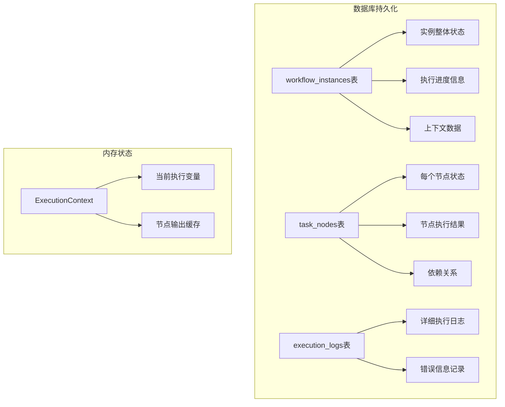
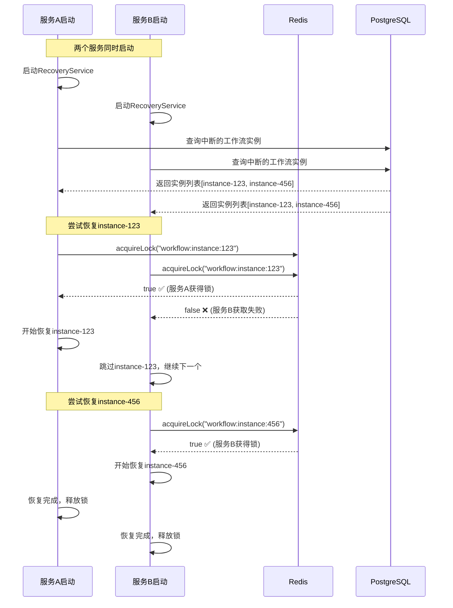

# 断点续传和多服务恢复机制详解

## 🔄 断点续传的核心原理

### 1. 工作流状态持久化机制

#### 1.1 三层状态存储



#### 1.2 关键状态字段

```sql
-- workflow_instances 表的关键字段
CREATE TABLE workflow_instances (
    id SERIAL PRIMARY KEY,
    status VARCHAR(50) NOT NULL,           -- pending/running/paused/completed/failed
    input_data JSONB,                      -- 原始输入数据
    output_data JSONB,                     -- 当前输出数据  
    context_data JSONB DEFAULT '{}',       -- 执行上下文（包含变量状态）
    started_at TIMESTAMP WITH TIME ZONE,   -- 开始时间
    updated_at TIMESTAMP WITH TIME ZONE,   -- 最后更新时间（心跳）
    
    -- 断点续传关键字段
    current_node_id VARCHAR(255),          -- 当前执行到的节点ID
    completed_nodes JSONB DEFAULT '[]',    -- 已完成的节点列表
    failed_nodes JSONB DEFAULT '[]',       -- 失败的节点列表
    
    -- 分布式锁信息
    lock_owner VARCHAR(255),               -- 锁拥有者标识
    lock_acquired_at TIMESTAMP WITH TIME ZONE, -- 锁获取时间
    last_heartbeat TIMESTAMP WITH TIME ZONE    -- 最后心跳时间
);

-- task_nodes 表的节点状态
CREATE TABLE task_nodes (
    id SERIAL PRIMARY KEY,
    workflow_instance_id INTEGER NOT NULL,
    node_key VARCHAR(255) NOT NULL,        -- 节点标识
    status VARCHAR(50) NOT NULL,           -- pending/running/completed/failed/skipped
    input_data JSONB,                      -- 节点输入数据
    output_data JSONB,                     -- 节点输出数据
    started_at TIMESTAMP WITH TIME ZONE,
    completed_at TIMESTAMP WITH TIME ZONE,
    
    -- 动态并行支持
    parallel_group_id VARCHAR(255),        -- 并行组ID
    parallel_index INTEGER,                -- 并行索引
    parent_task_id INTEGER                 -- 父任务ID
);
```

### 2. 实时状态同步机制

#### 2.1 执行过程中的状态更新

```typescript
class WorkflowEngineService {
  private async executeNode(context: ExecutionContext, node: NodeDefinition): Promise<void> {
    // 1. 更新节点开始执行状态
    await this.updateNodeStatus(context.instance.id, node.id, 'running', {
      started_at: new Date(),
      input_data: this.extractNodeInputs(context, node)
    });
    
    // 2. 更新实例心跳
    await this.updateInstanceHeartbeat(context.instance.id);
    
    try {
      // 3. 执行节点逻辑
      const result = await this.executeNodeLogic(context, node);
      
      // 4. 更新节点完成状态
      await this.updateNodeStatus(context.instance.id, node.id, 'completed', {
        completed_at: new Date(),
        output_data: result
      });
      
      // 5. 更新实例上下文
      await this.updateInstanceContext(context.instance.id, {
        [`nodes.${node.id}.output`]: result,
        completedNodes: [...(context.instance.contextData.completedNodes || []), node.id],
        currentNodeId: this.getNextNodeId(context.definition, node.id)
      });
      
    } catch (error) {
      // 6. 更新节点失败状态
      await this.updateNodeStatus(context.instance.id, node.id, 'failed', {
        error_message: error.message,
        error_details: error,
        completed_at: new Date()
      });
      
      throw error;
    }
  }
  
  // 心跳更新机制
  private async updateInstanceHeartbeat(instanceId: number): Promise<void> {
    await this.workflowInstanceRepository.update(instanceId, {
      last_heartbeat: new Date(),
      updated_at: new Date()
    });
  }
}
```

#### 2.2 动态并行任务的状态追踪

```typescript
private async executeDynamicParallelLoop(
  context: ExecutionContext,
  loopNode: LoopNodeDefinition
): Promise<void> {
  const sourceData = this.getSourceDataForDynamicLoop(context, loopNode);
  
  // 为每个动态任务创建task_nodes记录
  const taskNodes = await Promise.all(
    sourceData.map(async (item, index) => {
      return await this.createTaskNode({
        workflow_instance_id: context.instance.id,
        node_key: `${loopNode.id}_dynamic_${index}`,
        node_name: `${loopNode.name} - Item ${index}`,
        node_type: 'task',
        status: 'pending',
        input_data: { item, index },
        parallel_group_id: loopNode.id,
        parallel_index: index
      });
    })
  );
  
  // 并发执行，实时更新状态
  const results = await this.executeParallelTasks(
    context,
    sourceData,
    loopNode.taskTemplate,
    loopNode.maxConcurrency,
    loopNode.errorHandling,
    taskNodes // 传入已创建的节点记录
  );
}
```

## 🚀 服务重启后的恢复机制

### 1. 多服务同时启动的竞争处理



### 2. 恢复服务的完整实现

```typescript
export class WorkflowRecoveryService {
  private readonly recoveryInterval = 30000; // 30秒检查一次
  private isRecovering = false;

  /**
   * 启动恢复服务 - 服务启动时调用
   */
  async startRecoveryService(): Promise<void> {
    this.logger.info('启动工作流恢复服务');

    try {
      // 立即执行一次恢复
      await this.recoverInterruptedWorkflows();

      // 启动定期检查
      this.startPeriodicRecovery();

    } catch (error) {
      this.logger.error('工作流恢复服务启动失败', { error });
      throw error;
    }
  }

  /**
   * 恢复中断的工作流实例
   */
  private async recoverInterruptedWorkflows(): Promise<void> {
    if (this.isRecovering) {
      this.logger.debug('恢复过程正在进行中，跳过本次检查');
      return;
    }

    this.isRecovering = true;

    try {
      // 1. 查找可能中断的实例
      const interruptedInstances = await this.findInterruptedInstances();
      
      if (interruptedInstances.length === 0) {
        this.logger.debug('没有发现需要恢复的工作流实例');
        return;
      }

      this.logger.info(`发现 ${interruptedInstances.length} 个需要恢复的工作流实例`);

      // 2. 并发尝试恢复（每个实例通过分布式锁保证唯一性）
      const recoveryResults = await Promise.allSettled(
        interruptedInstances.map(instance => this.recoverSingleInstance(instance))
      );

      // 3. 统计恢复结果
      const successful = recoveryResults.filter(r => r.status === 'fulfilled').length;
      const failed = recoveryResults.length - successful;

      this.logger.info('工作流恢复完成', {
        total: interruptedInstances.length,
        successful,
        failed
      });

    } catch (error) {
      this.logger.error('工作流恢复过程异常', { error });
    } finally {
      this.isRecovering = false;
    }
  }

  /**
   * 查找中断的工作流实例
   */
  private async findInterruptedInstances(): Promise<WorkflowInstance[]> {
    try {
      const query = `
        SELECT wi.*, wd.name as workflow_name 
        FROM workflow_instances wi
        JOIN workflow_definitions wd ON wi.workflow_definition_id = wd.id
        WHERE wi.status = 'running'
          AND (
            wi.last_heartbeat IS NULL 
            OR wi.last_heartbeat < NOW() - INTERVAL '5 minutes'
          )
          AND wi.updated_at < NOW() - INTERVAL '5 minutes'
        ORDER BY wi.updated_at ASC
        LIMIT 50
      `;

      const result = await this.database.query(query);
      
      const instances: WorkflowInstance[] = [];
      
      // 进一步验证每个实例是否真的中断
      for (const instance of result.rows) {
        if (await this.isInstanceReallyInterrupted(instance)) {
          instances.push(instance);
        }
      }

      return instances;
      
    } catch (error) {
      this.logger.error('查找中断实例失败', { error });
      return [];
    }
  }

  /**
   * 验证实例是否真的中断
   */
  private async isInstanceReallyInterrupted(instance: WorkflowInstance): Promise<boolean> {
    try {
      // 1. 检查是否有其他服务持有锁
      const lockKey = this.getInstanceLockKey(instance.id.toString());
      const hasLock = await this.lockService.hasLock(lockKey);
      
      if (hasLock) {
        // 有锁说明正在其他节点运行
        this.logger.debug('实例在其他节点运行', { instanceId: instance.id });
        return false;
      }

      // 2. 检查最后心跳时间
      const lastHeartbeat = instance.last_heartbeat || instance.updated_at;
      const now = new Date();
      const timeDiff = now.getTime() - new Date(lastHeartbeat).getTime();

      // 超过5分钟没有心跳，认为已中断
      const INTERRUPT_THRESHOLD = 5 * 60 * 1000;
      const isInterrupted = timeDiff > INTERRUPT_THRESHOLD;

      this.logger.debug('实例中断检查', {
        instanceId: instance.id,
        lastHeartbeat,
        timeDiffMinutes: Math.floor(timeDiff / 60000),
        isInterrupted
      });

      return isInterrupted;

    } catch (error) {
      this.logger.error('检查实例中断状态失败', { 
        instanceId: instance.id, 
        error 
      });
      return false;
    }
  }

  /**
   * 恢复单个工作流实例
   */
  private async recoverSingleInstance(instance: WorkflowInstance): Promise<void> {
    const instanceId = instance.id.toString();
    const lockKey = this.getInstanceLockKey(instanceId);
    const owner = `recovery-${process.pid}-${Date.now()}`;

    try {
      // 1. 尝试获取实例锁（1分钟锁定时间）
      const lockAcquired = await this.lockService.acquireLock(
        lockKey,
        60000,
        owner
      );

      if (!lockAcquired) {
        this.logger.debug('无法获取实例锁，可能正在其他节点运行', { instanceId });
        return;
      }

      this.logger.info('开始恢复工作流实例', { 
        instanceId,
        name: instance.name,
        status: instance.status,
        lastUpdate: instance.updated_at
      });

      // 2. 重建执行上下文
      const context = await this.rebuildExecutionContext(instance);
      
      // 3. 从断点继续执行
      await this.resumeFromBreakpoint(context);

      this.logger.info('工作流实例恢复成功', { instanceId });

    } catch (error) {
      this.logger.error('恢复工作流实例异常', { instanceId, error });
      
      // 标记实例为失败状态
      await this.markInstanceAsFailed(instance.id, error);
      
    } finally {
      // 释放锁
      await this.lockService.releaseLock(lockKey, owner);
    }
  }

  /**
   * 重建执行上下文
   */
  private async rebuildExecutionContext(instance: WorkflowInstance): Promise<ExecutionContext> {
    // 1. 获取工作流定义
    const definition = await this.workflowDefinitionService.getDefinition(
      instance.workflow_definition_id
    );

    // 2. 重建变量状态
    const variables = {
      ...instance.input_data,           // 原始输入
      ...instance.context_data.variables, // 执行过程中的变量
    };

    // 3. 重建已完成节点的输出
    const completedNodes = await this.getCompletedNodeOutputs(instance.id);
    for (const node of completedNodes) {
      variables[`nodes.${node.node_key}.output`] = node.output_data;
    }

    // 4. 创建执行上下文
    const context: ExecutionContext = {
      instance: {
        ...instance,
        status: 'running', // 重置为运行状态
        updated_at: new Date()
      },
      definition,
      executorRegistry: this.executorRegistry,
      variables
    };

    return context;
  }

  /**
   * 从断点继续执行
   */
  private async resumeFromBreakpoint(context: ExecutionContext): Promise<void> {
    const instance = context.instance;
    const definition = context.definition;

    // 1. 获取已完成的节点列表
    const completedNodeIds = await this.getCompletedNodeIds(instance.id);
    
    // 2. 获取失败需要重试的节点
    const failedNodes = await this.getFailedNodes(instance.id);
    
    this.logger.info('断点续传状态', {
      instanceId: instance.id,
      completedNodes: completedNodeIds.length,
      failedNodes: failedNodes.length,
      totalNodes: definition.nodes.length
    });

    // 3. 重新执行失败的节点
    for (const failedNode of failedNodes) {
      if (failedNode.retry_count < failedNode.max_retries) {
        this.logger.info('重试失败节点', {
          nodeId: failedNode.node_key,
          retryCount: failedNode.retry_count + 1
        });
        
        const nodeDefinition = definition.nodes.find(n => n.id === failedNode.node_key);
        if (nodeDefinition) {
          await this.retryFailedNode(context, nodeDefinition, failedNode);
        }
      }
    }

    // 4. 继续执行未完成的节点
    for (const node of definition.nodes) {
      // 跳过已完成的节点
      if (completedNodeIds.includes(node.id)) {
        this.logger.debug('跳过已完成节点', { nodeId: node.id });
        continue;
      }

      // 检查依赖是否满足
      if (!this.areDependenciesSatisfied(node, completedNodeIds)) {
        this.logger.debug('节点依赖未满足，跳过', { 
          nodeId: node.id,
          dependencies: node.dependsOn 
        });
        continue;
      }

      // 检查执行条件
      if (node.condition && !this.evaluateCondition(node.condition, context.variables)) {
        this.logger.debug('节点条件不满足，跳过', { 
          nodeId: node.id,
          condition: node.condition 
        });
        continue;
      }

      // 执行节点
      this.logger.info('继续执行节点', { nodeId: node.id });
      await this.executeNode(context, node);
    }

    // 5. 检查是否全部完成
    const allCompleted = await this.checkAllNodesCompleted(instance.id);
    if (allCompleted) {
      await this.markInstanceAsCompleted(instance.id);
      this.logger.info('工作流实例执行完成', { instanceId: instance.id });
    }
  }

  /**
   * 检查依赖是否满足
   */
  private areDependenciesSatisfied(node: NodeDefinition, completedNodeIds: string[]): boolean {
    if (!node.dependsOn || node.dependsOn.length === 0) {
      return true;
    }

    return node.dependsOn.every(depId => completedNodeIds.includes(depId));
  }

  /**
   * 获取已完成节点的输出数据
   */
  private async getCompletedNodeOutputs(instanceId: number): Promise<any[]> {
    const query = `
      SELECT node_key, output_data 
      FROM task_nodes 
      WHERE workflow_instance_id = $1 
        AND status = 'completed'
        AND output_data IS NOT NULL
    `;
    
    const result = await this.database.query(query, [instanceId]);
    return result.rows;
  }

  /**
   * 获取已完成的节点ID列表
   */
  private async getCompletedNodeIds(instanceId: number): Promise<string[]> {
    const query = `
      SELECT node_key 
      FROM task_nodes 
      WHERE workflow_instance_id = $1 
        AND status = 'completed'
    `;
    
    const result = await this.database.query(query, [instanceId]);
    return result.rows.map(row => row.node_key);
  }

  /**
   * 获取失败的节点
   */
  private async getFailedNodes(instanceId: number): Promise<any[]> {
    const query = `
      SELECT * 
      FROM task_nodes 
      WHERE workflow_instance_id = $1 
        AND status = 'failed'
        AND retry_count < max_retries
    `;
    
    const result = await this.database.query(query, [instanceId]);
    return result.rows;
  }

  private getInstanceLockKey(instanceId: string): string {
    return `workflow:instance:${instanceId}`;
  }
}
```

### 3. 动态并行任务的断点续传

```typescript
/**
 * 动态并行任务的恢复机制
 */
class DynamicParallelRecovery {
  /**
   * 恢复动态并行循环节点
   */
  async recoverDynamicParallelLoop(
    context: ExecutionContext, 
    loopNode: LoopNodeDefinition
  ): Promise<void> {
    // 1. 获取该并行组的所有任务节点
    const parallelTasks = await this.getParallelGroupTasks(
      context.instance.id, 
      loopNode.id
    );

    if (parallelTasks.length === 0) {
      // 没有创建过并行任务，从头开始执行
      await this.executeDynamicParallelLoop(context, loopNode);
      return;
    }

    // 2. 分析任务执行状态
    const taskStatus = this.analyzeParallelTaskStatus(parallelTasks);
    
    this.logger.info('动态并行任务恢复分析', {
      loopNodeId: loopNode.id,
      totalTasks: taskStatus.total,
      completed: taskStatus.completed,
      failed: taskStatus.failed,
      pending: taskStatus.pending
    });

    // 3. 重试失败的任务
    const failedTasks = parallelTasks.filter(t => 
      t.status === 'failed' && t.retry_count < t.max_retries
    );
    
    if (failedTasks.length > 0) {
      await this.retryFailedParallelTasks(context, loopNode, failedTasks);
    }

    // 4. 执行剩余的待处理任务
    const pendingTasks = parallelTasks.filter(t => t.status === 'pending');
    
    if (pendingTasks.length > 0) {
      await this.resumePendingParallelTasks(context, loopNode, pendingTasks);
    }

    // 5. 汇总结果
    const allResults = await this.collectParallelResults(
      context.instance.id, 
      loopNode.id
    );
    
    const finalResults = this.handleJoinResults(allResults, loopNode.joinType || 'all');
    
    // 6. 更新循环节点状态
    context.variables[`loops.${loopNode.id}.results`] = finalResults;
    context.variables[`loops.${loopNode.id}.count`] = finalResults.length;
  }

  /**
   * 获取并行组的任务节点
   */
  private async getParallelGroupTasks(instanceId: number, groupId: string): Promise<any[]> {
    const query = `
      SELECT * FROM task_nodes 
      WHERE workflow_instance_id = $1 
        AND parallel_group_id = $2
      ORDER BY parallel_index ASC
    `;
    
    const result = await this.database.query(query, [instanceId, groupId]);
    return result.rows;
  }

  /**
   * 分析并行任务状态
   */
  private analyzeParallelTaskStatus(tasks: any[]): TaskStatus {
    return {
      total: tasks.length,
      completed: tasks.filter(t => t.status === 'completed').length,
      failed: tasks.filter(t => t.status === 'failed').length,
      pending: tasks.filter(t => t.status === 'pending').length,
      running: tasks.filter(t => t.status === 'running').length
    };
  }
}

interface TaskStatus {
  total: number;
  completed: number;
  failed: number;
  pending: number;
  running: number;
}
```

### 4. 心跳机制防止误判

```typescript
class HeartbeatService {
  private heartbeatInterval?: NodeJS.Timeout;
  private readonly HEARTBEAT_INTERVAL = 30000; // 30秒

  /**
   * 启动心跳服务
   */
  startHeartbeat(instanceId: number): void {
    this.heartbeatInterval = setInterval(async () => {
      try {
        await this.sendHeartbeat(instanceId);
      } catch (error) {
        this.logger.error('心跳发送失败', { instanceId, error });
      }
    }, this.HEARTBEAT_INTERVAL);
  }

  /**
   * 发送心跳
   */
  private async sendHeartbeat(instanceId: number): Promise<void> {
    await this.workflowInstanceRepository.update(instanceId, {
      last_heartbeat: new Date(),
      updated_at: new Date()
    });
  }

  /**
   * 停止心跳
   */
  stopHeartbeat(): void {
    if (this.heartbeatInterval) {
      clearInterval(this.heartbeatInterval);
      this.heartbeatInterval = undefined;
    }
  }
}
```

## 🛡️ 关键保证机制总结

### 1. 断点续传保证

✅ **状态持久化**: 每个节点执行状态实时保存到数据库  
✅ **上下文恢复**: 重建完整的执行变量和节点输出  
✅ **依赖检查**: 确保节点依赖关系正确恢复  
✅ **动态任务**: 支持动态并行任务的部分完成和继续执行  

### 2. 多服务竞争保证

✅ **分布式锁**: 每个实例一个锁，确保唯一性恢复  
✅ **心跳检测**: 通过心跳判断实例是否真正中断  
✅ **锁超时**: 避免死锁，支持故障转移  
✅ **并发安全**: 多个服务可以同时恢复不同的实例  

### 3. 数据一致性保证

✅ **原子操作**: 状态更新使用数据库事务  
✅ **幂等恢复**: 重复恢复不会产生副作用  
✅ **失败回滚**: 恢复失败时正确标记状态  
✅ **监控告警**: 详细的日志和监控信息  

**最终效果**: 无论何时服务重启，工作流都能从上次中断的位置准确继续执行，且多服务环境下保证唯一性。