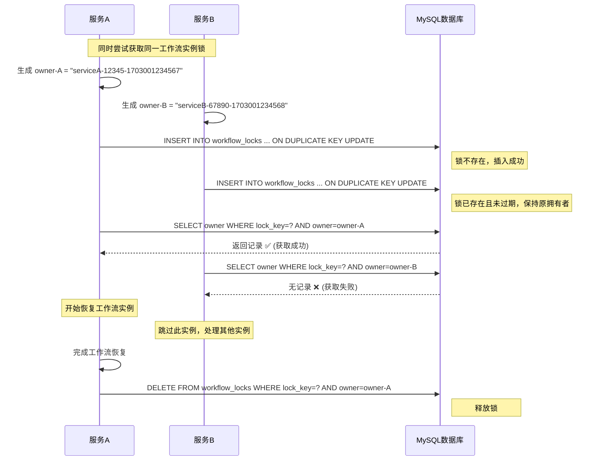
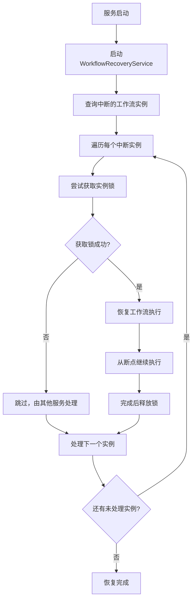
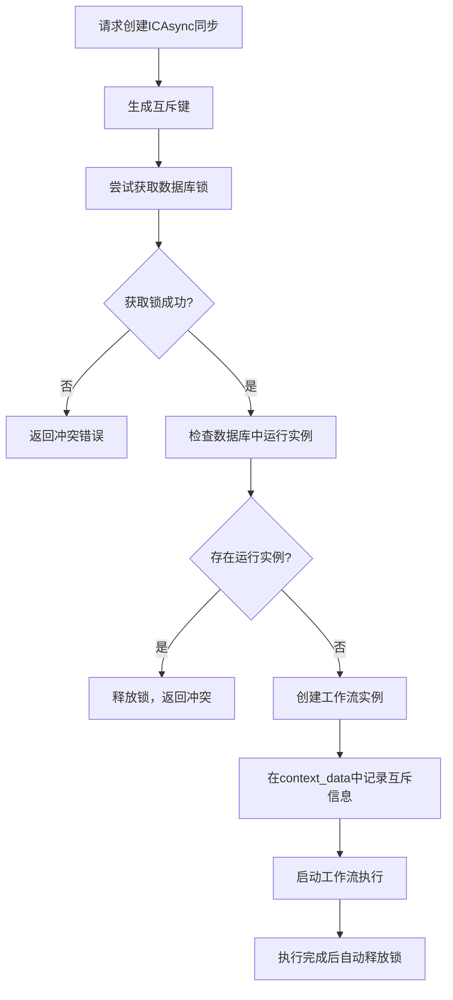

# 基于数据库的分布式锁机制详解

## 🎯 为什么选择数据库锁替代Redis锁？

### 优势：
✅ **零依赖**：无需额外的Redis服务，减少系统复杂度  
✅ **事务一致性**：与业务数据在同一数据库，天然支持事务  
✅ **高可用性**：依托MySQL主从复制，无需额外高可用方案  
✅ **简化运维**：统一的数据库管理，减少运维负担  
✅ **调试友好**：可直接查询锁状态，便于问题排查  

### 权衡：
⚠️ **性能**：数据库锁比Redis锁稍慢，但对工作流场景影响微乎其微  
⚠️ **并发**：MySQL并发处理能力比Redis低，但足以应对工作流锁场景  

## 🔐 核心实现原理

### 1. 锁表设计

```sql
CREATE TABLE `workflow_locks` (
    `lock_key` VARCHAR(255) NOT NULL PRIMARY KEY COMMENT '锁键，唯一标识',
    `owner` VARCHAR(255) NOT NULL COMMENT '锁拥有者标识',
    `expires_at` DATETIME NOT NULL COMMENT '锁过期时间',
    `created_at` TIMESTAMP NOT NULL DEFAULT CURRENT_TIMESTAMP,
    `updated_at` TIMESTAMP NOT NULL DEFAULT CURRENT_TIMESTAMP ON UPDATE CURRENT_TIMESTAMP,
    
    INDEX `idx_workflow_locks_expires_at` (`expires_at`),
    INDEX `idx_workflow_locks_owner` (`owner`)
);
```

**设计要点**：
- `lock_key` 作为主键，天然保证唯一性
- `expires_at` 实现锁的自动过期
- `owner` 标识锁的拥有者，确保只有拥有者能释放锁

### 2. 原子锁获取机制

```typescript
async acquireLock(key: string, ttl: number, owner: string): Promise<boolean> {
  const expiresAt = new Date(Date.now() + ttl);
  
  // 使用 INSERT ... ON DUPLICATE KEY UPDATE 实现原子操作
  const insertQuery = `
    INSERT INTO workflow_locks (lock_key, owner, expires_at, created_at)
    VALUES (?, ?, ?, NOW())
    ON DUPLICATE KEY UPDATE
      owner = CASE 
        WHEN expires_at < NOW() THEN VALUES(owner)    -- 锁已过期，可以重新获取
        ELSE owner                                    -- 锁未过期，保持原拥有者
      END,
      expires_at = CASE 
        WHEN expires_at < NOW() THEN VALUES(expires_at)
        ELSE expires_at
      END
  `;
  
  await this.database.query(insertQuery, [key, owner, expiresAt]);
  
  // 验证是否成功获取锁
  const checkResult = await this.database.query(
    'SELECT owner FROM workflow_locks WHERE lock_key = ? AND owner = ? AND expires_at > NOW()',
    [key, owner]
  );
  
  return checkResult.rows && checkResult.rows.length > 0;
}
```

**关键机制**：
1. **INSERT**: 如果锁不存在，直接插入并获取锁
2. **ON DUPLICATE KEY UPDATE**: 如果锁已存在：
   - 锁已过期：更新为新的拥有者
   - 锁未过期：保持原拥有者不变
3. **验证查询**: 确认当前进程是否成功获取了锁

### 3. 多服务竞争时序图



## 🛡️ 故障处理机制

### 1. 锁自动过期

```sql
-- 查询时自动过滤过期锁
SELECT * FROM workflow_locks WHERE lock_key = ? AND expires_at > NOW();

-- 定期清理过期锁
DELETE FROM workflow_locks WHERE expires_at < NOW();
```

### 2. 服务崩溃处理

```typescript
// 服务启动时清理自己的所有锁
async cleanupOnStartup(): Promise<void> {
  const ownerPattern = `${this.serviceId}-%`;
  await this.lockService.releaseAllLocksForOwner(ownerPattern);
}

// 服务关闭时释放所有锁
async cleanupOnShutdown(): Promise<void> {
  const ownerPattern = `${this.serviceId}-%`;
  await this.lockService.releaseAllLocksForOwner(ownerPattern);
}
```

### 3. 锁续约机制

```typescript
async renewLock(key: string, ttl: number, owner: string): Promise<boolean> {
  const newExpiresAt = new Date(Date.now() + ttl);
  
  const updateQuery = `
    UPDATE workflow_locks 
    SET expires_at = ?, updated_at = NOW()
    WHERE lock_key = ? AND owner = ? AND expires_at > NOW()
  `;
  
  const result = await this.database.query(updateQuery, [newExpiresAt, key, owner]);
  return result.affectedRows > 0;
}
```

## 🔄 断点续传的完整流程

### 1. 服务启动恢复流程



### 2. 关键代码实现

```typescript
class WorkflowRecoveryService {
  async recoverInterruptedWorkflows(): Promise<void> {
    // 1. 查找所有可能中断的实例
    const interruptedInstances = await this.findInterruptedInstances();
    
    // 2. 并发尝试恢复（每个实例通过锁保证唯一性）
    const recoveryPromises = interruptedInstances.map(instance => 
      this.recoverSingleInstance(instance)
    );
    
    await Promise.allSettled(recoveryPromises);
  }
  
  private async recoverSingleInstance(instance: WorkflowInstance): Promise<void> {
    const lockKey = `workflow:instance:${instance.id}`;
    const owner = `recovery-${process.pid}-${Date.now()}`;
    
    // 3. 尝试获取实例锁
    const lockAcquired = await this.lockService.acquireLock(lockKey, 60000, owner);
    
    if (!lockAcquired) {
      this.logger.debug('无法获取实例锁，可能正在其他节点运行', { instanceId: instance.id });
      return; // 其他服务正在处理，跳过
    }
    
    try {
      // 4. 恢复执行
      await this.workflowAdapter.resumeWorkflow(instance.id.toString());
      this.logger.info('工作流实例恢复成功', { instanceId: instance.id });
    } finally {
      // 5. 确保释放锁
      await this.lockService.releaseLock(lockKey, owner);
    }
  }
}
```

### 3. 双重保护机制

```typescript
private async findInterruptedInstances(): Promise<WorkflowInstance[]> {
  // 查找状态为 running 但可能已中断的实例
  const runningInstances = await this.workflowAdapter.listWorkflowInstances({
    status: 'running',
    limit: 100
  });
  
  const interruptedInstances: WorkflowInstance[] = [];
  
  for (const instance of runningInstances.data) {
    // 双重检查：既检查数据库锁，又检查心跳时间
    const lockKey = `workflow:instance:${instance.id}`;
    const hasLock = await this.lockService.hasLock(lockKey);
    
    if (!hasLock && this.isInstanceStale(instance)) {
      interruptedInstances.push(instance);
    }
  }
  
  return interruptedInstances;
}

private isInstanceStale(instance: WorkflowInstance): boolean {
  const lastUpdate = new Date(instance.updatedAt);
  const now = new Date();
  const timeDiff = now.getTime() - lastUpdate.getTime();
  
  // 超过5分钟没有更新，认为可能已中断
  const INTERRUPT_THRESHOLD = 5 * 60 * 1000;
  return timeDiff > INTERRUPT_THRESHOLD;
}
```

## 🎯 工作流互斥控制

### 1. ICAsync同步互斥实现

```typescript
class ICAsyncMutexManager {
  async createMutexFullSync(workflowDefinition: any, inputs: Record<string, any>) {
    const mutexKey = `icasync:full-sync:${inputs.xnxq}`;
    
    return this.mutexService.createMutexWorkflow(
      workflowDefinition,
      inputs,
      mutexKey
    );
  }
  
  async createMutexIncrementalSync(workflowDefinition: any, inputs: Record<string, any>) {
    const mutexKey = `icasync:incremental-sync:${inputs.xnxq}`;
    
    return this.mutexService.createMutexWorkflow(
      workflowDefinition,
      inputs,
      mutexKey
    );
  }
}
```

### 2. 互斥创建流程



## 📊 性能对比和优化

### 1. 与Redis锁的性能对比

| 指标 | Redis锁 | 数据库锁 | 说明 |
|------|---------|----------|------|
| 获取锁延迟 | 1-2ms | 5-10ms | 数据库锁稍慢，但对工作流场景影响很小 |
| 释放锁延迟 | 1ms | 3-5ms | 同上 |
| 并发支持 | 极高 | 中等 | MySQL可支持数百并发，足够工作流场景 |
| 可靠性 | 依赖Redis | 依赖MySQL | 通常MySQL比Redis更稳定 |
| 运维复杂度 | 需要Redis | 仅需MySQL | 显著简化 |

### 2. 数据库锁优化

```sql
-- 1. 索引优化
CREATE INDEX `idx_workflow_locks_expires_at` ON `workflow_locks`(`expires_at`);
CREATE INDEX `idx_workflow_locks_owner` ON `workflow_locks`(`owner`);

-- 2. 定期清理过期锁
CALL cleanup_expired_locks();

-- 3. 连接池优化
SET GLOBAL max_connections = 500;
SET GLOBAL innodb_buffer_pool_size = 1G;
```

### 3. 锁粒度优化

```typescript
// 细粒度锁键设计
const lockKeys = {
  // 实例级锁 - 用于断点续传
  instance: (instanceId: string) => `workflow:instance:${instanceId}`,
  
  // 互斥锁 - 用于同类型工作流互斥
  fullSync: (xnxq: string) => `mutex:icasync:full-sync:${xnxq}`,
  incrementalSync: (xnxq: string) => `mutex:icasync:incremental-sync:${xnxq}`,
  userSync: (xnxq: string) => `mutex:icasync:user-sync:${xnxq}`,
  
  // 资源锁 - 用于共享资源保护
  resource: (resourceId: string) => `resource:${resourceId}`
};
```

## 🛠️ 运维和监控

### 1. 锁状态监控

```sql
-- 查看当前所有锁
SELECT 
    lock_key,
    owner,
    expires_at,
    TIMESTAMPDIFF(SECOND, NOW(), expires_at) as remaining_seconds,
    created_at
FROM workflow_locks 
WHERE expires_at > NOW()
ORDER BY created_at DESC;

-- 查看过期锁（需要清理）
SELECT COUNT(*) as expired_locks FROM workflow_locks WHERE expires_at <= NOW();

-- 查看特定服务的锁
SELECT * FROM workflow_locks WHERE owner LIKE 'serviceA-%';
```

### 2. 性能监控

```sql
-- 锁操作统计
SELECT 
    DATE(created_at) as date,
    COUNT(*) as total_locks,
    AVG(TIMESTAMPDIFF(SECOND, created_at, updated_at)) as avg_hold_time
FROM workflow_locks 
WHERE created_at >= DATE_SUB(NOW(), INTERVAL 7 DAY)
GROUP BY DATE(created_at)
ORDER BY date DESC;
```

### 3. 告警规则

```typescript
class LockMonitorService {
  async checkLockHealth(): Promise<void> {
    // 1. 检查过期锁数量
    const expiredLocks = await this.getExpiredLockCount();
    if (expiredLocks > 100) {
      this.alertManager.sendAlert('EXPIRED_LOCKS_HIGH', {
        count: expiredLocks,
        threshold: 100
      });
    }
    
    // 2. 检查长时间持有的锁
    const longHeldLocks = await this.getLongHeldLocks(30 * 60 * 1000); // 30分钟
    if (longHeldLocks.length > 0) {
      this.alertManager.sendAlert('LONG_HELD_LOCKS', {
        locks: longHeldLocks
      });
    }
    
    // 3. 检查死锁拥有者
    const orphanedLocks = await this.getOrphanedLocks();
    if (orphanedLocks.length > 0) {
      this.alertManager.sendAlert('ORPHANED_LOCKS', {
        locks: orphanedLocks
      });
    }
  }
}
```

## 🎉 总结

基于数据库的分布式锁机制为@stratix/tasks提供了：

✅ **简化架构**：无需Redis，降低系统复杂度  
✅ **事务一致性**：与业务数据在同一事务中  
✅ **高可靠性**：依托成熟的MySQL高可用方案  
✅ **易于运维**：统一的数据库管理和监控  
✅ **完美适配**：专为工作流场景优化的锁机制  

这种实现在保证分布式系统一致性的同时，大大简化了部署和运维工作，是企业级工作流引擎的理想选择。