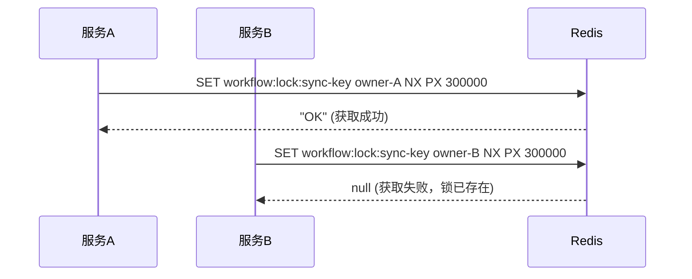
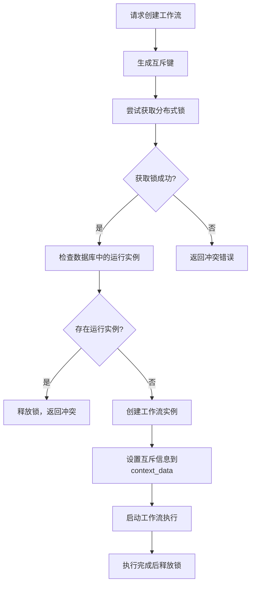
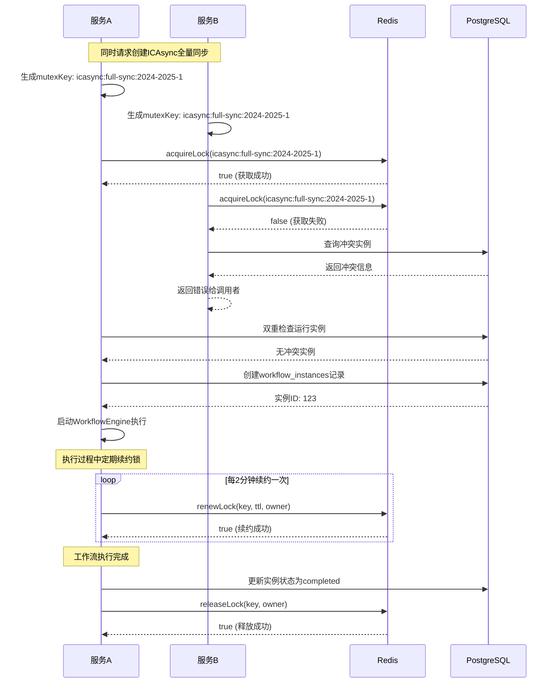
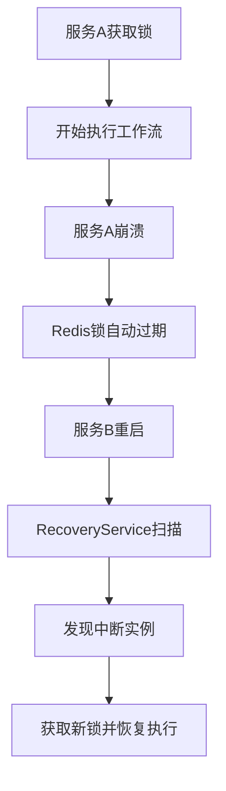

# 分布式锁实现机制详解

## 🔒 核心设计原理

### 1. Redis分布式锁基础实现

分布式锁基于Redis的`SET NX PX`命令实现，具有以下特性：

```redis
SET workflow:lock:icasync:full-sync:2024-2025-1 "serviceA-12345-1703001234567" NX PX 300000
```

- **NX**: 只有键不存在时才设置（Not eXists）
- **PX**: 设置毫秒级过期时间（300000ms = 5分钟）
- **锁值**: `{serviceId}-{processId}-{timestamp}` 唯一标识锁的拥有者

### 2. 分布式锁的三个关键操作

#### 2.1 获取锁（acquireLock）

```typescript
async acquireLock(key: string, ttl: number, owner: string): Promise<boolean> {
  const lockKey = this.lockPrefix + key;
  
  // 原子操作：设置键值对，只有不存在时才成功
  const result = await this.redis.set(lockKey, owner, 'PX', ttl, 'NX');
  
  return result === 'OK'; // 成功返回true，失败返回false
}
```

**时序图**：


#### 2.2 释放锁（releaseLock）

```typescript
async releaseLock(key: string, owner: string): Promise<boolean> {
  const lockKey = this.lockPrefix + key;
  
  // 使用Lua脚本确保原子性：只有锁的拥有者才能释放
  const luaScript = `
    if redis.call("get", KEYS[1]) == ARGV[1] then
      return redis.call("del", KEYS[1])
    else
      return 0
    end
  `;
  
  const result = await this.redis.eval(luaScript, 1, lockKey, owner);
  return result === 1;
}
```

**为什么需要Lua脚本？**
- 确保`GET`和`DEL`操作的原子性
- 防止释放别人的锁（锁被其他进程获取）
- 避免竞态条件

#### 2.3 续约锁（renewLock）

```typescript
async renewLock(key: string, ttl: number, owner: string): Promise<boolean> {
  const lockKey = this.lockPrefix + key;
  
  // 原子续约：只有锁的拥有者才能续约
  const luaScript = `
    if redis.call("get", KEYS[1]) == ARGV[1] then
      return redis.call("pexpire", KEYS[1], ARGV[2])
    else
      return 0
    end
  `;
  
  const result = await this.redis.eval(luaScript, 1, lockKey, owner, ttl);
  return result === 1;
}
```

## 🎭 工作流互斥控制实现

### 1. 互斥键生成策略

```typescript
// ICAsync同步的互斥键生成
class ICAsyncMutexManager {
  // 全量同步互斥键
  getFullSyncMutexKey(xnxq: string): string {
    return `icasync:full-sync:${xnxq}`;
  }
  
  // 增量同步互斥键
  getIncrementalSyncMutexKey(xnxq: string): string {
    return `icasync:incremental-sync:${xnxq}`;
  }
  
  // 用户同步互斥键
  getUserSyncMutexKey(xnxq: string): string {
    return `icasync:user-sync:${xnxq}`;
  }
}
```

### 2. 互斥工作流创建流程



### 3. 互斥控制代码实现

```typescript
async createMutexWorkflow(
  workflowDefinition: any,
  inputs: Record<string, any>,
  mutexKey: string,
  options?: any
): Promise<MutexWorkflowResult> {
  const lockKey = this.getMutexLockKey(mutexKey);
  const owner = `create-${process.pid}-${Date.now()}`;

  try {
    // 1. 尝试获取互斥锁（5分钟锁定）
    const lockAcquired = await this.lockService.acquireLock(
      lockKey,
      300000, // 5分钟
      owner
    );

    if (!lockAcquired) {
      // 检查冲突实例
      const conflictingInstance = await this.findConflictingInstance(mutexKey);
      return {
        success: false,
        error: '存在冲突的工作流实例，无法创建新实例',
        conflictingInstance
      };
    }

    // 2. 双重检查：查询数据库确认没有运行中的同类型实例
    const runningInstance = await this.findRunningMutexInstance(mutexKey);
    if (runningInstance) {
      await this.lockService.releaseLock(lockKey, owner);
      return {
        success: false,
        error: '已存在运行中的同类型工作流实例',
        conflictingInstance: runningInstance
      };
    }

    // 3. 创建工作流实例，并在context_data中记录互斥信息
    const createResult = await this.workflowAdapter.createWorkflow(
      workflowDefinition,
      inputs,
      {
        ...options,
        contextData: {
          ...options?.contextData,
          mutexKey,           // 互斥键
          mutexOwner: owner,  // 锁拥有者
          lockAcquiredAt: new Date().toISOString()
        }
      }
    );

    if (!createResult.success) {
      await this.lockService.releaseLock(lockKey, owner);
      return {
        success: false,
        error: createResult.error
      };
    }

    // 4. 记录互斥实例信息
    const instance = createResult.data;
    await this.registerMutexInstance(mutexKey, instance.id.toString());

    return {
      success: true,
      instance
    };

  } catch (error) {
    // 确保释放锁
    await this.lockService.releaseLock(lockKey, owner);
    throw error;
  }
}
```

## 🔄 多服务环境下的执行保证

### 1. 完整的执行时序图



### 2. 关键保证机制

#### 2.1 双重检查机制

```typescript
// 1. Redis锁检查（快速失败）
const lockAcquired = await this.lockService.acquireLock(mutexKey);
if (!lockAcquired) {
  return { success: false, error: 'Redis锁获取失败' };
}

// 2. 数据库状态检查（双重确认）
const runningInstance = await this.findRunningMutexInstance(mutexKey);
if (runningInstance) {
  await this.lockService.releaseLock(mutexKey); // 释放Redis锁
  return { success: false, error: '数据库中存在运行实例' };
}
```

#### 2.2 锁续约机制

```typescript
class LockManager {
  private renewalIntervals = new Map<string, NodeJS.Timeout>();
  
  async startLockRenewal(key: string, owner: string, ttl: number): Promise<void> {
    const renewalInterval = setInterval(async () => {
      const renewed = await this.lockService.renewLock(key, ttl, owner);
      if (!renewed) {
        this.logger.warn('锁续约失败，可能已过期', { key, owner });
        this.stopLockRenewal(key);
      }
    }, ttl * 0.3); // 在TTL的30%时间间隔续约
    
    this.renewalIntervals.set(key, renewalInterval);
  }
  
  stopLockRenewal(key: string): void {
    const interval = this.renewalIntervals.get(key);
    if (interval) {
      clearInterval(interval);
      this.renewalIntervals.delete(key);
    }
  }
}
```

#### 2.3 异常处理和恢复

```typescript
class WorkflowRecoveryService {
  /**
   * 服务重启后检查并恢复中断的工作流
   */
  async recoverInterruptedWorkflows(): Promise<void> {
    // 1. 查找状态为running但可能已中断的实例
    const instances = await this.findPotentiallyInterruptedInstances();
    
    for (const instance of instances) {
      const mutexKey = instance.contextData?.mutexKey;
      if (!mutexKey) continue;
      
      const lockKey = this.getInstanceLockKey(instance.id.toString());
      
      // 2. 检查Redis锁状态
      const hasLock = await this.lockService.hasLock(lockKey);
      if (hasLock) {
        // 锁存在，说明在其他节点运行，跳过
        continue;
      }
      
      // 3. 尝试获取锁并恢复执行
      const lockAcquired = await this.lockService.acquireLock(
        lockKey,
        60000, // 1分钟锁定
        `recovery-${process.pid}-${Date.now()}`
      );
      
      if (lockAcquired) {
        await this.resumeWorkflowExecution(instance);
      }
    }
  }
  
  /**
   * 判断实例是否可能中断（超过5分钟没有更新）
   */
  private async isInstanceInterrupted(instance: WorkflowInstance): Promise<boolean> {
    const lastUpdate = new Date(instance.updatedAt);
    const now = new Date();
    const timeDiff = now.getTime() - lastUpdate.getTime();
    
    // 超过5分钟没有更新，认为可能已中断
    const INTERRUPT_THRESHOLD = 5 * 60 * 1000;
    return timeDiff > INTERRUPT_THRESHOLD;
  }
}
```

## 🛡️ 故障场景和处理

### 1. 常见故障场景

#### 场景1：服务A获取锁后崩溃



**解决方案**：
- Redis锁设置TTL自动过期
- RecoveryService定期扫描中断实例
- 通过时间戳判断实例是否真正中断

#### 场景2：网络分区导致锁失效

```typescript
// 锁续约失败处理
async handleLockRenewalFailure(instanceId: string, mutexKey: string): Promise<void> {
  this.logger.warn('锁续约失败，准备优雅停止工作流', { instanceId, mutexKey });
  
  // 1. 停止当前工作流执行
  await this.workflowEngine.pauseWorkflow(instanceId);
  
  // 2. 更新实例状态
  await this.workflowInstanceRepository.updateStatus(
    Number(instanceId),
    'paused',
    {
      paused_at: new Date(),
      error_message: '锁续约失败，工作流已暂停'
    }
  );
  
  // 3. 清理本地资源
  this.cleanupLocalResources(instanceId);
}
```

#### 场景3：Redis故障

```typescript
class FallbackLockService {
  constructor(
    private primaryLock: DistributedLockService,
    private fallbackLock: DatabaseLockService // 基于数据库的备用锁
  ) {}
  
  async acquireLock(key: string, ttl: number, owner: string): Promise<boolean> {
    try {
      // 优先使用Redis锁
      return await this.primaryLock.acquireLock(key, ttl, owner);
    } catch (error) {
      this.logger.warn('Redis锁获取失败，使用数据库锁', { error });
      // 降级到数据库锁
      return await this.fallbackLock.acquireLock(key, ttl, owner);
    }
  }
}
```

### 2. 监控和告警

```typescript
class LockMonitorService {
  /**
   * 监控锁的健康状态
   */
  async monitorLockHealth(): Promise<void> {
    const activeLocks = await this.getActiveLocks();
    
    for (const lock of activeLocks) {
      // 检查锁是否即将过期
      if (lock.ttl < 60000) { // 小于1分钟
        this.alertManager.sendAlert({
          type: 'LOCK_EXPIRING',
          message: `锁即将过期: ${lock.key}`,
          severity: 'WARNING'
        });
      }
      
      // 检查锁的拥有者是否仍在运行
      const ownerAlive = await this.checkOwnerHealth(lock.owner);
      if (!ownerAlive) {
        this.alertManager.sendAlert({
          type: 'LOCK_OWNER_DEAD',
          message: `锁拥有者不响应: ${lock.key}`,
          severity: 'CRITICAL'
        });
      }
    }
  }
}
```

## 📊 性能优化

### 1. 锁粒度优化

```typescript
// 细粒度锁 - 按学期和类型分别加锁
const fullSyncKey = `icasync:full-sync:${xnxq}`;      // 全量同步锁
const incrSyncKey = `icasync:incr-sync:${xnxq}`;      // 增量同步锁
const userSyncKey = `icasync:user-sync:${xnxq}`;      // 用户同步锁

// 允许不同类型的同步并行执行
```

### 2. 锁超时策略

```typescript
const LOCK_TIMEOUTS = {
  'full-sync': 120 * 60 * 1000,    // 全量同步：2小时
  'incremental-sync': 30 * 60 * 1000, // 增量同步：30分钟
  'user-sync': 60 * 60 * 1000      // 用户同步：1小时
};
```

### 3. 批量锁管理

```typescript
class BatchLockManager {
  async acquireMultipleLocks(lockKeys: string[]): Promise<Map<string, boolean>> {
    const results = new Map<string, boolean>();
    
    // 使用Redis Pipeline批量执行
    const pipeline = this.redis.pipeline();
    
    for (const key of lockKeys) {
      pipeline.set(`workflow:lock:${key}`, this.owner, 'PX', this.ttl, 'NX');
    }
    
    const pipelineResults = await pipeline.exec();
    
    pipelineResults?.forEach((result, index) => {
      const success = result[1] === 'OK';
      results.set(lockKeys[index], success);
    });
    
    return results;
  }
}
```

通过这套完整的分布式锁机制，可以确保在多服务环境下，同一类型的ICAsync同步工作流实例只会在一个服务节点上执行，有效避免了数据竞争和重复处理的问题。