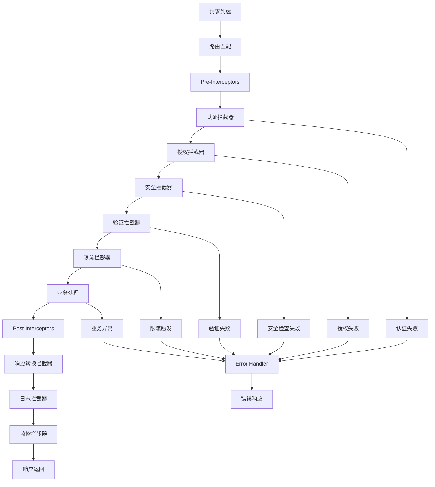

# @stratix/gateway 架构设计

## 概述

`@stratix/gateway` 是基于 Stratix 框架的统一 API 网关插件，采用 AOP（面向切面编程）的方式实现横切关注点的统一处理，为微服务架构提供统一的入口和安全防护。

## 核心架构

### 系统分层架构

```
┌─────────────────────────────────────────────────────────────┐
│                    Gateway Entry Layer                      │
│  ┌─────────────────┐  ┌─────────────────┐  ┌──────────────┐ │
│  │ Route Matcher   │  │ Request Router  │  │ Load Balancer│ │
│  │                 │  │                 │  │              │ │
│  │ - 路由匹配      │  │ - 请求路由      │  │ - 负载均衡   │ │
│  │ - 规则解析      │  │ - 转发控制      │  │ - 健康检查   │ │
│  │ - 优先级排序    │  │ - 重试机制      │  │ - 故障转移   │ │
│  └─────────────────┘  └─────────────────┘  └──────────────┘ │
└─────────────────────────────────────────────────────────────┘
┌─────────────────────────────────────────────────────────────┐
│                    AOP Interceptor Layer                    │
│  ┌─────────────────┐  ┌─────────────────┐  ┌──────────────┐ │
│  │ Pre-Interceptor │  │ Post-Interceptor│  │ Error Handler│ │
│  │                 │  │                 │  │              │ │
│  │ - 认证授权      │  │ - 响应转换      │  │ - 异常捕获   │ │
│  │ - 参数验证      │  │ - 响应头设置    │  │ - 错误格式化 │ │
│  │ - 安全检查      │  │ - 日志记录      │  │ - 降级处理   │ │
│  │ - 限流控制      │  │ - 监控统计      │  │ - 熔断保护   │ │
│  └─────────────────┘  └─────────────────┘  └──────────────┘ │
└─────────────────────────────────────────────────────────────┘
┌─────────────────────────────────────────────────────────────┐
│                   Security & Auth Layer                     │
│  ┌─────────────────┐  ┌─────────────────┐  ┌──────────────┐ │
│  │ Auth Manager    │  │ Security Guard  │  │ Rate Limiter │ │
│  │                 │  │                 │  │              │ │
│  │ - JWT验证       │  │ - CORS处理      │  │ - 令牌桶算法 │ │
│  │ - API Key验证   │  │ - XSS防护       │  │ - 滑动窗口   │ │
│  │ - OAuth2验证    │  │ - CSRF防护      │  │ - 分布式限流 │ │
│  │ - 权限控制      │  │ - 安全头注入    │  │ - 动态配置   │ │
│  └─────────────────┘  └─────────────────┘  └──────────────┘ │
└─────────────────────────────────────────────────────────────┘
┌─────────────────────────────────────────────────────────────┐
│                  Monitoring & Logging Layer                 │
│  ┌─────────────────┐  ┌─────────────────┐  ┌──────────────┐ │
│  │ Request Logger  │  │ Metrics Collector│ │ Health Check │ │
│  │                 │  │                 │  │              │ │
│  │ - 访问日志      │  │ - 性能指标      │  │ - 服务状态   │ │
│  │ - 错误日志      │  │ - 业务指标      │  │ - 依赖检查   │ │
│  │ - 审计日志      │  │ - 系统指标      │  │ - 自动恢复   │ │
│  │ - 结构化输出    │  │ - 实时统计      │  │ - 告警通知   │ │
│  └─────────────────┘  └─────────────────┘  └──────────────┘ │
└─────────────────────────────────────────────────────────────┘
```

## AOP 拦截器设计

### 拦截器执行流程



### 拦截器链模式

```typescript
interface Interceptor {
  name: string;
  order: number;
  preHandle(request: FastifyRequest, reply: FastifyReply): Promise<boolean>;
  postHandle(request: FastifyRequest, reply: FastifyReply, result?: any): Promise<void>;
  afterCompletion(request: FastifyRequest, reply: FastifyReply, error?: Error): Promise<void>;
}

interface InterceptorChain {
  addInterceptor(interceptor: Interceptor): void;
  removeInterceptor(name: string): void;
  execute(request: FastifyRequest, reply: FastifyReply): Promise<void>;
}
```

## 核心组件设计

### 1. Gateway Manager (网关管理器)
- **职责**: 统一管理网关的配置、路由、拦截器
- **功能**:
  - 路由规则管理
  - 拦截器链管理
  - 配置热更新
  - 服务发现集成

### 2. Route Manager (路由管理器)
- **职责**: 管理API路由和转发规则
- **功能**:
  - 动态路由配置
  - 路径匹配算法
  - 负载均衡策略
  - 健康检查机制

### 3. Auth Manager (认证管理器)
- **职责**: 统一认证和授权处理
- **功能**:
  - 多种认证方式支持
  - 权限验证
  - 令牌管理
  - 用户会话管理

### 4. Security Guard (安全防护器)
- **职责**: 提供全面的安全防护
- **功能**:
  - CORS策略配置
  - XSS/CSRF防护
  - 安全头注入
  - 恶意请求检测

### 5. Rate Limiter (限流器)
- **职责**: 实现API访问限流
- **功能**:
  - 多种限流算法
  - 分布式限流
  - 动态限流配置
  - 限流统计分析

### 6. Circuit Breaker (熔断器)
- **职责**: 提供服务熔断保护
- **功能**:
  - 故障检测
  - 熔断状态管理
  - 降级策略
  - 自动恢复机制

### 7. Request Validator (请求验证器)
- **职责**: 验证请求参数和格式
- **功能**:
  - JSON Schema验证
  - 参数类型检查
  - 业务规则验证
  - 自定义验证器

### 8. Response Transformer (响应转换器)
- **职责**: 统一响应格式和转换
- **功能**:
  - 响应格式标准化
  - 数据脱敏处理
  - 响应头设置
  - 内容压缩

### 9. Metrics Collector (指标收集器)
- **职责**: 收集和统计各种指标
- **功能**:
  - 性能指标收集
  - 业务指标统计
  - 实时监控数据
  - 告警触发

### 10. Logger Manager (日志管理器)
- **职责**: 统一日志记录和管理
- **功能**:
  - 结构化日志输出
  - 日志级别控制
  - 日志轮转管理
  - 审计日志记录

## 配置系统设计

### 配置层次结构

```yaml
gateway:
  # 全局配置
  global:
    timeout: 30000
    retries: 3
    
  # 路由配置
  routes:
    - path: "/api/v1/**"
      target: "http://backend-service:3000"
      methods: ["GET", "POST"]
      auth: true
      rateLimit: 100
      
  # 认证配置
  auth:
    jwt:
      secret: "your-secret-key"
      expiresIn: "1h"
    apiKey:
      header: "X-API-Key"
      
  # 安全配置
  security:
    cors:
      origin: ["http://localhost:3000"]
      credentials: true
    headers:
      xss: true
      csrf: true
      
  # 限流配置
  rateLimit:
    global: 1000
    window: 60000
    
  # 监控配置
  monitoring:
    metrics: true
    logging: true
```

## 扩展机制

### 插件化架构

```typescript
interface GatewayPlugin {
  name: string;
  version: string;
  install(gateway: GatewayManager): Promise<void>;
  uninstall(gateway: GatewayManager): Promise<void>;
}

interface MiddlewarePlugin extends GatewayPlugin {
  middleware: FastifyMiddleware;
  order: number;
}

interface InterceptorPlugin extends GatewayPlugin {
  interceptor: Interceptor;
}
```

### 自定义拦截器

```typescript
class CustomAuthInterceptor implements Interceptor {
  name = 'customAuth';
  order = 100;
  
  async preHandle(request: FastifyRequest, reply: FastifyReply): Promise<boolean> {
    // 自定义认证逻辑
    return true;
  }
  
  async postHandle(request: FastifyRequest, reply: FastifyReply): Promise<void> {
    // 后置处理逻辑
  }
  
  async afterCompletion(request: FastifyRequest, reply: FastifyReply, error?: Error): Promise<void> {
    // 完成后处理逻辑
  }
}
```

## 性能优化

### 缓存策略
- 路由规则缓存
- 认证结果缓存
- 配置信息缓存
- 响应内容缓存

### 连接池管理
- HTTP连接池
- 数据库连接池
- Redis连接池
- 第三方服务连接池

### 异步处理
- 非阻塞I/O
- 异步日志写入
- 异步指标收集
- 异步通知发送

## 高可用设计

### 故障恢复
- 自动重试机制
- 故障转移策略
- 降级处理方案
- 熔断保护机制

### 负载均衡
- 轮询算法
- 加权轮询
- 最少连接
- 一致性哈希

### 健康检查
- 主动健康检查
- 被动健康检查
- 服务状态监控
- 自动摘除故障节点
