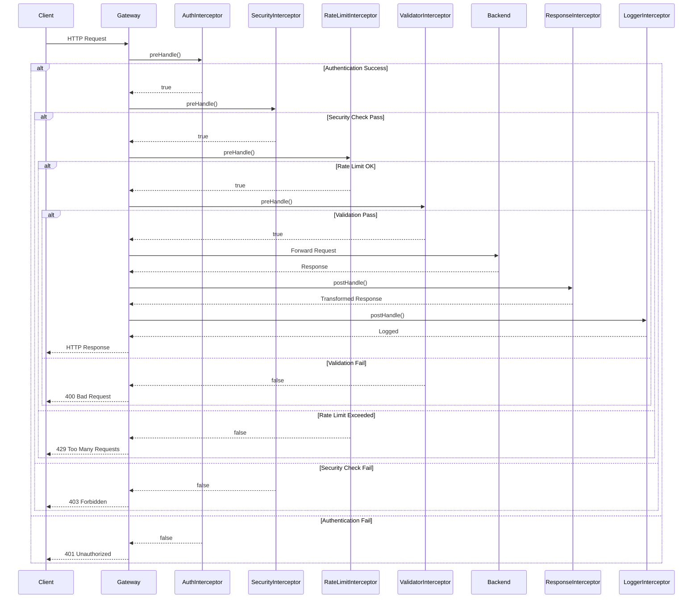
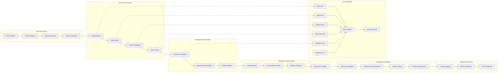

# @stratix/gateway 组件设计

## 核心组件关系图

```mermaid
graph TB
    subgraph "Gateway Core"
        GM[GatewayManager]
        RM[RouteManager]
        IC[InterceptorChain]
    end
    
    subgraph "Authentication & Authorization"
        AM[AuthManager]
        JWT[JWTProvider]
        API[APIKeyProvider]
        OAuth[OAuth2Provider]
        RBAC[RBACManager]
    end
    
    subgraph "Security & Protection"
        SG[SecurityGuard]
        CORS[CORSHandler]
        XSS[XSSProtection]
        CSRF[CSRFProtection]
        SH[SecurityHeaders]
    end
    
    subgraph "Rate Limiting & Circuit Breaking"
        RL[RateLimiter]
        TB[TokenBucket]
        SW[SlidingWindow]
        CB[CircuitBreaker]
        FB[Fallback]
    end
    
    subgraph "Request & Response Processing"
        RV[RequestValidator]
        RT[ResponseTransformer]
        PC[PayloadConverter]
        HC[HeaderController]
    end
    
    subgraph "Monitoring & Logging"
        MC[MetricsCollector]
        LM[LoggerManager]
        AL[AccessLogger]
        EL[ErrorLogger]
        PM[PerformanceMonitor]
    end
    
    subgraph "Configuration & Management"
        CM[ConfigManager]
        HU[HotUpdate]
        SD[ServiceDiscovery]
        HC2[HealthChecker]
    end
    
    GM --> RM
    GM --> IC
    GM --> CM
    
    IC --> AM
    IC --> SG
    IC --> RL
    IC --> RV
    IC --> RT
    IC --> MC
    
    AM --> JWT
    AM --> API
    AM --> OAuth
    AM --> RBAC
    
    SG --> CORS
    SG --> XSS
    SG --> CSRF
    SG --> SH
    
    RL --> TB
    RL --> SW
    RL --> CB
    RL --> FB
    
    RT --> PC
    RT --> HC
    
    MC --> LM
    MC --> AL
    MC --> EL
    MC --> PM
    
    CM --> HU
    CM --> SD
    CM --> HC2
```



## 拦截器执行时序图



## 数据流图



## 组件接口设计

### 1. 核心接口

```typescript
// 网关管理器接口
interface IGatewayManager {
  initialize(): Promise<void>;
  registerRoute(route: RouteConfig): void;
  addInterceptor(interceptor: Interceptor): void;
  removeInterceptor(name: string): void;
  updateConfig(config: GatewayConfig): Promise<void>;
  getMetrics(): GatewayMetrics;
  shutdown(): Promise<void>;
}

// 拦截器接口
interface Interceptor {
  name: string;
  order: number;
  enabled: boolean;
  preHandle(context: RequestContext): Promise<InterceptorResult>;
  postHandle(context: RequestContext, response: any): Promise<void>;
  afterCompletion(context: RequestContext, error?: Error): Promise<void>;
}

// 请求上下文接口
interface RequestContext {
  request: FastifyRequest;
  reply: FastifyReply;
  route: RouteConfig;
  user?: UserInfo;
  metadata: Map<string, any>;
  startTime: number;
  traceId: string;
}
```

### 2. 认证授权接口

```typescript
// 认证提供者接口
interface AuthProvider {
  name: string;
  authenticate(request: FastifyRequest): Promise<AuthResult>;
  validate(token: string): Promise<UserInfo>;
  refresh(refreshToken: string): Promise<TokenPair>;
}

// 授权管理器接口
interface AuthorizationManager {
  authorize(user: UserInfo, resource: string, action: string): Promise<boolean>;
  hasPermission(user: UserInfo, permission: string): boolean;
  hasRole(user: UserInfo, role: string): boolean;
  getPermissions(user: UserInfo): string[];
}
```

### 3. 安全防护接口

```typescript
// 安全防护接口
interface SecurityGuard {
  validateCORS(request: FastifyRequest): boolean;
  preventXSS(content: string): string;
  validateCSRF(request: FastifyRequest): boolean;
  injectSecurityHeaders(reply: FastifyReply): void;
  detectMaliciousRequest(request: FastifyRequest): boolean;
}

// 限流器接口
interface RateLimiter {
  isAllowed(key: string, limit: number, window: number): Promise<boolean>;
  getRemainingQuota(key: string): Promise<number>;
  reset(key: string): Promise<void>;
  getStatistics(key: string): Promise<RateLimitStats>;
}
```

### 4. 监控日志接口

```typescript
// 指标收集器接口
interface MetricsCollector {
  incrementCounter(name: string, labels?: Record<string, string>): void;
  recordHistogram(name: string, value: number, labels?: Record<string, string>): void;
  setGauge(name: string, value: number, labels?: Record<string, string>): void;
  getMetrics(): Promise<MetricsData>;
}

// 日志管理器接口
interface LoggerManager {
  logAccess(context: RequestContext, response: any): void;
  logError(context: RequestContext, error: Error): void;
  logSecurity(context: RequestContext, event: SecurityEvent): void;
  logPerformance(context: RequestContext, metrics: PerformanceMetrics): void;
}
```

## 配置模型

### 路由配置模型

```typescript
interface RouteConfig {
  id: string;
  path: string;
  methods: HttpMethod[];
  target: string | TargetConfig[];
  auth?: AuthConfig;
  security?: SecurityConfig;
  rateLimit?: RateLimitConfig;
  validation?: ValidationConfig;
  transformation?: TransformationConfig;
  caching?: CachingConfig;
  timeout?: number;
  retries?: number;
  metadata?: Record<string, any>;
}

interface TargetConfig {
  url: string;
  weight: number;
  healthCheck?: HealthCheckConfig;
  timeout?: number;
}
```

### 认证配置模型

```typescript
interface AuthConfig {
  required: boolean;
  providers: string[];
  permissions?: string[];
  roles?: string[];
  skipPaths?: string[];
  customValidator?: string;
}

interface JWTConfig {
  secret: string;
  algorithm: string;
  expiresIn: string;
  issuer?: string;
  audience?: string;
  clockTolerance?: number;
}
```

### 安全配置模型

```typescript
interface SecurityConfig {
  cors?: CORSConfig;
  xss?: XSSConfig;
  csrf?: CSRFConfig;
  headers?: SecurityHeadersConfig;
  rateLimit?: RateLimitConfig;
  ipWhitelist?: string[];
  ipBlacklist?: string[];
}

interface CORSConfig {
  origin: string | string[] | boolean;
  methods: string[];
  allowedHeaders: string[];
  exposedHeaders: string[];
  credentials: boolean;
  maxAge: number;
}
```

## 错误处理模型

### 错误分类

```typescript
enum ErrorType {
  AUTHENTICATION_ERROR = 'AUTHENTICATION_ERROR',
  AUTHORIZATION_ERROR = 'AUTHORIZATION_ERROR',
  VALIDATION_ERROR = 'VALIDATION_ERROR',
  RATE_LIMIT_ERROR = 'RATE_LIMIT_ERROR',
  SECURITY_ERROR = 'SECURITY_ERROR',
  BACKEND_ERROR = 'BACKEND_ERROR',
  TIMEOUT_ERROR = 'TIMEOUT_ERROR',
  CIRCUIT_BREAKER_ERROR = 'CIRCUIT_BREAKER_ERROR',
  INTERNAL_ERROR = 'INTERNAL_ERROR'
}

interface GatewayError extends Error {
  type: ErrorType;
  code: string;
  statusCode: number;
  details?: Record<string, any>;
  timestamp: Date;
  traceId: string;
}
```

### 错误响应格式

```typescript
interface ErrorResponse {
  success: false;
  error: {
    type: string;
    code: string;
    message: string;
    details?: Record<string, any>;
    timestamp: string;
    traceId: string;
    path: string;
  };
}
```

## 扩展点设计

### 插件扩展点

```typescript
interface GatewayPlugin {
  name: string;
  version: string;
  dependencies?: string[];
  
  // 生命周期钩子
  onInstall?(gateway: IGatewayManager): Promise<void>;
  onUninstall?(gateway: IGatewayManager): Promise<void>;
  onConfigUpdate?(config: any): Promise<void>;
  
  // 扩展点
  interceptors?: Interceptor[];
  authProviders?: AuthProvider[];
  validators?: Validator[];
  transformers?: Transformer[];
  middlewares?: FastifyMiddleware[];
}
```

### 自定义拦截器扩展

```typescript
abstract class BaseInterceptor implements Interceptor {
  abstract name: string;
  abstract order: number;
  enabled: boolean = true;
  
  async preHandle(context: RequestContext): Promise<InterceptorResult> {
    return { continue: true };
  }
  
  async postHandle(context: RequestContext, response: any): Promise<void> {
    // 默认实现
  }
  
  async afterCompletion(context: RequestContext, error?: Error): Promise<void> {
    // 默认实现
  }
  
  protected getConfig<T>(key: string): T {
    // 获取配置的辅助方法
  }
  
  protected getLogger(): Logger {
    // 获取日志器的辅助方法
  }
}
```
