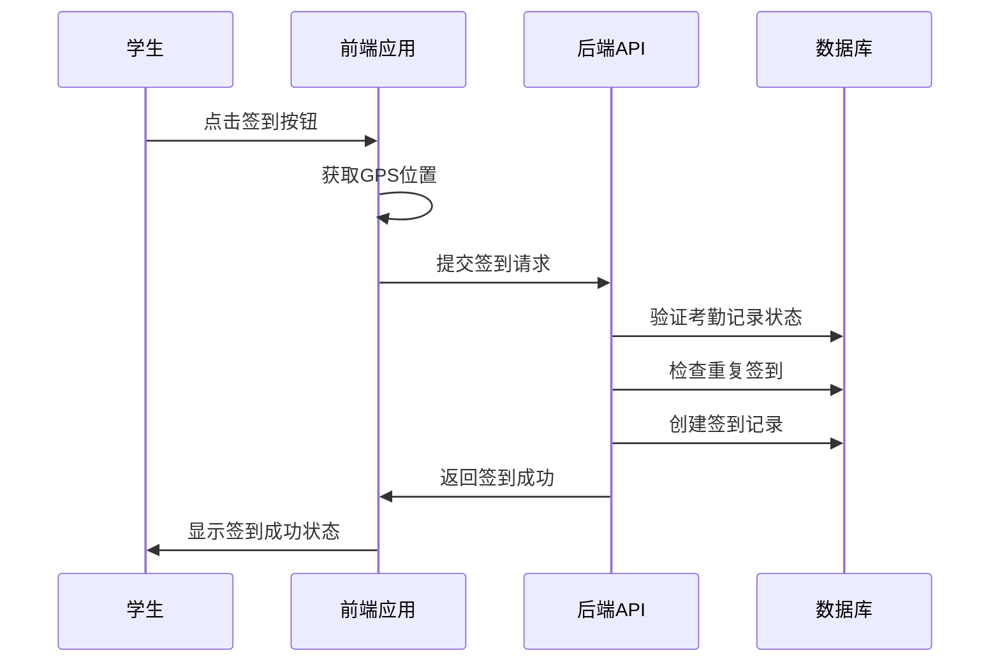
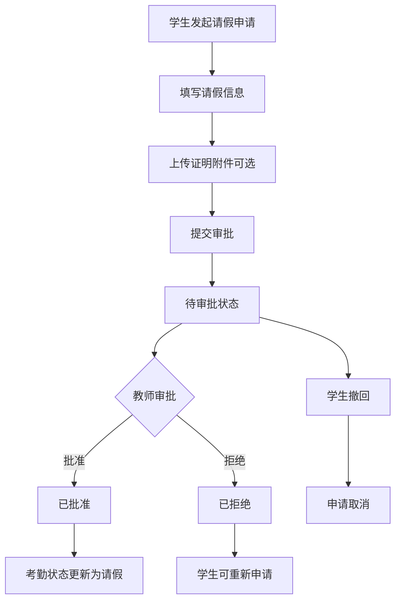
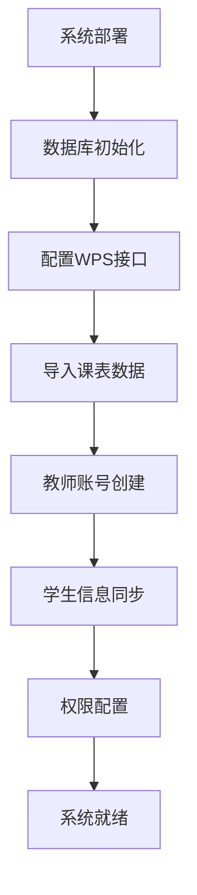
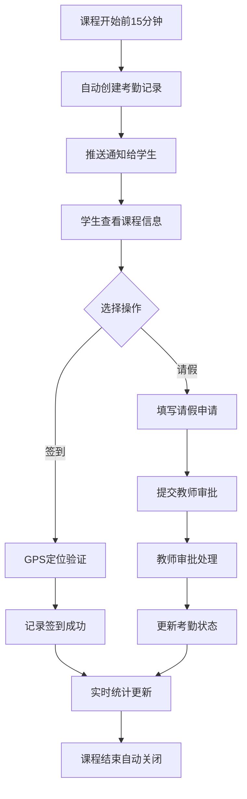
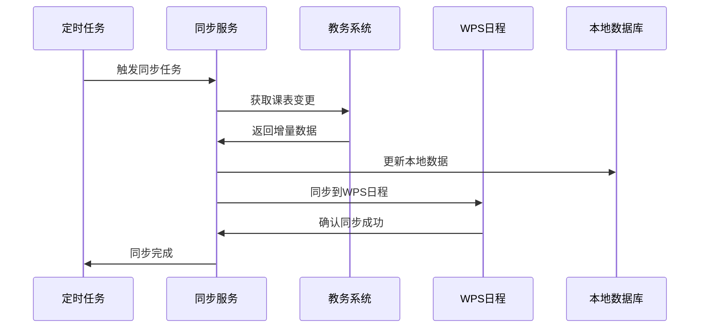
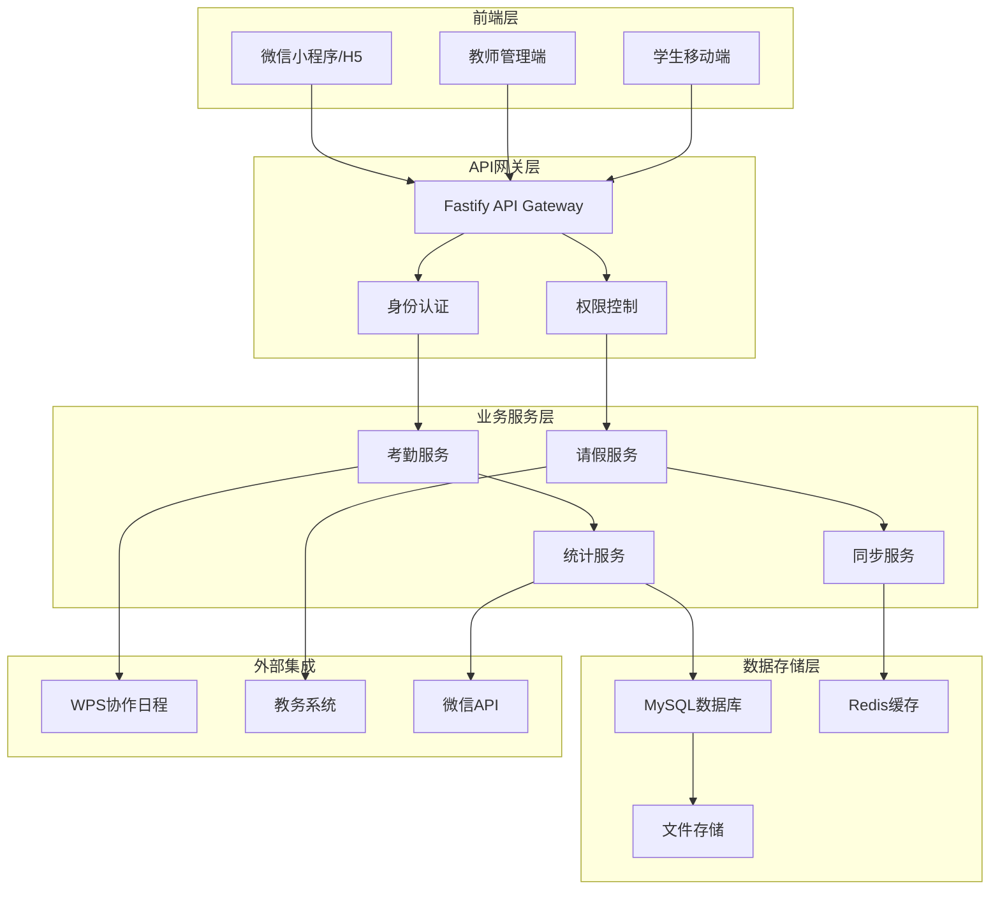
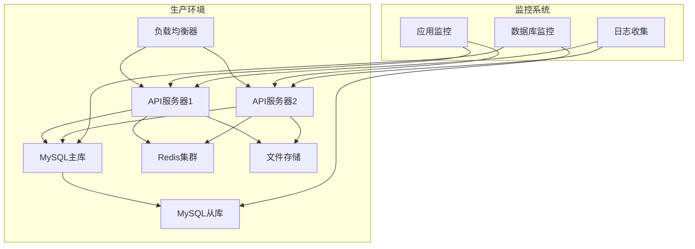

# @stratix/icalink 智能考勤系统方案说明

## 🎯 系统概述

@stratix/icalink 是一个基于微信生态的智能考勤管理系统，专为高校课程考勤场景设计。系统整合了课表同步、实时签到、请假管理、教师审批、统计分析等核心功能，为教师和学生提供便捷、高效的考勤体验。

### 核心特性
- 🔄 **智能同步**：与WPS协作日程无缝对接，自动同步课表信息
- 📱 **移动优先**：基于微信小程序/H5，随时随地完成考勤操作
- 🎯 **精准定位**：支持GPS定位签到，确保考勤真实性
- ⚡ **实时统计**：教师端实时查看签到情况和历史数据分析
- 🔧 **灵活配置**：支持多种请假类型和审批流程定制

---

## 📋 功能模块详解

### 1. 数据同步模块

#### 1.1 课表信息同步
- **数据来源**：对接学校教务系统，获取完整课表数据
- **同步范围**：课程信息、教师信息、学生信息、时间安排
- **同步机制**：
  - 全量同步：系统初始化或数据重置时执行
  - 增量同步：定期更新变更数据

#### 1.2 WPS日程集成
- **双向同步**：考勤数据与WPS协作日程保持一致
- **日程创建**：自动为课程创建对应的日程事件
- **状态更新**：考勤结果实时反馈到日程系统

#### 1.3 数据存储结构
```sql
-- 考勤记录表
icalink_attendance_records: 存储考勤基础信息
-- 学生考勤表  
icalink_student_attendance: 记录学生具体签到状态
-- 请假申请表
icalink_leave_applications: 管理请假申请流程
-- 课程表信息
icalink_course_schedules: 课程时间和地点信息
```

### 2. 学生签到模块

#### 2.1 签到界面功能
![学生签到界面示例]

**核心功能组件：**
- **学生信息展示**：姓名、学号、班级、专业
- **课程详情**：课程名称、时间、地点、教师、教学周次
- **签到状态**：实时显示当前签到状态和时间
- **操作按钮**：签到按钮、请假按钮
- **时间限制提示**：显示有效签到时间窗口

#### 2.2 签到流程设计


#### 2.3 技术实现细节
- **定位验证**：GPS坐标校验，确保在教室范围内
- **时间窗口**：支持课前N分钟到课后M分钟的签到时间
- **防作弊机制**：IP地址记录、设备指纹识别
- **离线支持**：网络异常时本地缓存，恢复后自动提交

### 3. 请假管理模块

#### 3.1 学生请假申请
![请假申请界面示例]

**申请表单元素：**
- **课程信息**：自动填充课程详情
- **请假类型**：病假、事假、紧急事假、其他
- **请假原因**：500字符以内的详细说明
- **附件上传**：支持最多3个证明文件
- **提交确认**：一键提交审批流程

#### 3.2 请假状态管理
![请假状态查看界面]

**状态分类：**
- **待审批**：已提交，等待教师处理（支持撤回）
- **已批准**：教师同意请假申请
- **已拒绝**：教师拒绝请假申请

#### 3.3 请假业务流程


### 4. 教师审批模块

#### 4.1 请假审批界面
![教师审批界面示例]

**审批信息展示：**
- **学生详情**：姓名、学号、班级、专业
- **课程信息**：课程名称、时间、地点、教学周次  
- **请假详情**：类型、日期、原因
- **附件查看**：支持在线预览和下载
- **审批操作**：批准/拒绝按钮，审批意见

#### 4.2 审批决策支持
- **历史记录**：查看学生历史请假情况
- **出勤统计**：学生整体出勤率参考
- **快捷审批**：常用审批理由模板
- **批量操作**：支持批量审批多个申请

### 5. 实时统计模块

#### 5.1 本节课签到统计
![本节课统计界面示例]

**实时数据展示：**
- **课程基本信息**：名称、时间、地点、教师
- **签到概况**：总人数、已签到、请假、缺勤
- **学生明细**：每个学生的具体状态
- **动态更新**：签到状态实时刷新

#### 5.2 历史统计分析
![历史统计界面示例]

**统计维度：**
- **课程统计**：按课程查看历史考勤数据
- **时间统计**：按教学周、月份统计出勤情况
- **学生统计**：个人出勤率和考勤记录
- **趋势分析**：出勤率变化趋势图表

#### 5.3 个人数据统计
![个人统计界面示例]

**教师个人视图：**
- **课程总览**：总课节数、班级人数、整体出勤率
- **学生排名**：按出勤率排序的学生列表
- **最近记录**：最新的考勤活动记录
- **数据导出**：支持Excel格式导出

---

## 🔄 业务流程设计

### 1. 系统初始化流程


### 2. 日常考勤流程


### 3. 数据同步流程


---

## 🏗️ 技术架构设计

### 1. 整体架构图


### 2. 核心技术栈

#### 2.1 后端技术
- **框架**：Fastify + TypeScript
- **数据库**：MySQL 8.0 + Kysely ORM
- **缓存**：Redis
- **认证**：JWT + WPS OAuth
- **任务队列**：@stratix/queue
- **日志**：结构化日志记录

#### 2.2 前端技术  
- **框架**：React + TypeScript
- **构建工具**：Vite
- **状态管理**：Zustand
- **UI组件**：基于微信设计规范
- **网络请求**：基于fetch的API客户端

#### 2.3 DevOps工具
- **包管理**：pnpm + monorepo
- **构建**：Turbo
- **版本管理**：Changesets
- **代码质量**：ESLint + Prettier + TypeScript

### 3. 数据库设计

#### 3.1 核心表结构
```sql
-- 考勤记录主表
CREATE TABLE icalink_attendance_records (
    id VARCHAR(200) PRIMARY KEY COMMENT '唯一标识',
    kkh VARCHAR(60) NOT NULL COMMENT '开课号',
    xnxq VARCHAR(20) NOT NULL COMMENT '学年学期',
    rq DATE NOT NULL COMMENT '上课日期',
    jc_s VARCHAR(50) NOT NULL COMMENT '节次串',
    kcmc VARCHAR(200) NOT NULL COMMENT '课程名称',
    status ENUM('active','closed') DEFAULT 'active' COMMENT '状态',
    total_count INT DEFAULT 0 COMMENT '应到人数',
    checkin_count INT DEFAULT 0 COMMENT '实到人数',
    leave_count INT DEFAULT 0 COMMENT '请假人数',
    absent_count INT DEFAULT 0 COMMENT '缺勤人数',
    created_at TIMESTAMP DEFAULT CURRENT_TIMESTAMP,
    updated_at TIMESTAMP DEFAULT CURRENT_TIMESTAMP ON UPDATE CURRENT_TIMESTAMP
);

-- 学生考勤详情表
CREATE TABLE icalink_student_attendance (
    id BIGINT AUTO_INCREMENT PRIMARY KEY,
    attendance_record_id VARCHAR(200) NOT NULL COMMENT '考勤记录ID',
    xh VARCHAR(50) NOT NULL COMMENT '学号',
    xm VARCHAR(100) NOT NULL COMMENT '姓名',
    status ENUM('present','absent','leave','late') NOT NULL COMMENT '状态',
    checkin_time TIMESTAMP NULL COMMENT '签到时间',
    location_info JSON COMMENT '位置信息',
    ip_address VARCHAR(45) COMMENT 'IP地址',
    created_at TIMESTAMP DEFAULT CURRENT_TIMESTAMP
);

-- 请假申请表
CREATE TABLE icalink_leave_applications (
    id BIGINT AUTO_INCREMENT PRIMARY KEY,
    attendance_record_id VARCHAR(200) NOT NULL COMMENT '关联考勤记录',
    student_xh VARCHAR(50) NOT NULL COMMENT '申请学生学号',
    leave_type ENUM('sick','personal','emergency','other') NOT NULL COMMENT '请假类型',
    reason TEXT NOT NULL COMMENT '请假原因',
    status ENUM('pending','approved','rejected','withdrawn') DEFAULT 'pending' COMMENT '审批状态',
    approver_id VARCHAR(50) COMMENT '审批人ID',
    approved_time TIMESTAMP NULL COMMENT '审批时间',
    approval_comment TEXT COMMENT '审批意见',
    created_at TIMESTAMP DEFAULT CURRENT_TIMESTAMP
);
```

#### 3.2 索引优化策略
```sql
-- 性能优化索引
CREATE INDEX idx_attendance_kkh_rq ON icalink_attendance_records(kkh, rq);
CREATE INDEX idx_student_attendance_record ON icalink_student_attendance(attendance_record_id);
CREATE INDEX idx_student_attendance_xh ON icalink_student_attendance(xh);
CREATE INDEX idx_leave_status ON icalink_leave_applications(status);
CREATE INDEX idx_leave_student ON icalink_leave_applications(student_xh);
```

---

## 🔌 API接口设计

### 1. 考勤相关接口

#### 1.1 获取考勤记录
```typescript
GET /api/attendance/:id/record?type=student|teacher

响应格式：
{
  "success": true,
  "data": {
    "course": {
      "kcmc": "数据库技术及应用",
      "course_start_time": "2025-06-27T09:50:00Z",
      "course_end_time": "2025-06-27T11:25:00Z",
      "room_s": "实验楼3405教室",
      "xm_s": "孙永锐",
      "status": "not_started"
    },
    "student": {
      "xh": "030406240106",
      "xm": "秦晓恒",
      "bjmc": "数据科学2401",
      "zymc": "数据科学"
    },
    "attendance_status": {
      "is_checked_in": false,
      "status": "not_started",
      "can_checkin": true,
      "can_leave": true
    },
    "stats": {
      "total_count": 35,
      "checkin_count": 0,
      "leave_count": 3,
      "absent_count": 33
    }
  }
}
```

#### 1.2 学生签到接口
```typescript
POST /api/attendance/:attendance_record_id/checkin

请求体：
{
  "location": "实验楼3405教室",
  "latitude": 39.9042,
  "longitude": 116.4074,
  "accuracy": 10.5,
  "remark": "正常签到"
}

响应格式：
{
  "success": true,
  "message": "签到成功",
  "data": {
    "id": "12345",
    "status": "present",
    "checkin_time": "2025-06-27T09:55:00Z",
    "approved_time": "2025-06-27T09:55:00Z"
  }
}
```

### 2. 请假相关接口

#### 2.1 提交请假申请
```typescript
POST /api/attendance/leave

请求体：
{
  "attendance_record_id": "record_123",
  "leave_type": "sick",
  "reason": "身体不适，需要就医",
  "attachments": ["file_id_1", "file_id_2"]
}

响应格式：
{
  "success": true,
  "message": "请假申请提交成功",
  "data": {
    "application_id": "leave_456",
    "status": "pending",
    "submitted_time": "2025-06-16T07:23:00Z"
  }
}
```

#### 2.2 教师审批请假
```typescript
POST /api/attendance/teacher-approve-leave

请求体：
{
  "application_id": "leave_456",
  "action": "approve", // 或 "reject"
  "comment": "同意请假，注意身体健康"
}

响应格式：
{
  "success": true,
  "message": "审批完成",
  "data": {
    "application_id": "leave_456",
    "status": "approved",
    "approved_time": "2025-06-16T08:30:00Z",
    "approver": {
      "id": "teacher_001",
      "name": "孙永锐"
    }
  }
}
```

### 3. 统计查询接口

#### 3.1 课程历史统计
```typescript
GET /api/attendance/course/:kkh/history?xnxq=2024-2025-2

响应格式：
{
  "success": true,
  "data": {
    "course_info": {
      "kkh": "CS001",
      "kcmc": "数据库技术及应用",
      "total_classes": 23,
      "overall_attendance_rate": "0.3%"
    },
    "history_records": [
      {
        "week": 17,
        "date": "2025-06-27",
        "day_of_week": "周五",
        "period": "3/4节",
        "status": "未开始",
        "stats": {
          "total": 35,
          "present": 0,
          "leave": 3,
          "absent": 33
        }
      }
    ]
  }
}
```

#### 3.2 个人课程统计
```typescript
GET /api/attendance/course/:kkh/stats?xnxq=2024-2025-2

响应格式：
{
  "success": true,
  "data": {
    "course_info": {
      "total_classes": 23,
      "total_students": 35,
      "overall_attendance_rate": "0.5%"
    },
    "teacher_info": {
      "gh": "teacher_001",
      "xm": "孙永锐"
    },
    "student_stats": [
      {
        "xh": "030406240120",
        "xm": "王一涵",
        "bjmc": "数据科学2401",
        "attendance_rate": "17.4%",
        "total_classes": 23,
        "present_count": 4,
        "leave_count": 1,
        "absent_count": 18,
        "recent_records": [
          {
            "date": "2025-07-04",
            "status": "签到"
          }
        ]
      }
    ]
  }
}
```

---

## 🚀 部署与运维

### 1. 部署架构


### 2. 性能优化策略

#### 2.1 数据库优化
- **读写分离**：查询请求路由到从库
- **连接池管理**：合理配置连接池大小
- **索引优化**：定期分析慢查询并优化索引
- **分表策略**：按学期分表存储历史数据

#### 2.2 缓存策略
- **Redis缓存**：热点数据缓存，减少数据库压力
- **浏览器缓存**：静态资源长期缓存
- **API缓存**：短期缓存频繁查询的接口响应

#### 2.3 并发处理
- **异步处理**：文件上传、消息推送等操作异步化
- **限流控制**：防止恶意刷接口
- **熔断机制**：服务降级保护核心功能

### 3. 安全保障

#### 3.1 数据安全
- **加密传输**：HTTPS/WSS协议
- **敏感数据加密**：个人信息加密存储
- **数据备份**：定期数据备份和恢复测试
- **访问控制**：基于角色的权限管理

#### 3.2 接口安全
- **身份认证**：JWT令牌验证
- **签名验证**：关键接口签名校验
- **防重放攻击**：时间戳和随机数验证
- **SQL注入防护**：参数化查询

---

## 📊 监控与告警

### 1. 业务监控指标
- **考勤活跃度**：每日签到人数、请假申请数量
- **系统性能**：API响应时间、数据库查询性能
- **错误监控**：接口错误率、异常日志统计
- **用户体验**：页面加载时间、操作成功率

### 2. 告警规则
- **服务可用性**：API服务宕机立即告警
- **数据库性能**：慢查询超过阈值告警
- **存储空间**：磁盘使用率超过80%告警
- **业务异常**：签到成功率低于95%告警

---

## 🎯 总结与展望

@stratix/icalink 智能考勤系统通过现代化的技术架构和精心设计的用户体验，为高校提供了一套完整的考勤管理解决方案。系统不仅满足了基本的签到、请假、统计需求，还通过智能化的数据分析为教学管理提供了有价值的决策支持。

### 核心价值
1. **提升效率**：自动化流程减少人工干预，提高考勤管理效率
2. **数据准确**：GPS定位和多重验证确保考勤数据真实可靠  
3. **体验优化**：移动端优先设计，操作简单流畅
4. **决策支持**：丰富的统计分析为教学改进提供数据依据

### 未来规划
- **AI智能分析**：基于考勤数据的学习效果预测
- **多平台扩展**：支持钉钉、企业微信等更多平台
- **物联网集成**：与智能教室设备联动，实现全自动考勤
- **大数据分析**：跨学期、跨课程的宏观数据分析

通过持续的产品迭代和技术创新，@stratix/icalink 将成为智慧校园建设的重要组成部分，为高等教育数字化转型贡献力量。 