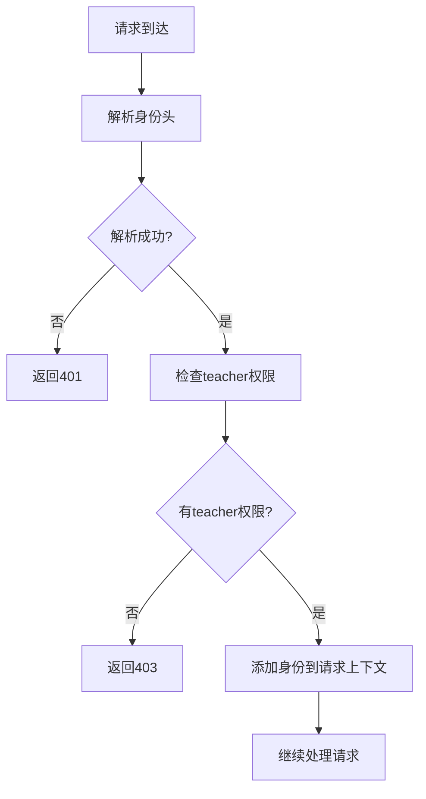

# Tasks插件onRequest权限验证钩子

## 概述

Tasks插件库现在集成了onRequest生命周期钩子，实现基于API Gateway转发的身份验证头的权限检查。该功能确保只有具有teacher权限的用户才能访问tasks相关的API资源。

## 功能特性

### 🔐 **权限验证**
- 解析API Gateway转发的用户身份请求头
- 检查用户是否具有teacher权限
- 支持中英文角色名称（teacher/教师）
- 自动处理URL编码的汉字角色名称

### 🚫 **访问控制**
- 401 Unauthorized：身份信息缺失或无效
- 403 Forbidden：权限不足（非teacher用户）
- 500 Internal Server Error：权限检查过程中的系统错误

### 📝 **日志记录**
- 详细的权限检查日志
- 访问拒绝的审计记录
- 错误情况的调试信息

## 实现原理

### 权限检查逻辑

```typescript
function checkTeacherPermission(userIdentity: UserIdentity, logger: any): boolean {
  // 1. 检查用户类型
  if (userIdentity.userType === 'teacher') {
    return true;
  }

  // 2. 检查角色数组
  if (userIdentity.roles && Array.isArray(userIdentity.roles)) {
    const hasTeacherRole = userIdentity.roles.includes('teacher') || 
                          userIdentity.roles.includes('教师'); // 支持中文
    return hasTeacherRole;
  }

  return false;
}
```

### onRequest钩子流程



## 支持的身份验证头

### 必需的请求头

| 请求头 | 说明 | 示例 |
|--------|------|------|
| `X-User-Id` | 用户ID（必需） | `teacher001` |

### 权限相关请求头

| 请求头 | 说明 | 示例 |
|--------|------|------|
| `X-User-Type` | 用户类型 | `teacher` |
| `X-User-Roles` | 角色数组（JSON格式） | `["teacher", "admin"]` |

### 可选的身份信息头

| 请求头 | 说明 | 示例 |
|--------|------|------|
| `X-User-Name` | 用户姓名（可能URL编码） | `%E6%9D%8E%E8%80%81%E5%B8%88` |
| `X-User-College` | 学院名称（可能URL编码） | `%E8%AE%A1%E7%AE%97%E6%9C%BA%E5%AD%A6%E9%99%A2` |

## 权限验证规则

### Teacher权限判定

用户满足以下任一条件即被认为具有teacher权限：

1. **用户类型为teacher**
   ```
   X-User-Type: teacher
   ```

2. **角色数组包含teacher**
   ```
   X-User-Roles: ["student", "teacher"]
   ```

3. **角色数组包含中文教师角色**
   ```
   X-User-Roles: ["学生", "教师"]
   ```

### URL编码处理

对于包含汉字的角色名称，系统会自动处理URL编码：

```typescript
// API Gateway端编码
const roles = ["学生", "教师"];
headers['X-User-Roles'] = JSON.stringify(roles); // 不再编码JSON

// Tasks插件端解码
const roles = JSON.parse(headers['x-user-roles']); // 直接解析
```

## 错误响应格式

### 401 Unauthorized

```json
{
  "error": "Unauthorized",
  "message": "Valid user identity required",
  "timestamp": "2024-01-01T00:00:00.000Z"
}
```

### 403 Forbidden

```json
{
  "error": "Forbidden",
  "message": "Teacher role required to access this resource",
  "requiredRole": "teacher",
  "userRoles": ["student"],
  "timestamp": "2024-01-01T00:00:00.000Z"
}
```

### 500 Internal Server Error

```json
{
  "error": "Internal Server Error",
  "message": "Failed to verify permissions",
  "timestamp": "2024-01-01T00:00:00.000Z"
}
```

## 使用示例

### 有效的Teacher请求

```bash
curl -X GET http://localhost:3000/api/tasks \
  -H "X-User-Id: teacher001" \
  -H "X-User-Name: %E6%9D%8E%E8%80%81%E5%B8%88" \
  -H "X-User-Type: teacher" \
  -H "X-User-Roles: [\"teacher\", \"admin\"]"
```

### 权限不足的请求

```bash
curl -X GET http://localhost:3000/api/tasks \
  -H "X-User-Id: student001" \
  -H "X-User-Type: student" \
  -H "X-User-Roles: [\"student\"]"
```

响应：
```json
{
  "error": "Forbidden",
  "message": "Teacher role required to access this resource",
  "requiredRole": "teacher",
  "userRoles": ["student"],
  "timestamp": "2024-01-01T00:00:00.000Z"
}
```

## 集成配置

### 插件注册

```typescript
import { tasks } from '@stratix/tasks';

// 注册tasks插件（自动启用权限验证）
await fastify.register(tasks, {
  // 插件选项
});
```

### 获取用户身份信息

在路由处理器中访问用户身份：

```typescript
fastify.get('/api/tasks', async (request, reply) => {
  // 用户身份信息已通过onRequest钩子验证并添加到请求上下文
  const userIdentity = (request as any).userIdentity;
  
  console.log('Current user:', userIdentity.userId);
  console.log('User type:', userIdentity.userType);
  console.log('User roles:', userIdentity.roles);
  
  // 处理业务逻辑...
});
```

## 测试验证

### 运行测试

```bash
# 运行权限验证测试
pnpm test onrequest-permission-check

# 运行所有身份验证相关测试
pnpm test identity
```

### 测试覆盖

- ✅ Teacher用户类型验证
- ✅ Teacher角色验证
- ✅ 中文角色名称支持
- ✅ URL编码处理
- ✅ 缺失身份信息处理
- ✅ 无效JSON处理
- ✅ 权限不足处理
- ✅ 错误响应格式

## 日志示例

### 成功访问

```
[DEBUG] Access granted {
  url: "/api/tasks",
  userId: "teacher001",
  userType: "teacher",
  roles: ["teacher", "admin"]
}
```

### 权限拒绝

```
[WARN] Access denied: teacher role required {
  url: "/api/tasks",
  userId: "student001",
  userRoles: ["student"]
}
```

### 身份解析失败

```
[WARN] Failed to parse user identity {
  url: "/api/tasks",
  error: {
    type: "MISSING_IDENTITY",
    message: "Missing required user ID in headers"
  }
}
```

## 注意事项

1. **性能影响**：每个请求都会进行权限检查，但开销很小
2. **缓存策略**：可以考虑在高并发场景下缓存权限检查结果
3. **监控建议**：监控403错误的频率，识别潜在的权限配置问题
4. **扩展性**：当前只检查teacher权限，未来可扩展支持更细粒度的权限控制

## 相关文件

- `packages/tasks/src/index.ts` - onRequest钩子实现
- `packages/tasks/src/utils/identity-parser.ts` - 身份解析工具
- `packages/tasks/src/__tests__/onrequest-permission-check.test.ts` - 权限验证测试
- `apps/api-gateway/src/hooks.ts` - API Gateway身份转发逻辑
