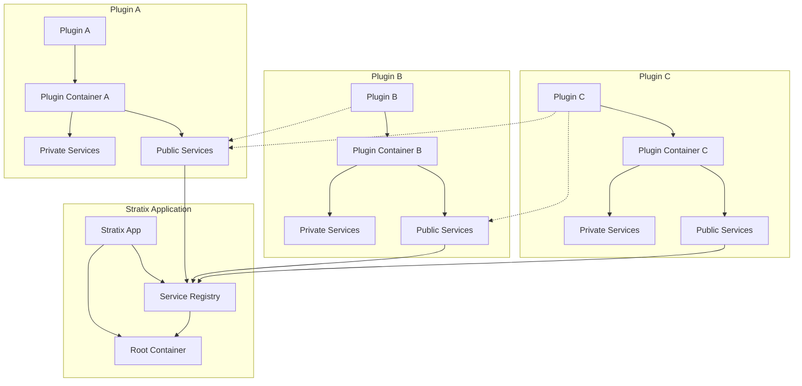
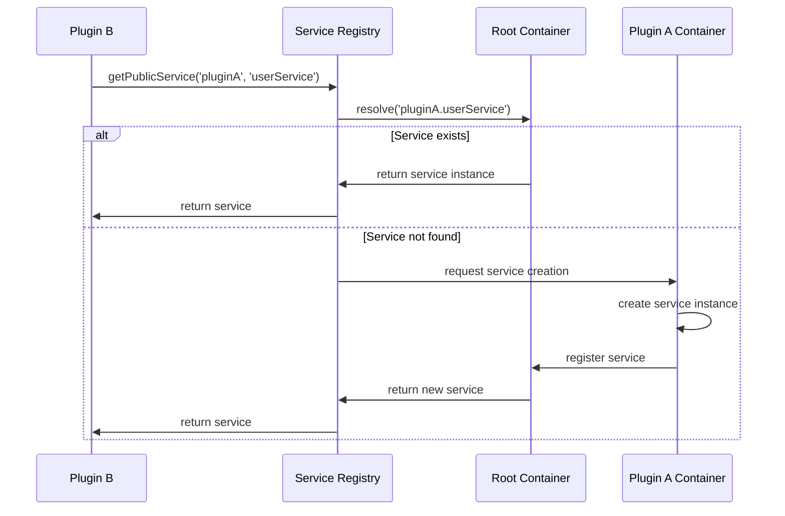

# Stratix 插件间服务共享架构设计

## 概述

本文档描述了 Stratix 框架中插件间服务共享的架构设计，旨在提供一个类型安全、生命周期管理完善的服务共享机制。

## 方案对比分析

### 方案A：全局容器共享

#### 优点
- **简单直接**：通过全局容器直接共享服务
- **统一管理**：所有服务在同一个容器中管理
- **性能较好**：直接容器访问，无额外开销

#### 缺点
- **生命周期冲突**：SCOPED服务在全局容器中会变成SINGLETON
- **内存泄漏风险**：SCOPED服务无法正确释放
- **依赖混乱**：插件间依赖关系不清晰
- **类型安全问题**：缺乏编译时类型检查

#### 关键问题分析
```typescript
// 问题示例：SCOPED服务在全局容器中的问题
container.register('plugin1.userService', {
  value: new UserService(), // 这会变成SINGLETON
  lifetime: Lifetime.SCOPED  // 但声明为SCOPED，产生冲突
});

// 内存泄漏：SCOPED服务无法在请求结束时释放
// 生命周期混乱：不同插件的SCOPED服务可能相互影响
```

### 方案B：Fastify装饰器

#### 优点
- **Fastify原生支持**：利用Fastify的装饰器机制
- **类型安全**：可以通过TypeScript声明合并提供类型
- **生命周期清晰**：每个插件管理自己的服务生命周期

#### 缺点
- **必须使用fastify-plugin**：增加了插件开发复杂度
- **装饰器污染**：大量服务会污染fastify实例
- **缺乏依赖注入**：无法利用Awilix的依赖注入能力

## 推荐方案：混合架构

基于以上分析，我们采用**混合架构**，结合两种方案的优点：

### 核心设计原则

1. **服务分层**：区分公共服务和私有服务
2. **生命周期隔离**：不同生命周期的服务分别管理
3. **类型安全**：完整的TypeScript类型支持
4. **依赖注入**：保持Awilix的依赖注入能力

### 架构图



### 服务分类

#### 1. 私有服务 (Private Services)
- **定义**：仅在插件内部使用的服务
- **生命周期**：由插件自己的容器管理
- **访问方式**：通过插件内部的DI容器

#### 2. 公共服务 (Public Services)
- **定义**：需要被其他插件使用的服务
- **生命周期**：SINGLETON（确保全局唯一）
- **访问方式**：通过服务注册表

#### 3. 请求级服务 (Request-Scoped Services)
- **定义**：与HTTP请求生命周期绑定的服务
- **生命周期**：SCOPED（每个请求创建新实例）
- **访问方式**：通过请求上下文

### 核心组件设计

#### 1. 服务注册表 (ServiceRegistry)

```typescript
interface ServiceRegistry {
  // 注册公共服务
  registerPublicService<T>(
    pluginName: string,
    serviceName: string,
    factory: ServiceFactory<T>,
    metadata?: ServiceMetadata
  ): void;
  
  // 获取公共服务
  getPublicService<T>(
    pluginName: string,
    serviceName: string
  ): Promise<T>;
  
  // 服务发现
  discoverServices(pattern?: string): ServiceDescriptor[];
  
  // 健康检查
  checkServiceHealth(
    pluginName: string,
    serviceName: string
  ): Promise<HealthStatus>;
}
```

#### 2. 服务工厂 (ServiceFactory)

```typescript
interface ServiceFactory<T> {
  create(context: ServiceContext): Promise<T>;
  destroy?(instance: T): Promise<void>;
  healthCheck?(instance: T): Promise<boolean>;
}
```

#### 3. 服务上下文 (ServiceContext)

```typescript
interface ServiceContext {
  pluginName: string;
  serviceName: string;
  container: AwilixContainer;
  fastify: FastifyInstance;
  logger: Logger;
  config: any;
}
```

### 生命周期管理

#### SINGLETON服务
```typescript
// 全局唯一实例，应用启动时创建，关闭时销毁
class DatabaseService {
  private connection: Connection;
  
  async initialize() {
    this.connection = await createConnection();
  }
  
  async destroy() {
    await this.connection.close();
  }
}
```

#### SCOPED服务
```typescript
// 请求级别实例，每个请求创建新实例
class RequestContextService {
  constructor(
    private request: FastifyRequest,
    private reply: FastifyReply
  ) {}
  
  getUserId(): string {
    return this.request.user?.id;
  }
}
```

#### TRANSIENT服务
```typescript
// 每次获取都创建新实例
class UtilityService {
  generateId(): string {
    return uuid();
  }
}
```

### 依赖解析流程



### 类型安全设计

#### 1. 服务接口声明

```typescript
// 全局服务接口声明
declare global {
  namespace Stratix {
    interface PublicServices {
      'tasks': {
        'taskManager': TaskManager;
        'executionEngine': TaskExecutionEngine;
      };
      'icasync': {
        'syncOrchestrator': SyncOrchestrator;
        'wpsApi': WpsApiService;
      };
      'gateway': {
        'authManager': AuthManager;
        'rateLimiter': RateLimiter;
      };
    }
  }
}
```

#### 2. 类型安全的服务访问

```typescript
// 编译时类型检查
const taskManager = await serviceRegistry.getPublicService('tasks', 'taskManager');
// taskManager 的类型自动推导为 TaskManager

// 错误的服务名会在编译时报错
const invalid = await serviceRegistry.getPublicService('tasks', 'invalidService');
// TypeScript Error: Argument of type '"invalidService"' is not assignable...
```

### 循环依赖处理

#### 1. 检测机制

```typescript
class CircularDependencyDetector {
  private dependencyGraph = new Map<string, Set<string>>();
  
  addDependency(from: string, to: string): void {
    if (this.wouldCreateCycle(from, to)) {
      throw new CircularDependencyError(`Circular dependency detected: ${from} -> ${to}`);
    }
    
    if (!this.dependencyGraph.has(from)) {
      this.dependencyGraph.set(from, new Set());
    }
    this.dependencyGraph.get(from)!.add(to);
  }
  
  private wouldCreateCycle(from: string, to: string): boolean {
    // 使用DFS检测是否会形成环
    return this.hasPath(to, from);
  }
}
```

#### 2. 解决策略

1. **延迟初始化**：使用工厂函数延迟创建依赖
2. **事件驱动**：通过事件解耦循环依赖
3. **接口抽象**：通过接口打破具体实现的循环依赖

### 性能优化

#### 1. 服务缓存

```typescript
class ServiceCache {
  private cache = new Map<string, any>();
  private ttl = new Map<string, number>();
  
  get<T>(key: string): T | undefined {
    if (this.isExpired(key)) {
      this.cache.delete(key);
      this.ttl.delete(key);
      return undefined;
    }
    return this.cache.get(key);
  }
  
  set<T>(key: string, value: T, ttlMs?: number): void {
    this.cache.set(key, value);
    if (ttlMs) {
      this.ttl.set(key, Date.now() + ttlMs);
    }
  }
}
```

#### 2. 懒加载

```typescript
class LazyService<T> {
  private instance?: T;
  private factory: () => Promise<T>;
  
  constructor(factory: () => Promise<T>) {
    this.factory = factory;
  }
  
  async get(): Promise<T> {
    if (!this.instance) {
      this.instance = await this.factory();
    }
    return this.instance;
  }
}
```

### 安全性考虑

#### 1. 服务访问控制

```typescript
interface ServiceAccessControl {
  canAccess(
    requesterPlugin: string,
    targetPlugin: string,
    serviceName: string
  ): boolean;
}

class RoleBasedAccessControl implements ServiceAccessControl {
  private permissions = new Map<string, Set<string>>();
  
  canAccess(requester: string, target: string, service: string): boolean {
    const key = `${target}.${service}`;
    const allowedPlugins = this.permissions.get(key);
    return allowedPlugins?.has(requester) ?? false;
  }
}
```

#### 2. 服务隔离

```typescript
// 每个插件的服务运行在独立的上下文中
class ServiceIsolation {
  private contexts = new Map<string, ServiceContext>();
  
  createContext(pluginName: string): ServiceContext {
    const context = {
      pluginName,
      container: this.createIsolatedContainer(),
      permissions: this.getPluginPermissions(pluginName),
      resources: this.allocateResources(pluginName)
    };
    
    this.contexts.set(pluginName, context);
    return context;
  }
}
```

## 总结

推荐的混合架构方案具有以下优势：

1. **生命周期清晰**：不同类型的服务有明确的生命周期管理
2. **类型安全**：完整的TypeScript类型支持和编译时检查
3. **性能优化**：通过缓存和懒加载提升性能
4. **安全可控**：提供访问控制和服务隔离机制
5. **易于使用**：简单的API和清晰的使用模式
6. **可扩展性**：支持插件的动态加载和卸载

这种架构既避免了全局容器的生命周期冲突问题，又保持了依赖注入的强大能力，是Stratix框架插件间服务共享的最佳解决方案。
