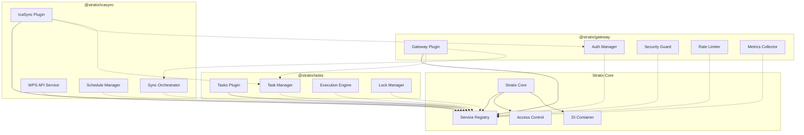

# Stratix 现有插件服务共享集成方案

## 概述

本文档描述了如何将服务共享机制集成到现有的 @stratix/gateway、@stratix/tasks 和 @stratix/icasync 插件中，实现插件间的服务共享和协作。

## 整体集成架构

### 系统架构图



## @stratix/gateway 插件集成

### 1. 服务注册改造

```typescript
// packages/gateway/src/index.ts
import { StratixPlugin } from '@stratix/core';

class GatewayPlugin extends StratixPlugin {
  constructor(fastify: FastifyInstance) {
    super('gateway', fastify);
  }

  async initialize(): Promise<void> {
    // 创建核心组件
    const components = await this.createCoreComponents();

    // 注册公共服务
    await this.registerPublicServices(components);

    // 设置服务访问权限
    await this.setupServicePermissions();

    // 初始化网关管理器
    await this.initializeGatewayManager(components);
  }

  private async registerPublicServices(components: any): Promise<void> {
    // 注册认证管理器服务
    this.registerPublicService(
      'authManager',
      {
        create: async () => components.authManager,
        healthCheck: async (instance) => instance.isHealthy(),
        destroy: async (instance) => await instance.shutdown()
      },
      {
        version: '1.0.0',
        description: '统一认证管理服务',
        tags: ['auth', 'security', 'core']
      }
    );

    // 注册安全防护服务
    this.registerPublicService(
      'securityGuard',
      {
        create: async () => components.securityGuard,
        healthCheck: async () => true
      },
      {
        version: '1.0.0',
        description: '安全防护服务',
        tags: ['security', 'protection']
      }
    );

    // 注册限流服务
    this.registerPublicService(
      'rateLimiter',
      {
        create: async () => components.rateLimiter,
        healthCheck: async (instance) => await instance.isHealthy()
      },
      {
        version: '1.0.0',
        description: 'API限流服务',
        tags: ['rate-limit', 'protection']
      }
    );

    // 注册指标收集服务
    this.registerPublicService(
      'metricsCollector',
      {
        create: async () => components.metricsCollector,
        healthCheck: async (instance) => instance.isRunning()
      },
      {
        version: '1.0.0',
        description: '指标收集服务',
        tags: ['monitoring', 'metrics']
      }
    );
  }

  private async setupServicePermissions(): Promise<void> {
    const accessControl = this.fastify.serviceAccessControl;

    // 认证服务权限设置
    accessControl.grantAccess('gateway', 'authManager', [
      'icasync',    // 同步服务需要认证
      'tasks',      // 任务服务需要认证
      'role:admin'  // 管理员角色
    ]);

    // 限流服务权限设置
    accessControl.grantAccess('gateway', 'rateLimiter', [
      'icasync',    // 同步服务可能需要限流控制
      'tasks'       // 任务服务可能需要限流控制
    ]);

    // 指标收集服务权限设置（所有插件都可以访问）
    accessControl.grantAccess('gateway', 'metricsCollector', ['*']);
  }
}
```

### 2. 增强的认证管理器

```typescript
// packages/gateway/src/auth/AuthManager.ts
export class AuthManager {
  private serviceAccessor: ServiceAccessor;

  constructor(
    private config: AuthProviderConfig,
    private logger: any,
    serviceAccessor: ServiceAccessor
  ) {
    this.serviceAccessor = serviceAccessor;
  }

  /**
   * 集成任务服务的用户权限检查
   */
  async checkTaskPermission(
    user: UserInfo,
    taskId: string,
    action: 'read' | 'write' | 'execute' | 'delete'
  ): Promise<boolean> {
    try {
      // 获取任务管理服务
      const taskManager = await this.serviceAccessor.getOptionalService('tasks', 'taskManager');
      
      if (taskManager) {
        // 通过任务服务检查任务所有权
        const task = await taskManager.getTask(taskId);
        
        if (task.createdBy === user.id) {
          return true; // 创建者有所有权限
        }
        
        // 检查基于角色的权限
        const requiredPermission = `task:${action}`;
        return this.hasPermission(user, requiredPermission);
      }
      
      // 如果任务服务不可用，回退到基础权限检查
      return this.hasPermission(user, `task:${action}`);
      
    } catch (error) {
      this.logger.error('Error checking task permission:', error);
      return false;
    }
  }

  /**
   * 集成同步服务的权限检查
   */
  async checkSyncPermission(
    user: UserInfo,
    scheduleId: string,
    action: 'read' | 'sync' | 'config'
  ): Promise<boolean> {
    try {
      // 获取同步编排服务
      const syncOrchestrator = await this.serviceAccessor.getOptionalService('icasync', 'syncOrchestrator');
      
      if (syncOrchestrator) {
        // 检查用户是否有权限访问特定课程表
        const hasAccess = await syncOrchestrator.checkUserAccess(user.id, scheduleId);
        
        if (!hasAccess) {
          return false;
        }
      }
      
      // 检查操作权限
      const requiredPermission = `sync:${action}`;
      return this.hasPermission(user, requiredPermission);
      
    } catch (error) {
      this.logger.error('Error checking sync permission:', error);
      return false;
    }
  }

  /**
   * 健康检查
   */
  async isHealthy(): Promise<boolean> {
    try {
      // 检查认证提供者状态
      for (const [name, provider] of this.providers) {
        if (provider.healthCheck && !(await provider.healthCheck())) {
          this.logger.warn(`Auth provider ${name} is unhealthy`);
          return false;
        }
      }
      return true;
    } catch (error) {
      this.logger.error('Auth manager health check failed:', error);
      return false;
    }
  }
}
```

## @stratix/tasks 插件集成

### 1. 任务服务注册

```typescript
// packages/tasks/src/index.ts
class TasksPlugin extends StratixPlugin {
  constructor(fastify: FastifyInstance) {
    super('tasks', fastify);
  }

  async initialize(): Promise<void> {
    // 创建核心组件
    const components = await this.createCoreComponents();

    // 注册公共服务
    await this.registerPublicServices(components);

    // 设置服务权限
    await this.setupServicePermissions();

    // 集成其他服务
    await this.integrateWithOtherServices(components);
  }

  private async registerPublicServices(components: any): Promise<void> {
    // 注册任务管理器服务
    this.registerPublicService(
      'taskManager',
      {
        create: async () => components.taskManager,
        healthCheck: async (instance) => await instance.isHealthy(),
        destroy: async (instance) => await instance.shutdown()
      },
      {
        version: '1.0.0',
        description: '任务管理服务',
        dependencies: ['database'],
        tags: ['task', 'management', 'core']
      }
    );

    // 注册执行引擎服务
    this.registerPublicService(
      'executionEngine',
      {
        create: async () => components.executionEngine,
        healthCheck: async (instance) => instance.isRunning()
      },
      {
        version: '1.0.0',
        description: '任务执行引擎',
        dependencies: ['taskManager'],
        tags: ['task', 'execution']
      }
    );

    // 注册锁管理器服务
    this.registerPublicService(
      'lockManager',
      {
        create: async () => components.lockManager,
        healthCheck: async (instance) => instance.isConnected()
      },
      {
        version: '1.0.0',
        description: '任务锁管理服务',
        tags: ['task', 'lock', 'concurrency']
      }
    );
  }

  private async setupServicePermissions(): Promise<void> {
    const accessControl = this.fastify.serviceAccessControl;

    // 任务管理器权限设置
    accessControl.grantAccess('tasks', 'taskManager', [
      'icasync',      // 同步服务需要创建和管理任务
      'gateway',      // 网关需要查询任务状态
      'role:admin',   // 管理员角色
      'role:operator' // 操作员角色
    ]);

    // 执行引擎权限设置（更严格的权限控制）
    accessControl.grantAccess('tasks', 'executionEngine', [
      'icasync',      // 只有同步服务可以执行任务
      'role:admin'    // 管理员可以直接控制执行引擎
    ]);

    // 锁管理器权限设置
    accessControl.grantAccess('tasks', 'lockManager', [
      'icasync',      // 同步服务需要锁管理
      'role:admin'    // 管理员可以管理锁
    ]);
  }

  private async integrateWithOtherServices(components: any): Promise<void> {
    // 集成认证服务
    try {
      const authManager = await this.getOptionalService('gateway', 'authManager');
      if (authManager) {
        components.taskManager.setAuthManager(authManager);
        this.logger.info('Integrated with gateway auth manager');
      }
    } catch (error) {
      this.logger.warn('Failed to integrate with auth manager:', error);
    }

    // 集成指标收集服务
    try {
      const metricsCollector = await this.getOptionalService('gateway', 'metricsCollector');
      if (metricsCollector) {
        components.executionEngine.setMetricsCollector(metricsCollector);
        this.logger.info('Integrated with metrics collector');
      }
    } catch (error) {
      this.logger.warn('Failed to integrate with metrics collector:', error);
    }
  }
}
```
