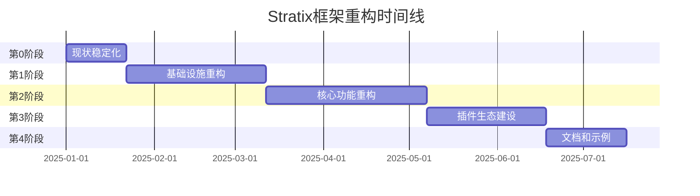

# Stratix框架重构任务分解方案

## 📋 文档概要

**项目名称**: Stratix框架架构重构  
**重构目标**: 基于函数式编程范式，构建现代化、插件化、高性能的Node.js应用框架  
**总工期**: 20-26周 (约5-6.5个月)  
**团队规模**: 7人  
**更新日期**: 2025-07-13  

## 🎯 重构核心目标

### 技术目标
- ✅ **插件化架构**: 每个插件作为独立npm包发布
- ✅ **显式配置**: 在`stratix.config.ts`中显式加载配置插件
- ✅ **函数式编程**: 完全采用函数式编程范式
- ✅ **零配置启动**: `StratixApp.run()`一行代码启动
- ✅ **类型安全**: 端到端TypeScript类型安全

### 业务目标
- 🚀 提升开发效率50%以上
- 📦 减少项目依赖体积30%
- 🔧 降低配置复杂度80%
- 🎨 改善开发体验和可维护性

## 📊 当前项目状态评估

### 🔍 Git状态分析
```bash
已修改的关键文件:
├── packages/core/package.json          # 版本管理更新
├── packages/database/package.json      # 依赖更新
├── packages/queue/package.json         # 包配置调整
├── packages/utils/package.json         # 工具库重构
└── apps/icalink-api/                   # 应用层适配

已删除的文件:
├── docs/ (80+个文档文件)               # ⚠️ 文档大量丢失
├── packages/queue/src/ (大部分实现)     # 🔄 队列重构中
└── packages/utils/src/ (部分工具)       # 🔄 工具重构中
```

### 📈 重构进度评估
| 模块 | 当前状态 | 完成度 | 风险等级 |
|------|----------|--------|----------|
| @stratix/core | 稳定运行 | 85% | 🟢 低 |
| @stratix/utils | 重构中 | 60% | 🟡 中 |
| @stratix/database | 基本完成 | 75% | 🟢 低 |
| @stratix/queue | 重构中 | 40% | 🔴 高 |
| @stratix/web | 稳定运行 | 90% | 🟢 低 |
| 文档系统 | 大量缺失 | 15% | 🔴 高 |

## 🗺️ 重构路线图

### 总体时间安排



## 🚨 第0阶段：现状稳定化 (2-3周)

> **目标**: 稳定当前代码状态，为重构建立可靠基线

### 0.1 项目现状全面评估 (1周)

#### 任务清单
- [ ] **代码变更影响评估**
  - [ ] 分析已删除文件的功能影响
  - [ ] 评估当前修改对现有应用的影响
  - [ ] 建立功能完整性检查清单
  - [ ] 识别关键功能缺失

- [ ] **依赖关系审计**
  - [ ] 检查packages间的依赖完整性
  - [ ] 分析第三方依赖的版本兼容性
  - [ ] 评估新依赖引入的影响
  - [ ] 清理无用依赖

#### 验收标准
✅ 完成项目现状分析报告  
✅ 建立功能完整性基线  
✅ 识别所有高风险变更点  
✅ 制定风险缓解措施清单  

#### 开发人员Checklist

**架构师 (1人)**
```typescript
任务详情:
├── 📋 分析git log和diff，了解近期所有变更
├── 📊 评估packages/*/package.json的依赖变更影响  
├── 🔍 检查apps/下各应用的运行状态
├── 📝 记录所有发现的问题和风险点
└── 📈 制定详细的风险评估矩阵

具体文件检查:
├── packages/core/package.json - 检查版本和依赖变更
├── packages/database/src/index.ts - 确认导出API完整性
├── packages/queue/src/index.ts - 评估功能缺失影响
├── packages/utils/src/index.ts - 检查工具函数可用性
└── apps/*/stratix.config.ts - 确认配置文件完整性
```

### 0.2 核心文档恢复 (1-2周)

#### 任务清单  
- [ ] **API文档恢复**
  - [ ] 从git历史恢复核心API文档
  - [ ] 重建packages的README和API文档
  - [ ] 恢复插件开发指南
  - [ ] 建立API变更记录

- [ ] **架构文档重建**
  - [ ] 确认当前架构与设计文档一致性
  - [ ] 更新架构图和流程图
  - [ ] 重建开发规范文档
  - [ ] 建立最佳实践指南

#### 验收标准
✅ 每个package都有完整的API文档  
✅ 插件开发指南可直接使用  
✅ 架构文档与实际代码一致  
✅ 建立文档维护流程  

#### 开发人员Checklist

**技术作家 (1人)**
```typescript
文档恢复清单:
├── 📚 从git历史中恢复以下文档:
│   ├── docs/core/dependency-injection-design.md
│   ├── docs/feature/database/api-reference.md  
│   ├── docs/feature/queue/queue-design.md
│   ├── docs/feature/utils/utils-api-*.md
│   └── docs/plugins/web-plugin-usage.md
├── 📝 重新编写缺失的核心文档:
│   ├── packages/core/README.md
│   ├── packages/database/README.md
│   ├── packages/queue/README.md
│   ├── packages/utils/README.md
│   └── packages/web/README.md
└── 🔄 建立文档自动化流程:
    ├── API文档自动生成
    ├── 文档变更检查
    └── 文档版本控制
```

**前端开发 (1人) - 辅助文档**
```typescript
协助任务:
├── 📖 整理现有配置文件示例
├── 🎯 创建快速开始指南
├── 💡 编写常见问题解答
└── 🔧 建立文档网站结构
```

### 0.3 代码基线建立 (0.5周)

#### 任务清单
- [ ] **版本标记**
  - [ ] 创建重构前的稳定版本标签
  - [ ] 建立代码回滚点
  - [ ] 确保所有应用可正常运行
  - [ ] 建立持续集成基线

#### 验收标准
✅ 创建稳定版本标签  
✅ 所有现有应用正常运行  
✅ 建立自动化测试基线  
✅ 制定回滚流程  

## 🏗️ 第1阶段：基础设施重构 (5-7周)

> **目标**: 完成核心包的函数式重构，建立稳固的技术基础

### 1.1 @stratix/utils 函数式重构 (2-3周)

#### 当前状态
- ✅ 基础函数式工具已实现
- 🔄 部分模块在重构中 
- ❌ 异步工具链不完整
- ❌ 缺少完整的测试覆盖

#### 任务清单
- [ ] **函数式核心重构**
  - [ ] 重新实现async模块的函数式版本
  - [ ] 完善Either/Maybe错误处理
  - [ ] 实现函数式流式处理工具  
  - [ ] 建立品牌类型系统

- [ ] **性能优化**
  - [ ] 实现惰性求值机制
  - [ ] 优化函数组合性能
  - [ ] 建立性能基准测试
  - [ ] 内存使用优化

#### 验收标准
✅ 所有工具函数都是纯函数  
✅ 完整的函数式编程工具链  
✅ 95%以上的测试覆盖率  
✅ 性能基准达到或超过重构前  

#### 开发人员Checklist

**函数式编程专家 (1人)**
```typescript
详细任务分解:

// 1. 重新实现async模块 (1周)
├── src/async/common.ts - 基础异步工具
│   ├── sleep: (ms: number) => Promise<void>
│   ├── delay: (ms: number) => <T>(value: T) => Promise<T>
│   └── timeout: (ms: number) => <T>(promise: Promise<T>) => Promise<T>
├── src/async/concurrency.ts - 并发控制  
│   ├── limitConcurrency: (limit: number) => <T>(tasks: Task<T>[]) => Promise<T[]>
│   ├── parallelLimit: (limit: number) => <T, R>(items: T[], fn: (item: T) => Promise<R>) => Promise<R[]>
│   └── pMap: <T, R>(items: T[], mapper: (item: T) => Promise<R>, options?: PMapOptions) => Promise<R[]>
└── src/async/promise-combinators.ts - Promise组合器
    ├── sequence: <T>(promises: Promise<T>[]) => Promise<T[]>
    ├── parallel: <T>(promises: Promise<T>[]) => Promise<T[]>
    └── race: <T>(promises: Promise<T>[]) => Promise<T>

// 2. 完善错误处理 (0.5周)  
├── src/functional/either.ts - Either Monad增强
│   ├── chainAsync: <E, A, B>(f: (a: A) => Promise<Either<E, B>>) => (either: Either<E, A>) => Promise<Either<E, B>>
│   ├── traverseArray: <E, A, B>(f: (a: A) => Either<E, B>) => (array: A[]) => Either<E, B[]>
│   └── sequenceArray: <E, A>(eithers: Either<E, A>[]) => Either<E, A[]>
└── src/functional/maybe.ts - Maybe Monad增强
    ├── chainAsync: <A, B>(f: (a: A) => Promise<Maybe<B>>) => (maybe: Maybe<A>) => Promise<Maybe<B>>
    └── traverse: <A, B>(f: (a: A) => Maybe<B>) => (array: A[]) => Maybe<B[]>

// 3. 流式处理工具 (0.5周)
└── src/functional/stream.ts - 函数式流处理
    ├── pipe: (...fns: Function[]) => (value: any) => any  
    ├── compose: (...fns: Function[]) => (value: any) => any
    ├── map: <A, B>(f: (a: A) => B) => (stream: A[]) => B[]
    ├── filter: <A>(predicate: (a: A) => boolean) => (stream: A[]) => A[]
    ├── reduce: <A, B>(reducer: (acc: B, current: A) => B, initial: B) => (stream: A[]) => B
    └── take: (n: number) => <A>(stream: A[]) => A[]
```

**测试工程师 (1人)**
```typescript
测试任务分解:

// 1. 异步工具测试 (1周)
├── __tests__/async/common.test.ts
│   ├── sleep函数测试 - 验证延迟时间准确性
│   ├── delay函数测试 - 验证值传递和延迟
│   └── timeout函数测试 - 验证超时处理
├── __tests__/async/concurrency.test.ts  
│   ├── limitConcurrency测试 - 并发数限制验证
│   ├── parallelLimit测试 - 并行处理验证
│   └── pMap测试 - 映射函数验证
└── __tests__/async/promise-combinators.test.ts
    ├── sequence测试 - 顺序执行验证
    ├── parallel测试 - 并行执行验证
    └── race测试 - 竞态条件验证

// 2. 函数式工具测试 (0.5周)
├── __tests__/functional/either.test.ts
│   ├── chainAsync测试 - 异步链式操作
│   ├── traverseArray测试 - 数组遍历处理
│   └── sequenceArray测试 - Either数组序列化
└── __tests__/functional/maybe.test.ts
    ├── chainAsync测试 - Maybe异步链式
    └── traverse测试 - Maybe数组遍历

// 3. 性能基准测试 (0.5周)
└── __tests__/performance/
    ├── async-performance.test.ts - 异步工具性能
    ├── functional-performance.test.ts - 函数式工具性能
    └── memory-usage.test.ts - 内存使用测试
```

### 1.2 @stratix/queue 重构完成 (2-3周)

#### 当前状态
- 🔄 基础队列实现存在
- ❌ 集群支持不完整
- ❌ 监控和可观测性缺失
- ❌ 错误处理需要优化

#### 任务清单
- [ ] **核心队列重构**
  - [ ] 重新实现Redis队列核心逻辑
  - [ ] 完善集群支持和负载均衡
  - [ ] 实现死信队列处理
  - [ ] 优化序列化和反序列化

- [ ] **可观测性建设**
  - [ ] 实现队列监控指标
  - [ ] 建立性能监控
  - [ ] 实现日志结构化
  - [ ] 建立健康检查机制

#### 验收标准
✅ 支持Redis集群部署  
✅ 完整的监控和告警机制  
✅ 死信队列自动处理  
✅ 99.9%的消息可靠性  

#### 开发人员Checklist

**后端架构师 (1人)**
```typescript
核心队列重构任务:

// 1. Redis队列核心 (1.5周)
├── src/redis/redis-queue.ts - Redis队列核心实现
│   ├── interface RedisQueueConfig 
│   ├── class RedisQueue implements QueueInterface
│   ├── enqueue: (job: QueueJob) => Promise<JobId>
│   ├── dequeue: (options?: DequeueOptions) => Promise<QueueJob | null>
│   ├── peek: (count?: number) => Promise<QueueJob[]>
│   └── clear: () => Promise<void>
├── src/redis/redis-cluster.ts - 集群支持
│   ├── interface ClusterConfig
│   ├── class RedisClusterQueue extends RedisQueue  
│   ├── distributeJob: (job: QueueJob) => Promise<string>
│   └── rebalance: () => Promise<void>
└── src/redis/redis-scripts.ts - Lua脚本优化
    ├── enqueueScript: string - 原子入队脚本
    ├── dequeueScript: string - 原子出队脚本
    └── rebalanceScript: string - 负载均衡脚本

// 2. 队列管理 (1周)  
├── src/queue/queue-manager.ts - 队列管理器
│   ├── interface QueueManagerConfig
│   ├── class QueueManager
│   ├── createQueue: (name: string, config: QueueConfig) => Promise<Queue>
│   ├── getQueue: (name: string) => Queue | undefined
│   ├── deleteQueue: (name: string) => Promise<void>
│   └── listQueues: () => string[]
├── src/queue/job-processor.ts - 任务处理器
│   ├── interface JobProcessor<T>
│   ├── process: (job: QueueJob<T>) => Promise<JobResult>
│   ├── retry: (job: QueueJob<T>, error: Error) => Promise<void>
│   └── handleDeadLetter: (job: QueueJob<T>) => Promise<void>
└── src/retry/retry-strategy.ts - 重试策略
    ├── exponentialBackoff: (attempt: number) => number
    ├── linearBackoff: (attempt: number) => number
    └── customStrategy: (config: RetryConfig) => RetryStrategy
```

**DevOps工程师 (1人)**
```typescript
监控和运维任务:

// 1. 监控指标 (1周)
├── src/monitoring/queue-metrics.ts - 队列指标
│   ├── interface QueueMetrics
│   ├── class MetricsCollector
│   ├── collectQueueSize: () => Promise<number>
│   ├── collectProcessingTime: () => Promise<number>
│   ├── collectErrorRate: () => Promise<number>
│   └── collectThroughput: () => Promise<number>
├── src/monitoring/health-check.ts - 健康检查
│   ├── interface HealthCheckResult
│   ├── checkRedisConnection: () => Promise<boolean>
│   ├── checkQueueHealth: (queueName: string) => Promise<HealthCheckResult>
│   └── generateHealthReport: () => Promise<HealthReport>
└── src/monitoring/alerts.ts - 告警机制
    ├── interface AlertRule
    ├── class AlertManager
    ├── registerRule: (rule: AlertRule) => void
    └── checkRules: () => Promise<Alert[]>

// 2. 日志和追踪 (0.5周)
├── src/logging/queue-logger.ts - 队列日志
│   ├── logJobEnqueue: (job: QueueJob) => void
│   ├── logJobProcess: (job: QueueJob, result: JobResult) => void
│   ├── logJobError: (job: QueueJob, error: Error) => void
│   └── logJobComplete: (job: QueueJob, duration: number) => void
└── src/tracing/job-tracer.ts - 任务追踪
    ├── startTrace: (job: QueueJob) => TraceContext
    ├── addSpan: (trace: TraceContext, operation: string) => Span
    └── endTrace: (trace: TraceContext, result: JobResult) => void
```

### 1.3 @stratix/core 架构增强 (1-2周)

#### 任务清单
- [ ] **插件系统增强**
  - [ ] 优化插件加载性能
  - [ ] 实现插件依赖解析
  - [ ] 建立插件生命周期管理
  - [ ] 实现插件热重载机制

- [ ] **DI容器优化**
  - [ ] 优化依赖注入性能
  - [ ] 实现作用域管理
  - [ ] 建立循环依赖检测
  - [ ] 优化内存使用

#### 验收标准
✅ 插件加载时间减少50%  
✅ 支持插件热重载  
✅ 完整的依赖检测机制  
✅ 内存使用优化20%  

#### 开发人员Checklist

**系统架构师 (1人)**
```typescript
核心架构增强任务:

// 1. 插件系统优化 (1周)
├── src/plugin/plugin-loader.ts - 插件加载器优化
│   ├── interface PluginLoaderConfig
│   ├── class OptimizedPluginLoader
│   ├── loadPlugin: (pluginFactory: PluginFactory, config: any) => Promise<Plugin>
│   ├── preloadPlugins: (registrations: PluginRegistration[]) => Promise<void>
│   ├── resolveDependencies: (plugins: Plugin[]) => Plugin[]
│   └── validatePlugins: (plugins: Plugin[]) => ValidationResult[]
├── src/plugin/plugin-registry.ts - 插件注册表
│   ├── interface PluginRegistry  
│   ├── register: (plugin: Plugin) => void
│   ├── get: (name: string) => Plugin | undefined
│   ├── list: () => Plugin[]
│   └── resolve: (name: string) => Plugin
└── src/plugin/hot-reload.ts - 热重载机制
    ├── interface HotReloadConfig
    ├── class HotReloadManager
    ├── watchPlugin: (pluginPath: string) => void
    ├── reloadPlugin: (pluginName: string) => Promise<void>
    └── handleReloadError: (error: Error, pluginName: string) => void

// 2. DI容器优化 (1周)
├── src/di/container.ts - 容器优化
│   ├── interface OptimizedContainer extends AwilixContainer
│   ├── registerService: <T>(name: string, factory: ServiceFactory<T>) => void
│   ├── resolveFast: <T>(name: string) => T
│   ├── createScope: (scopeName: string) => Scope
│   └── detectCircularDependencies: () => CircularDependency[]
├── src/di/scope-manager.ts - 作用域管理
│   ├── interface ScopeManager
│   ├── createScope: (name: string, parent?: Scope) => Scope
│   ├── destroyScope: (name: string) => void
│   └── listScopes: () => Scope[]
└── src/di/performance.ts - 性能优化
    ├── precompileFactories: (registrations: Registration[]) => CompiledFactory[]
    ├── optimizeResolution: (container: Container) => void
    └── measurePerformance: () => PerformanceMetrics
```

## 🚀 第2阶段：核心功能重构 (6-8周)

> **目标**: 完成应用层重构，实现新架构的全面落地

### 2.1 配置系统全面重构 (2-3周)

#### 任务清单
- [ ] **零配置体验优化**
  - [ ] 实现智能默认配置推导
  - [ ] 建立环境自适应配置
  - [ ] 实现配置继承机制
  - [ ] 优化配置加载性能

- [ ] **配置验证增强**
  - [ ] 实现运行时配置验证
  - [ ] 建立配置变更检测
  - [ ] 实现配置热重载
  - [ ] 建立配置安全检查

#### 验收标准
✅ 零配置启动时间<1秒  
✅ 配置错误实时检测  
✅ 支持配置热重载  
✅ 通过安全审计  

#### 开发人员Checklist

**配置专家 (1人)**
```typescript
配置系统重构任务:

// 1. 零配置增强 (1.5周)
├── src/config/zero-config.ts - 零配置实现
│   ├── interface ZeroConfigOptions
│   ├── createZeroConfig: () => StratixConfig
│   ├── detectEnvironment: () => Environment
│   ├── inferDatabase: () => DatabaseConfig | null
│   ├── inferRedis: () => RedisConfig | null
│   └── applyDefaults: (config: Partial<StratixConfig>) => StratixConfig
├── src/config/smart-defaults.ts - 智能默认值
│   ├── getDefaultPort: (environment: Environment) => number
│   ├── getDefaultLogLevel: (environment: Environment) => LogLevel
│   ├── getDefaultBodyLimit: (environment: Environment) => number
│   └── getDefaultPoolSize: (environment: Environment) => PoolConfig
└── src/config/inheritance.ts - 配置继承
    ├── interface ConfigInheritance
    ├── mergeConfigs: (base: StratixConfig, override: Partial<StratixConfig>) => StratixConfig
    ├── applyOverrides: (config: StratixConfig, overrides: ConfigOverrides) => StratixConfig
    └── validateInheritance: (config: StratixConfig) => ValidationResult

// 2. 配置验证和安全 (1周)
├── src/config/validator.ts - 配置验证器
│   ├── interface ConfigValidator
│   ├── validateConfig: (config: unknown) => Either<ValidationError[], StratixConfig>
│   ├── validatePlugin: (pluginConfig: unknown, schema: Schema) => ValidationResult
│   ├── checkSecurity: (config: StratixConfig) => SecurityAudit
│   └── generateReport: (result: ValidationResult) => ValidationReport
├── src/config/hot-reload.ts - 配置热重载
│   ├── interface HotReloadConfig
│   ├── class ConfigWatcher
│   ├── watchConfig: (configPath: string) => void
│   ├── reloadConfig: () => Promise<void>
│   └── notifyConfigChange: (changes: ConfigChanges) => void
└── src/config/security.ts - 配置安全
    ├── sanitizeConfig: (config: StratixConfig) => StratixConfig
    ├── checkSecrets: (config: StratixConfig) => SecretValidation[]
    ├── validatePermissions: (config: StratixConfig) => PermissionCheck[]
    └── auditConfig: (config: StratixConfig) => SecurityAudit
```

### 2.2 应用启动流程重构 (2-3周)

#### 任务清单
- [ ] **启动性能优化**
  - [ ] 实现并行初始化
  - [ ] 优化依赖加载顺序
  - [ ] 实现懒加载机制
  - [ ] 建立启动时间监控

- [ ] **错误处理增强**
  - [ ] 实现优雅启动失败处理
  - [ ] 建立启动状态监控
  - [ ] 实现自动恢复机制
  - [ ] 建立诊断和调试工具

#### 验收标准
✅ 启动时间减少60%  
✅ 启动失败率<0.1%  
✅ 完整的启动诊断信息  
✅ 支持启动状态查询  

#### 开发人员Checklist

**系统工程师 (1人)**
```typescript
启动流程重构任务:

// 1. 启动性能优化 (1.5周)
├── src/startup/parallel-loader.ts - 并行加载器
│   ├── interface ParallelLoaderConfig
│   ├── class ParallelLoader
│   ├── loadInParallel: <T>(loaders: Loader<T>[]) => Promise<T[]>
│   ├── optimizeLoadOrder: (dependencies: Dependency[]) => LoadOrder
│   └── monitorProgress: (progress: LoadProgress) => void
├── src/startup/lazy-loader.ts - 懒加载机制
│   ├── interface LazyLoadable<T>
│   ├── createLazyLoader: <T>(factory: () => Promise<T>) => LazyLoader<T>
│   ├── load: () => Promise<T>
│   └── isLoaded: () => boolean
└── src/startup/performance-monitor.ts - 性能监控
    ├── interface StartupMetrics
    ├── startTimer: (phase: string) => Timer
    ├── endTimer: (timer: Timer) => number
    ├── recordMetric: (name: string, value: number) => void
    └── generateReport: () => PerformanceReport

// 2. 错误处理和诊断 (1周)
├── src/startup/error-handler.ts - 启动错误处理
│   ├── interface StartupError extends Error
│   ├── handleStartupError: (error: StartupError) => StartupErrorResult
│   ├── recoverFromError: (error: StartupError) => Promise<boolean>
│   └── reportError: (error: StartupError) => void
├── src/startup/diagnostics.ts - 启动诊断
│   ├── interface DiagnosticInfo
│   ├── collectSystemInfo: () => SystemInfo
│   ├── checkPrerequisites: () => PrerequisiteCheck[]
│   ├── validateEnvironment: () => EnvironmentValidation
│   └── generateDiagnosticReport: () => DiagnosticReport
└── src/startup/health-check.ts - 启动健康检查
    ├── interface StartupHealthCheck
    ├── checkDependencies: () => Promise<DependencyCheck[]>
    ├── checkConnections: () => Promise<ConnectionCheck[]>
    ├── checkResources: () => Promise<ResourceCheck[]>
    └── generateHealthReport: () => Promise<HealthReport>
```

### 2.3 现有应用兼容性保证 (2周)

#### 任务清单
- [ ] **向后兼容实现**
  - [ ] 建立API兼容层
  - [ ] 实现配置迁移工具
  - [ ] 建立功能特性检测
  - [ ] 实现渐进式迁移

#### 验收标准
✅ 现有应用零修改运行  
✅ 提供自动迁移工具  
✅ 完整的迁移指南  
✅ 通过所有兼容性测试  

#### 开发人员Checklist

**兼容性工程师 (1人)**
```typescript
兼容性保证任务:

// 1. API兼容层 (1周)
├── src/compat/legacy-api.ts - 旧API兼容
│   ├── interface LegacyAPICompat
│   ├── wrapLegacyFunction: <T, R>(fn: LegacyFunction<T, R>) => ModernFunction<T, R>
│   ├── mapLegacyConfig: (legacyConfig: LegacyConfig) => StratixConfig
│   └── provideLegacyAPI: () => LegacyAPI
├── src/compat/config-migration.ts - 配置迁移
│   ├── interface ConfigMigration
│   ├── migrateConfig: (oldConfig: OldConfig) => NewConfig
│   ├── detectConfigVersion: (config: unknown) => ConfigVersion
│   ├── applyMigrations: (config: unknown, migrations: Migration[]) => unknown
│   └── validateMigration: (oldConfig: unknown, newConfig: unknown) => ValidationResult
└── src/compat/feature-detection.ts - 特性检测
    ├── interface FeatureDetector
    ├── detectFeatures: (config: StratixConfig) => Feature[]
    ├── checkCompatibility: (features: Feature[]) => CompatibilityReport
    └── suggestMigration: (features: Feature[]) => MigrationSuggestion[]

// 2. 迁移工具 (1周)
├── src/migration/auto-migrate.ts - 自动迁移
│   ├── interface AutoMigrator
│   ├── analyzeProject: (projectPath: string) => ProjectAnalysis
│   ├── generateMigrationPlan: (analysis: ProjectAnalysis) => MigrationPlan
│   ├── executeMigration: (plan: MigrationPlan) => Promise<MigrationResult>
│   └── rollbackMigration: (result: MigrationResult) => Promise<void>
├── src/migration/manual-guide.ts - 手动迁移指南
│   ├── generateMigrationGuide: (analysis: ProjectAnalysis) => MigrationGuide
│   ├── checkMigrationStep: (step: MigrationStep) => StepResult
│   └── validateMigration: (before: ProjectState, after: ProjectState) => ValidationResult
└── src/migration/test-runner.ts - 迁移测试
    ├── runCompatibilityTests: (config: StratixConfig) => TestResult[]
    ├── compareResults: (before: TestResult[], after: TestResult[]) => ComparisonResult
    └── generateTestReport: (results: TestResult[]) => TestReport
```

## 🔌 第3阶段：插件生态建设 (4-6周)

> **目标**: 完善插件生态，建立开发者友好的插件开发体验

### 3.1 插件开发工具链 (2-3周)

#### 任务清单
- [ ] **CLI工具开发**
  - [ ] 实现插件脚手架生成
  - [ ] 建立插件开发模式
  - [ ] 实现插件调试工具
  - [ ] 建立插件测试工具

- [ ] **开发体验优化**
  - [ ] 实现插件热重载
  - [ ] 建立插件市场机制
  - [ ] 实现插件依赖管理
  - [ ] 建立插件文档生成

#### 验收标准
✅ 完整的CLI工具集  
✅ 支持插件热重载开发  
✅ 自动化插件测试  
✅ 插件文档自动生成  

### 3.2 核心插件完善 (2-3周)

#### 任务清单
- [ ] **@stratix/auth 认证插件**
  - [ ] 多种认证策略支持
  - [ ] JWT令牌管理
  - [ ] 权限控制系统
  - [ ] 会话管理

- [ ] **@stratix/validation 验证插件**
  - [ ] 数据验证引擎
  - [ ] 自定义验证规则
  - [ ] 错误消息国际化
  - [ ] 性能优化

#### 验收标准
✅ 插件功能完整可用  
✅ 完整的API文档  
✅ 95%以上测试覆盖  
✅ 性能基准达标  

## 📚 第4阶段：文档和示例完善 (3-4周)

> **目标**: 建立完整的文档体系和示例项目

### 4.1 完整文档体系建设 (2周)

#### 任务清单
- [ ] **API文档完善**
  - [ ] 自动化API文档生成
  - [ ] 交互式API文档
  - [ ] 代码示例集成
  - [ ] 多语言支持

- [ ] **开发指南编写**
  - [ ] 快速开始指南
  - [ ] 最佳实践指南
  - [ ] 常见问题解答
  - [ ] 故障排除指南

#### 验收标准
✅ 完整的API文档覆盖  
✅ 多语言文档支持  
✅ 交互式文档体验  
✅ 实时文档更新  

### 4.2 示例项目和模板 (1-2周)

#### 任务清单
- [ ] **官方示例项目**
  - [ ] 基础Web应用示例
  - [ ] 微服务架构示例
  - [ ] 全栈应用示例
  - [ ] 插件开发示例

- [ ] **项目模板**
  - [ ] 零配置项目模板
  - [ ] 企业级项目模板
  - [ ] 微服务项目模板
  - [ ] 插件项目模板

#### 验收标准
✅ 5个以上官方示例  
✅ 4套完整项目模板  
✅ 示例项目可直接运行  
✅ 模板项目生成工具  

## 👥 团队配置和角色分工

### 核心团队 (7人)

| 角色 | 人数 | 主要职责 | 关键技能 |
|------|------|----------|----------|
| **系统架构师** | 1 | 整体架构设计、技术决策 | 架构设计、技术选型、性能优化 |
| **函数式编程专家** | 1 | Utils包重构、FP指导 | 函数式编程、Haskell/F#、类型理论 |
| **后端架构师** | 1 | 核心包开发、API设计 | Node.js、TypeScript、系统设计 |
| **DevOps工程师** | 1 | 构建系统、监控运维 | CI/CD、Docker、监控系统 |
| **测试工程师** | 1 | 测试框架、质量保证 | 自动化测试、性能测试、质量工程 |
| **技术作家** | 1 | 文档编写、示例开发 | 技术写作、文档工具、示例设计 |
| **前端开发** | 1 | 工具界面、文档网站 | React/Vue、文档网站、CLI工具 |

### 专项团队配置

#### 第0阶段团队
- **架构师** - 现状评估和风险分析
- **技术作家** - 文档恢复和重建  
- **前端开发** - 辅助文档整理

#### 第1阶段团队
- **函数式编程专家** + **测试工程师** - Utils包重构
- **后端架构师** + **DevOps工程师** - Queue包重构  
- **系统架构师** - Core包增强

#### 第2阶段团队
- **全员参与** - 核心功能重构
- **重点：配置专家(架构师)** - 配置系统重构
- **重点：兼容性工程师(后端架构师)** - 兼容性保证

## 📊 质量保证和风险管控

### 质量标准

#### 代码质量
- ✅ **测试覆盖率**: ≥95%
- ✅ **类型覆盖率**: 100%
- ✅ **代码审查**: 100%覆盖
- ✅ **性能基准**: 不低于重构前

#### 文档质量
- ✅ **API文档**: 100%覆盖
- ✅ **示例代码**: 可运行验证
- ✅ **多语言**: 中英文支持
- ✅ **更新及时性**: 代码变更后24小时内

### 风险管控

#### 高风险项 (🔴)
1. **大量文档丢失** 
   - 缓解措施：优先恢复核心文档，建立文档保护机制
   - 应急方案：从git历史和代码注释重建

2. **Queue包重构影响现有功能**
   - 缓解措施：建立功能兼容层，渐进式迁移
   - 应急方案：保留旧版本实现作为fallback

3. **团队技能匹配度**
   - 缓解措施：提前进行技能培训，建立mentor机制
   - 应急方案：引入外部专家支持

#### 中风险项 (🟡)
1. **性能回归风险**
   - 缓解措施：建立性能基准测试，持续监控
   - 应急方案：性能优化专项，必要时回滚

2. **兼容性问题**
   - 缓解措施：建立完整的兼容性测试套件
   - 应急方案：提供兼容性补丁和迁移工具

### 质量检查点

#### 每周检查
- [ ] 代码审查完成情况
- [ ] 测试覆盖率统计
- [ ] 性能基准对比
- [ ] 文档更新状态

#### 阶段检查
- [ ] 功能完整性验证
- [ ] 兼容性测试结果
- [ ] 性能压力测试
- [ ] 安全审计报告

## 📈 项目监控和度量

### 关键指标 (KPI)

#### 技术指标
- **启动性能**: 目标提升60%
- **内存使用**: 目标优化30%
- **构建时间**: 目标减少50%  
- **包体积**: 目标减少30%

#### 质量指标
- **测试覆盖率**: 目标≥95%
- **代码重复率**: 目标<5%
- **技术债务**: 目标减少80%
- **安全漏洞**: 目标0个高危

#### 开发效率指标
- **配置复杂度**: 目标减少80%
- **插件开发时间**: 目标减少50%
- **文档完整度**: 目标100%
- **开发者满意度**: 目标≥4.5/5

### 监控工具

#### 自动化监控
- **代码质量**: SonarQube + ESLint
- **性能监控**: Custom benchmarks + CI集成
- **安全扫描**: Snyk + npm audit
- **依赖监控**: Dependabot + 人工审查

#### 手动监控  
- **代码审查**: GitHub Pull Request
- **架构审查**: 每两周架构师审查
- **用户反馈**: GitHub Issues + 社区反馈
- **竞品分析**: 每月技术趋势分析

## 📋 详细开发Checklist

### 每日开发流程
```typescript
日常开发Checklist:
├── 🌅 开始工作
│   ├── [ ] 拉取最新代码: git pull origin main
│   ├── [ ] 检查任务状态: 查看项目看板
│   ├── [ ] 同步团队进度: 参加站会
│   └── [ ] 确认当日目标: 明确具体任务
├── 💻 编码开发  
│   ├── [ ] 创建功能分支: git checkout -b feature/task-name
│   ├── [ ] 编写代码: 遵循编码规范
│   ├── [ ] 编写测试: 确保覆盖率≥95%
│   ├── [ ] 运行测试: npm test
│   ├── [ ] 代码质量检查: npm run lint
│   └── [ ] 提交代码: git commit -m "feat: description"
├── 🔍 代码审查
│   ├── [ ] 创建PR: 包含详细描述和测试说明
│   ├── [ ] 自检代码: 确保代码质量
│   ├── [ ] 等待审查: 及时响应reviewer反馈
│   └── [ ] 合并代码: 通过审查后合并
└── 📊 结束工作
    ├── [ ] 更新任务状态: 更新看板状态
    ├── [ ] 记录工作日志: 记录进度和问题
    ├── [ ] 同步团队: 通知相关人员
    └── [ ] 计划明日工作: 明确下一步任务
```

### 代码提交规范
```typescript
提交信息格式: <type>(<scope>): <subject>

Type类型:
├── feat: 新功能开发
├── fix: Bug修复
├── docs: 文档更新
├── style: 代码格式调整
├── refactor: 代码重构
├── test: 测试相关
├── chore: 构建或工具变更
└── perf: 性能优化

Scope范围:
├── core: 核心模块
├── utils: 工具库
├── database: 数据库模块
├── queue: 队列模块
├── web: Web模块
├── config: 配置系统
└── docs: 文档

示例:
├── feat(core): add plugin hot reload support
├── fix(queue): resolve memory leak in job processor
├── docs(utils): update functional programming guide
└── refactor(config): migrate to new validation system
```

### 测试要求Checklist
```typescript
测试要求:
├── 🧪 单元测试
│   ├── [ ] 测试覆盖率≥95%
│   ├── [ ] 所有public方法都有测试
│   ├── [ ] 边界条件测试完整
│   ├── [ ] 错误场景测试覆盖
│   └── [ ] Mock依赖正确使用
├── 🔗 集成测试
│   ├── [ ] 模块间交互测试
│   ├── [ ] 插件加载测试
│   ├── [ ] 配置系统测试
│   └── [ ] 数据库连接测试
├── 🎭 端到端测试
│   ├── [ ] 完整用例流程测试
│   ├── [ ] 性能基准测试
│   ├── [ ] 兼容性测试
│   └── [ ] 错误恢复测试
└── 📊 测试报告
    ├── [ ] 生成覆盖率报告
    ├── [ ] 记录性能数据
    ├── [ ] 分析失败用例
    └── [ ] 更新测试文档
```

### 文档要求Checklist
```typescript
文档要求:
├── 📖 API文档
│   ├── [ ] 所有public API都有文档
│   ├── [ ] 参数类型和返回值说明
│   ├── [ ] 使用示例代码
│   ├── [ ] 错误处理说明
│   └── [ ] 版本变更记录
├── 📚 用户指南
│   ├── [ ] 快速开始指南
│   ├── [ ] 配置说明文档
│   ├── [ ] 最佳实践指南
│   ├── [ ] 常见问题解答
│   └── [ ] 故障排除指南
├── 🔧 开发文档
│   ├── [ ] 架构设计文档
│   ├── [ ] 插件开发指南
│   ├── [ ] 代码规范说明
│   ├── [ ] 测试指导文档
│   └── [ ] 部署运维指南
└── 📝 变更记录
    ├── [ ] CHANGELOG.md更新
    ├── [ ] 版本发布说明
    ├── [ ] 迁移指南更新
    └── [ ] 已知问题记录
```

## 🎯 项目成功标准

### 技术成功标准
- ✅ **性能提升**: 启动时间减少60%，内存使用优化30%
- ✅ **开发效率**: 配置复杂度减少80%，插件开发时间减少50%
- ✅ **代码质量**: 测试覆盖率≥95%，技术债务减少80%
- ✅ **兼容性**: 现有应用100%兼容，提供自动迁移工具

### 业务成功标准
- ✅ **开发体验**: 开发者满意度≥4.5/5分
- ✅ **社区活跃**: GitHub Star增长50%，Issues处理及时
- ✅ **企业采用**: 至少5家企业成功部署使用
- ✅ **生态发展**: 社区贡献插件≥10个

### 交付成功标准
- ✅ **按时交付**: 在26周内完成所有核心功能
- ✅ **质量达标**: 通过所有质量检查点
- ✅ **文档完整**: 100%API文档覆盖，多语言支持
- ✅ **团队成长**: 团队成员技能提升，知识传承完整

---

## 📞 联系方式和支持

**项目负责人**: 架构师团队  
**技术支持**: GitHub Issues  
**社区交流**: 待建立Discord/Slack频道  
**文档网站**: 待建立官方文档站点  

**紧急联系**: 项目关键节点失败时的应急联系机制  
**代码仓库**: https://github.com/your-org/stratix  
**CI/CD状态**: 待建立持续集成看板  

---

*本文档将随着项目进展持续更新，请定期检查最新版本。*