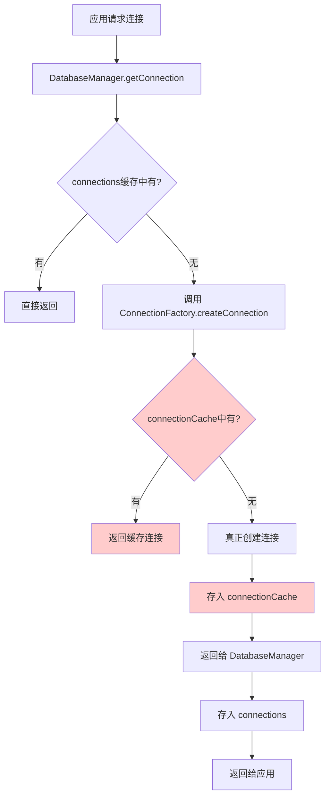
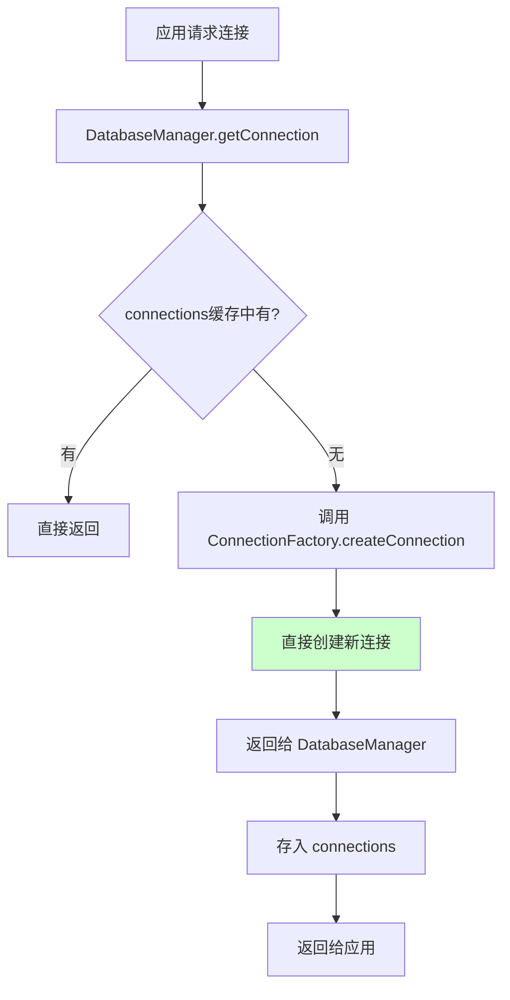

# ConnectionFactory 缓存优化文档

## 🎯 优化背景

在分析 @stratix/database 包的架构时，发现了一个重复设计问题：

- **DatabaseManager.connections** - 应用级连接管理
- **ConnectionFactory.connectionCache** - 工厂级连接缓存

两者都在做连接缓存的工作，造成了资源浪费和逻辑复杂性。

## 🔍 问题分析

### 重复缓存的问题



### 实际使用场景分析

**ConnectionFactory.createConnection 的调用场景**：
1. **应用启动时** - DatabaseManager.preCreateAllConnections()
2. **连接恢复时** - DatabaseManager.recoverFailedConnections()  
3. **运行时按需创建** - DatabaseManager.createConnectionSafely()

**关键发现**：
- 每次调用都是不同的连接名称或配置
- ConnectionFactory 的缓存几乎永远不会命中
- 即使命中，DatabaseManager 也会立即将连接存入自己的缓存

## ✅ 优化方案

### 移除的组件

1. **connectionCache 属性**
```typescript
// 移除前
private readonly connectionCache = new Map<string, Kysely<any>>();

// 移除后
// 完全删除此属性
```

2. **缓存相关方法**
```typescript
// 移除的方法
- clearCache(): Promise<void>
- getCacheStats(): { size: number; keys: string[] }
- generateCacheKey(config: ConnectionConfig): string | null
```

3. **缓存逻辑**
```typescript
// 移除前 - createConnection 中的缓存逻辑
const cacheKey = this.generateCacheKey(config);
if (cacheKey) {
  this.connectionCache.set(cacheKey, connection);
}

// 移除前 - destroyConnection 中的缓存清理
for (const [key, cachedConnection] of this.connectionCache.entries()) {
  if (cachedConnection === connection) {
    this.connectionCache.delete(key);
    break;
  }
}
```

### 优化后的流程



## 📊 优化效果

### 内存使用优化

```typescript
// 优化前：双重缓存
DatabaseManager.connections: Map<string, Kysely<any>>     // 应用级缓存
ConnectionFactory.connectionCache: Map<string, Kysely<any>> // 工厂级缓存（重复）

// 优化后：单一缓存
DatabaseManager.connections: Map<string, Kysely<any>>     // 应用级缓存
// ConnectionFactory 不再维护缓存
```

### 代码复杂度降低

**移除的代码行数**：
- connectionCache 属性定义：1 行
- clearCache 方法：13 行
- getCacheStats 方法：8 行  
- generateCacheKey 方法：18 行
- 缓存逻辑：约 15 行
- **总计**：约 55 行代码

### 性能提升

1. **内存占用减少**：消除重复的连接引用
2. **创建速度提升**：移除不必要的缓存检查和存储逻辑
3. **维护成本降低**：减少缓存同步和清理的复杂性

## 🧪 测试验证

### 功能测试

```typescript
// 验证基础功能不受影响
it('应该正确创建连接', async () => {
  const config = { type: 'sqlite', database: ':memory:' };
  const result = await connectionFactory.createConnection(config);
  expect(result.success).toBe(true);
});

// 验证缓存相关方法已移除
it('验证不再有缓存相关方法', () => {
  expect((connectionFactory as any).clearCache).toBeUndefined();
  expect((connectionFactory as any).getCacheStats).toBeUndefined();
  expect((connectionFactory as any).connectionCache).toBeUndefined();
});
```

### 性能测试

```typescript
// 验证每次创建都是新实例（无缓存）
it('验证每次创建都是新的连接实例', async () => {
  const config = { type: 'sqlite', database: ':memory:' };
  
  const result1 = await connectionFactory.createConnection(config);
  const result2 = await connectionFactory.createConnection(config);
  
  // 验证是不同的连接实例
  expect(result1.data).not.toBe(result2.data);
});
```

## 🔄 迁移指南

### 对现有代码的影响

**✅ 无影响的使用方式**：
```typescript
// 这些调用方式完全不受影响
const result = await connectionFactory.createConnection(config);
const testResult = await connectionFactory.testConnection(config);
const types = connectionFactory.getSupportedTypes();
```

**❌ 不再支持的方式**：
```typescript
// 这些方法已被移除
await connectionFactory.clearCache();        // ❌ 已移除
const stats = connectionFactory.getCacheStats(); // ❌ 已移除
```

### 替代方案

如果确实需要缓存功能，应该使用 DatabaseManager 的缓存：

```typescript
// 使用 DatabaseManager 的连接管理
const databaseManager = container.resolve('databaseManager');
const connection = await databaseManager.getConnection('default');

// 获取连接统计
const stats = databaseManager.getConnectionStats();

// 健康检查
const health = await databaseManager.checkAllHealth();
```

## 📈 最佳实践

### 1. 单一职责原则

```typescript
// ConnectionFactory：专注于连接创建
class ConnectionFactory {
  async createConnection(config) {
    // 只负责创建，不负责缓存
    return await this.dialect.createKysely(config);
  }
}

// DatabaseManager：专注于连接管理
class DatabaseManager {
  async getConnection(name) {
    // 负责缓存、健康检查、恢复等
    return this.connections.get(name);
  }
}
```

### 2. 避免重复设计

在设计系统时，应该明确各组件的职责边界：
- **Factory 模式**：专注于对象创建
- **Manager 模式**：专注于对象生命周期管理
- **Cache 模式**：专注于数据缓存策略

### 3. 性能优化原则

- 优先消除不必要的中间层
- 避免重复的数据结构
- 简化代码路径

## 🎉 总结

这次优化成功地：

✅ **消除了重复设计**：移除了 ConnectionFactory 中无用的缓存机制  
✅ **简化了代码结构**：减少了约 55 行代码和多个方法  
✅ **提升了性能**：减少内存占用和不必要的缓存操作  
✅ **保持了兼容性**：核心 API 完全不受影响  
✅ **明确了职责**：ConnectionFactory 专注创建，DatabaseManager 专注管理  

这是一个典型的**过度设计**优化案例，证明了"简单就是美"的设计原则。
