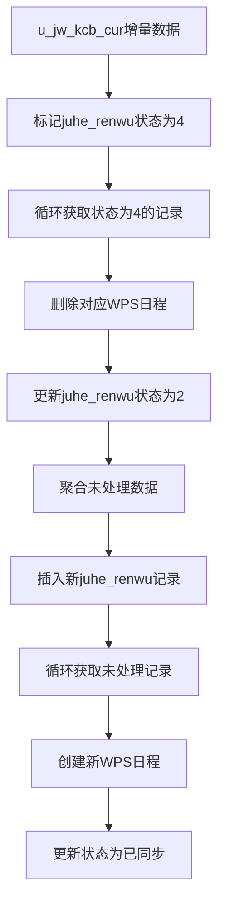

# icasync 增量同步功能实现文档

## 概述

本文档描述了为 icasync 插件库实现的增量同步功能，该功能基于 Stratix 框架架构，用于处理课程表的增量数据变更同步到 WPS 日程系统。

## 系统架构

增量同步采用分层架构设计：

```
工作流层 (Workflow)
    ↓
执行器层 (Executors)
    ↓
服务层 (Services)
    ↓
仓储层 (Repositories)
    ↓
数据层 (Database)
```

## 功能规格

### 1. 增量数据识别
- **数据源**: `u_jw_kcb_cur` 表
- **识别条件**: `kkh`、`rq` 字段有值且 `gx_zt` 状态为 null 的记录
- **业务规则**: 
  - `jc < 5` 的记录匹配 `sjd = 'am'` 的 juhe_renwu 记录
  - `jc > 4` 的记录匹配 `sjd = 'pm'` 的 juhe_renwu 记录

### 2. 删除过期日程
- 根据增量数据匹配到的 `juhe_renwu` 记录
- 删除对应的所有 WPS 日程数据
- 清理 `schedule_mapping` 映射记录
- 更新 `juhe_renwu` 记录状态为 '2'

### 3. 数据聚合与预处理
- 将 `u_jw_kcb_cur` 表中 `gt_zt` 状态为未处理的数据进行聚合
- 将聚合结果插入到 `juhe_renwu` 表中
- 不清空现有数据，只处理新的增量部分

### 4. 新增课程日程
- 基于聚合后的 `juhe_renwu` 数据创建新的 WPS 日程
- 创建 `schedule_mapping` 映射记录
- 更新相关表的状态字段

## 工作流设计

### 主工作流: `incremental-sync-workflow`

包含 4 个主要节点：

1. **标记增量数据** (`mark-incremental-data`)
   - 执行器: `markIncrementalDataProcessor`
   - 功能: 识别并标记需要处理的 juhe_renwu 记录

2. **删除过期日程循环** (`delete-expired-schedules-loop`)
   - 执行器: `fetchMarkedJuheRenwuRecords` (循环执行器)
   - 子节点: `deleteSingleScheduleProcessor`
   - 功能: 删除标记为状态'4'的日程

3. **聚合增量数据** (`aggregate-incremental-data`)
   - 执行器: `incrementalDataAggregationProcessor`
   - 功能: 聚合未处理数据并插入 juhe_renwu 表

4. **创建新日程循环** (`create-new-schedules-loop`)
   - 执行器: `fetchUnprocessedJuheRenwuRecords` (循环执行器)
   - 子节点: `createSingleScheduleProcessor`
   - 功能: 为未处理记录创建新的 WPS 日程

## 核心组件

### Repository 层扩展

#### CourseRawRepository 新增方法:

```typescript
// 通过单条SQL完成增量数据识别和juhe_renwu状态更新
async updateJuheRenwuByIncrementalData(xnxq?: string): Promise<DatabaseResult<number>>

// 获取增量数据统计信息
async getIncrementalDataStats(xnxq: string): Promise<DatabaseResult<{
  totalCount: number;
  amCount: number;
  pmCount: number;
  distinctKkhs: string[];
}>>

// 验证增量数据更新结果
async validateIncrementalUpdate(xnxq: string): Promise<DatabaseResult<{
  matchedJuheRenwu: number;
  updatedJuheRenwu: number;
  pendingIncrementalData: number;
}>>
```

### Executor 层新增组件:

1. **MarkIncrementalDataProcessor**: 增量数据标记处理器
2. **DeleteSingleScheduleProcessor**: 删除单个日程处理器
3. **IncrementalDataAggregationProcessor**: 增量数据聚合处理器
4. **CreateSingleScheduleProcessor**: 创建单个日程处理器
5. **FetchMarkedJuheRenwuProcessor**: 获取标记记录处理器
6. **FetchUnprocessedJuheRenwuProcessor**: 获取未处理记录处理器

## 数据流程



## 部署和使用

### 1. 部署工作流

执行 SQL 脚本部署增量同步工作流：

```bash
mysql -u username -p database_name < packages/icasync/workflows/deploy-incremental-sync-workflow-v1.0.0.sql
```

### 2. 工作流执行

使用 Stratix Tasks 引擎执行增量同步：

```typescript
const workflowInstance = await workflowEngine.startWorkflow({
  workflowName: 'incremental-sync-workflow',
  version: '1.0.0',
  inputs: {
    xnxq: '2023-2024-1',
    dryRun: false,
    batchSize: 100
  }
});
```

### 3. 输入参数

| 参数 | 类型 | 必填 | 默认值 | 描述 |
|------|------|------|--------|------|
| xnxq | string | ✅ | - | 学年学期标识 (格式: YYYY-YYYY-N) |
| dryRun | boolean | ❌ | false | 是否仅测试运行 |
| batchSize | number | ❌ | 100 | 批处理大小 |

### 4. 输出结果

```typescript
interface IncrementalSyncResult {
  incrementalSyncReport: {
    processedChanges: number;
    deletedSchedules: number;
    createdSchedules: number;
    errorCount: number;
  };
  processedChanges: number;
  totalErrors: number;
}
```

## 监控和日志

### 性能监控

- 执行时长跟踪
- 内存使用监控
- 并发任务监控
- 错误率统计

### 日志级别

- **INFO**: 主要流程节点
- **DEBUG**: 详细操作步骤
- **ERROR**: 错误和异常
- **WARN**: 警告信息

### 关键指标

- 处理的增量数据数量
- 删除的日程数量
- 创建的日程数量
- 失败任务数量
- 平均处理时长

## 错误处理

### 策略配置

- **重试策略**: 自动重试失败的操作
- **故障转移**: 分布式环境下的任务转移
- **错误继续**: 单个任务失败不影响整体流程
- **事务回滚**: 关键操作的事务保护

### 常见错误

1. **数据不一致**: 增量数据与 juhe_renwu 匹配失败
2. **WPS API 错误**: 日程创建/删除失败
3. **网络超时**: 长时间运行导致的连接超时
4. **数据库锁**: 并发访问导致的死锁

## 性能优化

### 批量处理

- 默认批处理大小: 100
- 可配置的并发级别
- 智能的负载均衡

### 数据库优化

- 使用单条 SQL 完成复杂匹配
- 批量更新状态字段
- 索引优化查询性能

### 分布式处理

- 支持多引擎并行执行
- 动态任务分配
- 自动负载均衡

## 安全性

### 数据保护

- 软删除机制保护历史数据
- 事务保证数据一致性
- 操作日志完整记录

### 访问控制

- 基于能力的任务分配
- 执行权限验证
- 资源访问限制

## 测试验证

### 单元测试

```bash
# 运行所有增量同步相关测试
npm test -- --grep "incremental"
```

### 集成测试

```bash
# 运行工作流集成测试
npm run test:integration
```

### 性能测试

```bash
# 运行性能测试
npm run test:performance
```

## 故障排除

### 常见问题

1. **增量数据未找到**
   - 检查 `u_jw_kcb_cur` 表中是否有 `gx_zt` 为 null 的记录
   - 验证 `kkh` 和 `rq` 字段是否有值

2. **日程删除失败**
   - 检查 WPS API 连接状态
   - 验证日历权限设置
   - 查看 `schedule_mapping` 表是否存在对应记录

3. **聚合数据异常**
   - 检查 `CourseAggregationService` 服务状态
   - 验证数据库连接
   - 查看聚合逻辑的错误日志

### 调试指南

1. 启用详细日志: 设置 `logLevel: "debug"`
2. 使用测试模式: 设置 `dryRun: true`
3. 监控任务状态: 查看工作流执行状态
4. 检查数据一致性: 运行验证脚本

## 未来扩展

### 计划功能

1. **智能冲突解决**: 自动处理数据冲突
2. **增量备份**: 操作前自动备份
3. **实时监控**: Dashboard 实时监控
4. **自动修复**: 常见问题的自动修复

### 性能改进

1. **缓存机制**: 减少重复数据库查询
2. **异步处理**: 非关键路径异步执行
3. **资源池**: 连接池和对象池优化
4. **压缩传输**: 大数据传输压缩

---

**版本**: 1.0.0  
**创建日期**: 2024-08-29  
**最后更新**: 2024-08-29  
**维护者**: Claude Code 生成