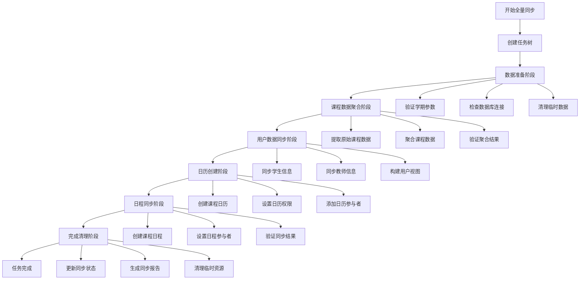
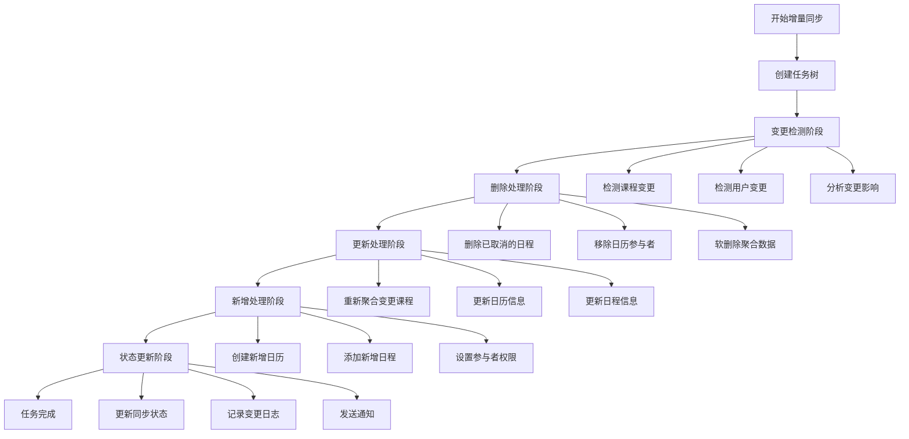
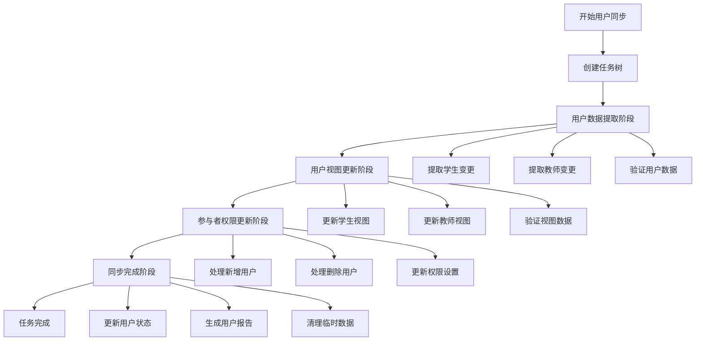

# @stratix/icasync 任务流程设计文档

## 1. 任务流程概述

### 1.1 设计目标
- 建立可靠的任务执行流程
- 确保数据同步的一致性和完整性
- 提供完整的任务监控和错误恢复机制
- 支持大规模数据的高效处理

### 1.2 核心原则
- **原子性**：每个任务步骤要么完全成功，要么完全失败
- **一致性**：确保数据在同步过程中保持一致状态
- **隔离性**：不同任务之间相互隔离，避免干扰
- **持久性**：任务状态和结果持久化存储

### 1.3 任务类型
- **全量同步任务**：完整的课程数据同步
- **增量同步任务**：基于变更的增量数据同步
- **用户同步任务**：用户信息和权限同步

## 2. 全量同步任务流程

### 2.1 流程概览



### 2.2 详细流程步骤

#### 阶段1：数据准备阶段

**目标**：验证环境和参数，准备同步所需的基础条件

**步骤**：
1. **验证学期参数**
   - 检查 `xnxq` 参数格式
   - 验证学期数据是否存在
   - 确认学期状态是否允许同步

2. **检查数据库连接**
   - 验证数据库连接可用性
   - 检查必要表的存在性
   - 验证数据库权限

3. **清理临时数据**
   - 清理上次同步的临时数据
   - 重置相关状态标识
   - 初始化工作空间

**成功条件**：所有验证通过，环境准备就绪
**失败处理**：记录错误信息，终止任务执行

#### 阶段2：课程数据聚合阶段

**目标**：从原始课程表提取和聚合数据

**步骤**：
1. **提取原始课程数据**
   ```sql
   SELECT * FROM u_jw_kcb_cur 
   WHERE xnxq = ? AND (zt = 'add' OR zt = 'update')
   ORDER BY kkh, rq, st
   ```

2. **聚合课程数据**
   - 按课程、日期、时间段分组
   - 合并连续的节次
   - 生成聚合任务记录

3. **验证聚合结果**
   - 检查数据完整性
   - 验证时间冲突
   - 确认教师和教室信息

**成功条件**：聚合数据生成完成，验证通过
**失败处理**：回滚聚合操作，记录错误详情

#### 阶段3：用户数据同步阶段

**目标**：同步用户信息，构建统一用户视图

**步骤**：
1. **同步学生信息**
   - 从 `out_xsxx` 提取学生数据
   - 转换为统一用户格式
   - 更新用户视图表

2. **同步教师信息**
   - 从 `out_jsxx` 提取教师数据
   - 转换为统一用户格式
   - 更新用户视图表

3. **构建用户视图**
   - 整合学生和教师数据
   - 建立用户映射关系
   - 验证用户数据完整性

**成功条件**：用户视图构建完成，数据一致
**失败处理**：回滚用户数据变更，保持原有状态

#### 阶段4：日历创建阶段

**目标**：为每个课程创建对应的 WPS 日历

**步骤**：
1. **创建课程日历**
   - 遍历聚合的课程数据
   - 调用 WPS API 创建日历
   - 保存日历映射关系

2. **设置日历权限**
   - 设置教师为日历所有者
   - 配置基础权限设置
   - 验证权限设置结果

3. **添加日历参与者**
   - 获取课程的学生列表
   - 批量添加学生为参与者
   - 设置参与者权限

**成功条件**：所有日历创建完成，参与者添加成功
**失败处理**：清理已创建的日历，回滚映射关系

#### 阶段5：日程同步阶段

**目标**：将聚合的课程数据同步为 WPS 日程

**步骤**：
1. **创建课程日程**
   - 遍历聚合任务数据
   - 转换为 WPS 日程格式
   - 批量创建日程

2. **设置日程参与者**
   - 为每个日程添加参与者
   - 设置参与者状态
   - 发送日程通知

3. **验证同步结果**
   - 检查日程创建结果
   - 验证参与者设置
   - 确认数据一致性

**成功条件**：所有日程创建完成，同步状态正确
**失败处理**：清理失败的日程，更新错误状态

#### 阶段6：完成清理阶段

**目标**：更新同步状态，生成报告，清理资源

**步骤**：
1. **更新同步状态**
   - 更新 `juhe_renwu` 表的 `gx_zt` 状态
   - 更新 `u_jw_kcb_cur` 表的 `gx_zt` 状态
   - 记录同步完成时间

2. **生成同步报告**
   - 统计同步结果
   - 生成详细报告
   - 发送通知消息

3. **清理临时资源**
   - 清理临时数据
   - 释放系统资源
   - 更新任务状态

**成功条件**：状态更新完成，报告生成成功
**失败处理**：记录清理错误，但不影响同步结果

## 3. 增量同步任务流程

### 3.1 流程概览



### 3.2 详细流程步骤

#### 阶段1：变更检测阶段

**目标**：检测数据变更，分析影响范围

**步骤**：
1. **检测课程变更**
   ```sql
   SELECT DISTINCT kkh, rq 
   FROM u_jw_kcb_cur 
   WHERE gx_zt IS NULL
   ```

2. **检测用户变更**
   ```sql
   SELECT * FROM out_xsxx WHERE zt IS NOT NULL
   UNION
   SELECT * FROM out_jsxx WHERE zt IS NOT NULL
   ```

3. **分析变更影响**
   - 确定受影响的日历
   - 分析参与者变更
   - 评估同步复杂度

#### 阶段2：删除处理阶段

**目标**：处理删除的课程和日程

**步骤**：
1. **删除已取消的日程**
   - 查找标记为删除的课程
   - 调用 WPS API 删除对应日程
   - 更新本地映射状态

2. **移除日历参与者**
   - 处理用户删除变更
   - 从相关日历移除参与者
   - 更新权限设置

3. **软删除聚合数据**
   - 将相关 `juhe_renwu` 记录标记为删除
   - 更新 `gx_zt` 为软删除状态
   - 保留删除记录用于审计

#### 阶段3：更新处理阶段

**目标**：处理课程和用户信息的更新

**步骤**：
1. **重新聚合变更课程**
   - 重新聚合受影响的课程数据
   - 生成新的聚合记录
   - 替换原有聚合数据

2. **更新日历信息**
   - 更新日历基本信息
   - 修改日历描述和设置
   - 同步权限变更

3. **更新日程信息**
   - 更新日程时间和地点
   - 修改日程描述信息
   - 同步参与者变更

#### 阶段4：新增处理阶段

**目标**：处理新增的课程和日程

**步骤**：
1. **创建新增日历**
   - 为新增课程创建日历
   - 设置日历基本信息
   - 建立映射关系

2. **添加新增日程**
   - 创建新增的日程
   - 设置日程详细信息
   - 添加参与者

3. **设置参与者权限**
   - 为新增用户设置权限
   - 更新现有用户权限
   - 验证权限设置

#### 阶段5：状态更新阶段

**目标**：更新同步状态，记录变更历史

**步骤**：
1. **更新同步状态**
   - 更新处理完成的记录状态
   - 标记同步完成时间
   - 清理临时状态

2. **记录变更日志**
   - 记录详细的变更信息
   - 保存操作历史
   - 生成变更报告

3. **发送通知**
   - 发送同步完成通知
   - 通知相关用户变更
   - 更新监控指标

## 4. 用户同步任务流程

### 4.1 流程概览



### 4.2 详细流程步骤

#### 阶段1：用户数据提取阶段

**目标**：提取用户变更数据，验证数据完整性

**步骤**：
1. **提取学生变更**
   - 查询学生表的变更记录
   - 提取新增、更新、删除的学生
   - 验证学生数据格式

2. **提取教师变更**
   - 查询教师表的变更记录
   - 提取新增、更新、删除的教师
   - 验证教师数据格式

3. **验证用户数据**
   - 检查数据完整性
   - 验证必填字段
   - 确认数据格式正确

#### 阶段2：用户视图更新阶段

**目标**：更新统一用户视图，保持数据一致性

**步骤**：
1. **更新学生视图**
   - 将学生数据转换为统一格式
   - 更新用户视图表
   - 建立用户映射关系

2. **更新教师视图**
   - 将教师数据转换为统一格式
   - 更新用户视图表
   - 建立用户映射关系

3. **验证视图数据**
   - 检查视图数据一致性
   - 验证映射关系正确性
   - 确认更新结果

#### 阶段3：参与者权限更新阶段

**目标**：更新日历参与者权限，处理用户变更

**步骤**：
1. **处理新增用户**
   - 为新增用户分配日历权限
   - 添加到相关课程日历
   - 设置适当的权限级别

2. **处理删除用户**
   - 从相关日历移除用户
   - 清理用户权限设置
   - 更新参与者列表

3. **更新权限设置**
   - 处理用户角色变更
   - 更新权限级别
   - 同步权限到 WPS 系统

#### 阶段4：同步完成阶段

**目标**：完成用户同步，更新状态和生成报告

**步骤**：
1. **更新用户状态**
   - 更新用户同步状态
   - 记录同步完成时间
   - 清理处理标识

2. **生成用户报告**
   - 统计用户同步结果
   - 生成详细报告
   - 记录操作日志

3. **清理临时数据**
   - 清理临时处理数据
   - 释放系统资源
   - 更新任务状态

## 5. 错误处理和恢复机制

### 5.1 错误分类和处理策略

**网络错误**：
- 自动重试机制
- 指数退避策略
- 最大重试次数限制

**业务逻辑错误**：
- 记录详细错误信息
- 人工干预处理
- 数据一致性检查

**系统错误**：
- 立即停止任务执行
- 保护数据完整性
- 发送紧急告警

### 5.2 断点续传机制

**状态保存**：
- 任务执行状态实时保存
- 关键节点设置检查点
- 支持从任意检查点恢复

**数据恢复**：
- 识别已完成的操作
- 跳过重复处理
- 继续未完成的任务

### 5.3 数据一致性保证

**事务管理**：
- 关键操作使用数据库事务
- 支持分布式事务
- 确保原子性操作

**状态同步**：
- 本地状态与远程状态同步
- 定期一致性检查
- 自动修复不一致数据
