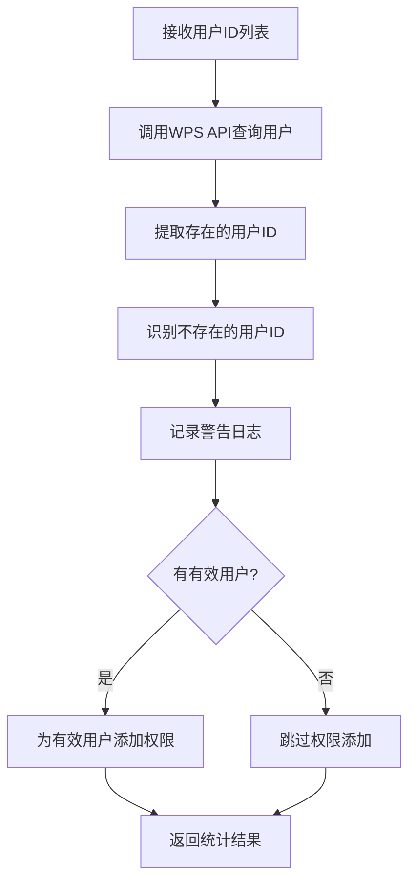

# AddSingleCalendarPermissionProcessor 用户过滤功能示例

## 功能概述

`AddSingleCalendarPermissionProcessor` 现在具备智能用户过滤功能，能够：

1. **验证用户存在性**: 在添加权限前，先查询WPS系统验证用户是否存在
2. **过滤无效用户**: 自动排除不存在的用户ID，避免API调用失败
3. **详细日志记录**: 记录被过滤的用户ID，便于问题排查和数据清理
4. **统计信息完整**: 返回详细的成功/失败统计信息

## 工作流程



## 使用示例

### 基本使用

```typescript
const context = {
  config: {
    kkh: 'CS101-2023-1',
    userList: '2021001, 2021002, T001, INVALID_USER',
    xnxq: '2023-2024-1'
  }
} as ExecutionContext;

const result = await processor.execute(context);

// 结果示例
{
  success: true,
  data: {
    kkh: 'CS101-2023-1',
    calendarId: 'cal-123',
    totalSuccessCount: 3,    // 成功添加权限的用户数
    totalFailureCount: 1,    // 被过滤的用户数
    batchCount: 1,
    batchResults: [{
      batchNumber: 1,
      userCount: 4,          // 原始用户总数
      successCount: 3,       // 成功处理的用户数
      failureCount: 1,       // 失败/跳过的用户数
      success: true
    }],
    statusUpdateResult: {
      studentUpdateCount: 2,
      teacherUpdateCount: 1,
      totalUpdateCount: 3
    }
  }
}
```

### 日志输出示例

#### 警告日志 - 发现无效用户
```
WARN: 发现不存在的用户ID，将跳过这些用户的权限添加
{
  calendarId: 'cal-123',
  batchNumber: 1,
  nonExistentUserIds: ['INVALID_USER'],
  nonExistentCount: 1,
  totalUserIds: 4
}
```

#### 调试日志 - 成功添加权限
```
DEBUG: 成功添加权限批次
{
  calendarId: 'cal-123',
  batchNumber: 1,
  originalUserCount: 4,
  validUserCount: 3,
  skippedUserCount: 1,
  response: { code: 0, msg: 'success' }
}
```

#### 警告日志 - 批次中无有效用户
```
WARN: 批次中没有有效的用户ID，跳过权限添加
{
  calendarId: 'cal-123',
  batchNumber: 1,
  originalUserCount: 2,
  validUserCount: 0
}
```

## 错误处理

### 场景1: 部分用户不存在
- **行为**: 为存在的用户添加权限，跳过不存在的用户
- **结果**: `success: true`，但`failureCount > 0`
- **日志**: 记录被跳过的用户ID列表

### 场景2: 所有用户都不存在
- **行为**: 跳过权限添加操作
- **结果**: `success: true`，`successCount: 0`
- **日志**: 记录"批次中没有有效的用户ID"

### 场景3: WPS API调用失败
- **行为**: 整个批次失败
- **结果**: `success: false`
- **日志**: 记录API错误信息

## 性能优化

1. **批量查询**: 一次API调用查询所有用户，而不是逐个查询
2. **内存优化**: 使用Set进行快速用户ID查找
3. **早期退出**: 如果没有有效用户，直接跳过后续操作
4. **详细统计**: 提供完整的处理统计信息，便于监控和优化

## 配置建议

### 生产环境
```typescript
{
  kkh: 'COURSE_CODE',
  userList: 'user1,user2,user3',  // 来自数据库查询
  xnxq: '2023-2024-1',
  dryRun: false                   // 实际执行
}
```

### 测试环境
```typescript
{
  kkh: 'TEST_COURSE',
  userList: 'test_user1,invalid_user,test_user2',
  xnxq: '2023-2024-1',
  dryRun: true                    // 测试模式
}
```

## 监控指标

建议监控以下指标：

1. **用户过滤率**: `failureCount / userCount`
2. **批次成功率**: 成功批次数 / 总批次数
3. **平均处理时间**: 每个批次的处理时间
4. **无效用户频率**: 被过滤用户的出现频率

## 故障排查

### 高用户过滤率
1. 检查用户数据同步是否正常
2. 验证用户ID格式是否正确
3. 确认WPS系统中用户状态

### 权限添加失败
1. 检查WPS API访问权限
2. 验证日历ID是否有效
3. 确认用户权限配置

### 性能问题
1. 监控批次大小和处理时间
2. 检查WPS API响应时间
3. 优化用户查询逻辑
