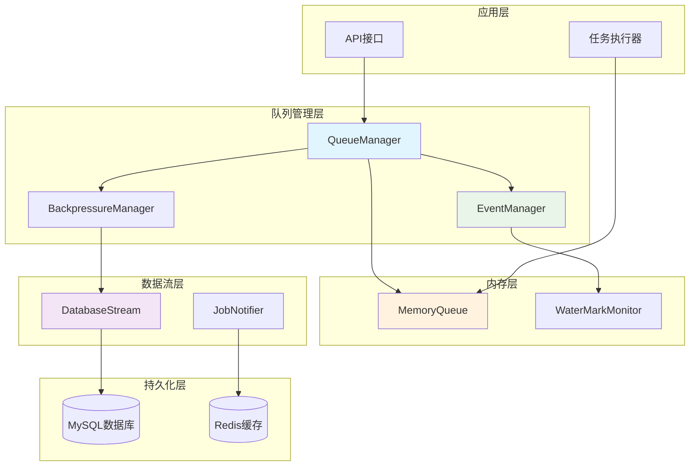
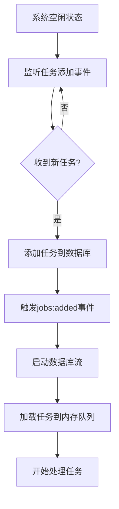
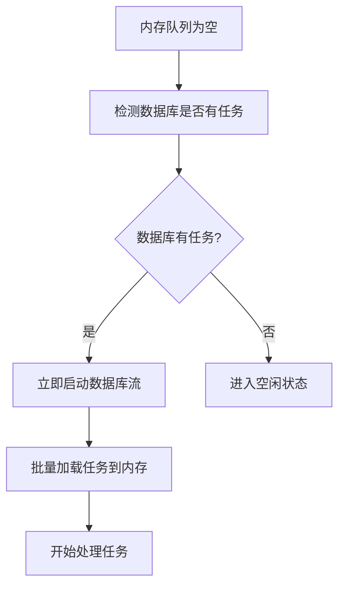
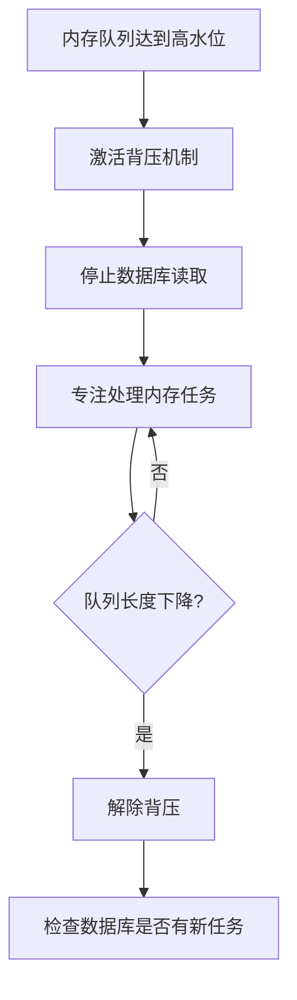
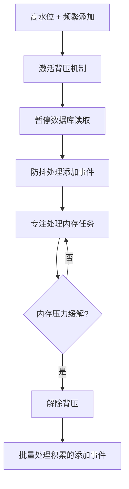
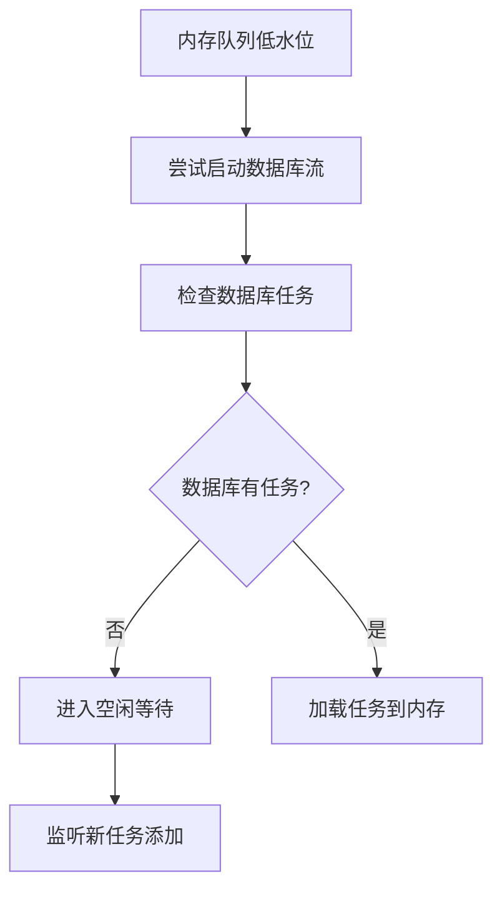
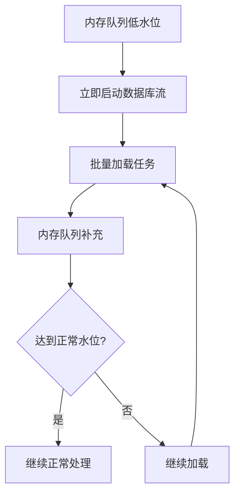

# @stratix/queue 事件驱动队列系统设计

## 🎯 系统概述

@stratix/queue 是一个基于事件驱动的高性能消息队列系统，采用内存队列 + 数据库持久化的混合架构，支持背压控制、智能流管理和实时监控。

### 核心特性

- **事件驱动**：零轮询设计，完全基于事件响应
- **背压控制**：智能的内存压力管理和流控制
- **顺序执行**：基于优先级和时间的严格顺序处理
- **分组管理**：支持队列分组和组级别的暂停/恢复
- **实时监控**：完整的队列状态和性能指标
- **高可用性**：支持集群部署和故障恢复

## 🏗️ 系统架构



## 🔧 核心组件设计

### 1. EventDrivenMemoryQueue - 事件驱动内存队列

```typescript
class EventDrivenMemoryQueue extends EventEmitter {
  private queue: QueueJob[] = [];
  private _length = 0;
  private waterMarks = {
    empty: 0,
    low: 2000,
    normal: 5000,
    high: 8000,
    critical: 10000
  };
  private currentLevel: WaterMarkLevel = 'empty';
  private debounceTimeout: NodeJS.Timeout | null = null;

  // 添加任务（触发事件）
  push(job: QueueJob) {
    this.queue.push(job);
    this._length++;
    this.checkWaterMarksAndEmit();
  }

  // 批量添加任务
  pushBatch(jobs: QueueJob[]) {
    this.queue.push(...jobs);
    this._length += jobs.length;
    this.checkWaterMarksAndEmit();
  }

  // 取出任务（触发事件）
  shift(): QueueJob | undefined {
    const job = this.queue.shift();
    if (job) {
      this._length--;
      this.checkWaterMarksAndEmit();
    }
    return job;
  }

  // 实时长度获取
  get length(): number {
    return this._length;
  }

  // 检查水位并发出事件
  private checkWaterMarksAndEmit() {
    const newLevel = this.calculateWaterMarkLevel();
    
    if (newLevel !== this.currentLevel) {
      this.emitWaterMarkChange(this.currentLevel, newLevel);
      this.currentLevel = newLevel;
    }

    this.debouncedLengthChange();
  }

  private calculateWaterMarkLevel(): WaterMarkLevel {
    if (this._length === 0) return 'empty';
    if (this._length >= this.waterMarks.critical) return 'critical';
    if (this._length >= this.waterMarks.high) return 'high';
    if (this._length >= this.waterMarks.normal) return 'normal';
    if (this._length <= this.waterMarks.low) return 'low';
    return 'normal';
  }

  private emitWaterMarkChange(from: WaterMarkLevel, to: WaterMarkLevel) {
    console.log(`📊 队列水位变化: ${from} → ${to} (长度: ${this._length})`);
    
    this.emit('watermark:changed', { from, to, length: this._length });
    this.emit(`watermark:${to}`, { length: this._length });
  }

  // 防抖的长度变化事件
  private debouncedLengthChange() {
    if (this.debounceTimeout) {
      clearTimeout(this.debounceTimeout);
    }

    this.debounceTimeout = setTimeout(() => {
      this.emit('length:changed', {
        length: this._length,
        level: this.currentLevel
      });
    }, 50); // 50ms防抖
  }
}
```

### 2. SmartBackpressureManager - 智能背压管理器

```typescript
class SmartBackpressureManager extends EventEmitter {
  private isBackpressureActive = false;
  private databaseStream: DatabaseJobStream | null = null;
  private streamStartDebounce: NodeJS.Timeout | null = null;
  private streamStopDebounce: NodeJS.Timeout | null = null;
  private config = {
    startStreamDelay: 100,    // 启动流延迟
    stopStreamDelay: 200,     // 停止流延迟
    minStreamDuration: 1000   // 最小流运行时间
  };
  private streamStartTime: number | null = null;

  constructor(
    private memoryQueue: EventDrivenMemoryQueue,
    private jobRepository: QueueJobRepository
  ) {
    super();
    this.setupEventHandlers();
  }

  private setupEventHandlers() {
    // 高水位/临界水位 - 激活背压
    this.memoryQueue.on('watermark:high', () => this.activateBackpressure());
    this.memoryQueue.on('watermark:critical', () => this.activateBackpressure(true));

    // 低水位/正常水位 - 解除背压
    this.memoryQueue.on('watermark:low', () => this.deactivateBackpressure());
    this.memoryQueue.on('watermark:normal', () => {
      if (this.isBackpressureActive) {
        this.deactivateBackpressure();
      }
    });

    // 空队列 - 准备启动流
    this.memoryQueue.on('watermark:empty', () => this.handleEmptyQueue());
  }

  private activateBackpressure(force = false) {
    if (this.isBackpressureActive && !force) return;

    // 清除启动流的防抖
    if (this.streamStartDebounce) {
      clearTimeout(this.streamStartDebounce);
      this.streamStartDebounce = null;
    }

    this.isBackpressureActive = true;
    console.log('🔴 激活背压机制');

    // 延迟停止流，避免频繁开关
    if (this.streamStopDebounce) {
      clearTimeout(this.streamStopDebounce);
    }

    this.streamStopDebounce = setTimeout(() => {
      this.pauseDatabaseStream();
    }, this.config.stopStreamDelay);

    this.emit('backpressure:activated', {
      queueLength: this.memoryQueue.length,
      force
    });
  }

  private deactivateBackpressure() {
    if (!this.isBackpressureActive) return;

    // 清除停止流的防抖
    if (this.streamStopDebounce) {
      clearTimeout(this.streamStopDebounce);
      this.streamStopDebounce = null;
    }

    this.isBackpressureActive = false;
    console.log('🟢 解除背压机制');

    // 延迟启动流，避免频繁开关
    this.debouncedStartStream();

    this.emit('backpressure:deactivated', {
      queueLength: this.memoryQueue.length
    });
  }

  private handleEmptyQueue() {
    console.log('📭 队列为空，准备启动数据流');
    this.debouncedStartStream();
  }

  // 防抖启动数据流
  private debouncedStartStream() {
    if (this.streamStartDebounce) {
      clearTimeout(this.streamStartDebounce);
    }

    this.streamStartDebounce = setTimeout(() => {
      this.startDatabaseStreamIfNeeded();
    }, this.config.startStreamDelay);
  }

  private startDatabaseStreamIfNeeded() {
    if (this.isBackpressureActive || this.databaseStream) {
      return;
    }

    console.log('🚀 启动数据库读取流');
    this.streamStartTime = Date.now();
    
    this.databaseStream = new DatabaseJobStream(this.jobRepository);
    
    this.databaseStream.on('data', (jobs: QueueJob[]) => {
      if (!this.isBackpressureActive && jobs.length > 0) {
        this.memoryQueue.pushBatch(jobs);
      }
    });

    this.databaseStream.on('end', () => {
      console.log('📄 数据库流结束');
      this.databaseStream = null;
      this.streamStartTime = null;
    });

    this.databaseStream.on('error', (error) => {
      console.error('❌ 数据库流错误:', error);
      this.databaseStream = null;
      this.streamStartTime = null;
    });

    this.emit('stream:started');
  }

  private pauseDatabaseStream() {
    if (!this.databaseStream) return;

    // 检查最小运行时间
    if (this.streamStartTime) {
      const runDuration = Date.now() - this.streamStartTime;
      if (runDuration < this.config.minStreamDuration) {
        console.log(`⏳ 流运行时间不足 ${this.config.minStreamDuration}ms，延迟暂停`);
        setTimeout(() => this.pauseDatabaseStream(), 
          this.config.minStreamDuration - runDuration);
        return;
      }
    }

    console.log('⏸️ 暂停数据库读取流');
    this.databaseStream.pause();
    this.emit('stream:paused');
  }

  // 外部触发启动流（用于任务添加事件）
  triggerStreamStart() {
    if (!this.isBackpressureActive) {
      this.debouncedStartStream();
    }
  }

  getStatus() {
    return {
      isBackpressureActive: this.isBackpressureActive,
      hasActiveStream: !!this.databaseStream,
      queueLength: this.memoryQueue.length,
      streamStartTime: this.streamStartTime
    };
  }
}
```

### 3. JobAdditionNotifier - 任务添加通知器

```typescript
class JobAdditionNotifier extends EventEmitter {
  private addEventDebounce: NodeJS.Timeout | null = null;
  private pendingAddEvents: string[] = [];

  constructor(private jobRepository: QueueJobRepository) {
    super();
  }

  async addJob(jobData: any): Promise<QueueJob> {
    const job = await this.jobRepository.create(jobData);
    
    // 收集添加事件，批量处理
    this.pendingAddEvents.push(job.id);
    this.debouncedEmitAddEvent();
    
    return job;
  }

  // 防抖的添加事件发送
  private debouncedEmitAddEvent() {
    if (this.addEventDebounce) {
      clearTimeout(this.addEventDebounce);
    }

    this.addEventDebounce = setTimeout(() => {
      const jobIds = [...this.pendingAddEvents];
      this.pendingAddEvents = [];
      
      console.log(`🔔 批量任务添加事件: ${jobIds.length} 个任务`);
      
      this.emit('jobs:added', {
        jobIds,
        count: jobIds.length,
        timestamp: new Date()
      });
    }, 100); // 100ms内的添加事件合并
  }
}
```

## 📋 六大场景详细分析

### 场景1: 数据库和内存队列都为空

**状态特征：**
- 内存队列长度 = 0
- 数据库待处理任务 = 0
- 系统处于完全空闲状态

**处理流程：**


**代码实现：**
```typescript
// 空闲状态处理
memoryQueue.on('watermark:empty', () => {
  console.log('📭 进入空闲状态，等待新任务');
  this.emit('queue:idle');
});

// 任务添加触发
jobNotifier.on('jobs:added', () => {
  console.log('🔔 检测到新任务，启动处理流程');
  backpressureManager.triggerStreamStart();
});
```

### 场景2: 数据库有数据，内存队列无数据

**状态特征：**
- 内存队列长度 = 0
- 数据库待处理任务 > 0
- 可能是系统刚启动或处理完内存任务

**处理流程：**


**代码实现：**
```typescript
// 内存队列空时的处理
memoryQueue.on('watermark:empty', async () => {
  const pendingCount = await jobRepository.countPendingJobs();
  if (pendingCount > 0) {
    console.log(`📥 内存队列为空，数据库有 ${pendingCount} 个待处理任务`);
    backpressureManager.triggerStreamStart();
  }
});
```

### 场景3: 内存队列积压超过上限，数据库无数据

**状态特征：**
- 内存队列长度 >= 高水位线
- 数据库待处理任务 = 0
- 任务处理速度慢于内存积累速度

**处理流程：**


**代码实现：**
```typescript
// 高水位背压处理
memoryQueue.on('watermark:high', () => {
  console.log('🔴 内存队列达到高水位，激活背压');
  // 自动暂停数据库读取，专注处理内存任务
});

// 背压解除
memoryQueue.on('watermark:normal', () => {
  if (backpressureManager.isActive) {
    console.log('🟢 内存压力缓解，解除背压');
    // 检查是否需要重新启动数据库流
  }
});
```

### 场景4: 内存队列积压超过上限，数据库有数据（频繁add事件）

**状态特征：**
- 内存队列长度 >= 高水位线
- 数据库持续有新任务添加
- 频繁的任务添加事件

**处理流程：**


**关键优化：防抖机制**
```typescript
class JobAdditionNotifier extends EventEmitter {
  private addEventDebounce: NodeJS.Timeout | null = null;
  private pendingAddEvents: string[] = [];

  // 防抖处理频繁的添加事件
  private debouncedEmitAddEvent() {
    if (this.addEventDebounce) {
      clearTimeout(this.addEventDebounce);
    }

    this.addEventDebounce = setTimeout(() => {
      const jobIds = [...this.pendingAddEvents];
      this.pendingAddEvents = [];
      
      // 批量发送事件，避免频繁触发
      this.emit('jobs:added:batch', {
        jobIds,
        count: jobIds.length
      });
    }, 100); // 100ms内的事件合并
  }
}
```

### 场景5: 内存队列少于最低值，数据库无数据

**状态特征：**
- 内存队列长度 <= 低水位线
- 数据库待处理任务 = 0
- 任务处理速度快于补充速度

**处理流程：**


**代码实现：**
```typescript
// 低水位处理
memoryQueue.on('watermark:low', async () => {
  console.log('📉 内存队列达到低水位');
  
  // 尝试从数据库加载更多任务
  const pendingCount = await jobRepository.countPendingJobs();
  if (pendingCount > 0) {
    backpressureManager.triggerStreamStart();
  } else {
    console.log('💤 数据库无待处理任务，进入等待状态');
  }
});
```

### 场景6: 内存队列低于最小值，数据库有数据

**状态特征：**
- 内存队列长度 <= 低水位线
- 数据库待处理任务 > 0
- 正常的补充流程

**处理流程：**


### 场景7: 内存队列低于最小值，数据库任务增加缓慢

**问题：** 会频繁开启暂停读取队列吗？

**解决方案：** 智能防抖机制

```typescript
class SmartBackpressureManager {
  private config = {
    startStreamDelay: 100,      // 启动流延迟
    stopStreamDelay: 200,       // 停止流延迟
    minStreamDuration: 1000,    // 最小流运行时间
    cooldownPeriod: 5000        // 冷却期
  };
  private lastStreamStop: number = 0;

  private debouncedStartStream() {
    // 检查冷却期
    const timeSinceLastStop = Date.now() - this.lastStreamStop;
    if (timeSinceLastStop < this.config.cooldownPeriod) {
      console.log(`⏳ 流启动冷却期，剩余 ${this.config.cooldownPeriod - timeSinceLastStop}ms`);
      return;
    }

    if (this.streamStartDebounce) {
      clearTimeout(this.streamStartDebounce);
    }

    this.streamStartDebounce = setTimeout(() => {
      this.startDatabaseStreamIfNeeded();
    }, this.config.startStreamDelay);
  }

  private pauseDatabaseStream() {
    // 记录停止时间
    this.lastStreamStop = Date.now();
    
    // 检查最小运行时间
    if (this.streamStartTime) {
      const runDuration = Date.now() - this.streamStartTime;
      if (runDuration < this.config.minStreamDuration) {
        setTimeout(() => this.pauseDatabaseStream(), 
          this.config.minStreamDuration - runDuration);
        return;
      }
    }

    this.databaseStream?.pause();
  }
}
```

## 🎮 完整的队列管理器实现

```typescript
class EventDrivenQueueManager extends EventEmitter {
  private memoryQueue: EventDrivenMemoryQueue;
  private backpressureManager: SmartBackpressureManager;
  private jobNotifier: JobAdditionNotifier;
  private isProcessing = false;
  private processingStats = {
    totalProcessed: 0,
    totalFailed: 0,
    averageProcessingTime: 0
  };

  constructor(private jobRepository: QueueJobRepository) {
    super();
    this.initializeComponents();
    this.setupEventHandlers();
  }

  private initializeComponents() {
    this.memoryQueue = new EventDrivenMemoryQueue();
    this.backpressureManager = new SmartBackpressureManager(
      this.memoryQueue, 
      this.jobRepository
    );
    this.jobNotifier = new JobAdditionNotifier(this.jobRepository);
  }

  private setupEventHandlers() {
    // 1. 任务添加事件处理
    this.jobNotifier.on('jobs:added', (event) => {
      this.handleJobsAdded(event);
    });

    // 2. 队列状态变化处理
    this.memoryQueue.on('watermark:changed', (event) => {
      this.handleWaterMarkChange(event);
    });

    // 3. 背压状态变化处理
    this.backpressureManager.on('backpressure:activated', () => {
      console.log('🔴 背压激活，优先处理内存任务');
    });

    this.backpressureManager.on('backpressure:deactivated', () => {
      console.log('🟢 背压解除，恢复正常流程');
    });

    // 4. 数据流状态处理
    this.backpressureManager.on('stream:started', () => {
      console.log('🚀 数据库流已启动');
    });

    this.backpressureManager.on('stream:paused', () => {
      console.log('⏸️ 数据库流已暂停');
    });
  }

  private async handleJobsAdded(event: { jobIds: string[], count: number }) {
    console.log(`🔔 处理 ${event.count} 个新任务添加事件`);
    
    // 如果队列为空，立即启动处理
    if (this.memoryQueue.length === 0) {
      this.backpressureManager.triggerStreamStart();
    }

    // 如果没有在处理，启动处理循环
    if (!this.isProcessing) {
      this.startProcessing();
    }
  }

  private handleWaterMarkChange(event: { from: string, to: string, length: number }) {
    console.log(`📊 队列水位变化: ${event.from} → ${event.to} (${event.length})`);
    
    // 发送监控指标
    this.emit('metrics:watermark', {
      level: event.to,
      length: event.length,
      timestamp: new Date()
    });
  }

  async addJob(jobData: any): Promise<QueueJob> {
    return await this.jobNotifier.addJob(jobData);
  }

  private async startProcessing() {
    if (this.isProcessing) return;
    
    this.isProcessing = true;
    console.log('🔄 开始处理队列');

    while (this.isProcessing) {
      const job = this.memoryQueue.shift();
      
      if (job) {
        await this.processJob(job);
      } else {
        // 没有任务时短暂等待
        await new Promise(resolve => setTimeout(resolve, 100));
      }
    }
  }

  private async processJob(job: QueueJob) {
    const startTime = Date.now();
    
    try {
      console.log(`🔄 处理任务 ${job.id} (剩余: ${this.memoryQueue.length})`);
      
      // 更新任务状态
      await this.jobRepository.updateStatus(job.id, 'processing');
      
      // 执行任务
      await job.execute();
      
      // 移动到成功表
      await this.moveJobToSuccess(job);
      
      this.processingStats.totalProcessed++;
      
      const processingTime = Date.now() - startTime;
      this.updateAverageProcessingTime(processingTime);
      
      console.log(`✅ 任务 ${job.id} 完成 (耗时: ${processingTime}ms)`);
      
    } catch (error) {
      console.error(`❌ 任务 ${job.id} 失败:`, error);
      
      // 移动到失败表
      await this.moveJobToFailure(job, error);
      
      this.processingStats.totalFailed++;
    }
  }

  private updateAverageProcessingTime(processingTime: number) {
    const total = this.processingStats.totalProcessed;
    this.processingStats.averageProcessingTime = 
      (this.processingStats.averageProcessingTime * (total - 1) + processingTime) / total;
  }

  // 获取实时状态
  getRealtimeStatus() {
    return {
      memoryQueue: {
        length: this.memoryQueue.length,
        level: this.memoryQueue.currentLevel
      },
      backpressure: this.backpressureManager.getStatus(),
      processing: {
        isActive: this.isProcessing,
        stats: this.processingStats
      },
      timestamp: new Date()
    };
  }

  async stop() {
    console.log('🛑 停止队列管理器');
    this.isProcessing = false;
    this.removeAllListeners();
  }
}
```

## ⚙️ 配置和最佳实践

### 水位标记配置

```typescript
interface QueueConfig {
  waterMarks: {
    low: number;        // 低水位：2000
    normal: number;     // 正常水位：5000  
    high: number;       // 高水位：8000
    critical: number;   // 临界水位：10000
  };
  
  backpressure: {
    startStreamDelay: number;     // 启动流延迟：100ms
    stopStreamDelay: number;      // 停止流延迟：200ms
    minStreamDuration: number;    // 最小流运行时间：1000ms
    cooldownPeriod: number;       // 冷却期：5000ms
  };
  
  debounce: {
    lengthChange: number;         // 长度变化防抖：50ms
    jobAddition: number;          // 任务添加防抖：100ms
  };
}

// 不同场景的推荐配置
const configs = {
  highThroughput: {
    waterMarks: { low: 5000, normal: 10000, high: 20000, critical: 30000 },
    backpressure: { startStreamDelay: 50, stopStreamDelay: 100, minStreamDuration: 2000, cooldownPeriod: 3000 },
    debounce: { lengthChange: 25, jobAddition: 50 }
  },
  
  normalLoad: {
    waterMarks: { low: 2000, normal: 5000, high: 8000, critical: 10000 },
    backpressure: { startStreamDelay: 100, stopStreamDelay: 200, minStreamDuration: 1000, cooldownPeriod: 5000 },
    debounce: { lengthChange: 50, jobAddition: 100 }
  },
  
  lowLatency: {
    waterMarks: { low: 500, normal: 1000, high: 2000, critical: 3000 },
    backpressure: { startStreamDelay: 200, stopStreamDelay: 300, minStreamDuration: 500, cooldownPeriod: 2000 },
    debounce: { lengthChange: 100, jobAddition: 200 }
  }
};
```

### 监控指标

```typescript
interface QueueMetrics {
  // 队列状态
  memoryQueueLength: number;
  waterMarkLevel: string;
  
  // 处理统计
  totalProcessed: number;
  totalFailed: number;
  averageProcessingTime: number;
  
  // 背压统计
  backpressureActivations: number;
  totalBackpressureTime: number;
  
  // 流状态
  streamStartCount: number;
  streamPauseCount: number;
  averageStreamDuration: number;
}
```

## 🎯 总结

这个事件驱动的队列系统设计具有以下优势：

1. **零轮询**：完全基于事件驱动，无需定时检查
2. **智能背压**：自动检测和处理内存压力
3. **防抖优化**：避免频繁的流开关操作
4. **实时响应**：任务添加和状态变化立即触发相应动作
5. **高性能**：批量处理和智能缓存机制
6. **可观测性**：完整的监控指标和状态跟踪

通过这个设计，系统能够智能地处理各种复杂场景，确保高效、稳定的队列处理性能。