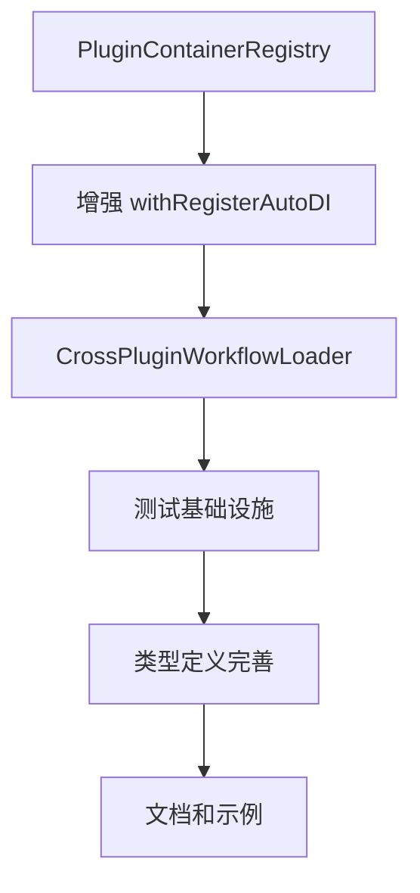

# @stratix/tasks 技术实施计划

## 📋 概述

本文档详细描述了 @stratix/tasks 工作流引擎的技术实施计划，包括第一阶段的具体开发步骤、文件结构和技术细节。

## 🎯 第一阶段：核心基础设施实施

### 阶段目标
建立跨插件容器管理和依赖注入机制，为整个工作流引擎奠定技术基础。

### 开发顺序和依赖关系



## 🔧 具体实施步骤

### 步骤 1：创建 PluginContainerRegistry (Day 1)

#### 1.1 新建文件
```
packages/core/src/plugin/container-registry.ts
packages/core/src/plugin/container-registry.test.ts
```

#### 1.2 核心功能设计
```typescript
// packages/core/src/plugin/container-registry.ts
export interface PluginContainerInfo {
  pluginName: string;
  container: AwilixContainer;
  basePath: string;
  workflowConfig?: WorkflowConfig;
  metadata?: PluginMetadata;
}

export class PluginContainerRegistry {
  // 容器注册和管理
  registerContainer(info: PluginContainerInfo): void;
  getContainer(pluginName: string): AwilixContainer | undefined;
  getTasksContainer(): AwilixContainer | null;
  
  // 工作流插件管理
  getWorkflowEnabledPlugins(): PluginContainerInfo[];
  createCrossContainerResolver(targetPluginName: string): CrossContainerResolver;
  
  // 生命周期管理
  dispose(): Promise<void>;
}
```

#### 1.3 技术要点
- **线程安全**：使用 Map 存储容器引用，确保并发安全
- **内存管理**：提供容器清理机制，避免内存泄漏
- **错误处理**：完善的错误处理和日志记录

### 步骤 2：增强 withRegisterAutoDI (Day 2-3)

#### 2.1 修改文件
```
packages/core/src/plugin/auto-di-plugin.ts
packages/core/src/plugin/utils.ts
packages/core/src/plugin/types.ts
```

#### 2.2 关键修改点

**2.2.1 扩展配置接口**
```typescript
// packages/core/src/plugin/types.ts
export interface AutoDIConfig {
  // 现有配置...
  
  // 新增：工作流配置
  workflows?: {
    enabled: boolean;
    patterns: string[];
    metadata?: {
      category?: string;
      provides?: {
        definitions?: string[];
        executors?: string[];
        services?: string[];
      };
    };
  };
}
```

**2.2.2 增强主函数**
```typescript
// packages/core/src/plugin/auto-di-plugin.ts
export function withRegisterAutoDI<T extends FastifyPluginOptions = FastifyPluginOptions>(
  plugin: FastifyPluginAsync<T> | FastifyPluginCallback<T>,
  config: Partial<AutoDIConfig> = {}
): FastifyPluginAsync<T> {
  return async (fastify: FastifyInstance, options: T) => {
    // 1. 现有逻辑...
    
    // 2. 新增：注册插件容器到全局注册表
    const containerInfo: PluginContainerInfo = {
      pluginName,
      container: pluginInternalContainer,
      basePath,
      workflowConfig: mergedConfig.workflows
    };
    
    pluginContainerRegistry.registerContainer(containerInfo);
    
    // 3. 新增：如果是 @stratix/tasks 插件，执行跨插件加载
    if (pluginName === '@stratix/tasks') {
      await loadCrossPluginWorkflows(pluginInternalContainer);
    }
    
    // 4. 新增：如果插件包含工作流配置，通知 @stratix/tasks
    if (mergedConfig.workflows?.enabled) {
      await notifyTasksPluginOfWorkflowComponents(pluginName, mergedConfig.workflows);
    }
    
    // 5. 现有逻辑...
  };
}
```

#### 2.3 集成要点
- **向后兼容**：确保现有插件不受影响
- **性能优化**：避免不必要的容器操作
- **错误隔离**：工作流相关错误不影响插件正常功能

### 步骤 3：实现 CrossPluginWorkflowLoader (Day 3-4)

#### 3.1 新建文件
```
packages/core/src/plugin/cross-plugin-workflow-loader.ts
packages/core/src/plugin/cross-plugin-workflow-loader.test.ts
```

#### 3.2 核心实现

**3.2.1 主类设计**
```typescript
// packages/core/src/plugin/cross-plugin-workflow-loader.ts
export class CrossPluginWorkflowLoader {
  constructor(
    private tasksContainer: AwilixContainer,
    private debugEnabled: boolean = false
  ) {}
  
  // 主要方法
  async loadAllPluginWorkflows(): Promise<void>;
  async loadPluginWorkflows(pluginName: string): Promise<void>;
  
  // 私有方法
  private async loadWorkflowDefinitions(pluginInfo: PluginContainerInfo): Promise<void>;
  private async loadExecutorsWithCrossContainerDI(pluginInfo: PluginContainerInfo): Promise<void>;
  private async loadWorkflowServices(pluginInfo: PluginContainerInfo): Promise<void>;
  
  // 工厂方法
  private createCrossContainerExecutorFactory(
    sourceModuleName: string,
    sourceContainer: AwilixContainer,
    pluginInfo: PluginContainerInfo
  ): (tasksContainer: AwilixContainer) => TaskExecutor;
}
```

**3.2.2 跨容器代理工厂**
```typescript
private createCrossContainerExecutorFactory(
  sourceModuleName: string,
  sourceContainer: AwilixContainer,
  pluginInfo: PluginContainerInfo
): (tasksContainer: AwilixContainer) => TaskExecutor {
  return (tasksContainer: AwilixContainer) => {
    try {
      // 🔥 关键：从源插件容器解析执行器实例
      const executorInstance = sourceContainer.resolve<TaskExecutor>(sourceModuleName);
      
      if (this.debugEnabled) {
        console.log(`🔄 跨容器代理解析: ${sourceModuleName} (来自 ${pluginInfo.pluginName})`);
      }
      
      return executorInstance;
      
    } catch (error) {
      throw new Error(
        `跨容器执行器解析失败: ${sourceModuleName} (插件: ${pluginInfo.pluginName}) - ${error.message}`
      );
    }
  };
}
```

#### 3.3 命名策略实现
```typescript
// 生成标准化的注册键名
private generateExecutorRegistrationKeys(
  executorInstance: any,
  pluginName: string,
  moduleName: string
): string[] {
  const keys: string[] = [];
  
  const executorName = executorInstance.prototype?.name || 
                      executorInstance.name || 
                      moduleName;
  
  // 1. 标准格式
  keys.push(`executor_${executorName}`);
  
  // 2. 插件前缀格式
  const pluginPrefix = this.extractPluginPrefix(pluginName);
  if (pluginPrefix) {
    keys.push(`executor_${pluginPrefix}_${executorName}`);
    keys.push(`${pluginPrefix}_${executorName}`);
  }
  
  // 3. 直接名称
  keys.push(executorName);
  
  // 4. 类名格式
  if (executorInstance.name?.endsWith('Executor')) {
    const className = executorInstance.name;
    keys.push(className);
    keys.push(`executor_${className}`);
  }
  
  return [...new Set(keys)];
}
```

### 步骤 4：建立测试基础设施 (Day 4-5)

#### 4.1 测试文件结构
```
packages/core/src/plugin/__tests__/
├── container-registry.test.ts
├── cross-plugin-workflow-loader.test.ts
├── auto-di-plugin.test.ts
└── fixtures/
    ├── test-plugin-a/
    │   ├── index.ts
    │   └── workflows/
    │       ├── definitions/
    │       │   └── test-workflow.ts
    │       └── executors/
    │           └── test-executor.ts
    └── test-plugin-b/
        ├── index.ts
        └── workflows/
            └── executors/
                └── another-executor.ts
```

#### 4.2 核心测试用例

**4.2.1 容器注册表测试**
```typescript
// packages/core/src/plugin/__tests__/container-registry.test.ts
describe('PluginContainerRegistry', () => {
  test('应该正确注册和检索插件容器', async () => {
    const registry = new PluginContainerRegistry();
    const mockContainer = createContainer();
    
    const containerInfo: PluginContainerInfo = {
      pluginName: '@test/plugin-a',
      container: mockContainer,
      basePath: '/test/path',
      workflowConfig: {
        enabled: true,
        patterns: ['workflows/**/*.ts']
      }
    };
    
    registry.registerContainer(containerInfo);
    
    const retrieved = registry.getContainer('@test/plugin-a');
    expect(retrieved).toBe(mockContainer);
  });
  
  test('应该正确识别工作流启用的插件', async () => {
    // 测试工作流插件识别逻辑
  });
});
```

**4.2.2 跨插件加载器测试**
```typescript
// packages/core/src/plugin/__tests__/cross-plugin-workflow-loader.test.ts
describe('CrossPluginWorkflowLoader', () => {
  test('应该正确加载跨插件执行器', async () => {
    // 设置测试环境
    const tasksContainer = createContainer();
    const sourceContainer = createContainer();
    
    // 注册测试执行器到源容器
    sourceContainer.register('testExecutor', asClass(TestExecutor));
    
    // 创建加载器并执行加载
    const loader = new CrossPluginWorkflowLoader(tasksContainer, true);
    await loader.loadPluginWorkflows('@test/plugin-a');
    
    // 验证代理注册
    expect(tasksContainer.hasRegistration('executor_test-executor')).toBe(true);
    
    // 验证跨容器解析
    const executor = tasksContainer.resolve('executor_test-executor');
    expect(executor).toBeInstanceOf(TestExecutor);
  });
});
```

#### 4.3 集成测试
```typescript
// packages/core/src/plugin/__tests__/integration.test.ts
describe('跨插件工作流集成测试', () => {
  test('完整的插件加载和执行流程', async () => {
    // 1. 创建 Fastify 实例
    const app = fastify();
    
    // 2. 注册测试插件
    await app.register(testPluginA);
    await app.register(testPluginB);
    await app.register(tasksPlugin);
    
    // 3. 验证跨插件组件可用
    const tasksContainer = pluginContainerRegistry.getTasksContainer();
    expect(tasksContainer?.hasRegistration('executor_test-executor')).toBe(true);
    
    // 4. 验证执行器可以正确解析和执行
    const executor = tasksContainer?.resolve('executor_test-executor');
    const result = await executor.execute({}, mockContext);
    expect(result.success).toBe(true);
  });
});
```

### 步骤 5：完善类型定义 (Day 5)

#### 5.1 新建类型文件
```
packages/core/src/plugin/workflow-types.ts
packages/core/src/plugin/index.ts (更新导出)
```

#### 5.2 核心类型定义
```typescript
// packages/core/src/plugin/workflow-types.ts
export interface WorkflowConfig {
  enabled: boolean;
  patterns: string[];
  metadata?: {
    category?: string;
    provides?: {
      definitions?: string[];
      executors?: string[];
      services?: string[];
    };
  };
}

export interface PluginMetadata {
  version?: string;
  description?: string;
  author?: string;
  dependencies?: string[];
  loadedAt?: Date;
}

export interface CrossContainerResolver {
  resolve<T>(name: string): T;
  has(name: string): boolean;
}

// 工作流相关的基础类型
export interface TaskExecutor<TInput = any, TOutput = any> {
  name: string;
  execute(input: TInput, context: ExecutionContext): Promise<TaskResult<TOutput>>;
}

export interface TaskResult<T = any> {
  success: boolean;
  data?: T;
  error?: {
    message: string;
    code: string;
    retryable?: boolean;
    details?: any;
  };
}

export interface ExecutionContext {
  workflowInstanceId: string;
  taskInstanceId: string;
  input: Record<string, any>;
  variables: Record<string, any>;
  logger: Logger;
  signal: AbortSignal;
  reportProgress(percentage: number): void;
  setVariable(key: string, value: any): void;
  getVariable(key: string): any;
}
```

## 🧪 测试策略

### 单元测试
- **覆盖率目标**：≥ 90%
- **测试框架**：Jest + @types/jest
- **模拟策略**：使用 jest.mock() 模拟 Awilix 容器

### 集成测试
- **测试环境**：使用真实的 Fastify 实例
- **插件隔离**：每个测试用例使用独立的插件实例
- **异步处理**：正确处理插件加载的异步性质

### 性能测试
- **容器操作性能**：测试大量插件注册的性能
- **内存使用**：监控容器和代理对象的内存占用
- **并发安全**：测试多线程环境下的容器操作

## 🔍 调试和监控

### 调试支持
```typescript
// 调试日志配置
const DEBUG_CONFIG = {
  containerRegistry: process.env.DEBUG_CONTAINER_REGISTRY === 'true',
  crossPluginLoader: process.env.DEBUG_CROSS_PLUGIN === 'true',
  dependencyInjection: process.env.DEBUG_DI === 'true'
};

// 调试日志示例
if (DEBUG_CONFIG.containerRegistry) {
  console.log(`📦 注册插件容器: ${pluginName}`, {
    basePath,
    workflowEnabled: !!workflowConfig?.enabled,
    patterns: workflowConfig?.patterns
  });
}
```

### 监控指标
- **容器注册数量**：跟踪注册的插件容器数量
- **跨插件组件数量**：统计加载的工作流组件数量
- **解析性能**：监控跨容器解析的耗时
- **错误率**：跟踪跨插件操作的失败率

## 📋 验收标准

### 功能验收
- ✅ 插件容器可以正确注册和检索
- ✅ 跨插件工作流组件可以正确加载
- ✅ 依赖注入在跨容器场景下正常工作
- ✅ 错误处理机制完善

### 性能验收
- ✅ 插件启动时间增加 < 100ms
- ✅ 跨容器解析延迟 < 10ms
- ✅ 内存使用增加 < 50MB
- ✅ 支持 ≥ 20 个插件同时注册

### 兼容性验收
- ✅ 现有插件无需修改即可正常工作
- ✅ 不启用工作流功能的插件性能无影响
- ✅ Awilix 12.0.5 完全兼容
- ✅ TypeScript 类型检查通过

## 🚀 部署和发布

### 发布策略
1. **Alpha 版本**：内部测试，验证核心功能
2. **Beta 版本**：有限用户测试，收集反馈
3. **RC 版本**：候选发布版本，最终验证
4. **正式版本**：生产环境发布

### 版本兼容性
- **主版本**：不兼容的 API 变更
- **次版本**：向后兼容的功能添加
- **补丁版本**：向后兼容的问题修复

### 迁移指南
- 提供详细的升级指南
- 包含代码示例和最佳实践
- 说明潜在的破坏性变更
