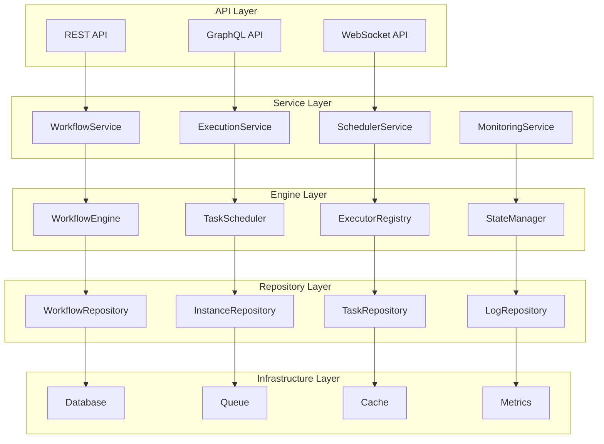
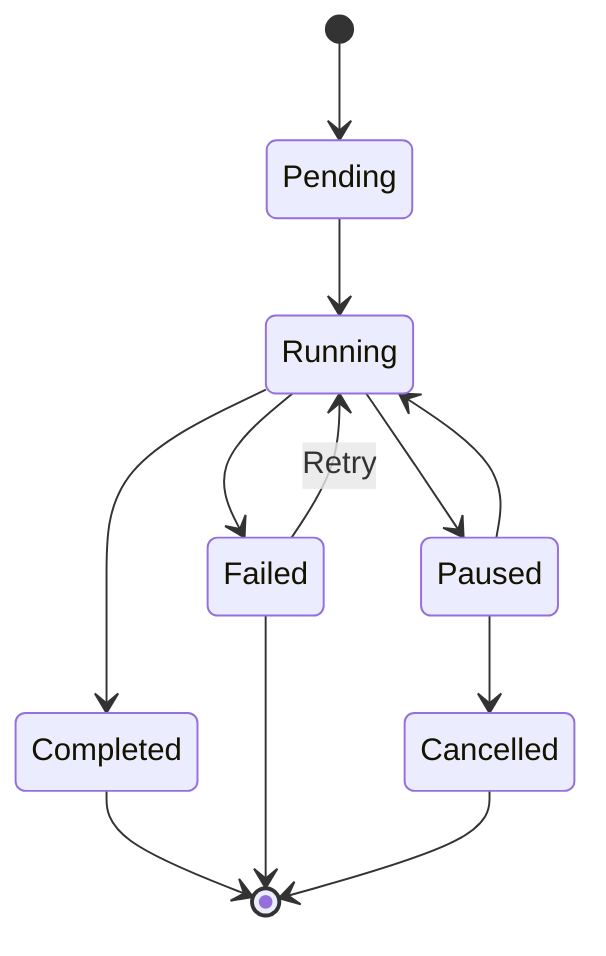

# @stratix/tasks 技术架构设计方案

## 概述

@stratix/tasks 是基于 Stratix 框架的企业级工作流任务管理插件，采用函数式编程范式和插件化架构，提供高性能、可扩展的工作流执行引擎。

## 设计目标

1. **高性能**：支持大规模并发任务执行
2. **可扩展**：插件化执行器架构，支持业务定制
3. **可靠性**：完整的错误处理和恢复机制
4. **可观测**：全面的监控和日志记录
5. **易用性**：简洁的API和丰富的DSL支持

## 整体架构

### 架构分层图



## 核心模块设计

### 1. 工作流引擎 (WorkflowEngine)

工作流引擎是系统的核心，负责解析DSL、管理执行状态、协调任务调度。

```typescript
interface WorkflowEngine {
  // 启动工作流实例
  startWorkflow(definition: WorkflowDefinition, inputs: any): Promise<WorkflowInstance>;
  
  // 恢复工作流执行
  resumeWorkflow(instanceId: string): Promise<void>;
  
  // 暂停工作流
  pauseWorkflow(instanceId: string): Promise<void>;
  
  // 取消工作流
  cancelWorkflow(instanceId: string): Promise<void>;
  
  // 获取执行状态
  getWorkflowStatus(instanceId: string): Promise<WorkflowStatus>;
}
```

**核心功能：**
- DSL解析和验证
- 执行计划生成
- 状态机管理
- 错误处理和恢复
- 事件发布

### 2. 任务调度器 (TaskScheduler)

负责任务的调度、分发和执行管理。

```typescript
interface TaskScheduler {
  // 调度任务
  scheduleTask(task: TaskNode): Promise<void>;
  
  // 执行任务
  executeTask(taskId: string): Promise<TaskResult>;
  
  // 重试任务
  retryTask(taskId: string): Promise<void>;
  
  // 获取待执行任务
  getPendingTasks(limit?: number): Promise<TaskNode[]>;
}
```

**调度策略：**
- 优先级调度
- 依赖关系解析
- 并发控制
- 负载均衡
- 故障转移

### 3. 执行器注册表 (ExecutorRegistry)

管理所有可用的任务执行器，支持动态注册和发现。

```typescript
interface ExecutorRegistry {
  // 注册执行器
  registerExecutor(name: string, executor: TaskExecutor): void;
  
  // 获取执行器
  getExecutor(name: string): Promise<TaskExecutor>;
  
  // 列出所有执行器
  listExecutors(): Promise<ExecutorInfo[]>;
  
  // 注销执行器
  unregisterExecutor(name: string): void;
}
```

**执行器接口：**
```typescript
interface TaskExecutor {
  name: string;
  description?: string;
  configSchema?: JSONSchema;
  
  // 执行任务
  execute(context: ExecutionContext): Promise<ExecutionResult>;
  
  // 验证配置
  validateConfig?(config: any): ValidationResult;
  
  // 健康检查
  healthCheck?(): Promise<HealthStatus>;
}
```

### 4. 状态管理器 (StateManager)

管理工作流和任务的状态转换，确保状态一致性。

```typescript
interface StateManager {
  // 更新工作流状态
  updateWorkflowState(instanceId: string, state: WorkflowState): Promise<void>;
  
  // 更新任务状态
  updateTaskState(taskId: string, state: TaskState): Promise<void>;
  
  // 获取状态历史
  getStateHistory(instanceId: string): Promise<StateTransition[]>;
  
  // 状态回滚
  rollbackState(instanceId: string, targetState: string): Promise<void>;
}
```

**状态机设计：**


## 执行器集成机制

### 1. 插件域注册

通过 Fastify 装饰器模式，为业务插件提供执行器注册接口：

```typescript
// 在 tasks 插件中添加装饰器
fastify.decorate('registerTaskExecutor', (name: string, executor: TaskExecutor) => {
  executorRegistry.registerExecutor(name, executor);
});

fastify.decorate('registerExecutorDomain', (domain: string, executors: Record<string, TaskExecutor>) => {
  Object.entries(executors).forEach(([name, executor]) => {
    executorRegistry.registerExecutor(`${domain}.${name}`, executor);
  });
});
```

### 2. 业务插件集成

业务插件通过装饰器方法注册执行器：

```typescript
// 在业务插件中
async function businessPlugin(fastify: FastifyInstance, options: any) {
  // 注册单个执行器
  fastify.registerTaskExecutor('userCreator', new UserCreatorExecutor());
  
  // 注册执行器域
  fastify.registerExecutorDomain('user', {
    creator: new UserCreatorExecutor(),
    validator: new UserValidatorExecutor(),
    notifier: new UserNotifierExecutor()
  });
}
```

### 3. 依赖关系保证

通过插件依赖声明确保加载顺序：

```typescript
export const businessPlugin = fp(businessPluginImpl, {
  name: 'business-plugin',
  dependencies: ['@stratix/tasks'] // 确保 tasks 插件先加载
});
```

## 中断恢复机制

### 1. 状态持久化

- 工作流实例状态实时持久化
- 任务节点执行状态记录
- 上下文数据快照保存

### 2. 恢复策略

```typescript
interface RecoveryManager {
  // 扫描中断的工作流
  scanInterruptedWorkflows(): Promise<WorkflowInstance[]>;
  
  // 恢复工作流执行
  recoverWorkflow(instance: WorkflowInstance): Promise<void>;
  
  // 重建执行上下文
  rebuildContext(instanceId: string): Promise<ExecutionContext>;
}
```

### 3. 恢复流程

1. 系统启动时扫描未完成的工作流实例
2. 重建执行上下文和依赖关系
3. 从中断点继续执行
4. 处理超时和失效的任务

## 并行执行架构

### 1. 动态并行生成

支持运行时根据数据动态创建并行任务：

```typescript
interface ParallelExecutor {
  // 生成并行任务
  generateParallelTasks(
    definition: ParallelNodeDefinition,
    context: ExecutionContext
  ): Promise<TaskNode[]>;
  
  // 执行并行任务
  executeParallel(
    tasks: TaskNode[],
    joinType: JoinType
  ): Promise<ParallelResult>;
}
```

### 2. 并发控制

- 全局并发限制
- 节点级并发控制
- 资源池管理
- 背压处理

## 监控和可观测性

### 1. 指标收集

```typescript
interface MetricsCollector {
  // 工作流指标
  recordWorkflowMetrics(instance: WorkflowInstance): void;
  
  // 任务执行指标
  recordTaskMetrics(task: TaskNode, duration: number): void;
  
  // 系统性能指标
  recordSystemMetrics(): void;
}
```

### 2. 监控维度

- 工作流执行成功率
- 任务平均执行时间
- 系统吞吐量
- 错误率统计
- 资源使用情况

### 3. 告警机制

- 执行失败告警
- 性能异常告警
- 资源不足告警
- 依赖服务异常告警

## 性能优化策略

### 1. 执行优化

- 任务预加载
- 批量执行
- 连接池复用
- 缓存策略

### 2. 数据库优化

- 读写分离
- 索引优化
- 分区策略
- 连接池管理

### 3. 内存管理

- 对象池
- 垃圾回收优化
- 内存泄漏检测
- 大对象处理

## 扩展性设计

### 1. 水平扩展

- 无状态设计
- 分布式调度
- 负载均衡
- 服务发现

### 2. 插件扩展

- 自定义节点类型
- 自定义执行器
- 自定义调度策略
- 自定义监控指标

### 3. API扩展

- RESTful API
- GraphQL支持
- WebSocket实时通信
- 事件驱动架构
